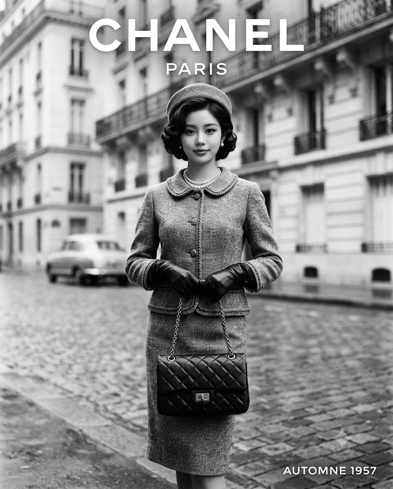
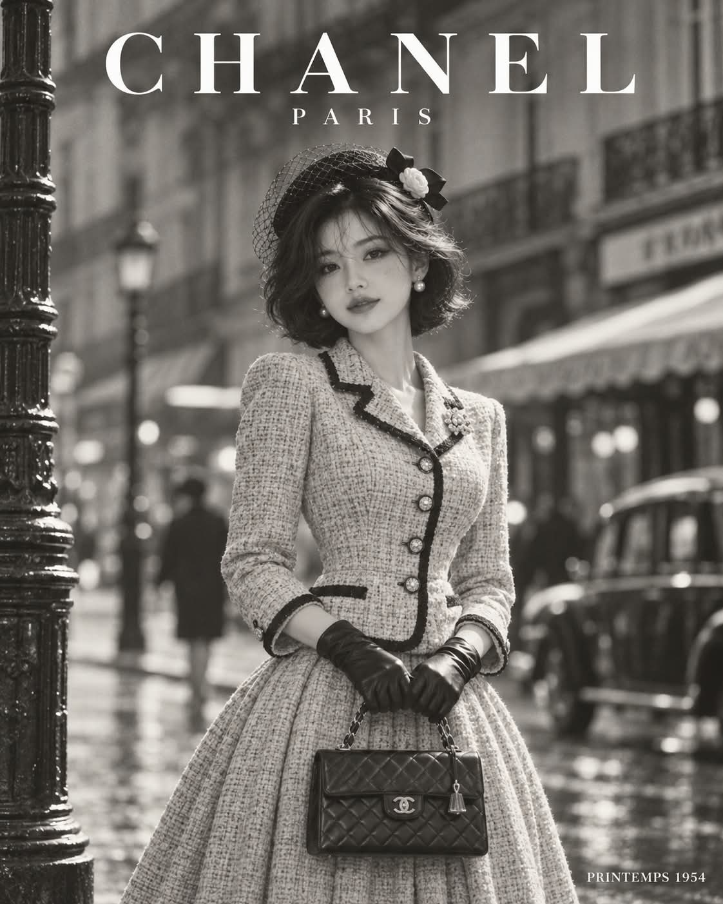

# 1950년대 파리 오뜨 쿠튀르 흑백 패션 매거진 광고 화보 프롬프트

## 1. 개요 및 아트 디렉팅 가이드
- **컨셉/장르**: 1947~1959년 파리 하이패션 하우스의 시그니처 룩과 대표 가방을 선보이는 1950년대 흑백 잡지 광고 지면 (세로 4:5 비율, 중형 필름 카메라와 85mm 렌즈 느낌, 순수한 중성 모노크롬 톤).
- **장면 & 배경**:
  - 1950년대 파리의 오전 거리. 젖은 자갈길 보도, 오스만 양식 석회암 건물과 섬세한 연철 발코니.
  - 얕은 피사계 심도로 크게 흐려진 클래식 자동차와 카페 차양, 인물과 배경의 완벽한 분리.
- **브랜드 매칭 & 의상/가방**:
  - 인물의 이목구비 인상을 분석하여 1950년대 실존 명품 브랜드(Dior, Chanel, Balenciaga 등) 및 연도를 매칭.
  - 당시 유행했던 대표 가방을 양손으로 아랫배 앞에 정갈하게 든 포즈 (다섯 손가락 및 관절 해부학적 정확성 필수).
  - 브랜드의 당시 쿠튀르 실루엣(원피스/수트), 손목까지 밀착되는 짧은 가죽 장갑, 상·하의·가방·배경의 풍부한 흑백 계조 분리.
- **인물 & 헤어 메이크업**:
  - 무릎을 가지런히 붙이고 선 단정하고 우아한 니샷(Knee shot), 수줍고 부드러운 미소.
  - 1950년대 클래식 핀컬 단발 웨이브, 매트한 밝은 피부 톤, 각진 아치형 눈썹과 윙 아이라인, 흑백에서 깊은 톤으로 대비되는 클래식 매트 립.
- **고증 타이포그래피**:
  - 상단 여백 중앙: 브랜드 공식 워드마크 서체를 그대로 재현한 순백색 브랜드명 및 본점 도시명.
  - 우측 하단: 브랜드 본점 언어의 계절 표기와 연도 (예: `AUTOMNE-HIVER 1954`).

## 2. 프롬프트 전문

```text
[업로드 이미지 사용 규칙]
업로드한 사진은 얼굴 참고용으로만 사용한다.
사진에서는 눈, 코, 입의 생김새만 가져온다. 얼굴형, 피부, 헤어, 이마와 헤어라인은 사진에서 가져오지 않는다.
사진 속 머리 각도, 고개 기울기, 얼굴 방향, 시선은 절대 가져오지 않는다. 각도와 시선은 아래 서술대로만 새로 그린다.
표정도 사진이 아니라 아래 서술대로 새로 그린다.
업로드 사진의 색감은 무시하고 결과물은 완전한 흑백으로만 그린다.
브랜드, 가방, 의상의 디자인과 타이포그래피의 브랜드명·서체·연도만 아래 [브랜드 선정] 규칙에 따라 얼굴 인상에 맞게 정한다. 그 외의 구도, 각도, 포즈, 헤어, 메이크업, 배경, 조명, 타이포그래피 배치는 아래 서술에서 전혀 바뀌면 안 된다.

[브랜드 선정]
먼저 업로드 사진의 눈, 코, 입에서 느껴지는 인상을 분석한다.
그 인상에 가장 잘 어울리는 하이패션 하우스 하나를 직접 고른다. 조건은 다음과 같다.
- 1947~1959년 사이에 실제로 활동하며 여성 의상과 가방을 선보였고, 지금도 존재하는 고급 패션 브랜드일 것
- 그 시기에 그 브랜드가 실제로 내놓아 유행했던 가방이 있을 것
같은 사진이 아니면 매번 인상에 따라 다른 브랜드가 나올 수 있도록 한다.
고른 브랜드와 연도는 아래 가방, 의상, 타이포그래피에 일관되게 적용한다.

[콘셉트]
고른 브랜드의 1950년대 패션 광고 화보 한 페이지. 흑백 사진 위에 브랜드명 타이포그래피가 얹힌 고급 잡지 광고 지면 형태.

[장면]
1950년대 파리의 오전 거리. 젖은 자갈길 보도와 밝은 석회암 오스만 양식 건물, 검은 연철 발코니, 흐릿하게 보이는 카페 차양과 클래식 자동차가 배경에 있다. 배경은 얕은 심도로 크게 흐려져 인물이 또렷하게 분리된다.

[구도]
세로 구도의 니샷. 화면 위쪽에 타이포그래피가 들어갈 여백을 화면 높이의 약 15% 정도 두고, 그 아래로 머리 끝이 시작된다. 아래쪽은 무릎 바로 아래에서 잘린다. 발과 신발은 화면에 나오지 않는다.
인물은 화면 가로 중앙에 서고, 카메라는 인물의 가슴 높이에서 정면으로 촬영한다.

[타이포그래피]
서체 규칙:
- 브랜드명은 고른 브랜드의 실제 공식 워드마크 서체 그대로 쓴다. 획의 굵기와 대비, 세리프 유무와 형태, 글자 비율, 자간, 대소문자 구성, 악센트 부호 모양까지 그 브랜드 워드마크와 똑같이 재현한다.
- 브랜드명 외의 문구는 그 브랜드 워드마크와 잘 어울리는, 같은 계열의 절제된 서체로 쓴다.
- 일반적인 기본 서체나 다른 브랜드의 서체로 대체하지 않는다.

배치:
- 화면 위쪽 여백 중앙에 고른 브랜드의 이름을 가로로 크게 배치한다. 글자색은 순백색이며 배경 위에서 또렷하게 읽힌다.
- 그 바로 아래에 작은 크기로 브랜드 본점이 있는 도시 이름을 넓은 자간으로 배치한다.
- 화면 오른쪽 아래 구석에 작은 순백색 글자로 그 브랜드 본점이 있는 나라 언어의 계절 이름과 고른 연도를 한 줄 배치한다.
- 그 외의 문구, 엠블럼, 그림 로고는 넣지 않는다. 모든 글자의 철자가 정확하고 일그러지지 않는다.

[인물과 포즈]
20대 후반~30대 초반의 우아한 여성. 다소곳하게 제자리에 서 있다.
몸은 카메라 기준 왼쪽으로 약 15도만 살짝 돌아서 있고, 두 발을 모아 무릎을 가지런히 붙인 정숙한 자세다. 어깨는 편안하게 내려가고 등은 곧게 편다.
얼굴은 카메라를 향한 거의 정면 각도, 턱을 아주 살짝 당기고 고개는 기울이지 않는다. 시선은 카메라를 바로 바라본다.
양손으로 가방 하나를 몸 앞, 아랫배와 골반 사이 높이에서 함께 든다. 가방 구조에 맞는 방식으로 잡되, 손잡이가 있으면 두 손이 손잡이를 나란히 감싸 쥐고, 손잡이가 없으면 두 손이 가방 몸체 양옆을 가볍게 받쳐 든다. 한 손이 다른 손 위에 살짝 겹칠 수 있다. 손가락은 모아져 있고 손목은 곧다. 양팔은 팔꿈치를 살짝 굽혀 몸통 옆에 자연스럽게 붙는다.

[표정]
입을 다문 채 입꼬리만 살짝 올린 수줍고 단정한 미소, 눈매는 부드럽고 차분하다.

[가방]
고른 브랜드가 고른 연도 무렵 실제로 선보여 유행했던 대표 가방을 그 당시 형태 그대로 그린다.
가방의 형태, 소재, 잠금장치, 금속 장식, 스티치를 정확하고 섬세하게 표현한다. 금속 부분은 밝은 하이라이트로 반짝인다.
가방은 몸 정중앙 앞에 수직으로 놓이고 앞면이 카메라를 정면으로 향한다. 기울거나 비틀리지 않는다.
가방 크기는 인물의 몸통 폭 절반을 넘지 않는다.

[의상]
고른 브랜드가 고른 연도 무렵 실제로 선보이던 여성복의 시그니처 스타일로 의상을 직접 디자인한다. 그 브랜드의 당시 재단, 실루엣, 소재, 디테일의 특징이 분명하게 드러나야 한다.
의상은 상의와 하의 또는 원피스·수트 등 그 브랜드의 당시 스타일에 맞는 구성으로 정한다. 하의 길이는 1950년대 기준을 따르며, 니샷 화면 안에서는 무릎 아래에서 잘린다.
머리 장식(모자 또는 헤어 액세서리)과 작은 주얼리도 같은 브랜드, 같은 시기의 분위기에 맞춰 정한다.
모든 소재와 재단은 1950년대 고급 쿠튀르 수준이어야 한다.

흑백 명암 규칙:
- 상의, 하의, 가방, 배경이 서로 다른 명암 톤으로 구분되어 한 덩어리로 뭉치지 않는다.
- 얼굴 주변은 밝게 유지되어 얼굴이 가장 먼저 눈에 들어온다.

고정 사항:
- 손목 위까지 오는 짧은 가죽 장갑을 양손에 착용한다. 손에 밀착해 손가락 마디 윤곽과 가죽의 은은한 광택이 드러난다.

[헤어와 메이크업]
헤어: 어두운 톤의 턱선 길이 단발을 1950년대 핀컬 세팅으로 볼륨 있게 말아, 앞머리 없이 옆가르마로 넘기고 귀 뒤로 부드러운 웨이브가 떨어진다. 웨이브마다 윤기 있는 하이라이트가 맺힌다. 잔머리 없이 정돈되어 있다.
메이크업: 매트하고 균일한 밝은 피부 톤, 또렷하게 각진 아치형 눈썹, 가는 검은 윙 아이라이너, 컬링한 속눈썹, 은은한 볼 음영, 흑백 사진에서 짙은 어두운 톤으로 선명하게 보이는 클래식 레드 매트 립.

[조명과 화질]
흐린 날의 부드러운 자연광이 왼쪽 위에서 비스듬히 들어오고, 얼굴과 상의에 은은한 하이라이트, 반대편에 부드러운 그림자가 생긴다.
1950년대 하이패션 잡지의 흑백 광고 화보. 중형 필름 카메라, 85mm 렌즈 느낌, 흑백 필름 특유의 풍부한 계조. 순백의 하이라이트부터 깊은 검정까지 중간 회색 톤이 부드럽게 이어지고, 대비는 선명하되 하이라이트와 그림자 디테일이 날아가지 않는다.
은염 인화지 프린트의 질감, 자연스러운 필름 그레인, 가장자리에 아주 옅은 비네팅.
완전한 흑백 모노크롬 실사 사진, 고해상도, 세로 4:5 비율.

[금지]
컬러, 부분 컬러, 세피아·푸른빛 등 색조가 섞인 톤 금지. 순수한 중성 흑백만 사용.
1950년대에 존재하지 않던 브랜드, 그 브랜드가 1960년대 이후에 내놓은 가방이나 의상, 서로 다른 브랜드의 디자인이나 서체를 섞는 것 금지.
브랜드명을 공식 워드마크와 다른 서체로 쓰는 것 금지.
현대적인 디자인, 노출이 큰 의상 금지.
타이포그래피에 지정한 세 문구 외의 텍스트, 엠블럼, 워터마크 금지. 철자 오류와 깨진 글자 금지.
현대적인 소품·간판·자동차 금지, 업로드 사진의 머리 각도·시선·표정·헤어·색감·의상 반영 금지.
걷는 동작, 발과 신발 노출, 한 손으로만 가방을 드는 것 금지.
손가락 개수 오류, 손가락 길이·굵기 불균형, 꺾이거나 뒤틀린 손목, 서로 엉키거나 녹아 붙은 두 손, 가방을 관통하는 손가락, 장갑이 헐렁하거나 주름져 손 형태가 뭉개지는 것 금지. 양손 모두 다섯 손가락이 해부학적으로 정확하다.
```

## 3. 결과물 비교 갤러리

| 제미나이 (Gemini) | GPT (DALL-E 3) |
| :---: | :---: |
|  |  |
