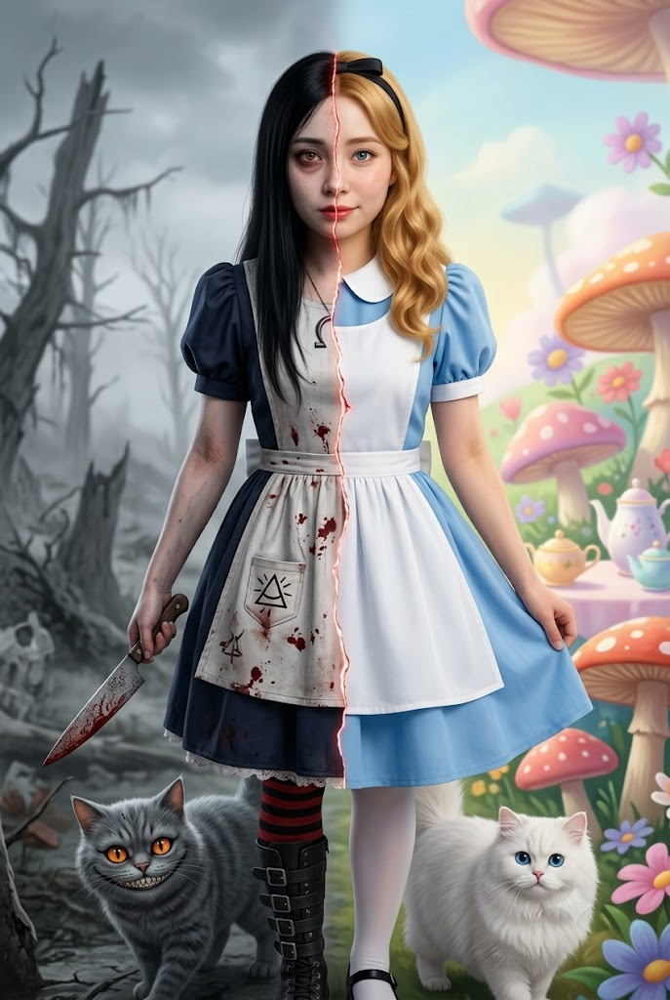
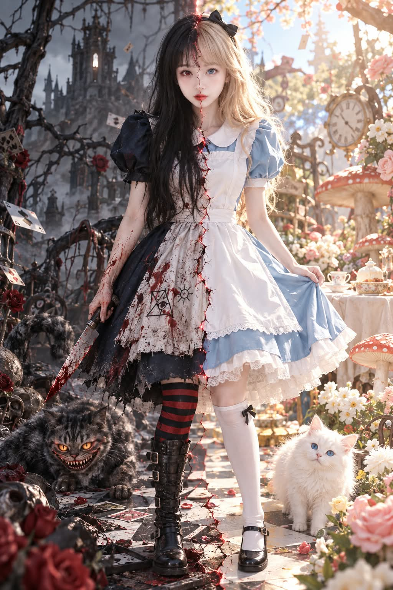

# 2중인격 앨리스(이상한 나라 vs 아메리칸 맥기) 실사 화보 프롬프트

## 1. 개요 및 아트 디렉팅 가이드
- **콘셉트 테마**: 단 한 명의 여성이 신체와 세계의 정중앙을 관통하는 불규칙한 균열을 경계로, 동화 속 순수한 '원더랜드 앨리스'와 피 묻은 보팔 나이프를 든 잔혹 동화 '아메리칸 맥기 앨리스'로 양분된 100% 포토리얼 실사 영화 스틸컷 (세로 2:3)
- **핵심 아트 디렉팅 & 조형 원리**:
  - **인물 인상 보존 및 로판급 미화 (Identity & Dual Realism)**:
    - 참조 사진 속 인물의 눈매 형태, 간격, 콧대, 입술선, 턱선 등 고유한 이목구비 정체성을 엄격히 유지하면서 로판 여주인공 수준으로 세련되게 정돈.
    - 좌우가 서로 다른 인물이 아닌 동일한 하나의 얼굴 골격 위에 두 가지 상반된 영혼과 조명을 부여.
  - **얼굴 및 신체 중앙 분할 (Organic Central Rift)**:
    - 이마→미간→콧대→입술→턱으로 이어지는 미세한 유기적 균열선과 틈새로 새어 나오는 희미한 붉은빛.
    - **오른쪽 (클래식 앨리스)**: 순하고 호기심 어린 블루 아이즈, 따스한 자연광, 블론드 웨이브와 검은 머리띠, 스카이블루 퍼프 드레스와 순백 앞치마, 둥근 눈의 온순한 흰 고양이, 화사한 파스텔톤 동화 숲.
    - **왼쪽 (아메리칸 맥기 앨리스)**: 다크서클과 피로감 깃든 흑갈색 눈, 차가운 잿빛 조명, 칠흑 흑발 생머리, 핏자국과 주술 문양이 새겨진 앞치마, 줄무늬 스타킹과 전투화, 피 묻은 칼, 날카로운 이빨의 기괴한 체셔 캣, 안개 낀 폐허.
  - **100% 포토리얼 실사 시네마틱 (Canon EOS R5 / 85mm Look)**:
    - 실제 피부 모공, 잔털, 피부결, 한 올씩 살아있는 머릿결, 직물 주름과 칼날의 금속성 질감 극대화.
    - 양분된 세계의 색온도(따뜻한 햇살 vs 차가운 잿빛)가 중앙 균열을 타고 유기적으로 이어지는 완성도 높은 미장센.

---

## 2. 프롬프트 전문 (코드 블록)

```text
세로 2:3, 고해상도, 100% 포토리얼 실사 사진.

한 명의 성인 여성이 몸의 정중앙을 기준으로 서로 다른 두 앨리스로 나뉘어 있다.
완전한 정면 전신 구도이며, 두 사람이 합쳐진 것이 아니라 하나의 얼굴과 하나의 몸이 좌우로 변화한 모습이다.

━━━━━━━━━━━━━━━━━━━━
[첨부 얼굴 — 인상 유지 + 로판 미화 / 최우선]
━━━━━━━━━━━━━━━━━━━━

첨부 사진은 주인공이 누구인지 결정하기 위한 얼굴 참고자료이다.

사진의 얼굴을 그대로 복사하거나 붙여 넣지 않는다.
대신 사진 속 인물을 다른 사람과 구별하게 만드는 핵심 얼굴 특징과 고유한 인상을 가져와 새로운 장면의 얼굴에 반영한다.

특히 원본의:
눈매의 형태와 기울기, 눈 사이 간격,
눈꼬리의 특징,
눈썹의 형태와 위치,
코의 전체적인 형태와 비율,
입술의 형태와 폭,
얼굴형과 광대·볼·턱선,
눈·코·입의 상대적인 배치,
그 사람 특유의 전체적인 인상을 강하게 유지한다.

그 위에서 로맨스 판타지 여주인공 수준으로 아름답게 미화한다.
피부와 윤곽을 세련되게 정돈하고 이목구비를 아름답게 다듬을 수 있지만,
원본의 핵심 특징과 인상이 사라져 전혀 다른 미인으로 변하면 안 된다.

목표는 사진을 그대로 복제하는 것도,
새로운 AI 미인 얼굴을 만드는 것도 아니다.

“첨부 사진 속 사람의 특징과 인상을 확실히 가지고 있으면서,
로맨스 판타지 여주인공처럼 아름답게 재해석된 동일 인물”이어야 한다.

첨부 사진의 얼굴 각도, 표정, 조명, 명암, 노출, 피부색은 가져오지 않는다.
이 장면의 정면 구도와 좌우 조명에 맞게 얼굴을 새롭게 구성한다.

━━━━━━━━━━━━━━━━━━━━
[얼굴 분할]
━━━━━━━━━━━━━━━━━━━━

좌우는 서로 다른 사람이 아니라 동일한 하나의 기본 얼굴이다.

얼굴 중앙의 이마 → 미간 → 콧대 → 입술 → 턱까지
가느다란 불규칙 균열이 이어지며 안쪽에서 아주 희미한 붉은빛이 보인다.

오른쪽 눈은 부드러운 푸른색.
따뜻한 빛을 받으며 순하고 호기심 어린 표정.

왼쪽 눈은 어두운 갈흑색이며 약간 충혈되어 있고 다크서클이 있다.
차가운 명암 아래 지치고 불안하며 공허한 표정.

양쪽의 눈동자 색·표정·피부톤·조명은 달라도
기본적인 얼굴 특징과 동일인이라는 인상은 하나로 이어진다.

━━━━━━━━━━━━━━━━━━━━
[오른쪽 — 이상한 나라의 앨리스]
━━━━━━━━━━━━━━━━━━━━

금빛 블론드 웨이브 헤어와 얇은 검은 머리띠.

연한 파란색 퍼프소매 드레스,
흰 피터팬 칼라와 깨끗한 흰 앞치마,
흰 스타킹과 검은 메리제인 슈즈.

따뜻하고 부드러운 햇빛.

배경은 꽃과 버섯, 티파티 요소가 있는
밝고 화사한 파스텔톤 원더랜드 숲.

━━━━━━━━━━━━━━━━━━━━
[왼쪽 — 아메리칸 맥기 앨리스]
━━━━━━━━━━━━━━━━━━━━

길고 곧은 칠흑색 생머리, 머리띠 없음.

짙은 네이비 퍼프소매 드레스와 흰 앞치마.
앞치마에는 마른 핏자국과 희미한 삼각형·태양 문양.

빨강·검정 가로줄 스타킹,
버클이 달린 검은 무릎 높이 전투화.

왼손에는 피 묻은 칼을 아래 방향으로 자연스럽게 들고 있다.

배경은 죽은 나무와 안개가 있는
차갑고 잿빛으로 붕괴된 원더랜드.

━━━━━━━━━━━━━━━━━━━━
[중앙 전환]
━━━━━━━━━━━━━━━━━━━━

얼굴, 머리카락, 의상, 몸과 배경이 하나의 불규칙한 중앙 균열을 따라 변화한다.

오른쪽의 따뜻하고 부드러운 빛이 중앙을 지나면서
왼쪽의 차갑고 강한 명암으로 바뀐다.

반듯하게 반으로 자른 합성이 아니라
하나의 인물과 세계가 두 현실로 갈라진 모습.

━━━━━━━━━━━━━━━━━━━━
[고양이]
━━━━━━━━━━━━━━━━━━━━

서로 완전히 독립된 고양이 두 마리.

왼쪽 발 근처:
회색·검정 줄무늬 체셔 고양이,
주황빛 눈과 날카로운 이빨의 기괴한 미소.

오른쪽 다리 근처:
푹신한 흰 고양이,
둥근 푸른 눈과 온순한 표정.

━━━━━━━━━━━━━━━━━━━━
[실사 스타일]
━━━━━━━━━━━━━━━━━━━━

100% 포토리얼 실사 영화 사진.
Canon EOS R5, 85mm 렌즈 느낌.

실제 피부의 모공과 잔털, 자연스러운 피부결,
한 올씩 보이는 머리카락,
직물의 조직과 주름, 가죽과 금속 질감까지 사실적으로 표현.

얼굴에는 반드시 장면의 실제 조명과 명암을 적용하고,
얼굴·목·몸의 피부톤이 자연스럽게 연결되게 한다.
얼굴만 밝고 하얗게 뜨거나 합성된 것처럼 표현하지 않는다.

금지:
원본 인상이 사라진 흔한 AI 미인 얼굴,
과도한 눈 확대,
극단적인 V라인,
인형 얼굴,
좌우 서로 다른 사람 얼굴,
얼굴 합성 느낌,
플라스틱 피부,
애니메이션, 일러스트, 3D, CGI.
```

---

## 3. 결과물 비교 갤러리

| 생성 모델 | 결과 이미지 |
| :--- | :--- |
| **Google Gemini** |  |
| **OpenAI GPT** |  |
