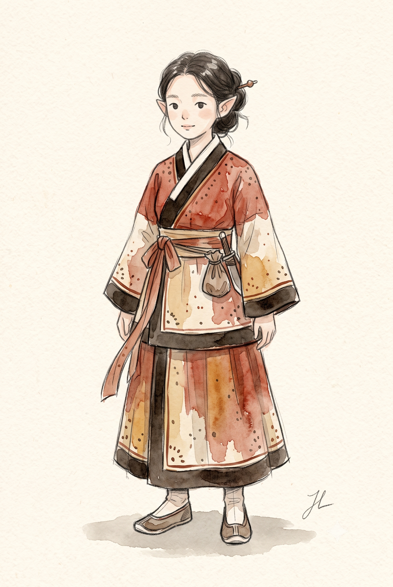
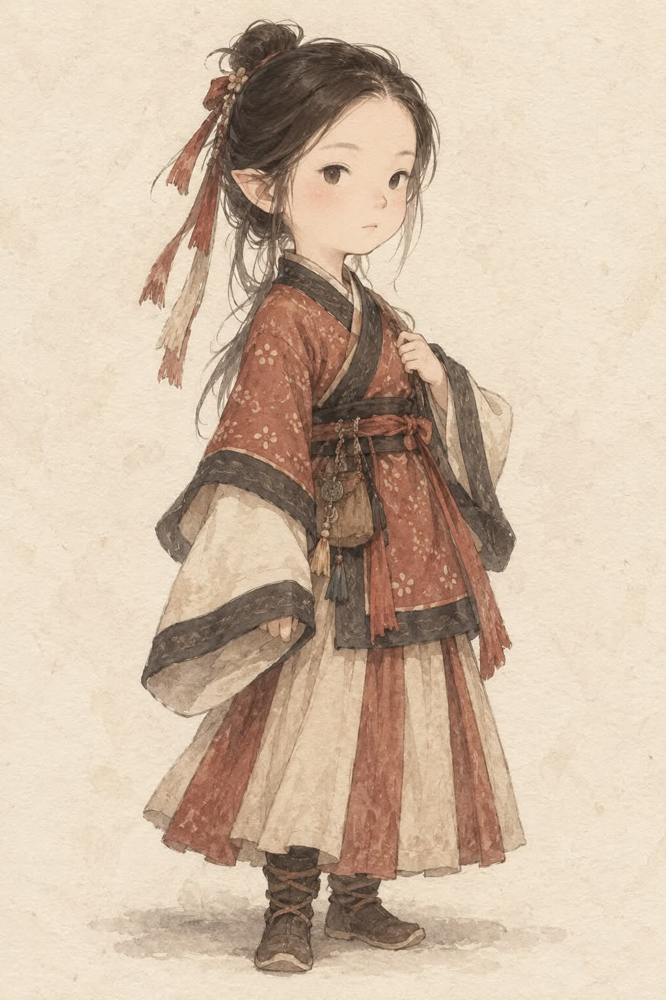

# 동양 판타지 RPG 수채화 캐릭터 컨셉아트 (고구려 복식 기반) 프롬프트

## 1. 개요 및 아트 디렉팅 해설
- **콘셉트 테마**: 고구려 고분벽화 복식을 모티브로 한 4~5등신 동양 판타지 소인족 캐릭터 수채화 설정화
- **핵심 조형 원리 및 캐릭터 디자인**:
  - **4~5등신 소인족 비율**: 과도한 2등신 SD가 아닌, 머리가 살짝 크고 팔다리가 아담한 단정하고 귀여운 판타지 종족 실루엣.
  - **판타지 귀**: 하이엘프처럼 긴 귀가 아닌, 작은 종족 특유의 작고 짧은 삼각형 뾰족귀.
  - **극도로 단순화된 손그림 얼굴**:
    - 사진 실사 텍스처나 입체 명암을 완전히 배제하고, 점눈·점코·한 줄 입과 옅은 수채 홍조로 동화처럼 표현.
    - 원본 인물의 차분하고 부드러운 인상과 눈매 방향만 손그림으로 재해석.
  - **고구려 전통 복식 고증 & 재해석**:
    - 좌임(왼쪽으로 여미는 교차 깃).
    - 깃, 소매 끝, 앞섶, 밑단을 따라 두른 굵은 짙은 갈색/검은색 선 장식 (고구려 복식 핵심 특징).
    - 벽화 특유의 손으로 찍은 불규칙한 점무늬 패턴 및 색동 세로 패널 주름치마, 허리 주머니.
    - 천연 염색 질감 (탁한 주홍, 벽돌색, 황토색, 크림색, 먹색).
  - **화풍 및 여백**:
    - 얇은 연필 스케치 선과 투명하고 불균일한 수채화 물 번짐(Wet-on-dry/wet).
    - 따뜻한 아이보리 수채화지 여백과 발밑의 가벼운 접지 그림자.
  - **시그니처 서명**:
    - 우측 하단 여백에 연필로 흘려 쓴 작고 자연스러운 필기체 서명 **"JL"**.

---

## 2. 프롬프트 전문 (코드 블록)

```text
업로드한 인물 사진을 기반으로, 동양 판타지 RPG 설정집에 등장하는
수채화 캐릭터 컨셉아트 한 장을 그려줘.

[가장 중요한 목표]
결과물은 사진을 수채화 필터로 변환한 것이 아니라,
처음부터 손으로 새롭게 디자인하고 그린 판타지 캐릭터 일러스트여야 한다.

첫 번째 인물 사진은 캐릭터의 성별과 기본적인 인상만 참고하고,
두 번째 복식 참고 이미지는 의상 디자인의 기준으로 사용한다.

한 화면에는 캐릭터 한 명만 그릴 것.
설정화 시트, 여러 포즈, 얼굴 확대, 뒷모습, 소품 분해도는 만들지 않는다.

────────────────────
[캐릭터 비율]
────────────────────

동양 판타지 RPG의 작은 종족 캐릭터처럼 디자인한다.

약 4~5등신.
머리는 현실 인물보다 조금 크지만 지나친 SD나 2등신은 금지.
몸통과 팔다리는 짧고 아담하며 전체 실루엣은 작고 단정하다.

머리 → 목 → 어깨 → 몸통이 자연스럽게 연결되어야 한다.
머리와 몸은 같은 방향을 바라본다.

정면 또는 아주 약한 3/4 방향의 전신 서 있는 포즈.
과도한 액션 포즈는 사용하지 않는다.

────────────────────
[성별]
────────────────────

사진 속 인물의 성별을 그대로 따른다.

남성이면 남성 캐릭터와 남성용 전통 복식.
여성이면 여성 캐릭터와 여성용 전통 복식.

성별과 맞지 않는 복식으로 변경하지 않는다.

────────────────────
[얼굴 — 매우 중요]
────────────────────

사진 속 얼굴을 그대로 복사하거나 사실적으로 재현하지 않는다.

사진 얼굴을 붙여 넣은 듯한 실사 얼굴은 절대 금지.

얼굴 전체를 처음부터 손으로 그린 캐릭터 얼굴로 재해석한다.

사진에서는 다음 정도의 분위기만 참고한다:

얼굴형의 전체적인 느낌

눈매의 방향

차분하거나 부드러운 인상

전체적인 분위기

얼굴 묘사는 극도로 단순하게 한다.

작은 타원 또는 점처럼 단순화된 눈

홍채와 동공의 사실적인 묘사 없음

속눈썹을 세밀하게 그리지 않음

코는 아주 작은 점이나 짧은 선 정도

입은 작고 얇은 한 줄

눈썹은 매우 옅은 연필선

피부는 거의 평면적인 옅은 수채색

볼에는 아주 희미한 수채 홍조 정도만 허용

피부 모공, 주름, 코의 입체적인 명암,
사실적인 눈동자 반사, 사진 같은 피부광,
3D 렌더링 같은 얼굴 표현은 모두 금지.

정확한 초상이 아니라
"사진 속 사람을 귀여운 판타지 캐릭터로 재해석했다"는
느낌만 남긴다.

────────────────────
[귀]
────────────────────

양쪽에 작고 뾰족한 판타지 귀를 추가한다.

귀가 지나치게 길거나 날카로운 하이엘프 형태가 아니라,
작은 종족 특유의 귀엽고 짧은 삼각형 귀.

────────────────────
[헤어스타일]
────────────────────

사진의 머리를 그대로 복제하지 말고
동양 판타지 컨셉아트에 어울리도록 새롭게 디자인한다.

머리카락 한 올 한 올을 사실적으로 묘사하지 않는다.

큰 덩어리 위주의 부드러운 연필선과
번지는 수채 붓 터치로 표현한다.

여성:
단정하게 묶거나 올린 전통적인 머리 형태를 기본으로 하되,
잔머리가 몇 가닥 자연스럽게 흘러내린다.
작은 비녀, 리본 또는 장식끈을 사용할 수 있다.

남성:
전통적인 상투 또는 묶은 머리를 판타지적으로 단순화한다.

────────────────────
[복식 — 고구려 복식 기반]
────────────────────

두 번째 업로드 이미지의 고구려 복식 디자인을
주요 참고 자료로 사용한다.

현대적인 옷이나 서양 중세 RPG 가죽 갑옷으로 바꾸지 않는다.

기본 구조:

왼쪽으로 여미는 교차 깃 (고구려 특유의 좌임)

깃, 소매 끝, 앞섶, 밑단을 따라 굵은 검은색 또는 짙은 갈색 선 장식
(고구려 복식의 가장 핵심적인 특징)

엉덩이 길이의 저고리형 상의, 안에 속옷을 겹쳐 입음

넓고 자연스럽게 떨어지는 소매

허리를 묶는 천 띠, 끝자락이 한쪽으로 늘어짐

천 전체에 고르게 흩뿌려진 작은 점무늬
(고구려 고분벽화 문양, 디지털 격자가 아닌 손으로 찍은 불규칙한 점)

허리띠에 매단 천과 가죽으로 만든 작은 주머니

전통적인 천 신발, 또는 바지 끝단을 넣어 신는 짧은 가죽·천 부츠

하의:

발목에서 좁아지는 풍성한 바지, 또는

크림색·벽돌색·황토색 세로 색동 패널이 들어간 주름 A라인 치마
(치마는 바지 위에 겹쳐 입는다)

머리 장식(선택):

작고 부드러운 천 모자 또는 두건,
혹은 깃털 하나를 꽂은 낮은 고깔모자

여성 캐릭터라면 참고 이미지의
귀족 여성, 시녀, 궁중 여성 복식에서 디자인 요소를 가져온다.

남성 캐릭터라면 참고 이미지의
귀족 남성, 평민 남성, 무관, 관리 복식에서 디자인 요소를 가져온다.

역사 복식을 그대로 복제하기보다는
고구려 복식을 기반으로 한 판타지 RPG 의상처럼 재해석한다.

색상:
탁한 주홍색
벽돌색
크림색
아이보리
짙은 갈색
먹색
황토색

금속 장식과 자수는 소량만 사용한다.
광택 없는 손염색 천의 질감을 유지한다.

────────────────────
[화풍 — 매우 중요]
────────────────────

전통적인 판타지 RPG 설정집의 손그림 캐릭터 컨셉아트.

얇고 약간 거친 연필 선화 위에
투명하고 옅은 수채 물감을 여러 번 얹은 방식.

선은 완벽하게 깨끗하지 않고
손으로 스케치한 흔적이 남아 있다.

색은 선 안을 완벽하게 채우지 않고
부분적으로 번지거나 종이색이 비쳐 보인다.

수채 특유의:

물 번짐

색 농도의 불균일함

붓자국

가장자리의 자연스러운 번짐

겹쳐 칠한 투명한 색

을 유지한다.

디지털 셀 셰이딩 금지.
애니메이션 셀 채색 금지.
3D 렌더링 금지.
사진적 조명 금지.
극사실적 얼굴 금지.
매끈한 디지털 페인팅 금지.

────────────────────
[배경]
────────────────────

따뜻한 아이보리색 수채화 종이 한 장.

종이 섬유와 미세한 얼룩이 자연스럽게 보인다.

풍경, 건물, 장식 프레임, UI는 넣지 않는다.
글자는 아래 [서명] 항목의 "JL" 서명 외에는 넣지 않는다.

캐릭터 주변에는 종이색에 가까운 아주 부드러운 흰색 여백을 둔다.

발밑에는 옅은 회갈색 수채 물감이 번진 정도의
작은 접지 그림자만 넣는다.

────────────────────
[서명]
────────────────────

화면 오른쪽 아래 종이 여백에
작가 서명처럼 "JL" 두 글자를 손글씨로 넣는다.

연필로 직접 쓴 듯한 얇고 흐린 흑연 필기체.
두 글자가 흘림체로 자연스럽게 이어지고,
필압에 따라 선 굵기가 미세하게 변한다.
종이 결에 긁힌 듯한 거친 흑연 질감이 남는다.

크기는 아주 작게, 캐릭터 키의 1/12 이하.
색은 옅은 회흑색이며 진하지 않고 살짝 번져 보인다.
살짝 기울어진 각도로 쓴다.

테두리, 상자, 도장, 장식 없이 글자만 단독으로 놓는다.
캐릭터와 겹치지 않는다.
다른 글자, 날짜, 로고는 추가하지 않는다.

────────────────────
[구도]
────────────────────

세로형 이미지.
캐릭터 한 명.
머리부터 발끝까지 모두 보이는 전신.

화면 중앙 배치.
캐릭터가 화면 대부분을 차지하지만
머리 위와 발 아래에 충분한 종이 여백을 남긴다.

설정화 여러 장을 한 화면에 배치하지 않는다.
오직 메인 캐릭터 한 명만 보여준다.

────────────────────
[피해야 할 것]
────────────────────

photorealistic face,
realistic skin,
photo collage,
face pasted from reference,
3D render,
realistic pores,
realistic nose shading,
realistic glossy eyes,
cinematic lighting,
cel shading,
anime screenshot,
modern clothing,
modern hanbok silhouette,
right-side collar overlap,
western medieval armor,
oversized bobble head,
2-head-tall proportions,
multiple characters,
character turnaround sheet,
multiple poses,
facial expression sheet,
accessory sheet,
text (오른쪽 아래 연필 서명 "JL"만 예외),
logo,
watermark,
printed font signature,
red seal stamp,
decorative frame.
```

---

## 3. 생성 예제

| Gemini | GPT |
| :---: | :---: |
|  |  |
