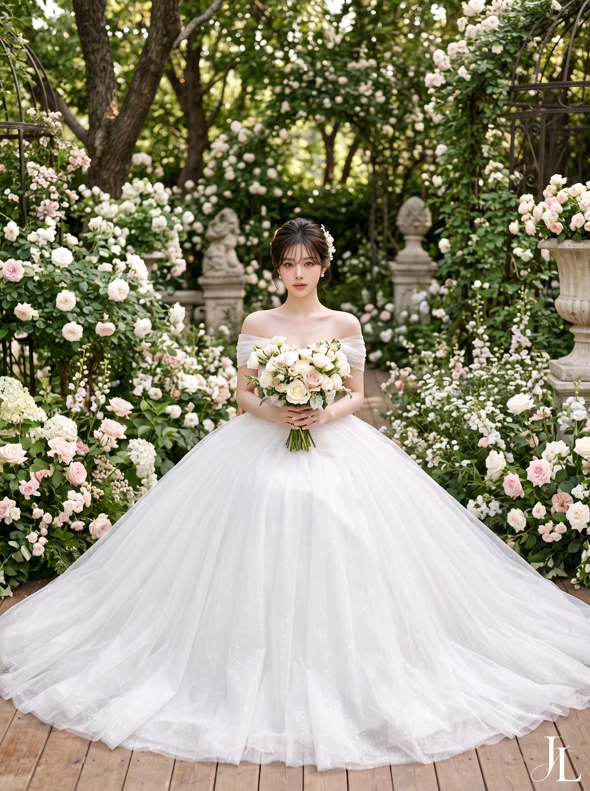
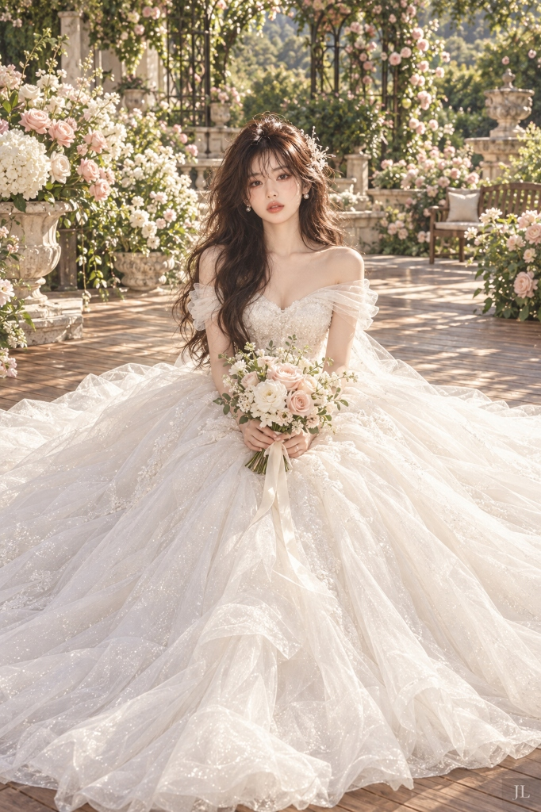

# 로맨틱 유럽풍 가든 웨딩 포트레이트 프롬프트

## 1. 개요 및 아트 디렉팅 해설
- **콘셉트 테마**: 따사로운 햇살이 내리쬐는 유럽풍 야외 정원 테라스에서 거대한 튤 볼가운 드레스를 펼치고 앉은 **하이엔드 럭셔리 가든 웨딩 화보(Romantic Garden Bridal Portrait)**
- **핵심 아트 디렉팅 & 조형 원리**:
  - **정면 응시 & 극상 미화 (Face & Direct Eye Contact)**:
    - 원본 인물의 고유한 이목구비와 비율을 정밀하게 보존하면서 최고급 뷰티 화보 수준의 미화(투명하고 화사한 피부, 또렷한 눈매와 속눈썹, 정돈된 윤곽) 적용.
    - 측면이나 시선 회피가 아닌, **카메라 렌즈를 정면으로 똑바로 바라보는 부드럽고 우아한 눈맞춤(Direct Eye Contact)**.
  - **헤어 스타일 & 헤어피스**:
    - 우아한 볼륨감의 소프트 다크 헤어, 내추럴한 루즈 웨이브, 이마 비율을 자연스럽게 살린 시스루 뱅과 페이스 라인 잔머리, 아이보리 진주·플로럴 헤어 오너먼트.
  - **좌식 와이드 전신 구도 (Locked Seated Composition)**:
    - 줌인이나 바스트 샷이 아닌, 나무 테라스 위에 단아하게 앉아 있는 신부의 전신과 좌우로 부채꼴처럼 광활하게 펼쳐진 거대한 스커트를 온전히 담아낸 와이드 세로 앵글.
  - **오프숄더 스파클링 튤 볼가운 (Fixed Dress Design)**:
    - 쇄골 라인이 드러나는 스위트하트 네크라인과 양 어깨/상완을 감싸는 반투명 튤 드레이핑.
    - 미세한 은하수 글리터 펄이 수놓아진 다층의 가벼운 화이트 튤 소재, 잘록한 허리선에서 바닥으로 웅장하게 퍼지는 초대형 프린세스 볼가운 실루엣.
  - **양손 부케 포즈 & 무장애 전경 (Unobstructed Foreground)**:
    - 양손으로 아이보리/블러시 핑크 장미 부케를 하복부 중앙에 자연스럽게 쥐고 단정한 자세 유지.
    - **스커트 앞쪽 전경에 화분, 바구니, 가구 등 시야를 가리는 장애물을 일체 배치하지 않고** 온전한 백색 스커트 실루엣을 부각.
  - **유럽풍 가든 배경 & 따스한 자연광 채광**:
    - 수국, 장미, 덩굴 식물, 클래식 석조 화병, 단조 아치와 멀리 보이는 벤치. 나무 사이로 스며드는 나뭇잎 그림자와 부드러운 전면 조명(Frontal Soft Lighting).
  - **스튜디오 시그니처 마크**:
    - 우측 하단 나무 바닥 영역에 반투명(35~45% Opacity) 화이트 세리프 서체로 깔끔하게 각인된 서명 **"JL"**.

---

## 2. 프롬프트 전문 (코드 블록)

```text
━━━━━━━━━━━━━━━━━━━━
[FACE — HIGHEST PRIORITY]
━━━━━━━━━━━━━━━━━━━━

Preserve the recognizable identity of the person in the photo with STRONG beautification.

- nose centered
- facial symmetry clearly visible
- direct eye contact with the camera
- head naturally upright
- only a tiny elegant head tilt if necessary

NO 3/4 facial angle.
NO profile.
NO sideways gaze.
NO looking downward.
NO face turned away.

━━━━━━━━━━━━━━━━━━━━
[HAIR]
━━━━━━━━━━━━━━━━━━━━

Create an elegant romantic bridal hairstyle.

Soft dark hair with:

- graceful crown volume
- polished loose waves
- airy wispy bangs
- delicate face-framing strands
- ivory pearl-and-floral bridal hair ornament

Aesthetically balance the forehead-to-face ratio.

Keep a realistic adult hairline with natural baby hairs.
No unnaturally low hairline.
No wig-like appearance.

━━━━━━━━━━━━━━━━━━━━
[COMPOSITION — LOCKED]
━━━━━━━━━━━━━━━━━━━━

KEEP THE WIDE SEATED BRIDAL COMPOSITION.

Vertical full-body bridal portrait.

Camera pulled back enough to clearly show:

- the complete seated bride
- her enormous wedding skirt
- the wooden terrace
- substantial surrounding garden

The bride is centered in the frame.

Her enormous skirt spreads broadly LEFT and RIGHT
across the wooden floor like a large elegant fan.

The skirt occupies most of the lower half of the image.

IMPORTANT:
Do NOT zoom in.
Do NOT change to waist-up or bust portrait.
Do NOT make her stand.
Do NOT crop the skirt.
Do NOT significantly change the camera distance.

━━━━━━━━━━━━━━━━━━━━
[POSE — BOUQUET]
━━━━━━━━━━━━━━━━━━━━

The bride sits gracefully on the wooden terrace.

Her torso faces almost directly toward the camera.

Her HEAD and FACE face DIRECTLY toward the camera.

She looks directly into the lens
with a soft, elegant and confident bridal expression.

She holds ONE bridal bouquet naturally with BOTH HANDS
at the center of her lap / lower waist.

The bouquet should rest slightly above the skirt,
without hiding the waist or bodice.

- shoulders relaxed
- elegant upright posture
- elbows naturally bent
- arms close to the body
- wrists relaxed
- fingers naturally separated and anatomically correct
- both hands clearly formed

NO hand touching the face.
NO chin-on-hand pose.
NO crossed arms.
NO exaggerated fashion pose.
NO sensual leg pose.

━━━━━━━━━━━━━━━━━━━━
[DRESS — FIXED DESIGN]
━━━━━━━━━━━━━━━━━━━━

Pure-white luxury off-the-shoulder wedding ball gown.

BODICE:

- fitted sweetheart bodice
- elegant exposed collarbones
- several soft horizontal layers of translucent tulle
  wrapping gracefully across BOTH shoulders and upper arms
- delicate fine sparkling texture
- narrow fitted waist

SKIRT:

- enormous princess / ball-gown silhouette
- extremely full A-line volume
- multiple layers of lightweight translucent white tulle
- subtle fine glitter throughout
- airy, luminous and ethereal fabric
- luxurious but lightweight appearance
- very wide train spreading across the wooden floor

The enormous skirt is a MAJOR visual element.

Do NOT change the dress into:

- mermaid gown
- narrow skirt
- lace-heavy gown
- high-neck dress
- long-sleeved dress
- completely strapless gown

━━━━━━━━━━━━━━━━━━━━
[BOUQUET]
━━━━━━━━━━━━━━━━━━━━

One elegant medium-sized romantic bridal bouquet.

Use:

- ivory flowers
- pure white flowers
- pale blush-pink roses
- delicate small blossoms
- subtle natural greenery
- soft ivory silk ribbon

The bouquet must remain proportional.

It must NOT:

- become oversized
- cover the face
- cover most of the bodice
- hide the waist
- obscure the overall dress silhouette

━━━━━━━━━━━━━━━━━━━━
[GARDEN BACKGROUND]
━━━━━━━━━━━━━━━━━━━━

Place the bride in a luxurious,
romantic European-inspired outdoor flower garden.

Include naturally:

- abundant white flowers
- pale blush-pink roses
- hydrangeas
- small delicate blossoms
- lush green foliage
- mature trees
- climbing vines
- subtle wrought-iron garden structures
- classical stone ornaments
- elegant stone flower urns
- wooden garden bench in the distance

The bride sits on a warm natural WOODEN TERRACE / DECK.

The garden should feel lush and abundant,
but the bride remains the unmistakable focal point.

━━━━━━━━━━━━━━━━━━━━
[FOREGROUND — CRITICAL]
━━━━━━━━━━━━━━━━━━━━

THE ENTIRE FRONT OF THE WEDDING SKIRT MUST REMAIN CLEAR.

Absolutely NO:

- flower pot in front of the skirt
- vase in front of the skirt
- planter in front of the skirt
- basket in front of the skirt
- separate bouquet on the floor
- plants growing over the skirt
- furniture blocking the dress
- decorative props covering the foreground

Flowers, pots and garden decorations may appear
ONLY at the SIDES or in the BACKGROUND.

Nothing may interrupt the beautiful,
wide white silhouette of the skirt.

━━━━━━━━━━━━━━━━━━━━
[LIGHTING & PHOTOGRAPHY]
━━━━━━━━━━━━━━━━━━━━

Soft warm natural daylight filtering through garden trees.

Use:

- flattering frontal facial illumination
- gentle dappled sunlight
- soft natural shadows
- luminous skin
- delicate highlights
- airy pastel color grading
- subtle romantic background bokeh

The FACE must receive sufficient soft light
to clearly show her beauty and identity.

High-end Korean luxury wedding photography.
Premium bridal magazine campaign quality.
Photorealistic full-frame camera rendering.
Natural lens characteristics.
High-resolution facial detail.
Fine realistic tulle texture.
Realistic flowers and foliage.

Color palette:
white, ivory, blush pink,
soft green and warm natural wood.

━━━━━━━━━━━━━━━━━━━━
[STUDIO SIGNATURE — REQUIRED]
━━━━━━━━━━━━━━━━━━━━

Add a small studio signature mark reading exactly "JL"
in the BOTTOM-RIGHT corner of the image.

- clean elegant serif lettering
- two capital letters only: J and L
- semi-transparent white, about 35-45% opacity
- small and unobtrusive, like a photo studio's signature stamp
- placed over the background or wooden floor area
- must NOT overlap the bride's face, bouquet or skirt
- must NOT affect composition, lighting or color grading

Exactly "JL" — no other letters, no extra text, no logo shapes.

━━━━━━━━━━━━━━━━━━━━
[FINAL PRIORITIES]
━━━━━━━━━━━━━━━━━━━━

1. Same recognizable person with STRONG beautification
2. Fully front-facing beautiful face + direct camera gaze
3. Wide seated composition
4. Bouquet held naturally with BOTH hands
5. Exact off-the-shoulder sparkling tulle ball gown
6. Huge skirt spreading widely across the floor
7. Romantic outdoor flower garden
8. Completely unobstructed skirt foreground
9. Small "JL" studio signature in the bottom-right corner

Do NOT allow beautification to erase identity.
Do NOT allow identity preservation to suppress beautification.
The face must be BOTH recognizable AND noticeably more beautiful.

# ref: JL-bridal-garden-v1
```

---

## 3. 결과물 비교 갤러리

| 생성 모델 | 결과 이미지 |
| :--- | :--- |
| **Google Gemini** |  |
| **OpenAI GPT** |  |
