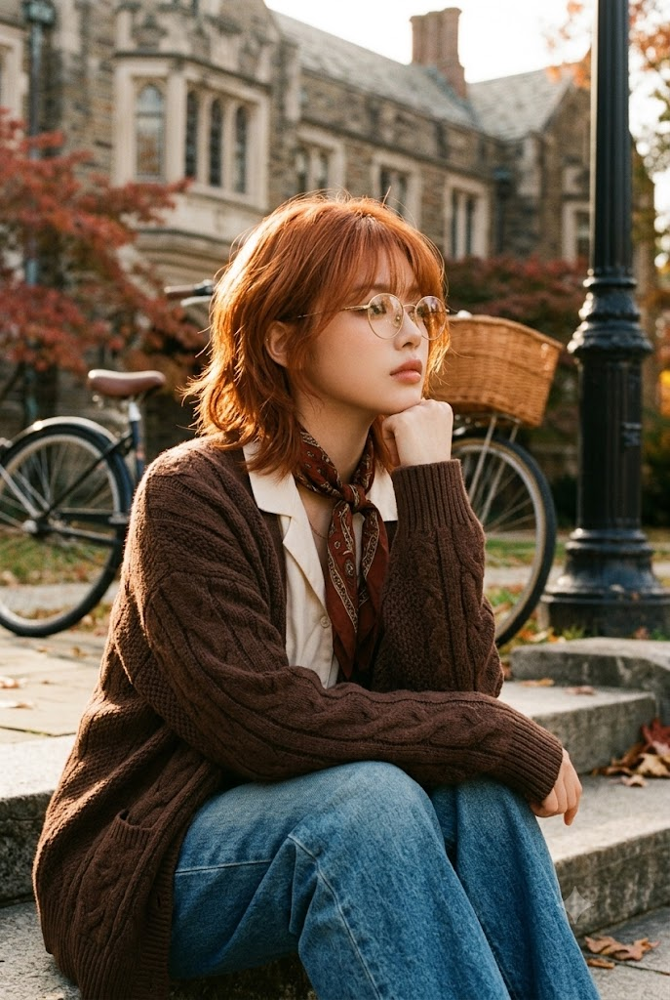
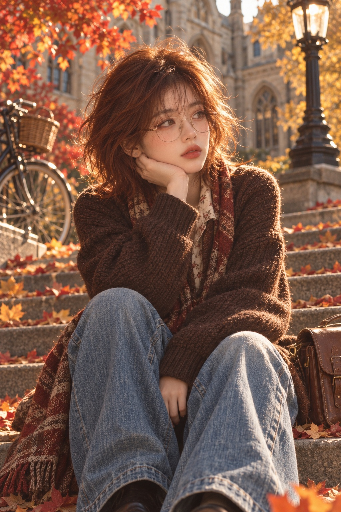

# 늦가을 캠퍼스 돌계단 다크 아카데미아 시네마틱 필름 사진 프롬프트

## 1. 개요 및 아트 디렉팅 가이드

- **컨셉**: 늦가을 오후 골든아워, 유럽풍 고딕 석조 캠퍼스 앞 돌계단에 앉아 턱을 괴고 생각에 잠긴 인물을 담은 다크 아카데미아 + 빈티지 오텀 감성의 시네마틱 실사 사진 (코닥 포트라 400 느낌의 필름 질감)
- **얼굴 합성 & 안경 규칙**:
  - 업로드 사진에서는 눈·코·입의 생김새만 가져오고, 얼굴형·피부·헤어·표정·고개 각도·시선은 프롬프트 서술대로 새로 그림
  - 사진에 안경·선글라스가 있으면 테와 렌즈를 그대로 재현하고, 없으면 얇은 골드 원형 안경을 기본으로 착용
- **구도 & 카메라**:
  - 세로 2:3, 머리 위부터 무릎·정강이까지 보이는 프레이밍, 가슴 높이보다 살짝 낮은 정면 촬영
  - 85mm f/1.8의 얕은 심도와 크리미한 보케, 카메라에 가까운 무릎과 청바지가 크게 보이는 원근감
- **포즈 & 시선**:
  - 두 무릎을 세우고 앉아 가볍게 쥔 주먹으로 턱을 괸 자세, 살짝 움츠러든 어깨
  - 고개를 3/4 돌려 화면 오른쪽 먼 곳을 바라보는 고정 시선, 카메라와 눈을 맞추지 않는 멍하고 쓸쓸한 표정
- **헤어 & 메이크업**:
  - 코퍼 진저 레드 컬러의 숏 샤기컷/울프컷 보브와 시스루 커튼뱅, 역광에 금빛으로 빛나는 잔머리의 헤일로 효과
  - 맑은 아이보리 피부에 로지 핑크 블러셔와 옅은 주근깨, 매트한 벽돌빛 레드 립
- **의상 & 소품**:
  - 초콜릿 브라운 청키 니트 오버사이즈 가디건, 잔무늬 셔츠 칼라 블라우스, 체크/페이즐리 숄 스카프, 빈티지 워싱 블루 데님 와이드 팬츠
  - 인물 옆 바닥의 낡은 브라운 가죽 사첼백
- **배경 & 조명**:
  - 단풍나무 가지, 등나무 바구니가 달린 빈티지 자전거, 고딕 양식 대학 건물, 검은 주철 가로등, 수북이 깔린 낙엽
  - 뒤쪽 오른편에서 들어오는 역광과 금빛 림라이트, 주황·호박색·적갈색 중심의 오텀 팔레트에 청바지의 블루가 유일한 차가운 포인트

---

## 2. 프롬프트 전문

```text
[얼굴 합성 규칙 — 최우선]
업로드한 사진은 오직 얼굴 정체성 참고용이다. 사진에서는 눈·코·입의 생김새만 가져온다.
단, 업로드 사진의 인물이 안경 또는 선글라스를 착용하고 있다면 그 안경/선글라스도 함께 가져온다.
(테 모양, 테 두께, 테 색상, 재질, 렌즈 색과 투명도, 렌즈 반사까지 사진과 똑같이 재현)
얼굴형, 피부톤, 피부결, 헤어, 이마·헤어라인, 표정, 고개 기울기, 얼굴 방향은 사진에서 절대 가져오지 않는다.
특히 시선(눈동자 위치와 바라보는 방향)은 업로드 사진을 절대 따르지 않는다. 사진 속 인물이 카메라를 보고 있어도 결과물의 시선은 반드시 아래 [얼굴 각도·시선·표정]에 고정된 방향 그대로 그린다.
표정·각도·시선·헤어·메이크업·의상·포즈·배경·조명·구도는 전부 아래 서술대로 새로 그린다.
얼굴과 안경/선글라스를 제외한 어떤 요소도 아래 서술에서 바뀌면 안 된다.

[전체 콘셉트]
늦가을 오후 골든아워, 유럽풍 고딕 석조 캠퍼스 앞 돌계단에 앉아 턱을 괴고 생각에 잠긴 젊은 여성.
다크 아카데미아 + 빈티지 오텀 감성의 시네마틱 인물 사진. 따뜻하고 나른하며 몽글몽글한 분위기.
실사 사진, 필름 카메라 질감(코닥 포트라 400 느낌), 미세한 필름 그레인.

[구도·카메라]
세로 2:3 비율. 인물이 화면 중앙에서 약간 왼쪽, 머리 위부터 무릎·정강이까지 보이는 니샷~풀샷 중간 프레이밍.
카메라는 앉은 인물의 가슴 높이에서 살짝 아래쪽, 정면에 가깝게 촬영.
85mm 인물용 렌즈, 조리개 f/1.8 수준의 얕은 심도. 인물 얼굴과 상체에 초점, 배경은 부드럽게 아웃포커스되어 크리미한 보케.
화면 아래쪽 무릎과 청바지가 카메라에 가까워 크게 보이는 원근감.

[포즈]
돌계단(낡은 회갈색 석재 턱) 위에 앉아 있음. 두 무릎을 세워 벌리고 다리를 앞으로 편하게 내린 자세.
인물의 오른손(화면 왼쪽 손)을 가볍게 주먹 쥐어 손등·손가락 마디를 턱과 뺨 아래쪽에 대고 턱을 괴고 있음. 오른쪽 팔꿈치는 오른쪽 무릎 위에 올려둠.
왼팔은 몸 앞쪽으로 내려 니트 소매 속에 반쯤 숨겨진 채 무릎 사이에 편하게 놓임.
어깨는 살짝 움츠러들어 편안하게 웅크린 느낌.

[얼굴 각도·시선·표정 — 고정]
고개를 화면 오른쪽으로 약 3/4 돌리고, 아주 살짝 손 쪽으로 기울임.
시선 고정: 두 눈동자가 모두 눈의 오른쪽 끝(화면 기준 오른쪽)으로 치우쳐 있고, 화면 오른쪽 바깥의 먼 곳을 수평보다 아주 살짝 위로 바라봄.
카메라(관객)와 절대 눈을 맞추지 않음. 정면 응시, 아래 응시, 왼쪽 응시 금지.
초점이 먼 곳에 맺힌 멍한 눈빛, 눈꺼풀은 살짝 내려앉아 나른함.
입술은 다문 채 살짝 내밀어진 듯한 무표정, 생각에 잠긴 몽환적이고 쓸쓸한 표정. 웃지 않음.

[헤어]
선명한 코퍼 진저 레드(구릿빛 주황+적갈색) 컬러.
턱선~목 길이의 짧은 숏 샤기컷/울프컷 보브. 자연스럽게 흐트러진 웨이브와 볼륨, 층이 많은 레이어드.
이마를 가볍게 덮는 시스루 커튼뱅, 앞머리 가닥이 눈썹과 안경 위로 흩어짐.
역광을 받아 머리카락 끝과 잔머리(플라이어웨이)가 금빛·주황빛으로 반짝이며 빛나는 헤일로 효과.
옆머리는 귀를 반쯤 덮고 목 옆으로 바깥쪽으로 뻗침.

[안경]
- 업로드 사진에 안경이 있으면: 사진 속 안경을 그대로 착용. 기본 안경(골드 원형)은 사용하지 않는다.
- 업로드 사진에 선글라스가 있으면: 사진 속 선글라스를 그대로 착용. 렌즈 색과 농도도 사진과 동일하게.
눈이 렌즈에 가려지는 정도도 사진과 같게 하고, 렌즈 표면에 주황빛 석양과 단풍이 은은하게 반사됨.
렌즈 너머로 눈이 비치는 경우에도 시선은 반드시 화면 오른쪽 먼 곳을 향함.
- 업로드 사진에 안경·선글라스가 없으면: 기본 안경 착용.
얇은 골드(살짝 로즈골드 기운) 메탈 와이어 동그란 원형 안경, 투명 렌즈에 햇빛이 은은하게 비침, 가는 금속 다리가 귀 쪽으로 이어짐.
- 어떤 경우든 안경은 3/4 측면 각도에 맞게 자연스럽게 원근 변형하고, 역광을 받은 테에 금빛 하이라이트를 준다.

[피부·메이크업]
밝은 아이보리~포슬린 톤의 맑은 피부, 햇빛을 받아 따뜻하게 물든 피부.
볼과 콧등에 걸쳐 은은하게 퍼진 로지 핑크 블러셔(추위에 살짝 상기된 듯한 볼).
코와 볼 주변에 아주 옅은 주근깨.
자연스러운 결의 갈색 눈썹, 가벼운 음영의 내추럴 아이 메이크업.
입술은 매트한 벽돌빛 뮤트 레드~로즈 레드 립.

[의상]
상의: 짙은 초콜릿 브라운 컬러의 두툼한 청키 니트 오버사이즈 가디건. 굵은 짜임, 보풀감 있는 울 텍스처. 소매가 길어 손등까지 덮고 소매 끝은 립 조직 커프스, 팔꿈치 쪽에 주름이 자연스럽게 잡힘.
이너: 아이보리·크림색 바탕에 작은 갈색 패턴(잔꽃/페이즐리)이 있는 셔츠 칼라 블라우스. 칼라가 니트 사이로 살짝 보임.
스카프: 레드·브라운·크림 톤의 체크/페이즐리 패턴 숄 스카프가 목에서 몸 왼쪽(화면 왼쪽 아래)으로 흘러내려 끝자락이 보임.
하의: 중간~연한 워싱의 블루 데님 와이드 팬츠. 아주 통이 넓고 헐렁하며, 허벅지와 무릎 부분이 하얗게 바랜 빈티지 워싱, 무릎에 굵은 주름과 접힌 자국. 옆선 스티치가 보임.
화면 오른쪽 아래, 인물 옆 바닥에 낡은 브라운 가죽 사첼백이 세워져 있음.

[배경]
화면 왼쪽 위: 붉은색·주황색으로 단풍이 든 단풍나무 가지가 프레임을 감싸며, 햇빛이 투과되어 잎이 빛남.
화면 왼쪽: 검은 프레임의 빈티지 자전거, 앞 핸들에 등나무(위커) 바구니가 달려 있음. 바퀴 스포크가 보이고 아웃포커스.
자전거 뒤로 붉은 관목과 단풍.
화면 중앙 뒤: 베이지·크림색 석재의 고딕/고전 양식 대학 건물, 아치형 창문들, 흐릿하게 보임.
화면 오른쪽: 검은 주철 빈티지 가로등. 위쪽에 유리 랜턴 헤드, 아래쪽 장식된 받침이 석조 계단 위에 서 있음.
바닥 전체와 계단 위에 붉은색·주황색·노란색 낙엽이 수북이 깔려 있음. 화면 하단 앞쪽 낙엽도 살짝 흐림.
오른쪽 뒤 노란 단풍나무.

[조명·색감]
해 질 무렵 낮게 깔린 태양이 인물의 뒤쪽 오른편에서 비추는 역광 + 사이드라이트.
머리카락, 어깨 윤곽, 니트 표면, 청바지 무릎에 따뜻한 금빛 림라이트.
얼굴은 부드러운 반사광으로 은은하게 밝음, 강한 그림자 없음.
전체 톤은 주황·호박색·적갈색 중심의 따뜻한 오텀 팔레트, 청바지의 블루가 유일한 차가운 포인트 컬러.
약간 낮은 채도의 필름 컬러 그레이딩, 부드러운 하이라이트, 살짝 들린 블랙, 은은한 빛 번짐.

[품질]
초고해상도, 사실적인 피부 질감과 니트·데님 직물 질감, 자연스러운 손가락 형태(손가락 5개),
안경 왜곡 없음, 인물 비율 자연스럽게, 텍스트·워터마크·로고 없음.
```

---

## 3. 결과물 비교 갤러리

| 생성 모델 | 생성 결과 이미지 |
| :--- | :--- |
| **제미나이 (Gemini)** |  |
| **ChatGPT (DALL-E 3)** |  |
