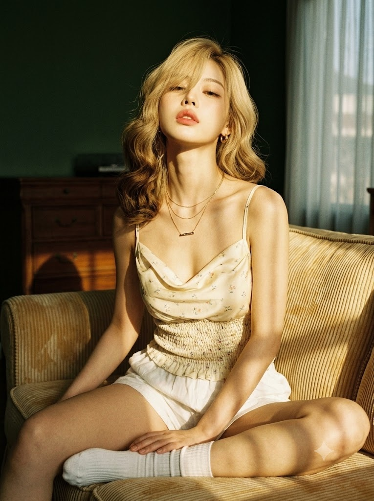
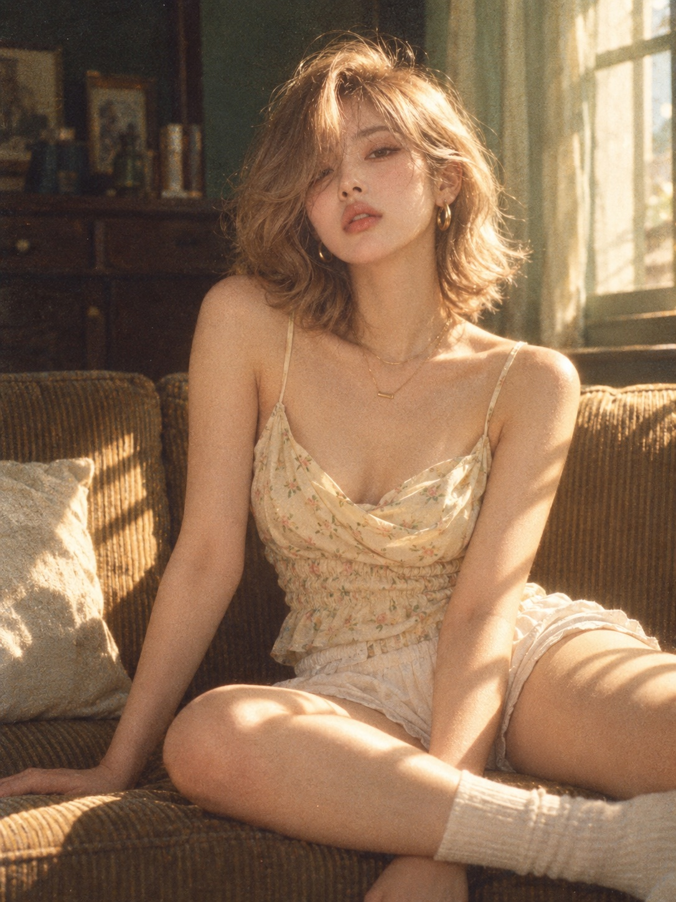

# 가을 햇살 소파 빈티지 필름 사진 프롬프트

## 1. 개요 및 아트 디렉팅 가이드

- **컨셉**: 늦은 오후의 강한 황금빛 직사광이 쏟아지는 옛날식 거실에서, 코듀로이 소파에 곧게 앉은 인물을 담은 거친 그레인의 빈티지 필름 사진. 같은 장면을 GPT용 한국어 프롬프트와 Gemini용 영어 프롬프트 두 버전으로 작성
- **화질 & 색감**:
  - 4K·초선명이 아닌, 옛날 필름을 스캔한 듯한 중간 이하 해상도와 화면 전체를 덮는 굵고 거친 그레인, 매트한 피부 질감
  - 전체에 노랑-연두빛 컬러 캐스트, 햇빛 닿은 피부·소파는 골드·앰버, 그림자·커튼·벽은 올리브·청록으로 분리, 깊은 블랙과 약한 비네팅
- **조명**:
  - 카메라 오른편 앞에서 인물 정면으로 들어오는 강한 직사광, 얼굴 정면 전체가 밝고 그림자는 앞머리가 덮은 눈 주변에만 형성
  - 창틀이 만든 굵은 사선 그림자 줄무늬, 어둡게 유지한 배경으로 인물만 빛 속에 떠오르는 강한 대비
- **카메라 & 구도**:
  - 2~3m 거리, 가슴 높이에서 아주 약간 올려다보는 50mm 화각, 세로 3:4, 인물이 화면 가로의 약 3분의 2를 차지하는 넉넉한 구도
- **인물 & 포즈**:
  - 턱을 들어 고개를 젖히고 렌즈를 내려다보는 나른하고 차가운 눈빛, 살짝 벌어진 입술의 무심한 표정
  - 한쪽 눈을 완전히 덮는 앞머리의 볼륨 있는 웨이브 금발 보브
  - 상체를 곧게 세우고 한 팔로 쿠션을 짚은 자세, 한쪽 다리를 책상다리처럼 납작하게 접은 포즈
- **의상 & 배경**:
  - 잔꽃 프린트의 크림·버터색 새틴 카울 캐미솔, 흰 면 반바지와 흰 골지 양말, 골드 후프 귀걸이와 가는 골드 체인 두 줄
  - 흰 창살의 큰 창과 연두빛 커튼, 어둠 속 원목 서랍장과 짙은 녹색 벽, 베이지·황토색 굵은 골 코듀로이 소파
- **얼굴 규칙**: 업로드 사진에서는 눈·코·입의 생김새만 가져오고, 얼굴형·피부톤·헤어·표정·고개 각도·시선은 프롬프트 서술대로 새로 그림

---

## 2. 프롬프트 전문

### GPT 버전

```text
[얼굴 교체 규칙]
업로드 사진에서는 눈·코·입의 생김새만 가져온다.
얼굴형, 피부톤, 헤어, 화장, 표정, 고개 각도, 시선은 가져오지 않고 아래 서술대로 그린다.
아래 서술된 포즈·각도·구도·조명·의상·배경은 하나도 바뀌면 안 된다. 모든 방향은 화면 기준이다.

[화질 — 최우선]
4K·고해상도·초선명 사진이 아니다.
옛날 필름 사진을 스캔한 듯한 중간 이하 해상도의 빈티지 사진.
화면 전체에 굵고 거친 노이즈 그레인이 강하게 덮여 있어, 피부 결·머리카락 한 올·원단 디테일이 그레인 속에 살짝 묻힌다.
윤곽은 알아볼 수 있지만 쨍하지 않고, 전체적으로 살짝 거칠고 부드럽다.
피부는 모공까지 보이는 극사실이 아니라 그레인에 덮인 매트한 질감.
필름 테두리, 프레임 번호, 먼지, 스크래치, 빛샘은 없다.

[조명 — 최우선]
늦은 오후의 강한 황금빛 직사광이 카메라 쪽 오른편 앞에서 인물 정면으로 쏟아져 들어온다.
얼굴 정면 전체(이마, 콧날, 양 볼, 입술, 턱)가 햇빛을 받아 환하게 밝고, 그림자는 앞머리가 덮은 화면 왼쪽 눈 주변에만 진다.
목, 쇄골, 가슴, 캐미솔 앞판, 양쪽 허벅지 위쪽까지 따뜻한 골드빛이 넓게 내려앉는다.
화면 왼쪽 어깨 위와 쇄골에 가장 밝은 햇빛 하이라이트가 맺히고, 피부가 골드빛으로 강하게 빛난다.
빛이 강해 대비가 크다. 빛이 닿지 않는 곳(턱 밑, 몸 옆면, 배경)은 짙게 떨어진다.
창틀이 만든 굵은 사선 그림자 줄무늬가 화면 오른쪽 위팔과 다리를 가로지른다.
소파 등받이 오른쪽에 햇빛이 고여 밝게 빛난다.
배경과 소파 뒤쪽은 어둡게 유지해 인물만 빛 속에 떠오른다.
퍼진 빛, 흐린 날 같은 평평한 조명 금지.

[색감]
전체에 노랑-연두빛 컬러 캐스트.
햇빛 닿은 피부·소파는 골드·앰버, 그림자·커튼·벽은 올리브·청록 녹색으로 분리.
블랙은 깊게. 앰버·세피아 단색 금지. 하이라이트 주변은 살짝 번진다. 가장자리 약한 비네팅.

[카메라·구도]
카메라는 인물에서 2~3m 떨어진 거리, 앉은 사람의 가슴 높이에서 정면으로, 아주 약간 올려다보는 각도. 50mm 표준 화각.
클로즈업 아님. 인물은 화면 가로의 약 3분의 2만 차지한다.
머리 위로 여백이 조금 있고, 화면 왼쪽엔 소파 쿠션과 어두운 서랍장, 화면 오른쪽엔 창틀·커튼·소파 등받이가 넉넉하게 보인다.
화면 아래는 가로로 누운 접은 다리의 정강이와 양말 신은 발까지 들어온다. 세로 3:4.

[머리·고개 각도]
얼굴은 거의 정면이지만 턱 끝이 화면 왼쪽으로 살짝 돌아가 있다.
그래서 화면 오른쪽 귀와 후프 귀걸이가 또렷하게 보이고, 화면 왼쪽 귀는 머리카락에 가려 귀걸이만 살짝 보인다.
턱을 위로 들어 고개를 뒤로 젖혔다. 목이 길게 드러나고 턱선 아래에 그림자가 진다.
정수리는 화면 오른쪽으로 아주 살짝 기울어 있다.
눈은 위에서 아래로 렌즈를 똑바로 내려다본다.

[표정]
윗눈꺼풀을 반쯤 내린 나른하고 차가운 눈빛.
입술은 살짝 벌어져 윗니 끝이 조금 보이고, 입꼬리는 올리지 않는다. 웃음기 없는 무심한 표정.
연한 코랄 핑크 매트 립, 내추럴 메이크업.

[헤어]
턱선~어깨 사이 길이의 볼륨 있는 웨이브 금발 보브.
가르마는 화면 오른쪽, 앞머리가 화면 오른쪽에서 왼쪽으로 크게 넘어오며 화면 왼쪽 눈을 완전히 덮는다.
화면 왼쪽 옆머리는 풍성한 웨이브가 겹쳐 그림자 속에서 짙은 금갈색.
화면 오른쪽 옆머리는 귀 뒤로 넘겨 귀와 귀걸이가 드러난다.
끝은 바깥으로 둥글게 말린 정돈된 웨이브. 부스스하거나 잔머리가 날리지 않는다.

[상체·팔]
소파에 상체를 곧게 세우고 앉음. 등받이에 기대지 않음.
어깨는 수평, 가슴을 펴고 몸통은 카메라 정면. 상체가 화면 왼쪽(짚은 팔 쪽)으로 아주 약간 기운다.
화면 왼쪽 팔: 팔꿈치를 완전히 펴고 바깥 아래로 비스듬히 뻗어, 화면 왼쪽 아래에서 손바닥을 소파 쿠션에 짚는다. 손가락은 화면 중앙 쪽.
화면 오른쪽 팔: 몸통 옆으로 내리고 팔꿈치를 살짝 굽혀 아래팔이 허벅지 위에 놓인다. 손은 거의 안 보인다.

[다리]
화면 왼쪽 다리를 소파 위에 책상다리처럼 납작하게 접어 몸 앞에 눕혔다.
그 무릎은 화면 아래 중앙에서 약간 왼쪽, 정강이는 화면 맨 아래를 가로로 지나 오른쪽으로 뻗고, 흰 골지 양말 신은 발이 화면 오른쪽 아래 끝에 걸친다.
이 접은 다리는 카메라와 가장 가까워 살짝 아웃포커스.
그 뒤로 화면 오른쪽 허벅지가 반바지 아래에서 오른쪽 아래로 비스듬히 뻗으며 햇빛을 받아 밝다.
무릎을 세우지 않고, 다리를 카메라 쪽으로 내밀거나 벌리지 않는다.

[의상]
연한 크림·버터색 새틴 캐미솔, 가는 스파게티 끈.
가슴 앞이 부드러운 카울 드레이프로 늘어져 중앙에서 V자로 교차하듯 겹친다.
가슴 아래부터 허리까지 주름이 모이며 몸에 붙고, 허리는 고무줄 스모킹 밴드.
원단 전체에 아주 작은 연두·핑크 잔꽃 프린트(희미하게 번진 느낌).
헐렁한 흰 면 숏 반바지, 흰 골지 크루 양말.
양쪽 골드 후프 귀걸이, 아주 가는 골드 체인 두 줄(짧은 줄 + 명치 위 작은 가로 막대 펜던트가 달린 긴 줄).

[배경]
화면 오른쪽: 흰 창살이 있는 큰 창, 연두빛이 도는 반투명 흰 커튼, 창밖은 하얗게 날아감.
화면 왼쪽 뒤: 어둠 속에 흐려진 원목 서랍장과 그 위의 액자·소품, 짙은 녹색 벽.
소파: 세로 골이 굵은 베이지·황토색 코듀로이, 화면 왼쪽에 연한 흰 쿠션. 얕은 심도로 배경 흐림.

[금지]
4K·초고해상도·쨍한 디지털 화질, 노이즈 없는 매끈한 피부, 극사실 피부 모공,
클로즈업·인물이 화면을 꽉 채우는 구도,
옆에서만 들어오는 측광, 얼굴 반쪽이 어두운 조명, 퍼진 평평한 조명, 앰버·세피아 단색,
턱을 숙이거나 정면 그대로 두는 것, 양쪽 눈이 다 보이는 것, 부스스한 헤어,
무릎 세우기·다리 벌리기·등받이에 눕기, 진한 레드 광택 립.
```

### Gemini 버전

```text
Use the uploaded photo only as a reference for the shape of the eyes, nose, and lips of the person. Recreate those three features faithfully so the result clearly resembles them, but do not copy anything else from the photo: not the face shape, skin tone, hair, makeup, expression, head angle, head tilt, or gaze direction. Everything else in the image is defined entirely by the description below. All directions (left/right) are from the viewer's point of view.

A vintage film photograph of a slender young woman sitting upright on a beige-and-ochre wide-wale corduroy sofa in a dim, old-fashioned living room, lit by strong late-afternoon sunlight. The image has the look of an old 35mm film print scanned at modest resolution: a heavy, coarse, clearly visible film grain covers the entire frame, softening fine details like skin pores, individual hair strands, and fabric texture. Edges are readable but not crisp; it should never look like a sharp, clean, high-resolution digital photo. The skin has a matte, grainy texture rather than hyper-real detail. There is no film border, frame number, dust, or light leak.

The color grade has an overall yellow-green cast. Sunlit skin and the sofa glow gold and amber, while shadows, the curtains, and the walls fall into olive and teal green. Blacks are deep, highlights bloom softly, and there is a gentle vignette at the edges.

The light is a strong, warm, golden direct sun coming from the front-right, from just beside the camera, pouring onto her front. Her whole face is brightly lit — forehead, bridge of the nose, both cheeks, lips, and chin — with the only facial shadow falling around the eye that is hidden under her bangs. The warm light spreads broadly across her neck, collarbones, chest, the front of her top, and the tops of both thighs, making her skin glow gold. The brightest highlight sits on top of her left shoulder and collarbone. Thick diagonal shadow stripes cast by a window frame fall across her right upper arm and her legs. The sofa back on the right catches a pool of sunlight. The background stays dark so she appears to stand out in the light.

The camera is about two to three meters away at her chest height, facing her straight on and looking up only very slightly, like a 50mm lens. This is not a close-up: she takes up about two-thirds of the frame width, with a little space above her head, the sofa cushion and a dark wooden dresser visible on the left, and the window, curtain, and sofa back visible on the right. The frame extends down to include her folded shin and socked foot at the bottom. Vertical 3:4 portrait orientation.

Her head is tilted back with her chin raised, showing a long neck with a soft shadow under the jawline. Her face is almost frontal, but the tip of her chin is turned slightly toward the left of the frame, so her ear and gold hoop earring on the right side of the frame are clearly visible, while the left ear is mostly hidden by hair with only the earring peeking out. The top of her head tilts very slightly to the right. She looks down into the lens from above, with heavy, half-lowered eyelids — a languid, cool, unsmiling gaze. Her lips are slightly parted, showing just the tips of her upper teeth, corners of the mouth relaxed. Soft matte coral-pink lips and natural makeup.

Her hair is a voluminous wavy blonde bob falling between the jawline and shoulders, parted on the right side of the frame. Long bangs sweep from right to left and completely cover the eye on the left side of the frame, so only one eye is visible. The waves on the left side are full and layered, deepening to golden brown in the shadow; on the right side the hair is tucked behind the ear. The ends curl outward in neat, defined waves, smooth and polished with no frizz or flyaways.

She sits with her back straight and away from the backrest, shoulders level, chest open, torso facing the camera and leaning just a little toward the left of the frame. Her arm on the left side of the frame is fully straight, extended down and outward at an angle, with her palm flat on the sofa cushion in the lower-left area, fingers pointing toward the center. Her other arm hangs by her side with the elbow slightly bent, the forearm resting on her thigh and the hand mostly out of view. Her leg on the left side is folded flat on the sofa in front of her like a half cross-legged pose: the knee sits slightly left of bottom-center, the shin runs horizontally across the very bottom of the frame toward the right, and her foot in a white ribbed crew sock rests at the lower-right edge. This folded leg, closest to the camera, is slightly out of focus. Behind it, her other thigh extends diagonally down to the right from under her shorts, bright in the sunlight. Her knees stay low and her legs stay together on the sofa.

She wears a pale cream-butter satin camisole with very thin spaghetti straps. The front falls in a soft cowl drape that crosses into a gentle V at the center, then gathers into ruching from under the bust to the waist, ending in an elastic smocked waistband. The fabric is covered in a tiny, faded, watercolor-like pastel green and pink floral print. Loose white cotton shorts and white ribbed crew socks. Small gold hoop earrings on both ears and two very fine gold chain necklaces — a short one and a longer one with a tiny horizontal bar pendant resting just above the sternum.

The room: on the right, a large window with white mullions and sheer white curtains with a slight green tint, the outside blown out to white. On the left in the background, a dark wooden dresser with framed pictures and small objects dissolving into shadow, against a deep green wall. A pale cream cushion sits on the left side of the sofa. Shallow depth of field blurs the background softly.
```

---

## 3. 결과물 비교 갤러리

| 생성 모델 | 생성 결과 이미지 |
| :--- | :--- |
| **제미나이 (Gemini)** |  |
| **ChatGPT (DALL-E 3)** |  |
