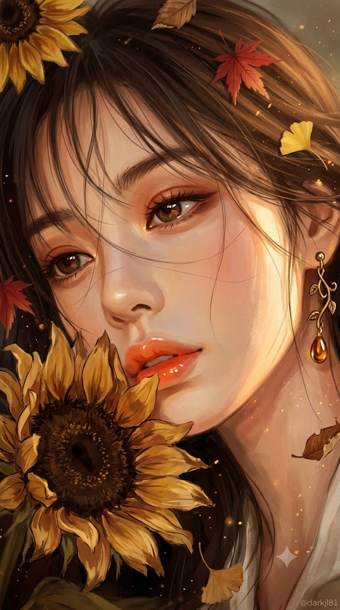
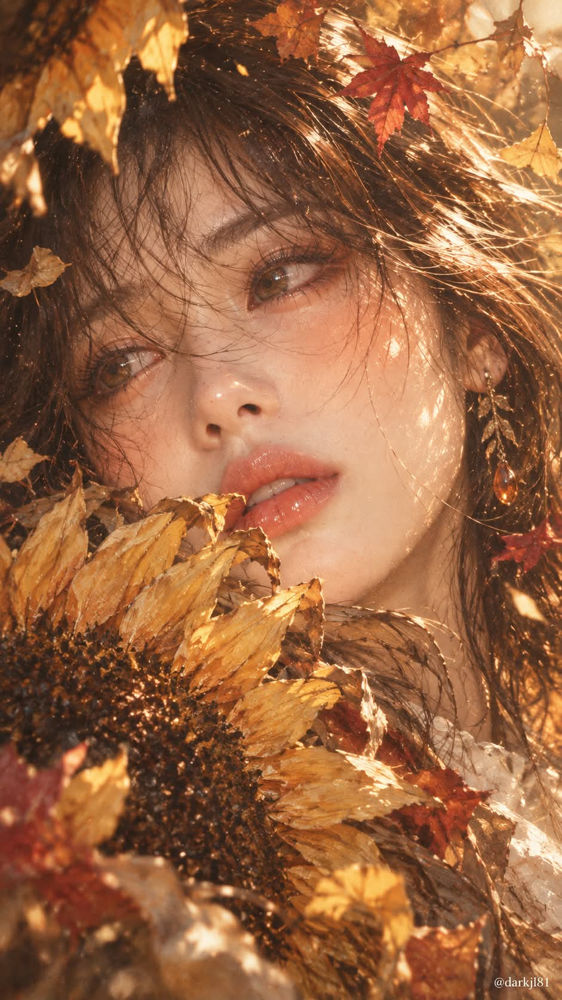

# 늦가을 해바라기와 골든아워 감성 페인팅 초상화 프롬프트

## 1. 개요 및 아트 디렉팅 가이드
- **컨셉/장르**: 유화와 수채화가 결합된 두터운 붓 터치의 반실사 디지털 페인팅 일러스트 (세로 9:16 비율, 몽환적이고 감성적인 늦가을 오후의 정취).
- **구도 & 연출**:
  - 화면을 가득 채우는 극단적 대각선 클로즈업 (오른쪽으로 살짝 기울어진 얼굴, 이마 상단과 턱 하단 크롭).
  - 화면 좌측 하단에서 입술 바로 아래를 덮듯 다가오는 커다란 늦가을 해바라기 한 송이.
- **인물 & 표정**:
  - 따뜻한 골든아워 햇빛이 비치는 맑고 깊은 갈색 눈동자, 눈물기 없는 나른하고 아련한 가을 오후의 시선.
  - 눈 밑과 볼에 번지는 주황빛 홍조, 젤리 같은 광택의 도톰한 코랄 오렌지빛 입술, 웜 브라운·테라코타 섀도.
  - 얼굴 위로 흐트러지듯 떨어지는 흑갈색 시스루 뱅 헤어.
- **안경 & 소품**:
  - 원본 사진에 안경/선글라스가 있을 경우 얼굴 기울기에 맞춘 원근 적용 및 렌즈 표면 골든아워 햇빛·단풍잎 실루엣 반사 연출 (회화풍 융화).
  - 앤틱 골드 잎사귀 드롭 귀걸이와 물방울형 앰버(호박) 펜던트, 아이보리 리넨 블라우스 칼라.
- **가을 감성 극대화**:
  - 시들기 시작한 머스터드·황토·꿀빛 해바라기, 머리카락 사이에 엉킨 붉은 단풍잎과 노란 은행잎.
  - 오후 5시의 따뜻한 골든아워 측광, 앰버·버건디·번트 오렌지 중심의 웜 톤 팔레트, 부유하는 금빛 먼지와 빈티지 비네팅.

## 2. 프롬프트 전문

```text
업로드한 얼굴 사진은 오직 '눈·코·입의 생김새'와 '착용한 안경 또는 선글라스(있을 경우)'만 참고한다. 얼굴형, 피부, 헤어, 이마/헤어라인, 표정, 고개 각도, 방향, 시선은 사진에서 절대 가져오지 않는다. 아래 서술 외의 구도·각도·헤어·의상·배경은 어떤 것도 바꾸지 않는다.

[화풍]
반실사 디지털 페인팅 일러스트. 유화와 수채가 섞인 듯한 두터운 붓 터치, 피부는 부드럽게 블렌딩하되 머리카락과 꽃잎은 거칠고 빠른 스트로크로 질감을 살린다. 전체적으로 은은하게 반짝이는 하이라이트, 몽환적이고 감성적인 분위기. 세로 9:16 비율.

[구도]
얼굴을 화면 가득 채우는 극단적 클로즈업. 얼굴은 오른쪽으로 살짝 기울어져 화면 대각선 방향으로 누워 있고, 이마 위쪽과 턱 아래는 프레임 밖으로 잘린다. 화면 왼쪽 아래에서 커다란 해바라기 한 송이가 입술 바로 아래를 덮듯 다가와 얼굴 하단 일부를 가린다.

[얼굴·표정]
젊은 여성. 맑고 깊은 갈색 눈동자에 골든아워 햇빛이 비쳐 따뜻하게 빛난다. 눈물은 절대 그리지 않으며, 눈가·볼·속눈썹에 물방울이나 젖은 흔적이 전혀 없다. 눈 밑과 볼에 주황빛 홍조가 번지듯 올라와 있고, 코끝에 작은 빛 하이라이트. 입술은 도톰한 코랄 오렌지빛에 젤리 같은 광택, 살짝 벌어져 해바라기 꽃잎에 닿을 듯하다. 시선은 화면 밖 어딘가를 가만히 바라보는, 나른하고 아련한 가을 오후의 표정. 아이섀도는 웜 브라운·테라코타 톤.

[헤어]
흑갈색의 길고 가는 머리카락이 얼굴 위로 흐트러져 흘러내린다. 앞머리는 눈썹을 덮을 듯한 시스루 뱅, 몇 가닥이 눈과 볼 위를 가로지른다. 바람에 날린 듯 결이 살아 있고 끝이 가늘게 갈라진다.

[안경·선글라스]

사진에 안경이나 선글라스가 없으면 아무것도 씌우지 않는다. 임의로 추가하지 않는다.

사진에 안경이 있으면 프레임의 형태(원형/사각/오벌/하금테 등), 굵기, 색상, 재질(금속/뿔테/투명)을 그대로 유지해 착용시킨다. 단, 얼굴 각도는 위 [구도]대로 기울어진 상태이므로 안경도 그 각도에 맞게 자연스럽게 원근을 적용해 다시 그린다.

안경 렌즈는 투명하게 그려 눈이 그대로 보이게 하고, 렌즈 표면에 골든아워 햇빛 반사와 작은 단풍잎 실루엣이 은은하게 비친다. 프레임 위에 금빛 림라이트, 앞머리 몇 가닥이 프레임 위로 걸쳐 내려온다.

사진에 선글라스가 있으면 프레임 형태·색상과 렌즈 색(블랙/브라운/그라데이션/미러 등)을 그대로 유지한다. 렌즈에 가려 눈이 보이지 않아도 되며, 대신 렌즈 표면에 붉은 단풍과 노란 은행잎, 해 질 녘 하늘이 거울처럼 비친다.

안경·선글라스도 전체 화풍(유화+수채 붓 터치)과 따뜻한 앰버 색감 안에 녹아들게 그리며, 사진처럼 이질적으로 붙여넣은 느낌이 나지 않게 한다.

[소품·액세서리]
화면 왼쪽 위에도 해바라기 꽃잎 일부가 걸쳐 있다. 오른쪽 귀에는 덩굴과 작은 잎사귀 모양의 앤틱 골드 드롭 귀걸이, 끝에 물방울형 호박(앰버) 펜던트. 어깨 쪽에 살짝 보이는 아이보리 리넨 블라우스 칼라.

[가을 감성 — 최대치로]

해바라기는 한여름의 선명한 노랑이 아니라 늦가을에 시들기 시작한 머스터드·황토·꿀빛 노랑, 꽃잎 가장자리는 갈색으로 말라 바스락거리는 질감, 씨앗부는 짙은 초콜릿 브라운

머리카락 사이와 얼굴 주변에 붉은 단풍잎, 노란 은행잎, 갈색 마른 잎이 몇 장 내려앉아 있고 일부는 머리카락에 엉켜 있다

공기 중에 낙엽 부스러기와 금빛 먼지 입자가 역광에 반짝이며 떠다닌다

조명은 해 질 녘 오후 5시의 낮고 따뜻한 골든아워 측광, 피부와 머리카락 가장자리에 호박색 림라이트

색감 팔레트: 앰버, 버건디, 번트 오렌지, 머스터드, 카라멜, 세피아 브라운 — 차가운 색은 거의 쓰지 않는다

필름 그레인과 약간 바랜 빈티지 톤, 가장자리는 따뜻하게 어두워지는 비네팅

마른 잎 냄새와 늦은 오후 햇살 냄새가 날 것 같은, 포근하면서도 살짝 그리운 분위기

[텍스트]
우하단에 작고 은은한 흰색 글씨로 "@darkjl81" 워터마크만 넣는다. 그 외 글자 없음.
```

## 3. 결과물 비교 갤러리

| 제미나이 (Gemini) | GPT (DALL-E 3) |
| :---: | :---: |
|  |  |
