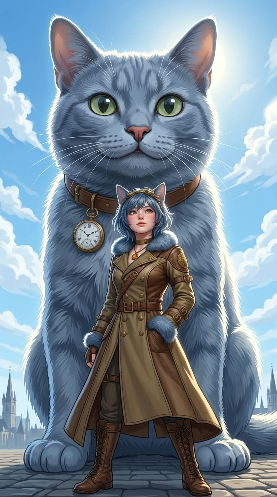
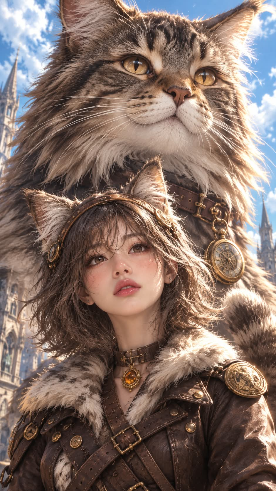

# 관상 매칭 거대 수호수 × 수인 소녀 판타지 일러스트 프롬프트

## 1. 개요 및 아트 디렉팅 가이드

- **컨셉**: 인물의 이목구비 관상을 분석해 가장 닮은 개·고양이 품종을 도출하고, 그 품종의 거대 수호수와 수인(동물 귀·꼬리) 소녀를 스팀펑크 탐험가 세계관으로 엮어낸 고해상도 판타지 컨셉 아트
- **2단계 생성 워크플로우**:
  - **1단계 (관상 분석 및 품종 매칭)**: 눈매, 코, 입매, 전체 분위기를 분석하여 전 세계 개·고양이 품종 중 가장 닮은 단 하나의 품종 선정 및 이유 설명 선행 출력
  - **2단계 (장면 생성)**: 선택된 품종의 외형적 특징(털 질감·색상·귀·눈동자)을 거대 수호수와 수인 소녀, 의상 컬러 팔레트에 100% 일체화
- **캐릭터 & 거대 수호수 묘사**:
  - **거대 수호수**: 인물 뒤편에서 화면 상단을 가득 채우는 압도적 스케일, 극사실적인 털 질감과 온화한 미소, 회중시계 목걸이 착용
  - **수인 소녀**: 동일 품종의 귀와 꼬리, 어깨 길이 단발, 주근깨와 발그레한 볼, 기계 장식 금속 헤어밴드
  - **얼굴 착용물 예외 규칙**: 업로드 사진의 안경·선글라스는 프레임/틴트를 그대로 유지하여 자연스럽게 착용
- **의상 (스팀펑크 탐험가 코트)**:
  - 품종의 털색·무늬·눈 색에서 추출한 컬러 팔레트의 맞춤형 트렌치 코트
  - 털 질감 칼라 트리밍, 다중 가죽 스트랩과 버클, 리벳 단추, 메달리온 펜던트
- **구도, 배경 & 조명**:
  - 세로 9:16 비율, 인물 가슴 위 반신 샷 + 거대 수호수가 감싸는 로우 앵글
  - 맑은 하늘과 뭉게구름, 발아래로 흐릿하게 펼쳐진 고풍스러운 유럽 고딕 첨탑 도시 전경, 부드러운 자연광 림라이트

---

## 2. 프롬프트 전문

```text
[관상 매칭 거대 수호수 × 수인 소녀 — 얼굴 합성 프롬프트]

■ 사용 이미지
업로드한 사진은 얼굴 참고용으로만 사용한다. 사진에서는 눈·코·입의 생김새만 가져온다.
얼굴형, 피부, 헤어, 이마·헤어라인, 표정, 고개 기울기, 얼굴 방향, 시선은 사진에서 절대 가져오지 않는다.
표정·각도·헤어·의상·구도는 모두 아래 서술대로 새로 그린다.
단, 사진 속 인물이 안경이나 선글라스를 쓰고 있다면 예외로 그 안경·선글라스의 프레임 모양, 두께, 렌즈 형태, 색, 렌즈 틴트를 그대로 가져와 최종 이미지에서도 똑같이 착용시킨다. 안경·선글라스를 쓰지 않은 사진이라면 새로 추가하지 않는다.

■ 1단계 — 관상 분석과 동물 선택 (이미지 생성 전에 먼저 수행)
업로드한 얼굴의 눈매(크기, 눈꼬리 방향, 눈 사이 거리), 코의 형태, 입매, 전체적인 인상과 분위기를 관상적으로 분석한다.
선글라스로 눈이 가려진 사진이라면 보이지 않는 눈매를 추측해 판단하지 말고, 코, 입매, 선글라스 너머로 드러나는 인상과 분위기만으로 관상을 분석한다.
세상의 모든 고양이 품종과 모든 강아지 품종 전체를 동등하게 후보로 두고, 이 인상과 닮은 후보를 고양이 쪽과 강아지 쪽에서 각각 떠올려 비교한 뒤 가장 닮은 품종 단 하나를 고른다.
- 의상, 배경, 화풍의 분위기에 어울리는 품종을 고르지 않는다.
- 장모종·단모종, 털색, 체구, 인기도에 대한 선호 없이 오직 얼굴 인상과의 닮음만으로 결정한다.
- 고른 품종 이름과 닮았다고 판단한 이유를 한두 문장으로 먼저 적은 뒤 이미지를 생성한다.

■ 2단계 — 선택한 품종을 장면 전체에 반영
[거대 수호수]
- 인물 바로 뒤에 선택한 품종의 거대한 동물이 서 있다. 인물보다 몇 배 크며, 머리가 화면 상단을 채우고 몸이 인물의 등 뒤를 감싸듯 화면 좌우 아래까지 이어진다.
- 털 길이, 털 질감, 털색, 무늬, 귀 모양, 주둥이 길이, 얼굴 비율, 눈 색, 체형은 선택한 품종의 실제 모습을 그대로 따른다. 짧은 털 품종이면 짧고 매끈하게, 곱슬 털 품종이면 곱슬하게 그린다.
- 극사실적인 털 표현, 촉촉한 코, 투명감 있는 눈동자와 선명한 하이라이트.
- 표정은 온화하게 인물 위에서 살짝 미소 짓는 얼굴.
- 목에는 목줄이 있고 한쪽에 금속 테두리의 둥근 회중시계가 매달려 있다.

[수인 인물]
- 선택한 품종의 귀가 머리 위에 자연스럽게 달려 있고, 허리 뒤로 같은 품종의 꼬리가 보인다. 귀와 꼬리의 형태, 털 질감, 털색, 무늬는 뒤의 거대 동물과 완전히 동일하다.
- 머리카락 색은 선택한 품종의 털색을 따르고, 앞머리가 있는 어깨 길이의 가볍게 흐트러진 단발. 머리에는 작은 기계 장식이 달린 금속 헤어밴드.
- 볼은 살짝 발그레하고 볼 위에 옅은 주근깨, 매끈한 도자기 같은 피부 질감.
- 표정: 입꼬리를 살짝 올린 부드럽고 차분한 미소, 시선은 화면 약간 위쪽 먼 곳.
- 얼굴은 정면에서 아주 살짝 돌아간 3/4 각도, 고개는 곧게.
- 사진에서 안경·선글라스를 가져온 경우, 사진과 같은 안경·선글라스를 자연스럽게 착용하고 있다. 수인 귀는 머리 위에 있으므로 안경다리는 사람 귀 위치의 머리카락 속으로 자연스럽게 들어간다. 선글라스라면 렌즈 너머로 눈을 드러내지 않고 사진 속 렌즈의 투명도를 그대로 유지한다. 안경을 쓴 상태에서도 표정과 얼굴 각도는 위 서술대로 그린다.

[의상 — 스팀펑크 탐험가 코트]
- 몸에 딱 맞는 스팀펑크 탐험가 트렌치 코트. 코트, 칼라 트리밍, 스트랩, 금속 장식, 보석의 색과 소재는 모두 선택한 품종의 털색·무늬·눈 색에서 가져와 조화롭게 정한다.
- 칼라에는 선택한 품종의 털 질감을 닮은 트리밍.
- 앞여밈에 여러 줄의 스트랩과 버클, 리벳 단추, 어깨의 원형 배지, 비스듬히 가로지르는 크로스 스트랩.
- 목에는 초커와 보석이 박힌 메달리온 펜던트.

■ 구도·배경·화풍
- 세로 9:16, 인물은 가슴 위 반신 샷으로 화면 하단 중앙, 거대 동물은 그 뒤 상단을 채우는 로우앵글 구도.
- 배경: 맑은 하늘과 뭉게구름, 화면 좌우 아래로 첨탑이 솟은 고풍스러운 유럽 고딕 도시가 흐릿하게 보인다.
- 밝은 한낮의 부드러운 자연광, 동물의 털과 인물 머리카락 가장자리에 은은한 림라이트.
- 반실사 판타지 일러스트, 극세밀 디테일, 고해상도 컨셉 아트 화풍.

■ 금지 사항
- 사진의 헤어·얼굴형·피부·표정·각도·배경 반영 금지
- 사진에 없는 안경·선글라스 추가 금지
- 품종 특징이 섞인 잡종 느낌 금지 (거대 동물과 인물의 귀·꼬리는 반드시 같은 한 품종)
- 텍스트, 로고, 워터마크 금지
```

---

## 3. 결과물 비교 갤러리

| 생성 모델 | 생성 결과 이미지 |
| :--- | :--- |
| **제미나이 (Gemini)** |  |
| **ChatGPT (DALL-E 3)** |  |
