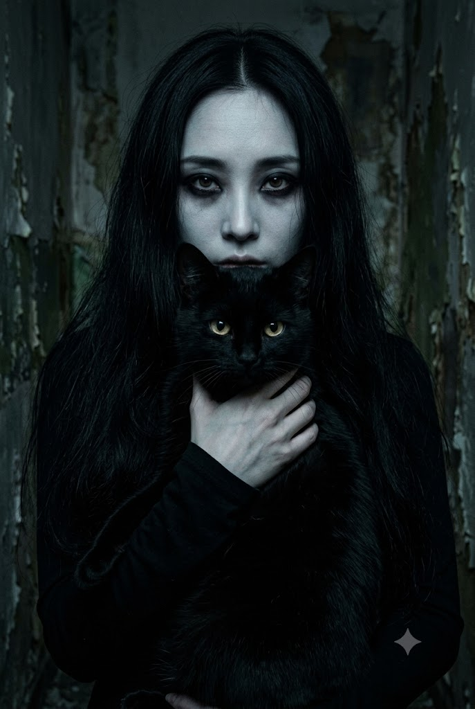
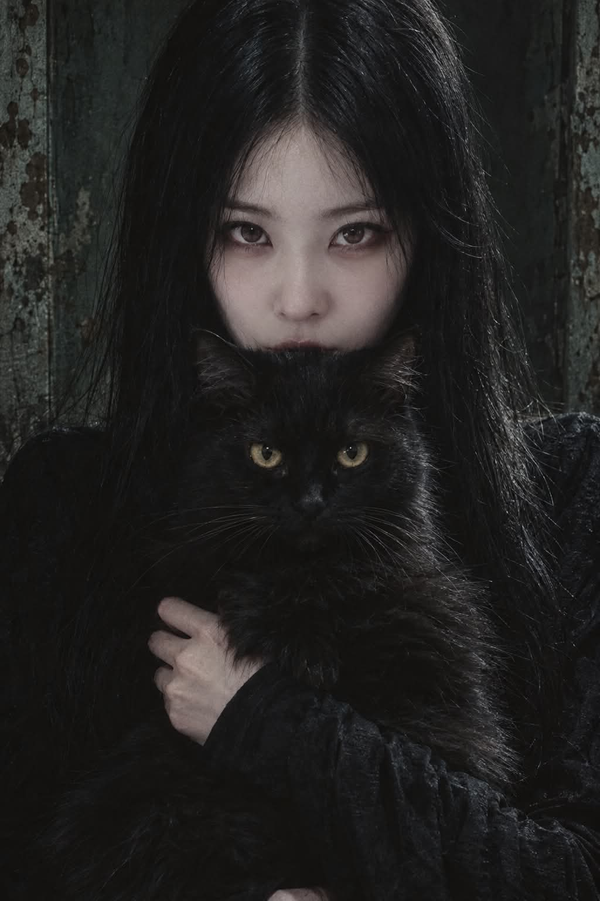

# 심리적 고딕 호러 '검은 고양이' 시네마틱 포트레이트 프롬프트

## 1. 개요 및 아트 디렉팅 가이드
- **콘셉트 테마**: 1970~1980년대 클래식 유럽 고딕 호러 영화의 정지된 한 프레임을 연상시키는 100% 포토리얼 심리 공포 포트레이트. 빛이 극도로 차단된 폐쇄 공간에서 턱 밑까지 거대한 검은 고양이를 끌어안은 채 정면을 응시하는 여성과 고양이의 섬뜩한 시선 (세로 2:3)
- **핵심 아트 디렉팅 & 조형 원리**:
  - **인물 인상 보존 & 로우키 호러 재조명 (Identity & Low-key Cinematography)**:
    - 참조 사진의 눈매, 눈동자 형태, 코, 입술, 얼굴 윤곽 등 고유 정체성만 추출.
    - 참조 사진의 밝기/색온도를 완전히 배제하고, 차가운 청회색·녹회색 톤과 깊은 그림자 속에서 이마·콧대·광대 일부만 희미하게 드러나는 극단적인 로우키 조명 재계산.
    - 번진 듯한 블랙 스모키 아이와 핏기 없는 차가운 입술.
  - **상반신 타이트 크롭 & 무거운 흑발 (Tight Medium Close-up)**:
    - 허리 위/명치선 부근에서 크롭되는 타이트한 상반신 정면 구도.
    - 앞머리 없는 완벽한 센터파트의 길고 무거운 흑발이 얼굴 양옆과 어깨를 수직으로 덮으며, 좁은 어깨와 마른 체형의 실루엣 강조.
  - **가슴 높이에 안긴 거대한 실제 검은 고양이 (Black Cat Companion)**:
    - 판타지 괴물이 아닌 실제 골격의 묵직한 검은 집고양이. 여성의 턱과 입술 일부를 가릴 정도로 높게 안겨 정면을 응시.
    - 발광 효과 없는 황금빛~황록빛 눈동자의 리얼한 캐치라이트, 미세한 빛을 받아 드러나는 털 한 올 한 올의 결.
  - **정교한 실루엣 분리 & 낡은 실내 벽 미장센**:
    - 인물 뒤편 양옆으로 좁게 드러나는 벗겨진 페인트와 습기 자국의 낡은 벽.
    - 극도로 어두운 톤 속에서도 인물의 어깨와 머리카락, 고양이의 등 윤곽이 배경과 뭉개지지 않도록 섬세하게 분리해 주는 극미한 차가운 환경광.
    - 35mm 필름 그레인과 묵직한 블랙 톤이 자아내는 점프스케어 없는 심리적 압박감.

---

## 2. 프롬프트 전문 (코드 블록)

```text
세로 2:3, 초고해상도, 100% 포토리얼 실사 고딕 호러 시네마틱 포트레이트.
오래된 공포영화의 한 장면을 실제 전문 사진작가가 촬영한 듯한 극사실적 이미지.
예쁘고 밝은 고딕 화보가 아니라, 빛이 거의 없는 오래된 폐쇄 공간에서 촬영한 듯한
차갑고 음산하며 심리적으로 불편한 공포 분위기.

━━━━━━━━━━━━━━━━━━━━
[전체 구도 — 매우 중요]
━━━━━━━━━━━━━━━━━━━━

세로 2:3, 상반신(허리 위)만 나오는 타이트한 미디엄 클로즈업.
전신·하반신은 프레임에 들어오지 않는다.

프레임 상단은 머리 정수리 바로 위에서 시작하고,
프레임 하단은 허리선 살짝 위 또는 명치~갈비뼈 부근에서 잘린다.

인물은 화면 정중앙에 위치하며,
길고 무거운 검은 머리카락이 얼굴 양옆으로 넓게 흘러내려
어깨와 가슴 윗부분 상당 부분을 자연스럽게 덮는다.

머리카락이 프레임 좌우 가장자리에 가깝게 퍼지고,
그 뒤로 낡은 벽의 좁은 여백만 살짝 드러난다.

고양이는 가슴 높이, 화면 중앙 하단부에 안겨 있으며
머리는 여성의 입과 턱 일부를 가릴 정도로 높게 위치한다.

한쪽 손은 소매 사이에서 자연스럽게 나와
고양이의 몸통 옆면을 받치듯 감싼다.

카메라는 인물의 정면, 얼굴과 몸 모두 기울어지지 않은 안정적인 중앙 구도.
어깨가 좁고 팔이 가늘어 마른 체형이 여전히 느껴져야 한다.

━━━━━━━━━━━━━━━━━━━━
[여성]
━━━━━━━━━━━━━━━━━━━━

창백한 성인 여성이 커다란 검은 고양이를 가슴 높이까지 끌어안고
카메라를 정면으로 똑바로 응시한다.

여성은 길고 새까만 생머리.
정확한 중앙 가르마이며 앞머리는 없다.
검은 머리카락은 얼굴 양옆에서 거의 수직으로 무겁게 떨어지고,
어깨와 검은 의상 쪽으로 자연스럽게 이어진다.
과도한 볼륨이나 웨이브 없이, 약간 축축하고 무거운 듯한 실제 머리카락 질감.

표정은 웃지 않는다.
입꼬리를 올리지 않고 거의 무표정에 가까운 차갑고 불길한 얼굴.
턱은 정면을 유지한 채 두 눈만 약간 치켜뜨는 듯한
강렬하고 섬뜩한 시선으로 렌즈를 바라본다.

눈 주변에는 검게 번지고 그을린 듯한 짙은 블랙 스모키 메이크업
(깔끔한 현대식이 아니라 약간 흐트러진 느낌).
입술은 혈색이 거의 없는 창백하고 차가운 색, 화려한 립 컬러 금지.

피부톤·조명·헤어스타일의 정확한 처리 방식은
아래 [얼굴 참조 사진 처리] 섹션을 따른다.

━━━━━━━━━━━━━━━━━━━━
[얼굴 참조 사진 처리 — 매우 중요]
━━━━━━━━━━━━━━━━━━━━

첨부된 얼굴 사진에서는 오직 다음만 추출한다:
눈매·눈동자 모양, 코 형태, 입술 형태, 얼굴 윤곽(정체성 형태)만.

아래 항목은 참조 사진에 어떻게 나와 있든 절대 가져오지 않는다:

헤어스타일, 앞머리(뱅) 유무, 머리 길이·질감
→ 이 장면은 반드시 앞머리 없는 중앙 가르마를 유지한다.

원본 사진의 피부 밝기, 화이트밸런스, 노출값, 조명 방향

원본 사진의 메이크업(립 컬러, 아이라인 스타일 등)

원본 사진의 표정, 카메라 각도

얼굴은 이 장면 안에서 새로 촬영된 것처럼 처음부터 다시 조명을 계산한다.
얼굴 대부분은 깊은 그림자에 잠기고,
이마 중앙·콧대·광대 일부에만 희미한 빛이 닿으며,
눈가와 얼굴 가장자리는 어둠 속으로 사라진다.
참조 사진처럼 얼굴 전체가 고르게 밝고 선명하게 보이면 안 된다.

피부톤은 참조 사진의 원래 색을 기준 삼지 않고,
이 장면의 차갑고 어두운 색온도(청회색·녹회색 계열)로 전면 재보정한다.
스모키 아이 메이크업과 창백한 입술은 정체성만 남은 얼굴 위에
이 장면 기준으로 새로 그린다.

합성된 얼굴의 명암·색온도는 바로 옆에 맞닿은 검은 고양이 및
배경 조명과 자연스럽게 이어져야 하며, 얼굴만 따로 붕 뜬 듯한
이질감이 없어야 한다.

이후 과도한 리터칭 없이 통상적인 인물 사진 보정 수준
(피부 잡티 정리, 톤 매끄럽게 정돈)만 적용해 합성한다.

━━━━━━━━━━━━━━━━━━━━
[의상·팔·소매 — 중요]
━━━━━━━━━━━━━━━━━━━━

목부터 손목까지 피부를 거의 완전히 덮는 오래된 검은색 긴소매 의상.
양쪽 소매는 반드시 손목까지 완전히 내려와 있어야 하며,
팔뚝·전완·팔꿈치 피부 노출, 민소매·반소매·걷어 올린 소매,
팔 타투 노출을 금지한다. 소매 끝에서 손만 자연스럽게 드러난다.

의상은 화려한 드레스가 아니라 무광의 오래된 검은 패브릭으로 된
단순하고 어두운 옷. 미세한 주름과 직물 질감은 있지만
장식·레이스·보석·화려한 자수는 최소화한다.
좁은 어깨선과 가느다란 팔, 작은 몸통 실루엣으로 마른 체형이 느껴져야 한다.

한쪽 손과 팔로 고양이의 앞가슴과 옆구리 부근을 안정적으로 받친다.
손가락은 길고 가늘지만 실제 사람의 해부학적 구조
(개수·관절·손목 연결)를 정확하게 유지한다.

━━━━━━━━━━━━━━━━━━━━
[검은 고양이]
━━━━━━━━━━━━━━━━━━━━

크고 묵직한 실제 검은 고양이. 판타지 생물이나 괴물이 아닌
실제 검은 집고양이의 자연스러운 골격과 얼굴 구조.

여성의 가슴 앞 중앙에 안겨 있으며, 머리는 여성의 입과 턱 일부를
가릴 정도로 높게 위치한다. 고양이도 카메라를 거의 정면으로 바라본다.

새까만 털이지만 완전한 검은 덩어리로 뭉개지지 않고,
약한 빛을 받은 부분에서 털 한 올 한 올과 귀·볼·목 주변 털결이
희미하게 드러난다.

눈동자는 황금빛~황록빛. 눈 자체가 빛나는 판타지 발광 효과는 금지하며,
주변 광원을 반사한 작은 실제 캐치라이트만 존재한다.

━━━━━━━━━━━━━━━━━━━━
[조명 — 극도로 어둡지만 실루엣은 반드시 보여야 함]
━━━━━━━━━━━━━━━━━━━━

전체적으로 매우 어두운 극단적인 로우키 조명.
장면 대부분은 검정, 숯회색, 짙은 녹회색 그림자 속에 잠겨 있지만,
단순 노출 부족으로 뭉개진 사진은 아니다.

검은 머리카락·의상·고양이와 뒤쪽 어두운 벽 사이에는
아주 미세한 밝기 차이가 반드시 존재해야 하며,
인물의 실루엣이 배경과 완전히 합쳐져 사라지면 안 된다.

인물 양쪽 뒤편에서 거의 느껴지지 않을 정도의 매우 약하고 차가운
회녹색·청회색 환경광이 들어와, 머리카락 가장자리와 좁은 어깨선의
외곽선만 배경으로부터 아주 희미하게 분리한다.
림라이트는 밝은 흰 테두리처럼 보이지 않을 만큼 극도로 미묘해야 한다.

얼굴에는 위쪽과 한쪽 측면의 제한적인 빛만 닿아
이마 중앙·콧대·광대 일부만 희미하게 드러나고,
눈 주변과 얼굴 가장자리, 얼굴 한쪽은 깊은 그림자 속에 남는다.

고양이의 귀·머리·등에도 매우 약한 가장자리 빛이 닿아
검은 배경과 완전히 합쳐지지 않게 한다.

장면에서 가장 밝게 인식되는 부분은 여성의 창백한 두 눈과
고양이의 황금빛 두 눈이지만, 얼굴만 허옇게 떠 보이면 안 되며
주변의 어둡고 차가운 환경광에 자연스럽게 맞춰진다.

━━━━━━━━━━━━━━━━━━━━
[배경 — 좁은 벽 여백]
━━━━━━━━━━━━━━━━━━━━

여성 바로 뒤에는 오래되고 낡은 실내 벽이 있다.
인물이 상반신 위주로 화면을 타이트하게 채우고 있어,
벽은 머리카락과 어깨 바깥쪽으로 좁은 폭만 드러난다.
왼쪽과 오른쪽 벽 모두 아주 좁게라도 프레임 가장자리에 들어와야 하며
완전히 잘려 안 보이면 안 된다.

벽은 거의 검게 보일 정도로 어둡지만 완전한 검은 배경은 아니며,
낡은 나무 또는 회벽의 거친 표면, 벗겨진 페인트, 습기 자국,
녹슨 갈색 얼룩, 탁한 청록색·회녹색 흔적이 아주 희미하게 보인다.
벽의 디테일은 인물보다 선명하지 않다.

창문, 촛불, 샹들리에, 밝은 램프, 화려한 장식이나
눈에 띄는 소품은 추가하지 않는다.

━━━━━━━━━━━━━━━━━━━━
[색감과 질감]
━━━━━━━━━━━━━━━━━━━━

전체 팔레트는 검정, 숯회색, 죽은 듯한 녹회색, 탁한 청록색,
오래된 갈색과 아주 약한 황갈색. 전체 채도는 매우 낮다.

현대적인 깨끗한 디지털 사진보다 1970~1980년대 유럽 고딕 호러
영화 필름을 현대 고해상도 카메라로 복원한 듯한 분위기.
35mm 필름 그레인, 깊고 무거운 블랙, 약간 거친 암부 질감,
미세하게 바랜 색.

과도한 HDR, 밝은 시네마틱 오렌지·틸 컬러그레이딩,
깨끗하고 화사한 스튜디오 조명은 금지.

━━━━━━━━━━━━━━━━━━━━
[공포 분위기]
━━━━━━━━━━━━━━━━━━━━

피, 상처, 괴물, 고어, 점프스케어에 의존하지 않는다.
여성과 검은 고양이가 아무 말 없이 카메라를 계속 바라보고 있다는
사실 자체가 불편하고 섬뜩해야 한다.

오래된 폐가에서 우연히 발견한 사진, 혹은 오래된 공포영화에서
갑자기 멈춘 한 프레임 같은 분위기. 아름답지만 편안하지 않고,
조용하지만 위협적이며, 어둠 속에 무엇인가 더 존재하는 듯한
심리적 공포감. 형태를 알아볼 수 있는 최소한의 빛만 남긴다.

━━━━━━━━━━━━━━━━━━━━
[최종 표현]
━━━━━━━━━━━━━━━━━━━━

100% 실제 사람과 실제 검은 고양이를 카메라로 촬영한 질감.
극사실적인 피부, 머리카락, 손, 검은 천, 고양이 털의 실제 질감.

세로 2:3, 상반신(허리 위)만 나오는 타이트한 크롭.
매우 마르고 좁은 체형. 머리카락이 양옆으로 넓게 흘러내려
어깨를 덮고, 그 바깥으로 낡은 벽이 좁게 보인다.
손목까지 내려오는 검은 긴소매. 매우 어두운 로우키 노출.
앞머리 없는 중앙 가르마 유지, 참조 사진의 헤어스타일·조명·
피부톤은 따라가지 않는다. 합성된 얼굴은 옆의 검은 고양이·
배경 조명과 자연스럽게 이어진다.
여성의 눈과 검은 고양이의 눈을 시각적 중심으로 한다.

일러스트, 유화, 디지털 페인팅, 애니메이션, 셀 셰이딩, 3D 렌더,
CGI 느낌 금지. 밝은 피부 보정, 뷰티 조명, 과도한 피부 광택,
판타지 발광 눈, 과도한 림라이트, 화려한 고딕 패션 화보 느낌 금지.
```

---

## 3. 결과물 비교 갤러리

| 생성 모델 | 결과 이미지 |
| :--- | :--- |
| **Google Gemini** |  |
| **OpenAI GPT** |  |
