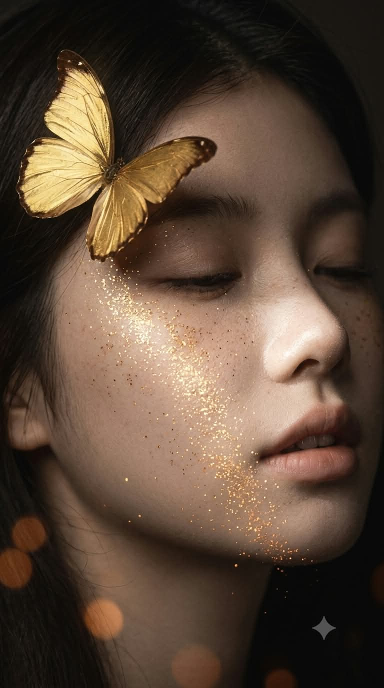
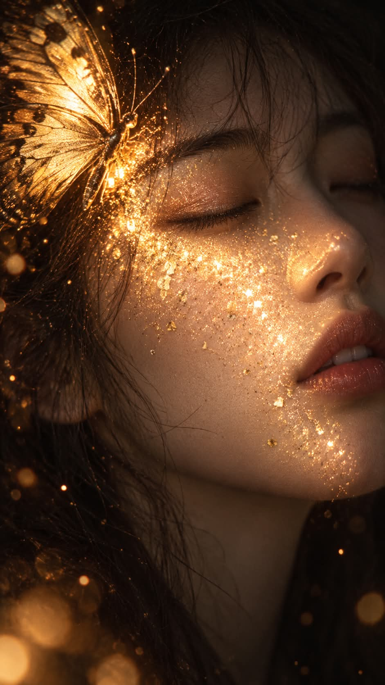

# 골든 더스트, 빛나는 나비 인분 로우키 매크로 실사 프롬프트

## 1. 개요 및 아트 디렉팅 가이드

- **컨셉**: 깊은 그늘에 잠긴 얼굴 위로 황금 나비의 인분이 스스로 빛나는 띠가 되어 흘러내리는, 극단적 로우키의 초근접 매크로 실사 뷰티 사진 (세로 9:16). GPT용과 Gemini용 두 버전으로 작성
- **버전별 차이**:
  - **GPT 버전**: 얼굴 규칙, 구도, 표정, 나비, 조명, 인분, 피부, 배경을 항목별로 나눈 규칙형 프롬프트
  - **Gemini 버전**: 같은 장면을 문단으로 풀어 쓰고 마지막에 '하지 말 것'을 한 문단으로 모은 서술형 프롬프트
- **얼굴 사용 규칙**: 사진에서는 눈·코·입의 생김새만 가져오고, 얼굴형·피부·헤어·표정·각도·시선·조명·배경은 프롬프트 서술대로 새로 만듦
- **구도 (엄격히 고정)**:
  - 얼굴 하나가 화면의 약 80%를 채우는 초근접 클로즈업
  - 이마 윗부분은 프레임 위로, 먼 쪽 볼과 귀는 화면 오른쪽 끝에서 잘림
  - 화면 오른쪽을 향한 3/4 측면, 고개는 아주 살짝만 위로, 목은 거의 보이지 않음
- **표정**: 두 눈을 부드럽게 감고 입술이 살짝 벌어진, 평온하게 잠든 듯한 얼굴. 광택 없는 누드 톤 립
- **황금 나비**: 화면 왼쪽 위에서 관자놀이와 헤어라인 위에 날개를 반쯤 접고 앉은 큰 나비. 금박 같은 금속성 날개와 섬세한 날개맥
- **조명 (엄격히 고정)**:
  - 외부 조명은 전혀 없음. 역광·림라이트·정면 조명 모두 금지
  - 얼굴 전체는 채도 낮은 어두운 회갈색 그림자에 덮여 윤곽과 피부 결만 희미하게 보임
  - 빛은 오직 인분 띠에서만 나오며, 그 빛이 닿는 피부만 밝아지는 극단적인 명암 대비
- **나비 인분 (빛나는 띠)**:
  - 나비 아래에서 눈 밑, 볼, 콧등과 콧끝, 입술 옆, 턱까지 대각선으로 넓고 빽빽하게 흘러내림
  - 콧끝과 볼 중앙은 거의 흰 금빛, 가장자리로 갈수록 성기고 주황빛으로 어두워지며 그림자 속으로 사라짐
- **피부 & 배경**: 촘촘한 주근깨와 미세한 모공이 보이는 매트하고 창백한 실사 피부, 거의 검정에 가까운 회갈색 배경, 어둠에 묻힌 무광의 머리카락, 화면 아래쪽 가장자리의 흐릿한 주황빛 보케
- **화질**: 100mm 매크로 렌즈, 얕은 심도, 매트한 필름 느낌의 초고해상도 실사. 일러스트 느낌과 따뜻한 전체 색보정은 금지

---

## 2. 프롬프트 전문

### GPT 버전

```text
[실사 합성 프롬프트 — 빛나는 나비 인분]

■ 얼굴 사용 규칙 (가장 중요)

- 업로드한 사진은 얼굴 인상 참고용으로만 사용한다.
- 사진에서 가져오는 것은 눈·코·입의 생김새뿐이다. 얼굴형, 피부, 헤어, 이마·헤어라인은 가져오지 않는다.
- 사진 속 머리·얼굴 각도(고개 기울기, 방향, 시선)는 절대 가져오지 않는다. 각도와 포즈는 아래 구도 서술만 따른다.
- 표정은 사진을 따르지 않고 아래 서술대로 새로 그린다.
- 얼굴 외의 구도·각도·헤어·조명·배경은 아래 서술에서 전혀 바뀌면 안 된다.

■ 구도 (엄격히 고정)

- 세로 9:16, 얼굴 초근접 매크로 클로즈업. 얼굴 하나가 화면의 약 80%를 채운다.
- 이마 윗부분과 머리 꼭대기는 프레임 밖으로 잘린다. 화면 맨 위에는 이마 중간과 눈썹이 걸린다.
- 얼굴 오른쪽(먼 쪽 볼과 귀)은 화면 오른쪽 끝에서 잘린다. 콧끝은 화면 오른쪽 끝 가까이.
- 턱끝은 화면 높이의 약 75~80% 지점. 목은 거의 보이지 않는다.
- 얼굴은 화면 오른쪽을 향한 3/4 측면, 고개는 아주 살짝만(10~15도) 위로 든다.
- 머리카락은 화면 왼쪽 가장자리와 왼쪽 아래 구석에만 조금 보이고, 얼굴 위를 덮지 않는다.

■ 표정

- 두 눈을 부드럽게 감음. 먼 쪽 눈은 오른쪽 끝에 일부만 보인다.
- 입술은 살짝 벌어져 윗니 끝이 아주 조금 보인다. 립은 자연스러운 누드 톤, 번들거리는 광택 금지.
- 평온하게 잠든 듯한 표정.

■ 황금 나비 (크게)

- 화면 왼쪽 위 1/4 영역을 차지하는 큰 황금 나비. 날개 폭이 얼굴 폭의 절반 정도.
- 관자놀이와 눈썹 옆 헤어라인 위에 날개를 세워 반쯤 접고 앉아 있다. 날개 일부가 화면 왼쪽 끝에서 잘린다.
- 금박 같은 금속성 날개, 섬세한 날개맥, 가장자리에 어두운 갈색 무늬.

■ 조명 (엄격히 고정)

- 외부 조명은 없다. 역광, 백라이트, 림라이트, 헤어라이트, 정면 키라이트 모두 금지.
- 얼굴 전체가 짙은 그림자로 덮여 있다. 마치 어두운 그늘 속에 얼굴을 묻은 것처럼, 인분 띠 밖의 이마·눈두덩·먼 쪽 얼굴·턱·목은 어둡게 가라앉아 윤곽과 피부 결만 희미하게 보인다.
- 그림자 속 피부는 채도 낮은 어두운 회갈색 톤. 따뜻한 금빛이 번지면 안 된다.
- 빛은 오직 나비 인분 띠에서만 나온다. 인분이 스스로 빛나며, 그 빛이 닿는 바로 그 피부만 밝다.
- 얼굴 전체가 고르게 보이거나 화면이 밝아지면 안 된다. 그림자와 빛나는 인분 띠의 명암 대비가 극단적이어야 한다.

■ 나비 인분 (빛나는 띠)

- 인분은 나비 바로 아래에서 시작해 대각선 아래 오른쪽으로 넓고 빽빽한 띠처럼 흘러내린다: 눈 밑 → 볼 전체 → 콧등과 콧끝 → 입술 옆 → 턱.
- 콧끝과 볼 중앙이 가장 밝아 거의 흰 금빛, 띠 가장자리로 갈수록 입자가 성기고 주황빛으로 어두워지며 그림자 속으로 사라진다.
- 띠 안은 그림자를 뚫고 빛나 피부에 수천 개의 미세한 반짝이는 점이 박혀 있다.
- 이마 위와 얼굴 주변 어둠 속에 작은 빛점 몇 개가 흩어져 있다.

■ 피부

- 매트하고 창백한 실사 피부, 촘촘한 주근깨와 미세한 모공. 매끈한 보정 피부 금지.

■ 배경과 헤어

- 배경은 깊은 어둠의 회갈색, 거의 검정에 가깝다.
- 머리카락은 빛을 받지 않아 무광의 어두운 갈색으로 어둠에 묻힌다.
- 화면 왼쪽 아래와 아래쪽 가장자리에만 흐릿한 주황빛 원형 보케가 몇 개 떠 있다.

■ 색감과 화질

- 전체는 그림자가 지배하는 어둡고 채도 낮은 톤, 인분 띠와 나비와 보케만 금빛·주황빛으로 빛난다.
- 극단적 로우키, 100mm 매크로 렌즈, 얕은 심도, 매트한 필름 느낌의 초고해상도 실사 사진.
- 일러스트 느낌 금지, 따뜻한 전체 색보정 금지.
```

### Gemini 버전

```text
업로드한 사진의 인물을 새로운 사진 속 주인공으로 다시 촬영한 것처럼, 완전히 새로운 장면의 세로 9:16 초근접 실사 뷰티 사진을 만들어 주세요. 업로드 사진에서는 눈·코·입의 생김새만 가져오고, 얼굴형·피부·헤어·이마·헤어라인·표정·머리 각도·시선·사진의 구도·밝기·조명·배경은 하나도 가져오지 마세요. 이 모든 것은 아래 서술대로 새로 만듭니다.

깊은 그늘 속, 한 여성의 얼굴이 화면을 꽉 채운 매크로 클로즈업입니다. 얼굴은 화면의 약 80%를 차지하고, 이마 윗부분은 프레임 위로 잘려 나가며, 먼 쪽 볼과 귀는 화면 오른쪽 끝에서 잘립니다. 얼굴은 화면 오른쪽을 향한 3/4 측면이고 고개는 아주 살짝만 위로 들려 있으며, 목은 거의 보이지 않습니다. 콧끝은 화면 오른쪽 끝 가까이, 턱끝은 화면 높이의 약 4/5 지점에 있습니다. 두 눈은 부드럽게 감겨 있고, 입술은 살짝 벌어져 윗니 끝이 아주 조금 보이는, 잠든 듯 평온한 표정입니다. 립은 광택 없는 자연스러운 누드 톤입니다.

화면 왼쪽 위에는 날개 폭이 얼굴 폭의 절반쯤 되는 큰 황금 나비가 관자놀이와 눈썹 옆 헤어라인 위에 날개를 세워 반쯤 접고 앉아 있고, 날개 일부는 화면 왼쪽 끝에서 잘립니다. 금박을 입힌 듯한 금속성 날개에 섬세한 날개맥과 가장자리의 어두운 갈색 무늬가 보입니다.

이 장면에는 외부 조명이 전혀 없습니다. 얼굴 전체는 짙은 그림자에 덮여 있어서, 이마·눈두덩·먼 쪽 얼굴·턱은 어둡게 가라앉아 윤곽과 피부 결만 희미하게 보이는 채도 낮은 어두운 회갈색입니다. 유일한 빛은 나비 날개에서 쏟아져 내린 인분입니다. 인분 입자 하나하나가 스스로 금빛으로 빛나며, 나비 바로 아래에서 시작해 눈 밑, 볼 전체, 콧등과 콧끝, 입술 옆, 턱까지 대각선 아래 오른쪽으로 넓고 빽빽한 빛의 띠를 이루며 흘러내립니다. 콧끝과 볼 중앙이 가장 밝아 거의 흰 금빛이고, 띠의 가장자리로 갈수록 입자가 성기고 주황빛으로 어두워지다가 그림자 속으로 사라집니다. 이 띠가 닿은 피부만 그림자를 뚫고 빛나며, 수천 개의 미세한 반짝이는 점이 주근깨 낀 매트하고 창백한 피부 결 사이에 박혀 있습니다. 얼굴 주변 어둠 속에는 작은 빛점 몇 개가 떠 있습니다.

머리카락은 빛을 받지 않은 무광의 어두운 갈색으로 화면 왼쪽 가장자리와 왼쪽 아래 구석에만 조금 보이며 어둠에 묻혀 있습니다. 배경은 거의 검정에 가까운 깊은 회갈색 어둠이고, 화면 왼쪽 아래와 아래 가장자리에만 흐릿한 주황빛 원형 보케가 몇 개 떠 있습니다.

전체는 그림자가 지배하는 극단적 로우키의 어둡고 채도 낮은 톤이며, 오직 인분의 띠와 나비와 보케만 금빛·주황빛으로 빛납니다. 100mm 매크로 렌즈, 얕은 심도, 매트한 필름 질감의 초고해상도 실사 사진입니다.

하지 말 것: 역광, 림라이트, 머리카락 윤곽이 금빛으로 빛나는 것, 얼굴 전체를 밝히는 정면 조명, 화면 전체가 노랗거나 따뜻하게 물드는 색보정, 머리카락이 얼굴을 덮거나 화면 전체에 흩날리는 것, 고개를 크게 젖혀 목이 길게 보이는 것, 광택 립, 매끈하게 보정된 피부, 일러스트 느낌, 업로드 사진의 구도·각도·밝기를 그대로 쓰는 것.
```

---

## 3. 결과물 비교 갤러리

| 생성 모델 | 생성 결과 이미지 |
| :--- | :--- |
| **제미나이 (Gemini)** |  |
| **ChatGPT (DALL-E 3)** |  |
