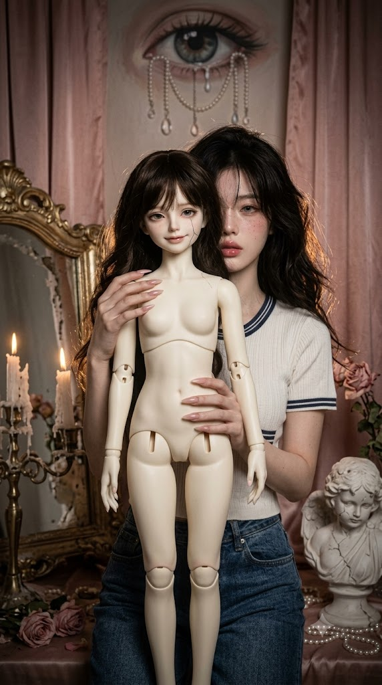
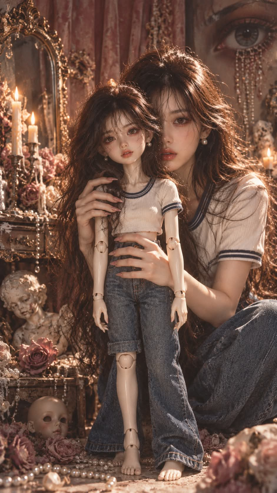

# 구체관절인형과 나 로코코 고딕 호러 판타지 포토그래피 프롬프트

## 1. 개요 및 아트 디렉팅 가이드

- **컨셉**: 사진 속 인물과 그 인물을 똑같이 본뜬 BJD(구체관절인형)가 함께 있는 세로 9:16 고딕 호러 판타지 포토그래피. 사람이 인형처럼, 인형이 사람처럼 보이는 역전된 '언캐니 밸리' 연출
- **사진 사용 규칙**:
  - 업로드 사진에서는 눈·코·입의 생김새와 얼굴 인상, 헤어스타일, 입고 있는 옷만 가져오고, 얼굴형·피부톤·표정·각도·시선·자세는 프롬프트 서술대로 새로 그림
  - 헤어는 길이·색상·웨이브·가르마·앞머리 유무까지 동일하게 재현하며, 사진에 없는 앞머리는 만들지 않음
  - 이마가 넓어 보이면 앞머리 대신 헤어라인·뿌리 볼륨·잔머리로만 이마가 얼굴의 약 1/3로 보이게 보정
  - 같은 얼굴·헤어·옷을 사람과 인형 양쪽에 똑같이 적용해 '원본과 복제본'처럼 연출
- **구도**:
  - 화면 중앙 앞쪽에 정면을 향해 선 약 60cm SD 사이즈 BJD 인형 전신, 그 뒤에 바짝 붙어 한쪽 눈과 코끝·입술만 보이는 사람
  - 길고 뾰족한 누드핑크 네일의 두 손이 인형의 어깨와 허리를 소유하듯 감싸 쥔 포즈, 인형 눈높이의 약간 로우 앵글
- **인형 & 사람 디테일**:
  - **인형**: 반광 아이보리 레진 피부와 선명한 구체관절 이음새, 볼의 가는 실금 크랙, 모헤어 가발과 수제 미니어처 돌 옷, 정면을 똑바로 응시하는 유리 안구와 어딘가 어긋난 미소
  - **사람**: 창백한 피부와 옅은 주근깨, 감정이 빠진 멍하고 공허한 얼굴, 초점 없는 한쪽 눈
- **배경**:
  - 바랜 더스티 핑크 새틴 커튼, 금박이 벗겨진 로코코 거울 프레임, 녹아내린 촛대, 시든 핑크 장미
  - 진주와 크리스털 줄이 눈물처럼 흘러내리는 거대한 눈 벽화, 흩어진 진주와 금이 간 천사 석고상, 구석 그늘의 얼굴 없는 인형 머리
- **조명 & 색감**:
  - 채도를 낮춘 핑크·아이보리·샴페인 골드와 가장자리로 갈수록 짙어지는 비네팅
  - 인형에게만 강하게 떨어지는 정면 소프트 조명, 반쯤 그늘진 사람 얼굴, 머리카락 가장자리에 걸리는 촛불 역광
- **금지**: 피·상처·고어 표현 없이 분위기와 시선만으로 공포를 표현, 텍스트·로고 없음

---

## 2. 프롬프트 전문

```text
[이미지 생성 지시]
업로드한 사진 1장을 기준으로, 사진 속 인물과 그 인물을 똑같이 본뜬 BJD(구체관절인형)가 함께 있는 세로형(9:16) 고딕 호러 판타지 포토그래피를 그려줘.

[사진 사용 규칙 — 반드시 지킬 것]

업로드 사진에서는 눈·코·입의 생김새와 얼굴 인상, 헤어스타일, 입고 있는 옷만 가져온다.

헤어는 길이, 색상, 컬·웨이브, 가르마 위치, 앞머리 유무까지 사진과 동일하게 재현한다. 사진에 앞머리가 없으면 앞머리를 절대 만들지 않는다.

이마 비율 보정: 이마가 넓어 보이면 헤어라인을 자연스럽게 조금 내리고, 가르마 옆 뿌리 볼륨과 관자놀이 쪽 얇은 잔머리·얼굴선을 감싸는 옆머리로 이마가 얼굴의 약 1/3 정도로 보이게 조절한다. 원래 이마가 적당하면 손대지 않는다.

이마 보정은 앞머리 생성이 아니라 헤어라인·볼륨·잔머리로만 한다.

옷은 디자인, 색상, 소재, 패턴, 단추·지퍼·로고 위치, 액세서리까지 사진과 동일하게 재현한다. 사진에서 보이지 않는 하의·신발은 상의 스타일과 어울리게 자연스럽게 채운다.

얼굴형, 피부톤, 표정은 사진에서 가져오지 않는다.

사진 속 고개 기울기, 얼굴 방향, 시선, 카메라 각도, 몸 자세는 절대 가져오지 않는다. 각도·시선·포즈는 아래 구도 서술대로만 그린다.

표정은 사진과 무관하게 아래 서술대로 새로 그린다.

같은 눈·코·입, 같은 헤어, 같은 옷을 '사람'과 '인형' 두 쪽에 동일하게 적용해, 한눈에 같은 사람이라는 것이 보이게 한다. 이마 보정도 둘 다 똑같이 적용한다. 단 인형 쪽은 BJD 특유의 매끈한 레진 피부와 유리안구로 양식화한다.

[구도]

화면 중앙 앞쪽에 전신이 보이는 BJD 인형이 정면을 향해 서 있다. 약 60cm 크기의 SD 사이즈.

인형 바로 뒤에 실제 사람이 바짝 붙어 있다. 사람의 얼굴은 인형 머리 뒤에서 반쯤 가려져 오른쪽 눈 하나와 코끝, 입술만 보인다.

사람의 양손은 길고 뾰족한 누드핑크 네일을 하고, 인형의 어깨와 허리를 소유하듯 감싸 쥐고 있다. 손가락 관절에 약간 힘이 들어가 있다.

카메라는 인형 눈높이, 정면, 약간 로우 앵글. 인물 상반신과 인형 전신이 화면을 꽉 채운다.

[인형 디테일]

반광 아이보리 레진 피부, 어깨·팔꿈치·손목·무릎·발목에 구체관절 이음새가 선명하게 보인다. 옷 밖으로 드러난 관절 부위는 반드시 보이게 한다.

왼쪽 볼에서 관자놀이 쪽으로 가는 실금 같은 크랙이 하나 있다.

헤어: 업로드 사진의 헤어스타일을 그대로 본뜬 인형용 가발. 모헤어 특유의 결과 윤기. 이마 보정 동일 적용.

의상: 업로드 사진 속 옷을 인형 사이즈로 그대로 축소한 미니어처 돌 옷. 바느질 땀과 원단 결이 보이는 정교한 수제 인형 옷 질감.

표정: 입꼬리가 아주 미세하게 올라간, 어딘가 어긋난 미소. 유리 안구가 정면 카메라를 똑바로 응시해 살아 있는 듯 섬뜩하다.

[사람 디테일]

헤어: 업로드 사진의 헤어스타일 그대로, 이마 보정 적용. 인형과 사람이 거울처럼 같은 머리.

창백한 피부, 옅은 주근깨, 핑크 블러셔, 촉촉한 핑크 입술.

의상: 업로드 사진 속 옷을 그대로 입고 있다. 인형의 옷과 완전히 같은 옷이라 둘이 '같은 사람의 원본과 복제본'처럼 보인다.

표정: 감정이 빠진 멍하고 공허한 얼굴. 입술은 살짝 벌어져 있고, 보이는 한쪽 눈은 초점 없이 정면을 본다. 오히려 사람이 인형처럼, 인형이 사람처럼 보이는 역전된 느낌.

[배경]

바랜 더스티 핑크 새틴 커튼, 금박이 벗겨진 로코코 거울 프레임, 녹아내린 촛대, 시든 핑크 장미.

배경 벽 오른쪽 위에 거대한 눈이 그려진 벽화. 눈 아래로 진주와 크리스털 줄이 눈물처럼 흘러내린다.

테이블과 바닥에 흩어진 진주, 금이 간 천사 석고상, 얼굴 없는 작은 인형 머리 하나가 구석 그늘에 놓여 있다.

[분위기·조명·색감]

겉보기엔 화사한 로코코 파스텔인데 묘하게 불길한 '언캐니 밸리' 호러.

채도를 낮춘 핑크·아이보리·샴페인 골드 + 가장자리로 갈수록 짙어지는 그림자 비네팅.

정면 소프트 조명은 인형에게만 강하게 떨어지고, 사람 얼굴은 반쯤 그늘. 촛불의 따뜻한 역광이 머리카락 가장자리에 걸린다.

미세한 필름 그레인, 얕은 심도, 초고해상도 디테일, 하이엔드 패션 화보 질감.

[금지]

피, 상처, 고어 표현 금지. 공포는 분위기와 시선으로만.

사진 속 고개 각도, 시선, 몸 자세, 표정 반영 금지.

사진에 없는 앞머리 생성 금지. 이마 보정을 핑계로 앞머리를 내리는 것도 금지.

이마가 지나치게 넓게 드러나는 것 금지.

사람과 인형의 헤어·옷이 서로 다르게 나오는 것 금지.

텍스트, 로고 금지.
```

---

## 3. 결과물 비교 갤러리

| 생성 모델 | 생성 결과 이미지 |
| :--- | :--- |
| **제미나이 (Gemini)** |  |
| **ChatGPT (DALL-E 3)** |  |
