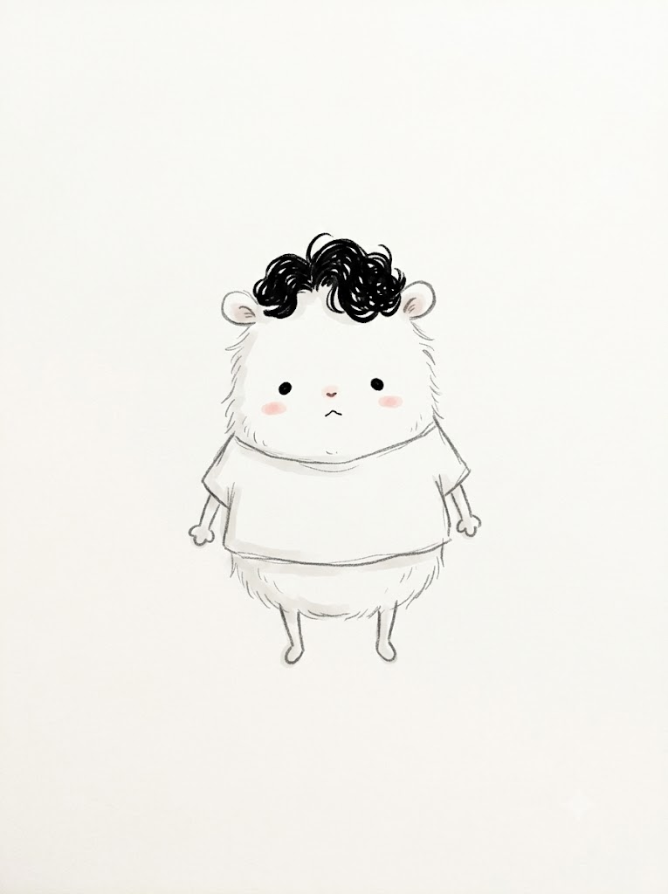
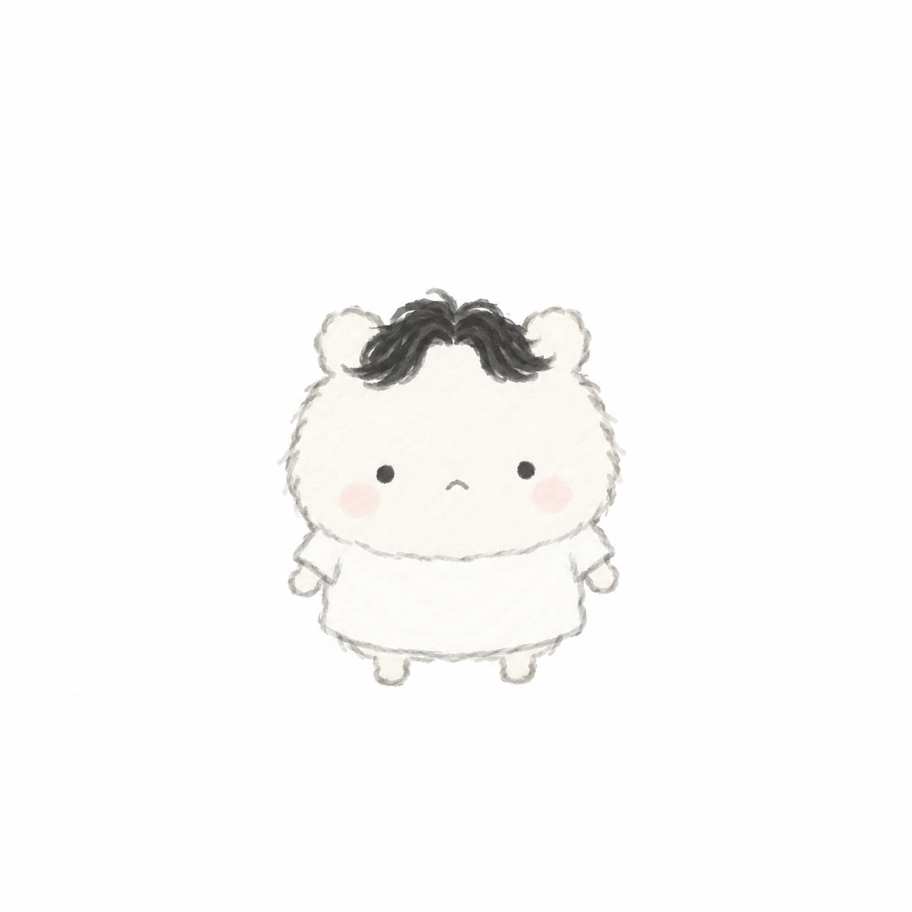

# 작고 하얀 동물형 생물 캐릭터 프롬프트

## 1. 개요 및 캐릭터 설명
- **캐릭터 콘셉트**: 사람이 아닌, 작고 하얀 털로 덮인 둥글둥글한 감자 모양의 동물형 생물 캐릭터입니다.
- **핵심 특징**:
  - **체형**: 머리와 몸의 구분이 거의 없는 일체형 실루엣, 둥근 귀 2개, 가늘고 짧은 막대형 팔다리.
  - **표정**: 흰자 없는 검은 점 두 개 눈, 작은 곡선 입, 연한 분홍빛 볼터치 (코와 눈썹 없음).
  - **포인트 요소**: 머리 위의 작은 검은 곱슬 털 뭉치, 심플한 흰 티셔츠.
  - **그림체 & 스타일**: 가늘고 삐뚤빼뚤한 손그림 느낌의 연회색 외곽선, 연한 수채화풍의 플랫한 채색 (음영/하이라이트 없음).
  - **분위기**: 어딘가 짠하고 불쌍해 보이면서도 지켜주고 싶은 엉뚱하고 귀여운 느낌.

---

## 2. 프롬프트 전문 (코드 블록)

```text
사진 속 인물을 참고해서, 사람이 아닌 작고 하얀 동물형 생물 캐릭터를 그려줘.

[기본 형태 — 가장 중요]
- 사람이 아님. 사람 얼굴 특징을 넣지 말 것
- 몸 전체가 하얀 털로 덮인 감자 모양 덩어리
- 머리와 몸의 구분이 거의 없는 하나의 둥근 실루엣
- 머리 위에 짧고 둥근 귀 두 개
- 팔다리는 아주 짧고 가는 막대, 손발 끝은 동글
- 키가 아주 작고 통통한 형태

[얼굴]
- 검은 점 두 개가 눈의 전부, 흰자 없음
- 눈 사이가 넓고 얼굴 아래쪽에 배치
- 입은 아주 작은 곡선 하나
- 코 없음. 눈썹 없음
- 볼에 아주 연한 분홍 원 두 개

[선과 채색]
- 가늘고 떨리는 손그림 느낌의 연한 회색 외곽선
- 채색은 거의 흰색에 가까운 아주 연한 수채
- 음영, 그라데이션, 하이라이트 전부 없음
- 선이 완벽하지 않고 어설프게 그린 느낌

[사진에서 딱 이것만 반영]
- 머리 위에 검은 곱슬 털 뭉치 한 덩이 (헤어스타일 힌트)
- 흰 티셔츠 같은 아주 단순한 옷 한 벌

[구도]
- 정면, 전신, 화면 중앙에 아주 작게
- 배경은 순백색 또는 여백 많은 단색
- 전체적으로 어딘가 불쌍하고 애처로운데 귀여운 분위기

텍스트, 로고, 사람 얼굴 특징은 절대 넣지 말 것.
```

---

## 3. 생성 예제

| Gemini | GPT |
| :---: | :---: |
|  |  |
