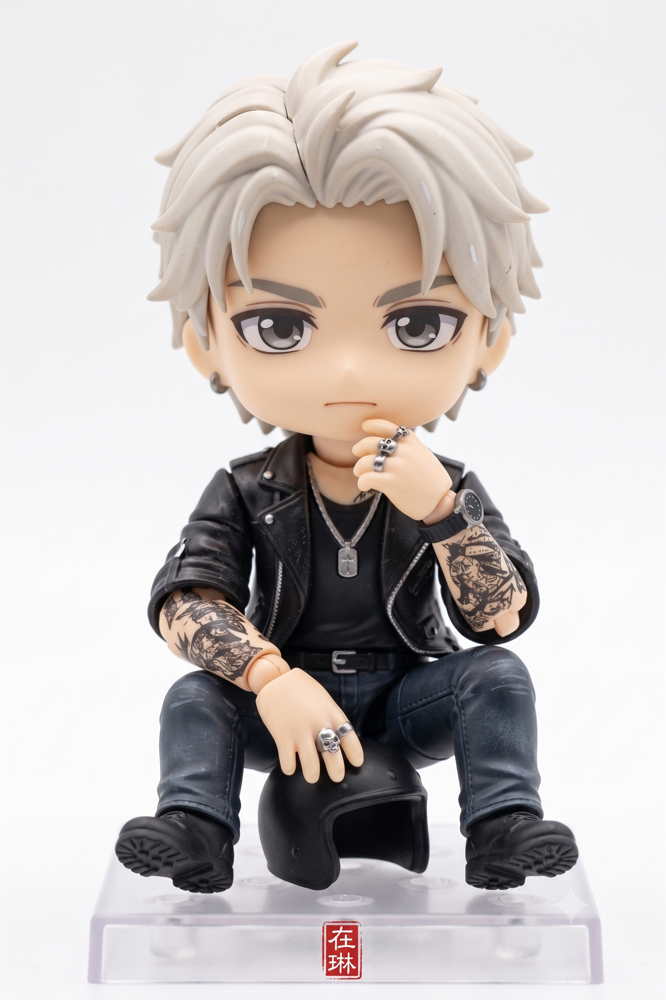
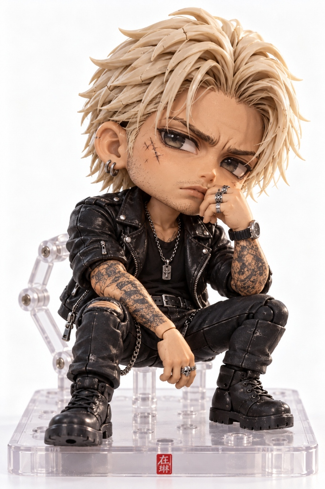

# SD 치비 1/12 스케일 조립형 프라모델 피규어 프롬프트

## 1. 개요 및 작품 해설
- **콘셉트 테마**: 원본 인물의 포즈, 의상, 악세서리를 그대로 유지하면서 2등신 대두(SD/Chibi) 비율로 축소 재해석한 **1/12 스케일 조립형 플라스틱 모델 킷(프라모델)** 피규어
- **핵심 프라모델 디테일 고증 (초현실적 조립감)**:
  - **게이트 & 파팅 라인**: 런너에서 니퍼로 떼어낸 게이트 자국(Nub marks)과 플라스틱 휨으로 인한 미세한 백화 현상(Stress marks), 머리와 몸통을 따라 흐르는 금형 분할선(Parting lines).
  - **접합선 & 관절**: 팔, 다리, 몸통 부품이 맞물린 선명한 접합선(Seam lines)과 관절부(목, 어깨, 팔꿈치, 골반)에 드러난 볼 조인트(Ball-joint) 가동 구조.
  - **사출 성형 재질감**: 매끈한 3D CG 렌더링이 아닌, 실제 반광(Semi-matte) ABS/PVC 플라스틱 특유의 요철, 미세한 먼지와 생활 잔기스 질감.
  - **베이스 & 스탠드**: 투명 플라스틱 조립식 디스플레이 베이스 위에 기립(발바닥 고정 핀/홀 디테일).
- **포인트 낙관**:
  - 투명 디스플레이 베이스 전면 모서리에 인쇄된 정갈한 붉은색 한자 도장 **「在琳」** 낙관.
- **촬영 스타일 (제품 사진)**:
  - 50mm 렌즈로 촬영한 상업용 프라모델 스튜디오 제품 매크로 사진. 부드러운 3점 조명, 얕은 피사계 심도, 순백색 심리스 배경.

---

## 2. 프롬프트 전문 (코드 블록)

```text
Turn the person in this photo into a super-deformed (SD) chibi
character, then present it as a 1/12 scale assembled plastic
model kit figure.

Ignore the mirror, reflections and background entirely — isolate
the subject only.

Reproduce the outfit and the pose exactly as they appear in the
source photo — same clothing items, colors, accessories and props,
same body posture, arm and hand positions, head angle and facial
expression. Do not restyle or substitute anything.

Character: 2-head-tall chibi proportions, oversized round head,
small body, big glossy eyes, simplified features while keeping
the person's hairstyle and face shape clearly recognizable.
Full body; if the original photo is cropped, invent a natural
lower body matching the outfit.

Finish: a real, hand-assembled plastic model kit — clearly
visible seam lines down the arms, legs and torso, obvious
parting lines along the hair and head, small nub marks and
faint white stress marks where parts were clipped from the
runner, polygonal injection-molded surfaces with sharp panel
lines and undercuts, slightly uneven gaps at the joints, visible
ball-joint articulation at the neck, shoulders, elbows and hips,
screw or peg holes on the soles of the feet. Semi-matte
injection-molded ABS/PVC with light dust and fine scratches on
the surface, not a smooth CG render. Standing on a clear plastic
display base with pegs.

Base detail: a small red square Chinese seal stamp (落款) with
the characters "在琳" carved in white seal script, printed on the
front edge of the display base.

Shot: studio product photography, 50mm lens, soft three-point
lighting, shallow depth of field, white seamless backdrop,
high detail macro texture.
```

---

## 3. 생성 예제

| Gemini | GPT |
| :---: | :---: |
|  |  |
