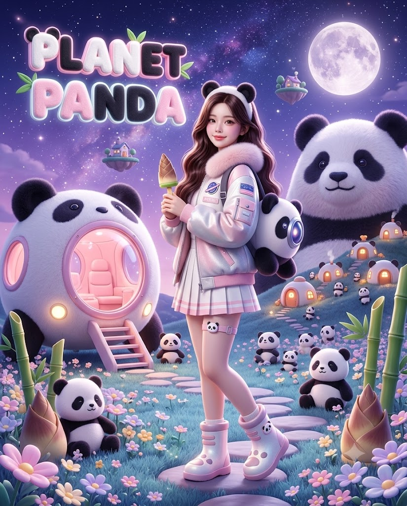
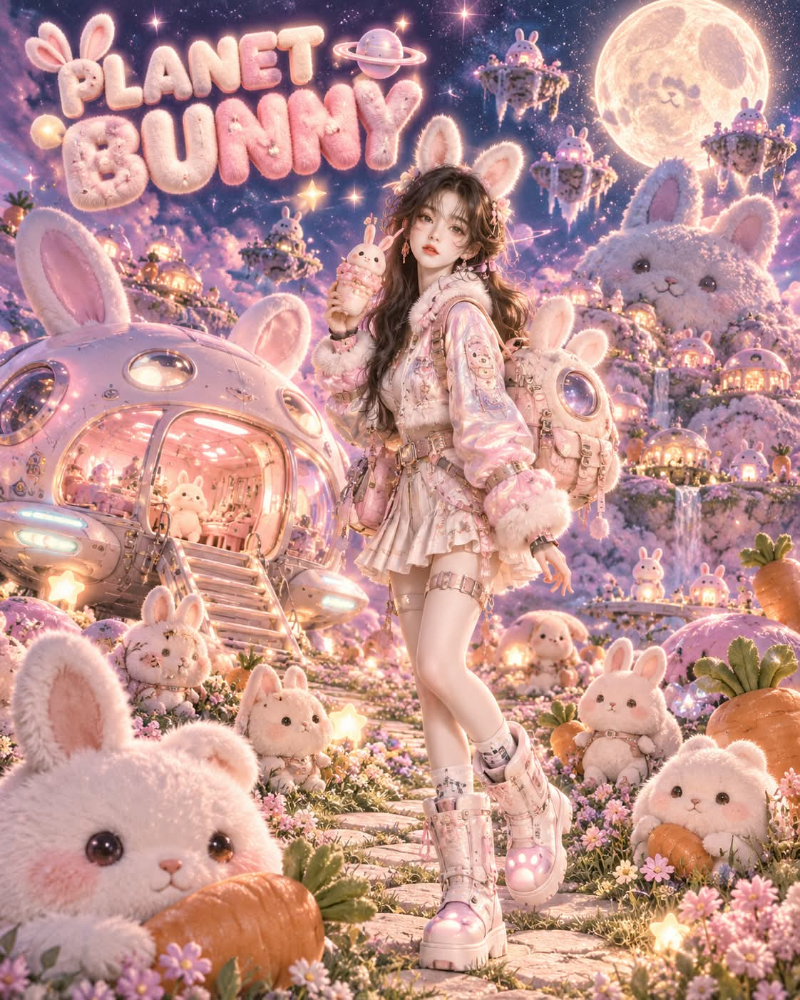

# 귀여운 것들의 행성, 인상 매칭 파스텔 판타지 영화 포스터 프롬프트

## 1. 개요 및 아트 디렉팅 가이드

- **컨셉**: 얼굴 인상과 가장 닮은 귀여운 존재 한 종류를 AI가 정하고, 그 존재들만 사는 별의 주민이 된 인물을 그리는 세로 4:5 판타지 영화 포스터. 우주선, 산, 집, 주민까지 별 전체를 그 존재 하나로 통일
- **얼굴 규칙**:
  - 업로드 사진에서는 눈·코·입의 생김새만 가져오고, 얼굴형·피부·헤어·표정·각도·시선은 프롬프트 서술대로 새로 그림
  - 안경은 유지하고 성별은 사진으로 판단하며, 얼굴은 로맨스판타지 표지처럼 맑고 사랑스럽게 살짝 미화
- **테마 결정**: 흔한 선택으로 쏠리지 않고 인상에 정말 어울리는 존재를 선택, 기존 애니메이션·게임·브랜드 캐릭터는 사용하지 않음
- **화면 구성**:
  - 화면 중앙에서 약간 오른쪽에 선 전신, 살짝 비스듬히 튼 몸과 정면을 보는 부드러운 미소
  - 한 손에 그 존재가 좋아할 만한 귀여운 간식이나 소품
- **인물 스타일**:
  - 그 존재의 귀나 특징을 본뜬 머리띠, 퍼 칼라가 달린 펄감 있는 파스텔 우주복 재킷
  - 여성은 플리츠 미니스커트와 허벅지 스트랩, 남성은 테크 카고 팬츠
  - 그 존재 얼굴 모양의 우주 배낭, 발바닥 모양 빛이 나는 두툼한 우주 부츠
- **배경**:
  - **왼쪽**: 그 존재의 얼굴을 본뜬 둥근 소형 우주선과 분홍빛 실내, 내려진 작은 계단
  - **오른쪽 뒤**: 산 전체가 하나의 커다란 얼굴인 거대한 털 산과 산비탈의 작은 돔 집들
  - **하늘**: 보랏빛 밤하늘과 커다란 보름달, 공중에 떠 있는 작은 섬들
  - **바닥**: 꽃이 핀 풀밭 사이 돌길, 봉제 인형 같은 주민들과 땅에 꽂힌 거대한 먹거리
- **타이틀**: 화면 왼쪽 위에 `PLANET`과 그 존재의 영어 이름(대문자) 두 줄, 털 질감의 통통한 파스텔 입체 글자에 네온 테두리 발광
- **화풍**: 3D 렌더와 실사를 섞은 판타지 일러스트, 보송한 털 질감과 펄·유광 소재의 반사, 창문 불빛과 달빛이 섞인 부드러운 시네마틱 조명

---

## 2. 프롬프트 전문

```text
업로드한 사진은 얼굴 참고용으로만 씁니다. 사진에서는 눈·코·입의 생김새만 가져오세요. 얼굴형, 피부, 헤어, 이마와 헤어라인, 표정, 고개 기울기, 얼굴 방향, 시선은 절대 가져오지 마세요. 표정, 각도, 헤어, 의상, 구도는 아래 서술대로 새로 그립니다. 사진 속 인물이 안경을 썼다면 안경만 유지합니다. 성별은 사진으로 판단해 그에 맞게 그립니다. 얼굴은 로맨스판타지 표지처럼 맑고 사랑스럽게 살짝 미화합니다.

[테마 결정]
사진 속 얼굴 인상을 분석해, 이 사람과 가장 닮은 귀여운 존재 한 종류를 AI가 직접 정하세요. 흔한 선택으로 쏠리지 말고, 인상에 정말 어울리는 것을 고르세요. 정한 존재 하나로 별 전체를 통일합니다. 이 별은 그 존재들만 사는 별이고, 이 사람은 이 별의 주민입니다.

[화면 구성]
세로 4:5 비율의 판타지 영화 포스터입니다. 인물은 화면 중앙에서 약간 오른쪽에 서 있고, 머리부터 발끝까지 전신이 나옵니다. 몸은 살짝 비스듬히 틀고, 얼굴은 정면 카메라를 보며 부드럽게 미소 짓습니다. 한 손에는 그 존재가 좋아할 만한 귀여운 간식이나 소품을 들고 있습니다.

[인물 스타일]

머리: 길고 윤기 나는 헤어, 그 존재의 귀나 특징을 본뜬 머리띠 착용

의상: 펄감 있는 파스텔 우주복 재킷, 퍼 칼라, 패치와 버클 디테일. 여성은 플리츠 미니스커트와 허벅지 스트랩, 남성은 테크 카고 팬츠

등에는 그 존재 얼굴 모양의 우주 배낭(가운데 발광 렌즈)

발에는 발바닥 모양 빛이 나는 두툼한 우주 부츠

의상 색은 그 존재의 대표 색을 파스텔로 옮긴 톤

[배경]

왼쪽: 그 존재의 얼굴과 귀·특징을 본뜬 둥근 소형 우주선이 착륙해 있고, 분홍빛 실내가 보이는 큰 유리창, 발광 라이트, 내려진 작은 계단

오른쪽 뒤: 그 존재 모양의 거대한 털 산(산 전체가 하나의 커다란 얼굴), 산비탈에 그 존재 모양의 작은 돔 집들이 불빛을 켜고 모여 있음

하늘: 보랏빛 밤하늘, 반짝이는 별, 오른쪽 위 커다란 보름달, 공중에 떠 있는 작은 섬들과 그 위의 집들

바닥: 꽃이 핀 풀밭 사이로 난 돌길. 그 존재의 말랑한 봉제 인형 같은 주민들이 크기를 달리해 곳곳에 앉아 있고, 그 존재가 좋아하는 먹거리가 거대한 크기로 땅에 꽂혀 있음

모든 형태는 둥글고 폭신하며 뾰족하거나 무서운 요소 없음

[타이틀]
화면 왼쪽 위에 3D 타이포그래피 두 줄:

윗줄: "PLANET"

아랫줄: 정한 존재의 영어 이름(대문자)

글자는 그 존재의 털이나 질감으로 된 통통한 파스텔 입체 글자, 네온 테두리 발광, 글자 위에 그 존재의 귀나 특징이 붙어 있음

이 두 줄 외에 다른 문구나 부제는 넣지 않음, 철자 정확하게

[화풍]
고퀄리티 3D 렌더와 실사를 섞은 판타지 일러스트. 봉제 인형의 보송한 털 질감, 펄과 유광 소재의 반사, 따뜻한 창문 불빛과 달빛이 섞인 부드러운 시네마틱 조명, 은은한 발광 효과, 몽환적이고 선명한 파스텔 색감, 초고해상도 디테일.

기존 애니메이션·게임·브랜드 캐릭터는 사용하지 않습니다.
```

---

## 3. 결과물 비교 갤러리

| 생성 모델 | 생성 결과 이미지 |
| :--- | :--- |
| **제미나이 (Gemini)** |  |
| **ChatGPT (DALL-E 3)** |  |
