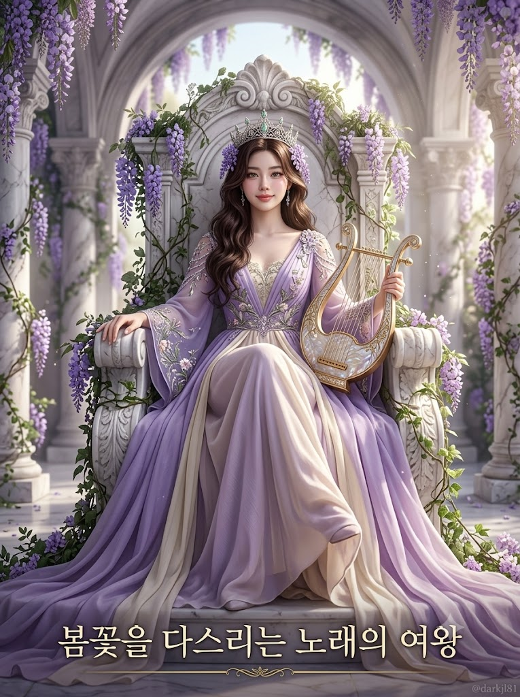
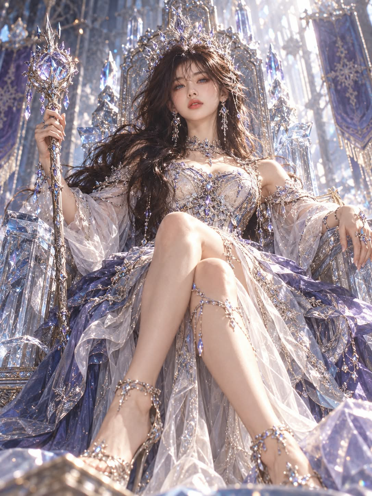

# 나는 어떤 여왕일까, 성격·취향 매칭 옥좌 판타지 군주 화보 프롬프트

## 1. 개요 및 아트 디렉팅 가이드

- **컨셉**: AI가 사용자에 대해 알고 있는 성격과 취향을 근거로 '어떤 영역을 다스리는 어떤 역할의 군주'인지 정하고, 그 설정대로 옥좌에 앉은 판타지 여왕(남성이면 왕)을 그리는 극사실 판타지 시네마틱 화보 (세로 3:4)
- **7단계 작업 순서**:
  - **0단계 (성별 확인)**: 사진은 성별 판단에만 사용하고 군주 선택에는 쓰지 않음
  - **1단계 (정보 정리)**: 대화·메모리에서 성격과 취향을 정리, 정보가 부족하면 이미지 대신 질문 3개를 먼저 진행
  - **2단계 (군주 확정)**: 표 1에서 역할 하나, 표 2에서 영역 하나를 구체적인 근거와 함께 선택하고 한글 칭호를 지음
  - **3단계 (장면 설계)**: 로우앵글 풀샷, 옥좌 한가운데 곧게 앉은 자세, 완전 정면 얼굴에 턱을 살짝 들고 카메라를 내려다보는 시선
  - **4단계 (얼굴 추출)**: 사진에서 눈·코·입의 생김새와 인상만 추출해 완전 정면으로 재구성
  - **5단계 (얼굴 삽입 & 미화)**: 원래 특징은 남기면서 로맨스 판타지 표지 주인공급으로 미화, 얼굴과 몸의 톤·명암을 조명에 맞춰 일관되게
  - **6단계 (최종 렌더링)**: 화면 하단 중앙에 한글 칭호, 우하단에 워터마크 `@darkjl81`
- **표 1 (성격으로 고르는 역할 12종)**: 전쟁, 밤, 저주, 노래, 시간, 마법, 사냥, 치유, 해적, 꿈, 예언, 지식. 예복 실루엣·상징물·눈빛·메이크업 기법·왕관과 옥좌의 형태를 결정
- **표 2 (취향으로 고르는 영역 9종)**: 얼음·서리, 폭풍·번개, 원석·광물, 새벽·여명, 사막·모래, 심해·바다, 등나무·봄꽃, 숲·고목, 불꽃·화산. 팔레트·옥좌 재질·눈동자 색·메이크업 색·조명을 결정
- **성별 적용**: 여왕은 드레스형 실루엣과 표의 메이크업을 그대로, 왕은 코트·튜닉·망토형 실루엣에 아주 옅은 메이크업만 적용
- **안경·선글라스**: 사진에 있으면 테와 렌즈를 그대로 유지하고, 없으면 추가하지 않음
- **주요 금지**: 뾰족한 귀·뿔·날개 등 인간이 아닌 신체 특징, 사진의 생김새를 근거로 한 역할·영역 선택, 표 2 재질이 아닌 기본 금박 옥좌, 장미, 얼굴과 몸의 톤이 다른 합성 티

---

## 2. 프롬프트 전문

```text
[얼굴 합성 · 옥좌에 앉은 판타지 군주]

군주는 반드시 인간이다. 뾰족한 귀, 뿔, 날개, 꼬리, 비늘, 동물 특징, 세로 동공 등 인간이 아닌 신체 특징은 절대 넣지 않는다.

전체 작업 순서 (반드시 이 순서대로, 앞 단계가 끝나기 전에 다음 단계로 넘어가지 않는다)
0단계 성별 확인 → 1단계 나에 대한 정보 정리 → 2단계 군주 확정 → 3단계 장면 설계 → 4단계 얼굴 추출 → 5단계 얼굴 삽입·로판급 미화 → 6단계 최종 렌더링

■ 0단계 — 성별 확인
업로드한 사진의 인물이 여성이면 "여왕", 남성이면 "왕"으로 만든다. 성별 판단에만 사진을 쓰고, 그 외 군주 선택에는 사진을 쓰지 않는다. 이하 '군주'는 성별에 맞게 여왕 또는 왕을 뜻한다.

■ 1단계 — 나에 대한 정보 정리 (결과를 글로 출력)
네가 나에 대해 알고 있는 모든 정보(지금까지의 대화, 메모리, 내가 말한 직업·성격·취미·관심사·말투·고민·좋아하는 것과 싫어하는 것)를 바탕으로 판단한다.
- 성격·일하는 방식·삶의 태도 → 표 1의 역할 선택에 사용
- 취향·분위기·좋아하는 것·감성 → 표 2의 영역 선택에 사용
업로드한 사진은 이 판단에 절대 쓰지 않는다. 얼굴 생김새, 안경 착용 여부, 사진 속 옷·배경·분위기로 군주를 고르지 않는다.
나에 대한 정보가 너무 적어서 근거를 댈 수 없다면, 이미지를 만들지 말고 먼저 나의 성격과 취향을 알 수 있는 짧은 질문 3개를 하고, 내 답을 받은 뒤 진행한다.

■ 2단계 — 군주 확정 (반드시 아래 표 안에서만 고른다)

[표 1 — 역할 / 예복 실루엣 / 상징물 / 눈빛 / 메이크업 기법] (성격으로 선택)
- 전쟁 / 장식 갑옷과 긴 예복이 결합된 실루엣, 어깨 망토 / 의식용 장검 / 꿰뚫는 듯 강렬한 눈빛 / 날렵한 아이라인, 매트한 피부, 선명한 립
- 밤 / 몸선을 따라 흐르는 긴 예복, 등 뒤로 늘어진 얇은 베일 망토 / 가는 홀 / 나른하고 깊은 눈빛 / 음영 깊은 스모키 아이, 촉촉한 립
- 저주 / 가시 형태의 왕관, 날카로운 각이 진 높은 칼라 / 금 간 거울 / 서늘하게 가라앉은 눈빛 / 창백한 피부 표현, 날카로운 음영, 짙은 립
- 노래 / 겹겹이 흩날리는 얇은 천의 예복 / 현악기 / 미소 띤 맑은 눈빛 / 광채 피부, 눈 앞머리 하이라이트, 생기 있는 그라데이션 립
- 시간 / 정교한 구조의 예복, 시계 톱니 문양 자수 / 모래시계 / 모든 걸 꿰뚫어 보는 차분한 눈빛 / 정교한 그래픽 라인, 반광택 립
- 마법 / 길게 끌리는 마법사 로브, 주위에 떠 있는 마도서 / 마력 구슬이 박힌 지팡이 / 홍채에 은은한 빛 고리가 도는 눈빛 / 눈두덩의 펄 그라데이션, 투명한 립
- 사냥 / 가죽과 깃털 장식이 섞인 예복, 활동적인 트임 / 장식 활 / 예리하게 집중한 눈빛 / 거의 맨 피부, 눈가를 가로지르는 가는 페인트 선
- 치유 / 부드럽게 흐르는 가벼운 로브 / 손바닥 위의 따뜻한 빛 / 다정하고 온화한 눈빛 / 맑은 피부, 볼 위 은은한 혈색, 촉촉한 립
- 해적 / 롱 코트와 예복의 결합, 넓은 벨트 / 장식 단검과 나침반 / 여유롭고 대담한 눈빛 / 번진 듯한 스모키 라인, 누드 립
- 꿈 / 몽환적으로 겹친 반투명 천의 예복 / 떠다니는 빛의 구 / 반쯤 꿈꾸는 듯한 눈빛 / 눈가에 번진 파스텔 음영, 투명한 광채
- 예언 / 얼굴선을 따라 늘어진 보석 체인 장식, 고대 사제풍 예복 / 빛나는 수정 / 먼 곳을 보는 신비로운 눈빛 / 눈 앞뒤로 길게 뺀 아이라인, 눈두덩 색 블록
- 지식 / 단정하고 우아한 학자풍 예복, 주위에 떠 있는 두루마리 / 펼쳐진 고서 / 지적이고 차분한 눈빛 / 깨끗한 피부, 정돈된 눈썹, 자연스러운 립

[표 2 — 영역 / 팔레트 / 옥좌 재질 / 눈동자 색 / 메이크업 색 / 조명] (취향·분위기로 선택)
- 얼음·서리 / 은백·빙청·라벤더 / 투명한 얼음 결정 / 빙하 같은 은청색 / 서리 펄 은백, 차가운 라벤더 / 차갑고 맑은 푸른 확산광, 얼음을 통과한 굴절광
- 폭풍·번개 / 회청·은·전기 보라 / 먹구름빛 석판과 은빛 번개 장식 / 폭풍 같은 회은색 / 회청 스모키, 보랏빛 / 어두운 저조도에 번개가 옆에서 번쩍이는 강한 콘트라스트
- 원석·광물 / 자수정 보라·은·흑색 / 거대한 원석 클러스터 / 자수정 보라 / 메탈릭 보라·흑색, 플럼 / 원석을 통과한 보랏빛 프리즘 스포트라이트
- 새벽·여명 / 복숭아·라일락·연금빛 / 진주빛 석재 / 맑은 꿀빛 호박색 / 복숭아 코랄 / 낮은 각도에서 번지는 분홍빛 금색 역광, 부드러운 안개
- 사막·모래 / 모래 베이지·테라코타·청금석 포인트 / 조각된 사암 / 따뜻한 황금 앰버 / 브론즈·테라코타, 누드 브라운 / 머리 위 강렬한 태양의 하드라이트, 짙고 선명한 그림자
- 심해·바다 / 청록·진주빛·짙은 바다색 / 산호와 자개 / 깊은 청록 / 진주 펄 청록, 산호빛 / 수면 아래처럼 일렁이는 청록 물결 무늬 빛
- 등나무·봄꽃 / 연보라·크림·연녹 / 등나무 꽃송이가 늘어진 흰 대리석 / 맑은 연녹색 / 연보라, 말린 꽃잎빛 / 부드럽게 확산된 아침 햇살의 화사한 하이키
- 숲·고목 / 이끼 초록·나무 갈색·연두 / 살아 있는 고목 뿌리와 덩굴 / 짙은 에메랄드 / 올리브 브라운, 베리 / 나뭇잎 사이로 떨어지는 얼룩진 초록 햇살 빛줄기
- 불꽃·화산 / 주홍·호박색·숯검정 / 흑요석과 용암 균열 / 불꽃처럼 이글거리는 주황빛 / 레드 오렌지 스모키, 진홍 / 아래에서 치솟는 용암빛 주홍 림라이트의 로우키

[성별 적용 규칙]
- 여성(여왕): 표 1의 예복을 드레스형 실루엣으로 해석하고, 메이크업은 표 1 기법 + 표 2 색을 그대로 적용한다.
- 남성(왕): 표 1의 예복을 코트·튜닉·망토형 남성 실루엣으로 해석한다. 메이크업은 표 1 기법을 아주 옅게, 피부 정돈과 눈매 음영 위주로만 표 2 색을 은은하게 쓰고, 립은 자연스러운 혈색만 준다. 왕관도 남성 군주에 어울리는 형태로 한다.

[선택 규칙]
- 표 1과 표 2에서 각각 정확히 하나만 고른다. 표에 없는 역할·영역을 만들지 않는다.
- 반드시 나에 대한 구체적인 근거로 고른다. 근거 없이 무난한 것, 가장 흔한 것을 고르지 않는다.
- 군주의 정체는 "표 2 영역을 다스리는 표 1 역할의 군주"다.
- 표 1은 예복 실루엣, 상징물, 눈빛, 메이크업 기법, 왕관 형태, 옥좌의 형태를 결정한다.
- 표 2는 팔레트, 옥좌 재질, 예복 문양, 배경 자연 요소, 눈동자 색, 메이크업 색, 조명을 결정한다. 상징물의 재질과 색도 표 2를 따른다.
- 두 표의 결과가 둘 다 뚜렷하게 보여야 한다. 역할은 예복과 상징물로 한눈에 드러나고, 영역은 장면 전체를 지배해야 한다.
- 조합과 성별에 맞는 칭호를 한글로 새로 짓는다. 형식은 "○○를 다스리는 ○○의 여왕" 또는 "○○를 다스리는 ○○의 왕"처럼 어떤 군주인지 한눈에 알 수 있게, 15자 안팎으로 짧게 한다.

출력 형식 (이미지 전에 먼저 글로):
군주: __ 영역을 다스리는 __ 의 여왕/왕
역할 선정 이유: 나의 어떤 성격·태도 때문인지 한두 문장
영역 선정 이유: 나의 어떤 취향·분위기 때문인지 한두 문장
눈동자 색: __ / 눈빛: __ / 메이크업: __ / 조명: __
팔레트: __ / 옥좌 재질: __ / 상징물: __
칭호 (이미지에 넣을 한글 문구 그대로): __

■ 3단계 — 장면 설계 (얼굴을 넣기 전에 장면을 먼저 완성)
[구도·포즈]
- 카메라: 바닥 가까이에서 약 20도 올려다보는 로우앵글 풀샷(머리끝부터 발끝까지, 옥좌 전체가 프레임 안에 들어옴)
- 몸: 옥좌 한가운데에 등을 곧게 펴고 위엄 있게 앉아 있음
- 한쪽 팔은 옥좌 팔걸이에 느긋하게 올리고, 다른 손은 표 1의 상징물을 들고 있음
- 다리는 군주의 성격에 맞게 꼬거나 벌려 앉거나 가지런히 하고, 예복 자락이 옥좌 아래로 흘러내림
[머리·얼굴 각도 (수치 고정)]
- 머리 좌우 기울기 0도: 고개를 옆으로 갸웃하지 않고 정수리부터 턱까지 수직
- 얼굴 좌우 회전 0도: 완전 정면, 양쪽 눈과 볼이 대칭
- 턱: 약 10도 들어 올려 턱선과 목선이 드러남
- 시선: 눈동자를 아래로 내려 로우앵글 카메라를 정면으로 내려다봄. 수평 시선 금지
[표정]
입꼬리가 아주 살짝만 올라간 여유로운 미소에, 표 1의 눈빛을 담는다
[배경·조명]
- 배경은 표 1 역할의 군주가 머무를 법한 판타지 알현실에 표 2 영역의 자연 요소가 가득 스며든 공간으로, 깊이감 있게 살짝 아웃포커스
- 장면 전체 조명은 표 2의 조명을 그대로 따르며, 그 빛이 옥좌·예복·피부·눈동자에 같은 방향과 색으로 떨어진다
[헤어]
사진과 무관하게, 성별·표 1 역할·표 2 영역에 맞는 윤기 있는 판타지 헤어스타일로 새로 그리며, 왕관과 자연스럽게 어우러지게

■ 4단계 — 얼굴 추출
업로드한 사진에서 눈·코·입의 생김새와 인상만 추출한다. 눈은 형태만 가져오고 눈동자 색은 가져오지 않는다.
추출한 눈·코·입을 고개를 전혀 기울이지 않은 완전 정면·좌우 대칭·무표정 얼굴로 재구성한다. 사진이 셀카 각도, 위에서 내려찍은 각도, 옆으로 돌린 각도, 고개를 갸웃한 각도여도 반드시 정면으로 펴서 재구성한다.
사진의 얼굴형, 피부, 피부색, 헤어, 이마·헤어라인, 수염, 표정, 메이크업, 고개 기울기, 얼굴 방향, 카메라 시점, 시선, 조명, 빛 방향, 그림자, 명암, 노출, 색온도, 화질, 필터, 포즈, 의상, 배경은 하나도 가져오지 않는다.

■ 5단계 — 얼굴 삽입·로판급 미화
4단계 얼굴을 3단계 장면의 각도·시선·표정에 맞춰 새로 배치하고, 로맨스 판타지 웹소설 표지의 주인공처럼 압도적으로 아름답게 미화한다. 단, 원래 눈·코·입의 특징과 인상은 남아 있어서 본인이 보면 "나를 멋지게 그렸다"고 알아볼 수 있어야 한다.
- 눈: 원래 눈매의 모양은 유지하되 더 또렷하게, 사람의 둥근 동공에 표 2의 눈동자 색을 입혀 홍채 결과 빛 반사까지 선명하게. 얼굴에서 가장 먼저 눈에 띄는 포인트
- 코: 원래 코의 특징은 유지하되 콧대를 곧고 정돈되게
- 입: 원래 입매의 모양은 유지하되 윤곽이 선명하고 생기 있게
- 피부: 사진과 무관하게, 표 2의 조명과 팔레트 속에서 가장 아름다운 맑은 톤과 매끈한 피부결. 얼굴·목·손 등 보이는 피부 톤이 하나로 이어짐
- 명암: 얼굴의 그림자와 하이라이트는 표 2 조명 방향에 맞춰 몸 전체와 일관되게. 얼굴만 따로 붙인 듯한 밝기·색감 차이 금지
- 여성(여왕): 로판 여주인공급. 갸름하고 매끄러운 V라인, 작은 얼굴, 긴 속눈썹, 가늘고 긴 목, 매끄러운 어깨선, 늘씬하고 우아한 비율
- 남성(왕): 로판 남주인공급. 날렵하고 선명한 턱선, 깊은 눈매, 정돈된 짙은 눈썹, 수염 없는 깔끔한 얼굴, 넓은 어깨와 길고 탄탄한 비율

[안경·선글라스]
사진 속 인물이 안경이나 선글라스를 쓰고 있다면 반드시 그대로 가져와 착용시킨다. 테의 형태, 두께, 색상, 렌즈 모양과 렌즈 색을 사진과 동일하게 유지하고, 사진에 없으면 추가하지 않는다. 안경은 착용만 할 뿐 군주 선택에는 아무 영향도 주지 않는다. 안경도 3단계 얼굴 각도에 맞춰 새로 씌우며, 투명 렌즈 너머로 눈동자 색이 선명하게 보이게 한다. 렌즈 반사는 표 2의 조명에 맞춘다. 왕관, 헤어 장식과 안경다리가 서로 뚫고 지나가지 않게 배치한다.

■ 6단계 — 최종 렌더링
- 극사실 판타지 시네마틱 포토그래피, 로맨스 판타지 표지급 하이엔드 화보 질감
- 어둡거나 강한 조명이어도 얼굴과 눈은 또렷하게 읽힐 만큼만 같은 색 계열의 약한 보조광을 더한다
- 옥좌와 예복 소재는 표 2의 재질 중심으로, 질감이 선명한 고해상도 디테일
- 화면 하단 중앙에 출력 형식의 한글 칭호를 그대로, 한 글자도 틀리지 않게 넣는다. 세계관과 팔레트에 어울리는 우아한 한글 명조·캘리그라피풍 서체로, 얇은 장식 라인과 함께 작고 선명하게. 글자가 깨지거나 뭉개지지 않게 또렷하게 렌더링한다
- 우하단에 작고 은은하게 워터마크 "@darkjl81"
- 세로 비율 3:4

■ 금지
- 인간이 아닌 신체 특징(뾰족한 귀, 뿔, 날개, 꼬리, 비늘, 세로 동공 등) 금지
- 사진 속 고개 기울기, 얼굴 방향, 셀카 시점, 수평 시선 반영 금지 (가장 중요)
- 사진 속 표정, 헤어, 수염, 눈동자 색, 메이크업, 피부색, 조명, 명암, 색온도, 화질, 포즈, 의상, 배경 반영 금지 (안경·선글라스만 예외로 유지)
- 사진의 생김새·안경·분위기를 근거로 역할·영역을 고르는 것 금지 (성별 판단만 예외)
- 나에 대한 근거 없이 무난하거나 흔한 역할·영역을 고르는 것 금지
- 표 1·표 2를 무시하고 임의로 역할·영역·팔레트·메이크업·조명을 고르는 것 금지
- 기본 갈색·검정 눈동자, 기본 붉은 립, 기본 화사한 정면 조명 금지 (표가 지정한 경우 제외)
- 표 2 팔레트에 없는 남색·금색 위주 배색, 표 2와 무관한 별·달·천체 장식, 고딕 성당·스테인드글라스 배경 금지
- 옥좌를 표 2 재질이 아닌 기본 금속 금박 옥좌로 그리는 것 금지
- 장미 사용 금지
- 남성인데 진한 여성 메이크업·드레스를 적용하는 것 금지
- 얼굴과 몸의 피부 톤·밝기가 서로 다른 합성 티 금지
- 미화 과정에서 원래 눈·코·입 특징이 완전히 사라져 다른 사람이 되는 것 금지
- 사진에 있던 안경·선글라스를 빼거나 디자인을 바꾸는 것 금지, 사진에 없던 안경을 추가하는 것 금지
- 인물의 인종·국적을 근거로 역할·영역을 고르는 것 금지
- 얼굴이 화면에서 지나치게 작게 묻히지 않게 할 것
- 손가락 개수·형태 왜곡, 왕관이 머리를 뚫고 들어가는 오류 금지
- 텍스트는 한글 칭호와 워터마크 외에 넣지 않음 (영문 칭호 금지)
- 한글 칭호의 오타, 깨진 글자, 없는 글자 생성 금지
```

---

## 3. 결과물 비교 갤러리

| 생성 모델 | 생성 결과 이미지 |
| :--- | :--- |
| **제미나이 (Gemini)** |  |
| **ChatGPT (DALL-E 3)** |  |
