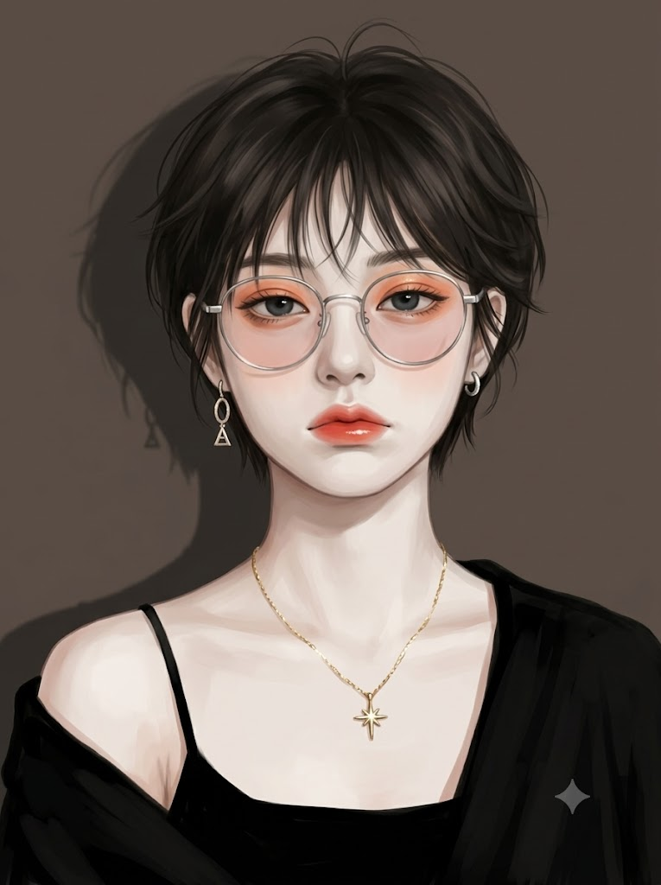
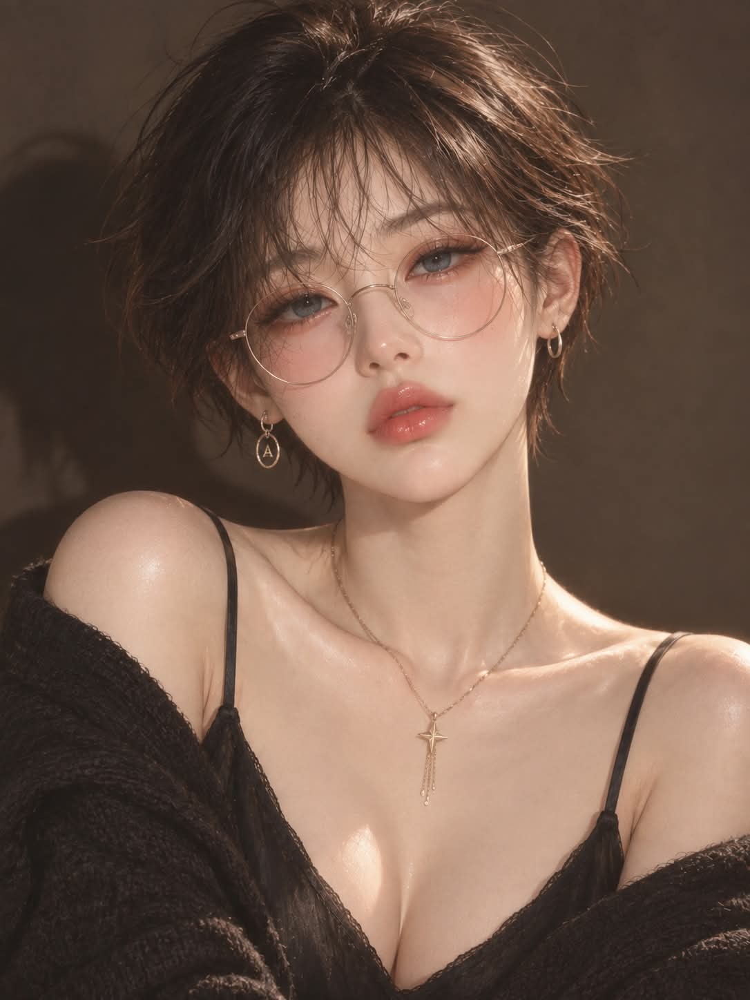

# 나른한 픽시 숏컷 세미리얼리스틱 디지털 일러스트 프롬프트

## 1. 개요 및 아트 디렉팅 가이드

- **컨셉**: 픽시 숏컷과 오버사이즈 카디건 룩, 나른하고 몽환적인 감성 무드의 세미리얼리즘 디지털 일러스트
- **화풍 및 스타일**:
  - 한국풍 웹툰·애니메이션 계열의 섬세한 페인터리 채색
  - 선화 없이 면과 빛으로 형태를 잡는 기법, 도자기처럼 매끄러운 피부
- **얼굴 사진 참조 규칙**:
  - 업로드 사진에서는 고정된 이목구비 골격(눈매 결, 눈썹·코·입술 형태, 얼굴형, 턱선, 광대 윤곽)만 추출
  - 눈 크기/뜬 정도, 헤어, 표정, 조명, 의상, 배경 등은 프롬프트 지침을 절대적으로 우선 반영
- **헤어 & 안경**:
  - **헤어**: 귀와 목덜미가 시원하게 드러나는 어두운 흑갈색 픽시 숏컷, 사선 시스루 앞머리, 정수리의 자연스러운 잔머리 볼륨
  - **안경**: 얇은 금속 원형 안경테, 왜곡 없는 투명 렌즈에 옅은 핑크 틴트
- **눈매 & 표정**:
  - 3:1 갸름한 아몬드형 눈매, 윗눈꺼풀이 홍채 상단을 살짝 덮는 나른한 시선(짙은 회청색 홍채)
  - 멍하고 살짝 뾰로통하며 도도하게 무관심한 나른한 무표정, 촉촉한 글로시 코랄 오렌지 레드 립
- **의상 & 액세서리**:
  - 검정 스파게티 스트랩 V넥 캐미솔 + 양 어깨 아래로 흘러내려 쇄골과 어깨를 드러낸 오버사이즈 카디건
  - 골드 4갈래 별(십자) 펜던트 체인 목걸이, 좌우 비대칭 은색 귀걸이(드롭형 / 얇은 후프)
- **구도, 조명 & 색감**:
  - 3:4 세로 바스트샷, 고개가 왼쪽으로 5~8도 살짝 기울어진 정면 시선
  - 무늬 없는 어두운 토프 브라운 단색 벽과 짙은 그림자, 부드러운 확산광, 웜 브라운·베이지 톤의 시네마틱 무드

---

## 2. 프롬프트 전문

```text
[얼굴 사진 사용 규칙] 업로드한 얼굴 사진에서는 눈매의 기본 결, 눈썹·코·입술의 기본 형태, 얼굴형, 턱선, 광대 윤곽 같은 고정된 이목구비 구조만 참고합니다. 눈의 크기와 눈동자 크기, 눈을 뜬 정도는 사진에서 가져오지 않고 아래 [눈] 항목만 따릅니다. 그 외 모든 것(머리카락, 표정, 시선, 고개 각도, 얼굴 크기, 피부색, 화장, 조명, 그림자, 안경, 귀걸이, 목걸이, 옷, 몸, 배경, 사진의 화질과 색감)도 아래 텍스트 설명만 따르고, 사진 속 내용은 전혀 반영하지 않습니다. 이목구비는 아래 일러스트 화풍에 맞게 그림으로 재해석해서 그립니다.

[스타일] 세미리얼리즘 디지털 일러스트. 한국풍 웹툰·애니메이션 계열의 섬세한 페인터리 채색, 선화 없이 면과 빛으로 형태를 잡음. 도자기처럼 매끄러운 피부.

[구도] 3:4 세로 바스트샷. 머리 윗부분이 프레임 상단에 가깝고 하단은 가슴 V넥 라인에서 끊김. 얼굴과 시선은 카메라를 정면으로 봄. 고개는 화면 기준 왼쪽으로 약 5~8도 살짝 기울어져 있고, 두 눈을 잇는 선은 화면 오른쪽이 아주 조금 높음. 어깨는 비스듬히 틀어져 화면 오른쪽 어깨가 앞으로 나와 둥글게 드러나고 왼쪽 어깨는 뒤로 빠짐.

[헤어 - 짧은 픽시 숏컷] 어두운 흑갈색의 아주 짧은 픽시 숏컷. 머리 전체 길이가 짧아서 옆머리와 뒷머리는 귀 높이에서 끝나고, 턱선이나 목까지 내려오지 않음. 양쪽 귀가 완전히 드러나 귓바퀴와 귀걸이가 그대로 보임. 옆머리는 귀 뒤로 넘기거나 귀 앞에서 짧게 끝나며, 뺨 옆에는 짧고 가느다란 잔머리 몇 가닥만 곡선으로 붙음. 뒷머리와 목덜미는 짧게 쳐서 목이 시원하게 드러남. 윗머리만 층을 내어 볼륨이 있고, 손으로 헝클어뜨린 듯 자연스럽게 흐트러지며 정수리에서 잔머리 몇 가닥이 위로 흩날림. 가르마는 중앙에서 살짝 벗어나 있고, 얇은 시스루 앞머리가 이마에서 눈 위로 사선으로 가볍게 흘러내리며 가닥 사이로 이마 피부가 비침. 앞머리 가닥은 눈썹 위에서 눈가까지만 드리워지고 눈동자는 가리지 않음. 흑갈색 바탕에 따뜻한 밝은 갈색 하이라이트가 가닥 사이로 비치고, 머리카락 한 올 한 올의 결이 보임. 전체 실루엣은 머리 윗부분에만 볼륨이 있는 작고 가벼운 숏컷.

[눈 - 크기와 뜬 정도 고정]
- 크기: 얼굴에 대해 보통 크기. 크지도 작지도 않은 자연스러운 크기이고, 얼굴에서 눈만 튀어 보이지 않음. 한쪽 눈의 가로 길이는 얼굴 너비의 약 5분의 1이고, 가로:세로 비율은 약 3:1인 갸름한 아몬드형. 눈꼬리가 아주 살짝 내려감.
- 뜬 정도: 윗눈꺼풀이 홍채 위쪽 약 4분의 1만 살짝 덮는 나른한 눈. 홍채의 약 4분의 3이 보이고, 아래쪽 흰자는 거의 드러나지 않음. 눈이 감겨 보이지도, 동그랗게 부릅뜬 것처럼 보이지도 않는 중간 상태.
- 눈동자: 홍채는 짙은 회청색이고 크기는 눈 안에 여유 있게 들어가는 보통 크기. 눈빛은 또렷하게 살아 있음.
- 쌍꺼풀은 얇고 자연스러운 선 하나. 속눈썹은 눈매를 따라 가늘고 자연스럽게 나 있고 볼륨은 보통.
- 좌우 눈 크기와 뜬 정도는 동일.

[표정] 나른하고 무심하며 몽환적인 무표정. 시선은 카메라 정면. 멍하고 살짝 우울하면서 도도하게 무관심한 눈빛. 입은 다물고 입꼬리는 살짝 내려가고 아랫입술이 은근히 삐죽 나온 뾰로통한 표정. 볼 근육은 이완 상태.

[화장·피부] 창백한 백자빛에 핑크·피치 언더톤. 눈두덩이에 피치·코랄 아이섀도와 은은한 골드 펄, 눈 밑과 볼에 복숭아빛 핑크 블러셔가 넓게 번짐. 도톰하고 촉촉한 글로시 코랄 오렌지 레드 립. 눈썹은 짧고 옅은 갈색이고 앞머리에 살짝 가려짐. 볼·코끝·턱·쇄골·어깨에 촉촉한 하이라이트.

[안경] 가늘고 얇은 금속 프레임의 동그란 원형 안경. 은색에서 옅은 골드로 은은하게 반짝임. 렌즈에 옅은 핑크 틴트가 있고, 눈이 확대되거나 왜곡되어 보이지 않는 투명한 렌즈. 코 위에서 살짝 내려와 있고 템플이 머리카락 사이로 이어짐.

[액세서리] 화면 왼쪽 귀: 은색 링 아래에 작은 타원형 프레임이 달리고 그 안에 작은 삼각형(A자) 참이 들어 있는 짧은 드롭 귀걸이. 화면 오른쪽 귀: 작고 얇은 은색 후프 귀걸이. 목: 가는 골드 체인 목걸이, 가슴 중앙에 작은 골드 4갈래 별(십자형) 펜던트가 있고 그 아래로 얇은 체인 술 몇 가닥이 짧게 늘어짐.

[의상] 검정 스파게티 스트랩의 깊은 V넥 캐미솔. 그 위에 걸친 검정 오버사이즈 카디건이 양 어깨 아래로 흘러내려 어깨와 쇄골, 팔이 드러남. 무광의 부드러운 옷감에 자연스러운 주름과 그림자.

[배경·조명] 무늬 없는 어두운 토프 브라운·회갈색 단색 벽. 화면 왼쪽 벽에 머리와 어깨가 만든 크고 짙은 그림자. 정면 살짝 오른쪽 위에서 들어오는 부드러운 확산광. 낮은 콘트라스트, 채도를 낮춘 웜 브라운·베이지 톤에 피부만 밝게 떠오르고 입술과 볼의 코랄이 포인트. 무디하고 시네마틱한 감성 무드.

[품질] 초고해상도, 정교한 디테일, 깨끗한 마감.

[마지막 확인] 얼굴 사진은 이목구비 구조만 사용하고, 눈의 크기와 뜬 정도(보통 크기의 갸름한 눈, 홍채 위쪽 4분의 1만 덮인 나른한 눈), 헤어(귀가 드러나는 짧은 픽시 숏컷), 표정, 고개 각도, 액세서리, 옷, 배경, 조명은 위 텍스트 설명 그대로 그립니다.
```

---

## 3. 결과물 비교 갤러리

| 생성 모델 | 생성 결과 이미지 |
| :--- | :--- |
| **제미나이 (Gemini)** |  |
| **ChatGPT (DALL-E 3)** |  |
