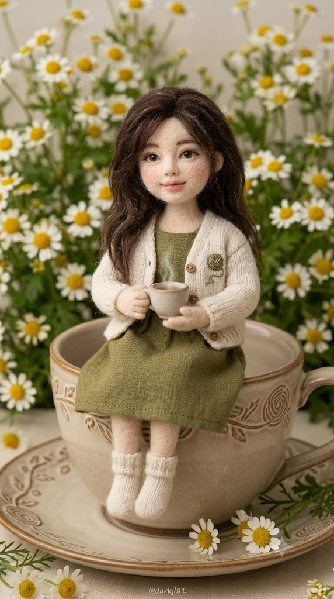
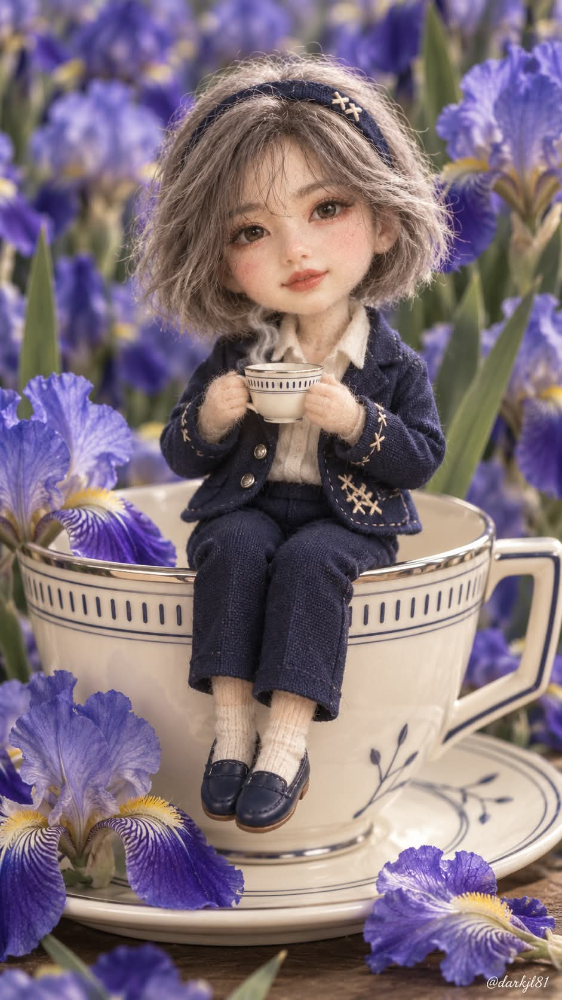

# 나만의 컵 디자인, 개인 분석 기반 니들펠트 티컵 아트돌 프롬프트

## 1. 개요 및 아트 디렉팅 가이드

- **컨셉**: AI가 대화와 기억으로 분석한 사용자의 특징을 근거로 찻잔·의상·꽃·색을 디자인하고, 그 사람을 모델로 만든 니들펠트 아트돌이 거대한 찻잔 가장자리에 걸터앉아 차를 마시는 모습을 담은 초정밀 매크로 제품 사진 (세로 9:16)
- **진행 방식 (한 응답 안에서 끝까지)**:
  1. **분석**: 직업, 전문 분야, 꾸준한 관심사, 취미, 성향과 일하는 방식을 분석하고 핵심 키워드 3개와 숨길 모티프 2~3개를 짧게 출력
  2. **디자인 결정**: 찻잔, 의상, 꽃, 팔레트·조명 네 가지를 "무엇 – 왜 나와 연결되는지" 한 줄씩 출력
  3. **이미지 생성**: 추가 질문 없이 같은 응답에서 바로 생성
- **디자인 결정 4항목**:
  - **찻잔**: 형태·재질·색·문양·테두리·손잡이·받침 접시까지 확정
  - **의상**: 종류에 제한을 두지 않고 시대감·실루엣·소재·장식 기법·부자재·신발·작은 찻잔 디자인까지 확정
  - **꽃**: 실제 존재하는 메인 꽃 한 종류와 그 꽃이 실제로 가지는 색, 잎 형태
  - **팔레트·조명**: 메인/서브/포인트 컬러와 색온도를 정해 세 요소를 하나의 세트로 통합
  - "예뻐서" 같은 이유는 근거로 인정하지 않으며, 개인 모티프는 문양·자수·부자재에 은은하게 숨김
- **니들펠트 인형 재질**:
  - 피부처럼 보이는 모든 부분은 양모를 바늘로 찔러 만든 펠트, 보송한 섬유와 미세한 바늘 자국, 손으로 만든 약간의 비대칭
  - 유리 눈과 펠트 눈꺼풀, 한 올씩 심은 실 속눈썹, 모헤어·양모 실 머리카락
  - 약 1:3 등신의 수공예 아트돌 비율, 실제 천과 부자재를 재단·봉제한 옷
- **얼굴 처리**: 사진에서는 눈·코·입의 생김새와 배치 비율만 가져오고, 사람을 축소한 얼굴이 아니라 그 사람을 모델로 만든 펠트 인형 얼굴로 표현. 안경은 가는 철사 미니어처 안경으로 유지
- **구도 & 배경**:
  - 찻잔 가장자리에 걸터앉아 두 손으로 작은 찻잔을 받쳐 든 3/4 각도, 큰 찻잔이 화면 하단 약 절반을 차지
  - 메인 꽃 한 종류로 가득 찬 꽃벽을 크고 부드러운 보케로 처리
- **조명 & 촬영**: 부드러운 확산광, 유리 눈과 펠트 얼굴에 초점을 둔 얕은 심도, 과도한 HDR·림라이트·렌즈 플레어 배제
- **워터마크**: 우하단에 작은 흰색 필기체 `@darkjl81`

---

## 2. 프롬프트 전문

```text
[개인 분석 기반 니들펠트 티컵 아트돌 이미지 생성 프롬프트]

첨부한 얼굴 사진의 인물을 본떠 손으로 만든 니들펠트(양모 펠트) 컬렉터 아트돌이,
거대한 찻잔 가장자리에 걸터앉아 작은 찻잔으로 차를 마시는 모습을
실제 스튜디오에서 매크로 촬영한 초고해상도 사진으로 만들어주세요.
사람을 작게 축소한 모습이 아니라, 처음부터 이 인물을 모델로 제작한 펠트 인형이어야 합니다.

이 작업의 핵심은 예쁜 티파티 장면이 아니라,
나를 분석한 결과로 찻잔·의상·꽃·색을 정하는 것입니다.

━━━━━━━━━━━━━━━━━━
[진행 방식 – 최우선]
━━━━━━━━━━━━━━━━━━
아래 순서로, 하나의 응답 안에서 끝까지 진행하세요.
추가 질문을 하거나 다음 메시지를 기다리지 않습니다.

1. 분석 결과를 짧게 출력

2. 디자인 결정을 4줄로 출력

3. 출력한 내용을 그대로 반영해 바로 이미지 생성

━━━━━━━━━━━━━━━━━━
[1. 분석 – 내부에서 수행, 출력은 짧게]
━━━━━━━━━━━━━━━━━━
현재 대화와, 네가 실제로 기억하거나 참조할 수 있는 지난 대화 전체를 분석하세요.

나라는 사람 자체를 우선 분석: 직업과 하는 일, 전문 분야, 꾸준한 관심사,
취미, 성향과 일하는 방식.

내가 요청한 이미지 장르나 테마는 보조 근거로만 쓰고, 그대로 재사용하지 마세요.

반복 확인된 특징에 높은 가중치. 근거 없는 정보는 만들어내지 마세요.

대화 출력은 아래 형식만, 각 줄 한 문장으로:
■ 내 키워드: 분석 결과에서 나온 핵심 특징 3개를 단어로
■ 숨긴 모티프: 시각화할 특징 2~3개와 어디에 숨겼는지

━━━━━━━━━━━━━━━━━━
[2. 디자인 결정 – 출력은 4줄]
━━━━━━━━━━━━━━━━━━
분석 근거로 아래 네 가지를 세부까지 확정하되, 대화에는 항목당 한 줄
("무엇 – 왜 나와 연결되는지")만 출력하세요.
"예뻐서", "티파티에 어울려서"는 근거로 인정하지 않습니다.
분석 근거가 없는 소재는 분위기용으로 넣지 않습니다.

① 찻잔: 형태·재질·색·문양·테두리·손잡이·받침 접시까지 내부 확정
② 의상: 종류 제한 없음, 특정 형식을 기본값으로 두지 말 것.
종류·시대감·실루엣·소재·색·장식 기법·부자재·머리 장식·신발·
양말 여부·작은 찻잔 디자인까지 내부 확정
③ 꽃: 실제 존재하는 메인 꽃 한 종류와 그 꽃이 실제로 가지는 색, 잎 형태
④ 팔레트·조명: 메인/서브/포인트 컬러, 금속색(있다면), 색온도, 명암 대비.
①②③을 같은 세계관과 팔레트의 한 세트로 통합

개인 모티프는 찻잔 문양, 테두리, 의상 자수, 부자재, 작은 찻잔 장식,
받침 접시 패턴 등에 은은하게 변형해 숨깁니다.
처음 보면 장식이지만, 나를 아는 사람은 의미를 알아볼 정도로.
글자, 로고, 브랜드 형태는 사용하지 않습니다.

━━━━━━━━━━━━━━━━━━
[3. 이미지 생성 규칙 – 고정]
━━━━━━━━━━━━━━━━━━

[니들펠트 인형 재질]

얼굴, 목, 손, 팔, 다리 등 피부처럼 보이는 모든 부분은
양모를 바늘로 찔러 뭉쳐 만든 니들펠트.

표면 전체에 보송보송한 양모 섬유와 짧은 잔털, 미세한 바늘 자국,
손으로 만든 약간의 불균일과 비대칭.

볼은 둥글고 통통하게 솟은 펠트, 파스텔로 문지른 듯한 은은한 홍조.

눈은 반짝이는 유리 눈이며, 둘레를 펠트 눈꺼풀로 감싸
사진 속 눈의 모양과 눈꼬리 형태에 맞게 다듬음. 애니처럼 크게 만들지 않음.

속눈썹은 가는 실을 한 올씩 심은 형태.

코는 작게 돌출시킨 펠트, 입은 얇은 실 자수 또는 섬유 안료로 표현.

손은 짧고 동글동글한 펠트 손가락.

머리카락은 모헤어·양모 실 다발을 한 올씩 심은 인형 머리, 실 가닥 질감이 보이게.

매끈한 사람 피부, 실리콘·PVC·BJD·도자기 인형 질감은 금지.

[얼굴 처리]

사진에서 가져오는 것: 눈·코·입의 생김새, 눈 사이 간격,
눈·코·입의 상대적 비율과 배치.

사진에서 가져오지 않는 것: 얼굴형, 턱선, 피부, 피부색, 헤어스타일, 머리색,
이마, 헤어라인, 조명, 그림자, 고개 각도·기울기, 얼굴 방향, 시선, 표정, 배경.

표정은 사진과 관계없이: 입꼬리를 아주 살짝 올린 온화한 미소,
편안하고 부드러운 눈빛, 시선은 카메라.

사진 속 인물의 성별을 판단해 ②의 의상을 그 성별에 맞게 적용.

안경을 쓰고 있다면 그 형태를 참고해 가는 철사로 만든 미니어처 인형 안경으로 유지.
안경이 없으면 추가하지 않음.

닮음은 유지하되, 사람을 축소한 얼굴이 아니라 그 사람을 모델로 만든
귀엽고 정교한 펠트 인형 얼굴.

[인형 비율]

약 1:3 등신 수공예 아트돌 비율: 큰 머리, 짧은 몸통과 팔다리, 작고 둥근 손발.

애니·치비 캐릭터가 아니라 실제 존재하는 고급 수공예 인형처럼.

[구도와 포즈]

세로 9:16, 인형은 화면 중앙, 정면에서 아주 살짝 비스듬한 3/4 각도.

거대한 찻잔 가장자리에 걸터앉아 두 다리를 잔 바깥 앞쪽으로 가지런히 내려뜨림.

두 펠트 손으로 ②의 작은 찻잔을 가슴 앞에 받쳐 듦, 가늘고 자연스러운 흰 김.

고개는 아주 조금만 기울임, 시선은 카메라.

큰 찻잔은 화면 하단 약 절반을 차지하며 ①의 받침 접시 위에 놓임.

받침 접시와 바닥 앞쪽에 ③의 꽃 몇 송이.

[의상 재질]

몸은 양모 펠트, 옷은 실제 천과 부자재를 재단·봉제해 입힌 것.
펠트와 직물의 재질 차이가 분명히 보이게.

천의 직조결, 작은 봉제선, 미니어처 단추, 자수 실, 부자재의 물성을 정교하게.

②에서 정하지 않은 장식은 추가하지 않음.

[배경]

배경 전체는 ③의 메인 꽃 한 종류로 가득 찬 꽃벽, 다른 종류를 메인으로 섞지 않음.

풍성하지만 인형보다 시각적으로 강하지 않게, 크고 부드러운 보케.

앞쪽 몇 송이만 형태가 조금 더 식별되게.

[색과 조명]

④의 팔레트와 색온도를 끝까지 유지, 다른 팔레트로 바꾸지 않음.

부드러운 확산광. 양모 섬유, 직물, 도자기 문양이 각각 구분될 정도의 입체감.

과도한 HDR, 강한 림라이트, 렌즈 플레어, 할레이션, 마법광, 과한 반짝임 금지.

[촬영 스타일]

실제 수공예 니들펠트 아트돌을 전문 스튜디오에서 촬영한 초정밀 매크로 제품 사진.

얕은 심도. 초점 우선순위: 유리 눈과 펠트 얼굴 > 양모 섬유와 바늘 자국 >
의상 직물과 봉제 > 작은 찻잔 > 큰 찻잔 문양.

애니메이션, 일러스트, 3D 렌더, CG 캐릭터 느낌 금지.

[워터마크]

우하단에만 작게 흰색 필기체로 "@darkjl81". 그 외 글자는 넣지 않음.

[금지]

실제 사람을 축소한 모습, 사람 피부·사람 비율

사진 속 얼굴형·헤어·표정·각도·시선·조명 복사

애니풍 얼굴, 과도하게 큰 눈

동물 귀·꼬리, 뿔, 날개 등 사람에게 없는 신체 요소

브랜드, 로고, 워터마크 외 텍스트

━━━━━━━━━━━━━━━━━━
[이미지 도구 전달 규칙]
━━━━━━━━━━━━━━━━━━
이미지 생성 도구에 넘기는 최종 프롬프트에는
①②③④의 확정 세부 내용과 [니들펠트 인형 재질], [얼굴 처리], [인형 비율]을
요약하거나 생략하지 말고 구체적인 문장으로 모두 포함하세요.

디자인 결정 4줄 출력이 끝나면 추가 질문 없이 같은 응답에서 바로 이미지를 생성하세요.
```

---

## 3. 결과물 비교 갤러리

| 생성 모델 | 생성 결과 이미지 |
| :--- | :--- |
| **제미나이 (Gemini)** |  |
| **ChatGPT (DALL-E 3)** |  |
