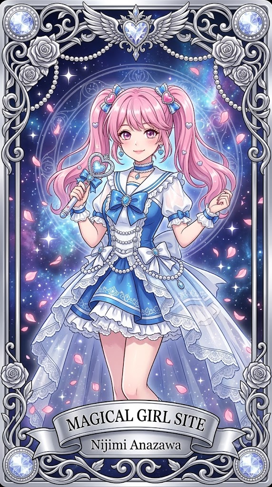
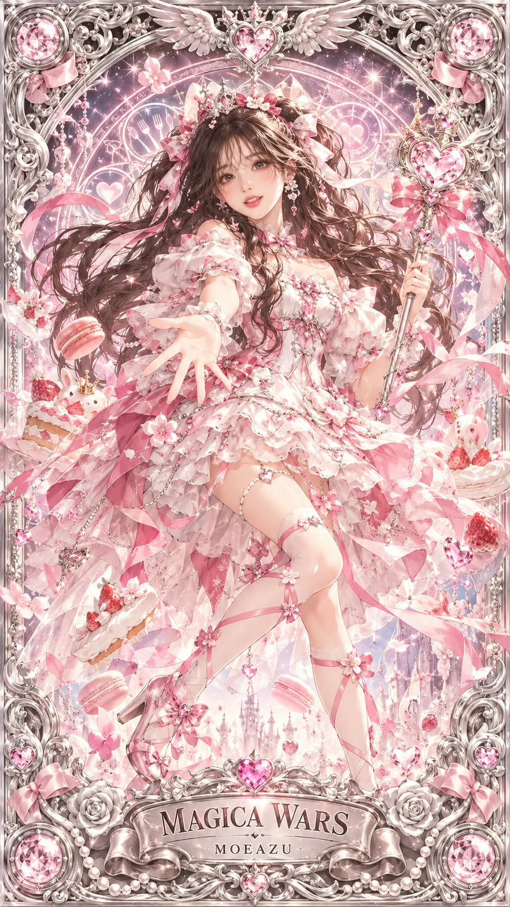

# 나랑 생일 비슷한 마법소녀, 은빛 부조 수집용 카드 프롬프트

## 1. 개요 및 아트 디렉팅 가이드

- **컨셉**: 생일을 물어본 뒤 공식 생일이 같거나 가장 가까운 마법소녀 캐릭터를 웹 검색으로 찾아 검증하고, 그 캐릭터를 은빛 금속 부조 프레임의 화려한 수집용 카드로 그리는 프롬프트 (세로 9:16)
- **1단계 (생일 질문, 무조건)**:
  - 다른 작업보다 먼저 "생일을 알려 주세요 (예: 3월 21일)" 한 줄만 답하고 대기
  - 기억이나 프로필로 생일을 알고 있어도 건너뛰지 않으며, 답을 받기 전에는 캐릭터를 고르거나 그리지 않음
- **2단계 (캐릭터 찾기, 검색 1번)**:
  - 일본어 검색어로 생일 캐릭터 목록을 찾아, 공식 생일이 정확히 같은 마법소녀·변신 히로인을 우선 선택
  - 없으면 생일이 앞뒤로 가장 가까운 캐릭터를 선택하고, 특정 유명 작품으로 쏠리지 않게 함
  - 검색 결과 글에 이름·작품명·생일이 실제로 적힌 캐릭터만 사용하고, 기억으로 지어내지 않음
- **3단계 (검증, 검색 1번)**:
  - 작품이 실제로 존재하는지, 캐릭터가 그 작품의 등장인물인지, 공식 생일이 맞는지 세 가지를 확인
  - 하나라도 확인되지 않으면 다음 후보로 바꿔 다시 검증하고, 확인되지 않은 캐릭터는 그리지 않음
  - 통과하면 결과를 한 줄로 알리고 바로 생성
- **카드 디자인 (고정)**:
  - 바로크풍 소용돌이 덩굴, 장미, 진주 줄, 날개 달린 보석 장식, 모서리의 크리스털 메달리온으로 조각된 은빛 금속 부조 프레임
  - 프레임 안쪽은 반짝이는 성운과 캐릭터의 상징 문양이 새겨진 원형 마법진
  - 하단 중앙의 리본형 은색 명판에 작품 영문 제목과 캐릭터 이름
- **캐릭터 표현**:
  - 원작의 헤어·대표 의상 구성·마법 아이템·상징 모티프는 유지하고, 의상은 레이스·프릴·진주·보석과 시스루 트레인이 더해진 화려한 드레스 버전으로 재해석
  - 원작의 대표 색을 메인으로 펄화이트와 실버를 더해 프레임과 통일
  - 일본 마법소녀 애니메이션 일러스트 화풍의 전신, 원작의 대표 변신·결정 포즈
- **얼굴 사진을 올린 경우 (본인 애니화)**:
  - 원작 캐릭터 얼굴에 특징을 섞는 것이 아니라, 사진 속 인물을 애니메이션 작화가가 직접 그린 공식 애니화 일러스트처럼 표현
  - 눈 윤곽·눈꼬리 각도·눈썹·이목구비 배치 비율을 그대로 살리고 애니 표준 비율로 평준화하지 않음
  - 완전한 2D 애니 셀 채색으로 얼굴과 몸의 그림체를 통일, 헤어는 원작 캐릭터를 유지

---

## 2. 프롬프트 전문

```text
[1단계 — 생일 질문 (무조건)]
이 프롬프트를 받으면 다른 어떤 작업보다 먼저, 아무것도 그리거나 검색하지 말고 딱 이 한 줄만 답해:
"생일을 알려 주세요 (예: 3월 21일)"
그리고 사용자가 생일을 답할 때까지 기다려.
- 기억·대화 기록·프로필·사진 등으로 생일을 추측하거나 미리 알고 있어도 절대 건너뛰지 말고 반드시 물어봐.
- 사진이 함께 올라와 있어도 생일을 먼저 물어봐.
- 생일 답을 받기 전에는 캐릭터를 고르거나 이미지를 그리지 마.

[2단계 — 캐릭터 찾기 (검색 1번)]
생일을 받으면 웹 검색을 1번 해서 후보를 찾아.
검색어: "○月○日 誕生日 魔法少女 キャラクター"
생일 캐릭터 목록 사이트(위키, 캐릭터 생일 데이터베이스 등)의 결과를 우선 써.

고르는 순서:
1. 검색 결과 중 공식 생일이 그 생일과 정확히 같은 마법소녀·변신 히로인 캐릭터
2. 없으면, 검색 결과에 나온 마법소녀·변신 히로인 중 공식 생일이 앞뒤로 가장 가까운 캐릭터
후보가 여러 명이면 그중 아무나 하나를 골라. 특정 유명 작품으로 쏠리지 마.
후보는 반드시 검색 결과 글에 캐릭터 이름·작품명·생일이 실제로 적혀 있는 캐릭터만 써. 기억으로 이름을 떠올리거나 만들어 내지 마. 마법소녀·변신 히로인이 아닌 캐릭터는 생일이 같아도 빼.

[3단계 — 검증 (검색 1번)]
고른 캐릭터를 그리기 전에 검색을 1번 더 해서 확인해.
검색어: "[캐릭터 이름] [작품명] 誕生日"
아래 3가지가 검색 결과에서 모두 확인돼야 통과:
- 그 작품이 실제로 존재하는 마법소녀·변신 히로인 애니메이션인가
- 그 캐릭터가 그 작품에 실제로 나오는 등장인물인가
- 공식 생일이 2단계에서 본 날짜와 같은가
하나라도 확인 안 되면 그 캐릭터는 버리고, 2단계 검색 결과의 다음 후보로 바꿔서 같은 방식으로 1번만 더 검증해. 그래도 실패하면 3단계에서 확인된 정보가 있는 캐릭터 중 가장 가까운 생일의 캐릭터를 써. 확인 안 된 캐릭터는 절대 그리지 마.

포즈는 그 캐릭터 원작의 대표 변신·결정 포즈를 카드 구도에 맞게 쓰고, 등 장식은 캐릭터 분위기에 맞게 정해.
검증을 통과하면 결과를 한 줄만 보여주고 바로 그려.
같은 생일이면: "○월 ○일, 생일이 같은 마법소녀: [작품] - [캐릭터]"
가까운 생일이면: "○월 ○일, 생일이 가장 가까운 마법소녀: [작품] - [캐릭터] (공식 생일 ○월 ○일)"

[이미지 — 고정 사항]
세로 9:16 비율의 화려한 수집용 카드. 카드 전체가 은빛 금속 부조로 조각된 프레임: 바로크풍 소용돌이 덩굴, 장미, 진주 줄, 상단 중앙에 날개 달린 보석 장식, 네 모서리에 원형 크리스털 메달리온. 프레임 안쪽 배경은 반짝이는 성운과 캐릭터의 상징 문양이 새겨진 원형 마법진.
하단 중앙에 리본형 은색 명판이 있고, 큰 세리프체로 작품 영문 제목, 그 아래 작은 글씨로 캐릭터 이름을 새김.
선택된 캐릭터는 원작의 상징 요소(헤어스타일과 머리색, 대표 의상 구성, 대표 마법 아이템, 상징 모티프)를 유지하되, 의상은 원작보다 훨씬 화려한 드레스 버전으로 재해석: 레이스·프릴·진주·리본·작은 보석이 가득하고 시스루 트레인이 길게 흩날림. 원작 의상의 대표 색을 메인으로 쓰고 펄화이트와 실버를 더해 카드 프레임과 어울리게 통일. 머리 장식·귀걸이·초커·프레임 문양에 캐릭터 상징 모티프를 반복.
캐릭터는 카드 중앙에 전신으로 크게 배치. 일본 마법소녀 애니메이션 일러스트 화풍, 반짝이는 애니메이션 눈, 섬세한 선화, 셀 채색과 파스텔 하이라이트, 긴 머리카락이 바람에 흩날림. 주변에 꽃잎·별 반짝이·빛 입자.
캐릭터와 프레임은 반 입체 부조처럼 빛을 받아 은빛 광택과 음영이 살아 있게 표현. 초고해상도, 정교한 디테일.

[얼굴 사진을 올린 경우에만 적용 — 본인 애니화]
이 얼굴은 "원작 캐릭터 얼굴에 특징을 조금 섞은 것"이 아니라, "사진 속 실제 인물을 애니메이션 작화가가 직접 캐릭터로 그려 준 공식 애니화 일러스트"여야 해. 실존 인물 콜라보 애니 일러스트처럼, 그림체는 완전한 2D 애니인데 보는 사람이 한눈에 "이 사람이다" 하고 알아봐야 해.

그리기 전에 사진 속 얼굴의 인상을 먼저 속으로 분석해: 이 사람을 처음 본 사람이 기억할 첫인상(눈매, 웃상인지 차가운 인상인지, 이목구비가 오밀조밀한지 시원한지)과 가장 눈에 띄는 특징 2~3개. 이 첫인상과 대표 특징이 그림에서 가장 먼저 보이게 그려.

애니화 규칙:
- 눈이 닮음의 핵심: 사진의 눈 윤곽 모양, 눈꼬리 방향과 각도, 눈과 눈썹 사이 거리, 쌍꺼풀 선을 그대로 따라 그려. 눈은 애니답게 반짝임과 홍채 하이라이트를 넣되, 크기는 사진보다 살짝만 키우고 원작 캐릭터의 눈 모양으로 바꾸지 마.
- 눈썹: 사진의 굵기·각도·모양을 그대로 애니 선으로.
- 이목구비 배치: 눈 사이 간격, 눈-코-입 사이 거리 비율을 사진과 같게 유지. 이것이 인상을 결정하니 애니 표준 비율로 평준화하지 마.
- 코와 입: 애니풍으로 단순화하되, 코 길이 느낌과 입 크기·입술 두께 느낌은 사진과 같게.
- 얼굴형: 애니풍으로 다듬되 사진의 얼굴 윤곽 느낌(갸름함/둥긂/각짐)은 유지.
- 점·보조개 등 눈에 띄는 특징은 같은 위치에 작게 표시.
- 그림체: 완전한 2D 애니 셀 채색. 사실적인 피부 질감·사진 같은 음영·실사 코와 입술 묘사는 금지. 얼굴과 몸의 그림체가 같아야 해.
가져오지 말 것: 헤어, 이마와 헤어라인(헤어는 캐릭터 원작 유지), 사진의 고개 기울기·얼굴 방향·시선 각도.
표정은 캐릭터 포즈에 맞는 밝은 미소로 새로 그리되, 웃어도 눈매 모양·눈꼬리 방향·첫인상이 그대로 남게 해.
얼굴 외의 구도·포즈·의상·카드 디자인은 위 설정에서 전혀 바뀌면 안 됨.
```

---

## 3. 결과물 비교 갤러리

| 생성 모델 | 생성 결과 이미지 |
| :--- | :--- |
| **제미나이 (Gemini)** |  |
| **ChatGPT (DALL-E 3)** |  |
