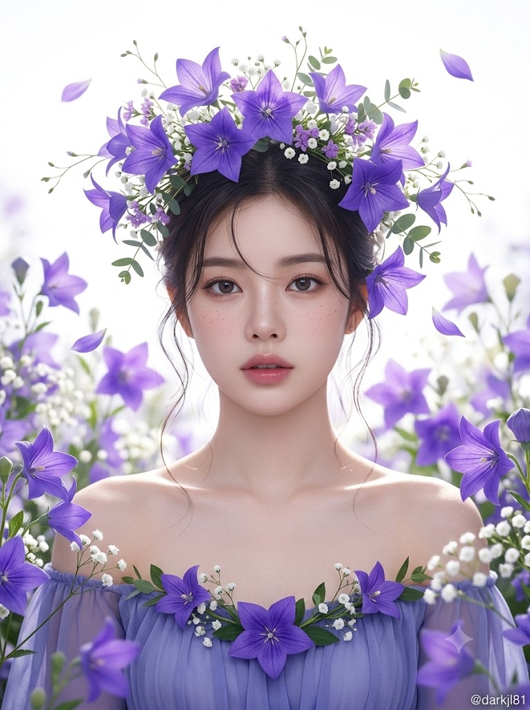
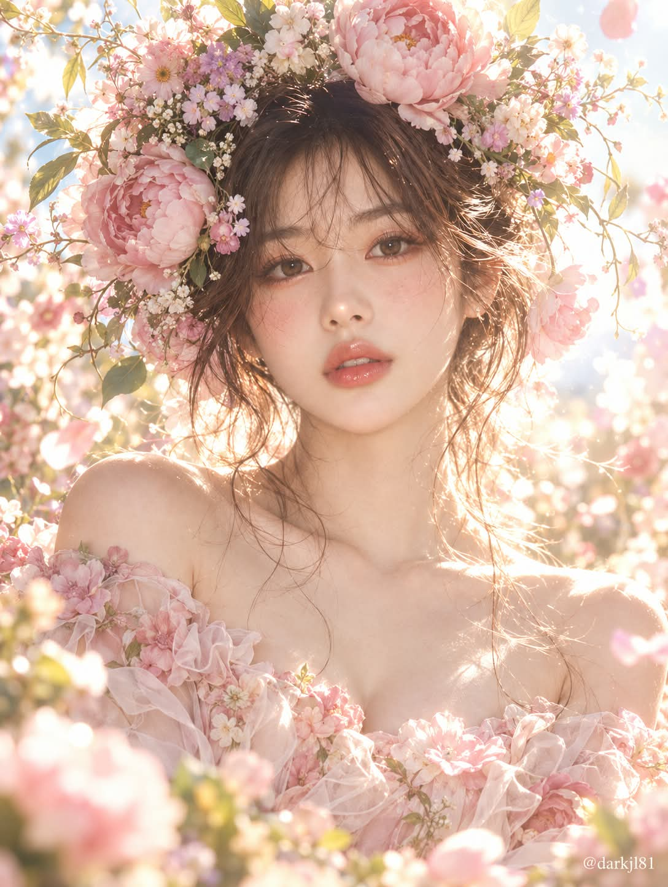

# 나의 꽃은, 나에게 어울리는 꽃 화관 역광 뷰티 포트레이트 프롬프트

## 1. 개요 및 아트 디렉팅 가이드

- **컨셉**: AI가 사용자에 대해 알고 있는 직업·성격·취향·말투를 종합해 가장 어울리는 꽃 한 종류와 그 색을 고르고, 그 꽃으로 만든 풍성한 화관을 쓴 역광 뷰티 포트레이트 화보를 그리는 2단계 프롬프트
- **1단계 (꽃과 색 선택)**:
  - 원예종·야생화·계절 꽃·나무 꽃 전체에서 폭넓게 후보를 떠올린 뒤 메인 꽃 1종과 메인 색 1가지를 선택
  - 꽃의 색, 꽃잎 형태, 피는 계절, 꽃말, 자라는 환경 중 최소 두 가지를 사용자의 특징과 구체적으로 연결
  - 분홍·피치·연보라 같은 화보 기본 색을 기본값으로 쓰지 않고, 그 품종에 실제로 있는 색 중에서 판단
  - 고른 꽃 이름, 메인 색, 이유를 3줄 이내로 먼저 안내
- **2단계 (이미지 생성)**:
  - **얼굴 규칙**: 사진에서는 눈·코·입의 생김새만 참고하고 성별만 판단, 얼굴형·헤어·각도·시선·표정은 새로 그림
  - **색 규칙 (최우선)**: 화관, 주변 꽃, 의상, 배경 보케, 꽃잎까지 메인 색과 보조 색으로만 구성하고, 파스텔로 바래지 않게 실제 꽃의 채도와 깊이를 유지
  - **구도 & 표정**: 가슴 위까지 들어오는 세로 바스트샷, 정면 얼굴과 렌즈를 곧게 응시하는 시선, 입술이 살짝 벌어진 차분하고 깊이 있는 무표정
  - **의상 & 헤어**: 여성은 메인 색 시폰 오프숄더 드레스와 느슨한 올림머리, 남성은 메인 색 리넨 셔츠와 자연스럽게 흐트러진 짧은 헤어
- **화관 & 꽃장식**:
  - 실제 꽃잎 수·모양·크기·피는 형태를 정확히 살리고, 둥근 겹꽃으로 뭉뚱그리지 않음
  - 머리 윤곽 바깥으로 흘러넘치는 크고 풍성한 화관, 인물을 감싸는 플라워 월과 흩날리는 꽃잎
- **배경 & 조명**:
  - 인물 바로 뒤에서 쏟아지는 강한 역광과 과노출된 햇살, 메인 색의 커다란 보케, 잔머리와 꽃잎 가장자리의 림라이트
  - 앞쪽의 부드러운 반사광으로 맑게 받쳐 준 얼굴
- **스타일 & 워터마크**: 85mm 렌즈의 얕은 심도 뷰티 포트레이트, 우측 하단에 작은 흰색 `@darkjl81`

---

## 2. 프롬프트 전문

```text
[1단계 – 꽃과 색 선택]
지금까지 나에 대해 알고 있는 정보와 나눈 대화들(직업, 성격, 취향, 관심사, 말투, 자주 하는 이야기)을 종합해서 나에게 가장 어울리는 꽃 한 종류와 그 꽃의 색을 직접 골라줘.

원예종, 야생화, 계절 꽃, 나무 꽃 등 전체 꽃 중에서 폭넓게 후보를 떠올린 뒤 고를 것.

고를 때는 꽃의 색, 꽃잎 형태, 피는 계절, 꽃말, 자라는 환경 중 최소 두 가지 이상을 내 특징과 구체적으로 연결해서 판단할 것.

꽃 색은 분홍·피치·연보라 같은 화보 기본 색을 기본값으로 쓰지 말고, 내 성향과 분위기에 맞는 색을 따로 판단해서 정할 것. 그 꽃 품종에 실제로 존재하는 색이어야 함.

메인 꽃 1종과 메인 색 1가지를 정하고, 어울리는 보조 꽃·잎과 보조 색 1~2가지는 자유롭게 정해.

이미지를 만들기 전에 고른 꽃 이름, 메인 색, 고른 이유를 3줄 이내로 먼저 알려줘.

[2단계 – 이미지 생성]
업로드한 얼굴 사진에서는 눈·코·입의 생김새만 참고하세요. 얼굴형, 피부, 헤어, 이마/헤어라인, 고개 각도·기울기·방향·시선, 표정은 절대 사진에서 가져오지 말고 아래 서술대로 새로 그리세요. 사진으로 성별만 판단하세요.

[색 규칙 – 최우선]
이미지 전체의 색은 1단계에서 정한 메인 색과 보조 색으로만 구성. 화관, 주변 꽃, 의상, 배경 보케, 흩날리는 꽃잎 모두 이 색 체계를 따를 것. 메인 색이 분홍 계열이 아닌 경우 화면에 분홍색이 끼어들지 않게 할 것. 꽃 색은 파스텔로 흐리게 바래지 말고 실제 그 꽃의 채도와 깊이를 그대로 살릴 것.

[구도·포즈]
가슴 위까지 들어오는 세로형 바스트샷. 인물은 화면 중앙, 몸은 아주 살짝 비스듬히 두되 얼굴은 정면을 향하고 고개는 똑바로 세운 채 턱을 아주 살짝 당김. 시선은 카메라 렌즈를 정면으로 곧게 응시. 목선과 쇄골, 맨어깨가 드러남. 손은 화면에 나오지 않음.
여성: 메인 색의 얇은 시폰 오프숄더 드레스, 가슴선을 따라 메인 꽃과 보조 꽃으로 만든 작은 꽃 장식.
남성: 메인 색의 얇은 리넨 셔츠를 단추 두세 개 풀어 쇄골이 보이게, 가슴 포켓에 메인 꽃 한 송이.

[표정]
웃지 않는 차분하고 깊이 있는 무표정. 입술은 힘을 빼고 아주 살짝 벌어져 윗니 끝이 살짝 보일 듯 말 듯. 눈은 편안하게 뜬 채 맑고 투명한 눈빛으로 정면을 조용히 바라봄. 눈썹은 자연스럽게 일자로 이완.

[헤어]
여성: 머리를 느슨하게 뒤로 올려 묶고, 얼굴 양옆과 목선을 따라 가늘고 긴 잔머리가 웨이브지며 흘러내림.
남성: 자연스럽게 흐트러진 짧은 헤어, 이마와 관자놀이 쪽에 잔머리 몇 가닥.

[메이크업·피부]
투명하고 매끈한 피부, 아주 옅은 주근깨. 블러셔와 입술은 피부 톤에 맞춘 자연스러운 혈색 정도로만, 진한 분홍 블러셔 금지. 아이 메이크업은 메인 색을 아주 은은하게 섞어 자연스럽게, 속눈썹만 또렷하게.

[화관]
메인 꽃은 실제 그 꽃의 꽃잎 수, 꽃잎 모양, 꽃 크기, 피는 형태를 정확히 살려서 그리고, 둥글고 풍성한 겹꽃 형태로 뭉뚱그려 그리지 말 것. 작은 꽃이면 작은 꽃 그대로, 송이나 이삭 형태로 피는 꽃이면 그 형태 그대로 표현.
1단계에서 고른 꽃으로 만든 크고 풍성한 화관. 머리 위를 넓게 덮고 머리 윤곽보다 바깥으로 흘러넘치듯 퍼짐. 메인 꽃 여러 송이 사이에 보조 꽃과 잔꽃, 가는 줄기와 잎이 공중으로 흩어지듯 뻗어 있음. 화관 일부가 옆머리를 타고 귀 아래까지 내려오고, 반대쪽 귀 옆에도 메인 꽃이 꽂혀 있음. 화관에서 가장 눈에 띄는 꽃은 반드시 메인 꽃이어야 함.

[주변 꽃장식]
인물 주변을 같은 꽃들이 감싸는 플라워 월 같은 공간. 화면 양옆과 아래 가장자리 앞쪽에 꽃가지가 프레임 안으로 들어와 부드럽게 아웃포커스로 번짐. 인물 뒤쪽에도 꽃이 층층이 피어 있고, 공중에 메인 꽃의 꽃잎 몇 장이 천천히 흩날림. 꽃이 얼굴은 절대 가리지 않음.

[배경·조명]
인물 바로 뒤에서 눈이 부실 만큼 강한 역광이 쏟아지는 배경. 햇살이 하얗게 날아갈 듯 과노출되어 빛이 번지고, 뒤쪽 꽃들은 빛에 녹아 메인 색의 커다란 반짝이는 보케로 표현. 잔머리와 화관 꽃잎 가장자리에 밝은 림라이트가 반짝이고, 꽃잎이 빛을 머금어 반투명하게 비침. 은은한 렌즈 플레어와 빛 번짐(헤이즈). 얼굴은 앞쪽에서 부드러운 반사광이 받쳐 줘서 어둡지 않고 맑게. 역광 때문에 전체 색이 분홍·주황빛으로 물들지 않게 할 것.

[스타일]
화보급 뷰티 포트레이트 사진, 85mm 렌즈, 얕은 심도, 얼굴과 화관에 선명한 초점, 메인 색이 또렷하게 살아 있는 밝은 색보정, 초고해상도.

[워터마크]
우측 하단에 작게 흰색 @darkjl81
```

---

## 3. 결과물 비교 갤러리

| 생성 모델 | 생성 결과 이미지 |
| :--- | :--- |
| **제미나이 (Gemini)** |  |
| **ChatGPT (DALL-E 3)** |  |
