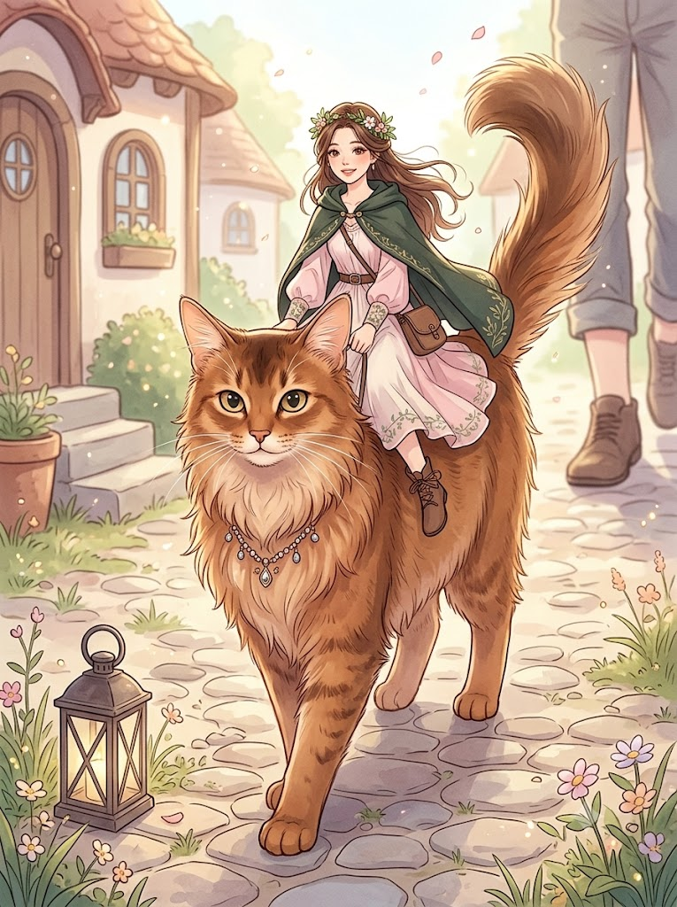
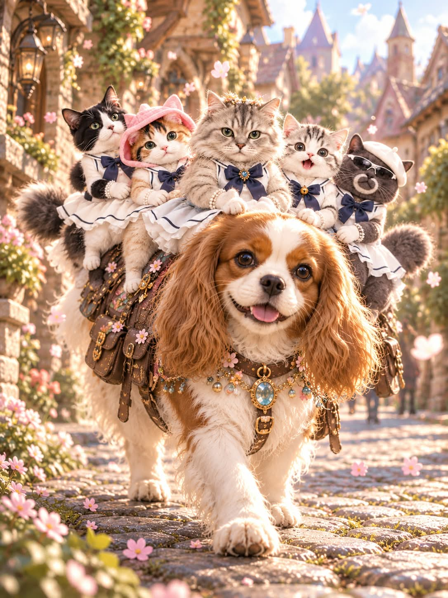

# 나의 반려동물 탈것, 소인국 판타지 동화 일러스트 프롬프트

## 1. 개요 및 아트 디렉팅 가이드

- **컨셉**: 사진 주인공의 인상이 고양이상인지 강아지상인지 판정해 닮은 품종의 반려동물을 정하고, 실제 크기의 그 동물 등에 손바닥만 하게 작아진 주인공이 올라탄 소인국 판타지 동화 일러스트 (세로 3:4)
- **2단계 진행 방식**:
  - **1차 (판정만)**: 이미지는 만들지 않고 네 가지 항목만 글로 답변. 사진 주인공(사람/고양이/강아지), 인상 판정, 태워주는 동물의 공인 품종명, 그 품종의 털 색·무늬·체형 특징
  - **2차 (이미지 생성)**: 다음 메시지로 요청하면 판정 결과대로 이미지 생성
- **크기 규칙 (가장 중요)**:
  - 태워주는 동물은 실제 성체 크기 그대로, 탑승자만 손바닥만 한 요정 크기로 축소
  - 집·돌길·화분·랜턴·행인 등 배경은 모두 정상 크기
- **사진이 사람일 때**:
  - 실제 나이대와 성별, 그 나이대의 정상 신체 비율을 유지 (SD 비율 금지)
  - 얼굴형과 눈·코·입의 형태는 가져오되 명암·피부색·각도·시선·표정은 새로 그리고, 안경은 유지
  - 여성은 화관과 시폰 드레스에 짧은 망토, 남성은 모험가풍 튜닉과 후드 망토의 파스텔 판타지 의상
- **사진이 고양이·강아지일 때**:
  - 사진 속 동물을 옷 없이 털 그대로 의인화해 탑승자로 표현하고, 품종·털 색과 무늬·눈 색은 그대로 유지
  - 탑승자가 고양이면 태워주는 동물은 강아지, 강아지면 고양이
- **태워주는 동물**:
  - 얼굴 인상과 가장 닮은 실제 공인 품종을 선택하고, 그 품종 고유의 체형·귀·주둥이·꼬리·털 질감을 그대로 표현
  - 보석과 펜던트가 달린 판타지풍 목걸이, 등 위의 탑승자를 신경 쓰며 정면으로 천천히 걸어오는 자세
- **배경 & 구도**:
  - 둥근 자갈길과 아기자기한 집들의 아랫부분, 화분과 랜턴, 흩날리는 꽃잎과 빛 입자, 멀리 흐릿한 행인의 다리
  - 바닥에 거의 닿는 낮은 앵글, 따뜻한 오전 햇살의 부드러운 역광과 얕은 심도
- **화풍**: 수채화와 셀 셰이딩이 섞인 손그림 느낌의 디지털 일러스트, 맑고 따뜻한 파스텔톤의 동화책 삽화 분위기

---

## 2. 프롬프트 전문

```text
[1차: 판정만 — 이번 답변에서는 절대 이미지를 생성하지 마세요]
아래 프롬프트를 읽고, [0]의 4개 항목만 텍스트로 답한 뒤 답변을 끝내세요.
이미지는 제가 다음 메시지로 요청할 때 생성합니다.

━━━━━━━━━━━━━━━━━━
[0] 판정 항목
━━━━━━━━━━━━━━━━━━

1. 사진 주인공: 사람 / 고양이 / 강아지

2. 인상 판정: 고양이상 / 강아지상 (판정 이유 한 줄)

3. 태워주는 동물: 고양이 또는 강아지, 실제로 존재하는 공인 품종명 (이 품종을 고른 이유 한 줄)

4. 그 품종에 실제로 있는 털 색·무늬·털 길이, 그리고 그 품종의 체형 특징 한 줄

━━━━━━━━━━━━━━━━━━
[크기 규칙] 가장 중요한 장면 설정
━━━━━━━━━━━━━━━━━━

태워주는 동물은 실제 성체 크기 그대로입니다. 절대 키우지 마세요.

탑승자만 손바닥만 한 크기로 아주 작게 축소합니다. 동물의 등에 올라탈 수 있을 정도의 요정 같은 크기입니다.

집, 돌길, 화분, 랜턴, 행인 등 배경은 모두 실제 정상 크기입니다.

결과적으로 평범한 크기의 반려동물 등에 손바닥만 한 탑승자가 타고 있는 소인국 판타지 장면이 되어야 합니다.

━━━━━━━━━━━━━━━━━━
[A] 사진이 사람일 때
━━━━━━━━━━━━━━━━━━
■ 나이·성별

사진 인물의 실제 나이대와 성별을 그대로 따르세요. 아이는 아이로, 청소년은 청소년으로, 성인은 성인으로, 노년은 노년으로 그립니다. 임의로 어리게 만들거나 나이 들게 하지 마세요.

크기만 작을 뿐, 체형과 신체 비율은 그 나이대의 정상 비율로 그립니다. 머리만 크게 하는 SD 비율로 만들지 마세요.

■ 얼굴 사용 규칙 (가장 중요)

사진에서 얼굴형과 눈·코·입의 생김새는 형태 그대로 가져오세요.

사진의 명암, 조명, 그림자, 피부색, 피부 질감은 가져오지 마세요. 얼굴의 명암·조명·피부색은 이 그림의 장면 조명과 그림체 기준으로 새로 칠합니다.

헤어와 이마/헤어라인은 사진에서 가져오지 말고 아래 서술대로 그립니다.

사진 속 머리 각도, 고개 기울기, 얼굴 방향, 시선은 절대 가져오지 마세요. 각도와 시선은 아래 구도 서술대로 새로 그립니다.

표정은 사진이 아니라 이 프롬프트 서술대로 새로 그립니다: 입꼬리가 살짝 올라간 해맑고 편안한 미소, 생기 있게 반짝이는 눈.

얼굴 형태는 알아볼 수 있게 유지하되 아래 그림체로 다시 그리고 아주 살짝 미화하세요. 실사 사진처럼 그리지 마세요.

사진에 안경이 있으면 같은 형태의 안경을 유지하세요.

■ 헤어·의상 (성별에 따라)

특정 나라나 시대의 전통 의상이 아닌, 동화 속 판타지 세계의 옷으로 그립니다.

여성: 부드러운 웨이브의 긴 머리를 반묶음하고, 작은 꽃과 잎사귀로 엮은 화관. 가볍게 겹친 시폰 소재의 무릎 아래 길이 드레스, 짧은 망토가 어깨에 걸쳐 있고, 소매와 밑단에 덩굴무늬 자수, 가죽 끈 부츠.

남성: 자연스럽게 흐트러진 짧은 머리. 허리까지 오는 모험가풍 튜닉에 가죽 벨트와 작은 가방, 짧은 후드 망토, 소매와 깃에 덩굴무늬 자수, 가죽 부츠.

머리색과 의상 색은 파스텔 계열로 하되, 인물 인상과 어울리는 색을 직접 골라주세요.

인물은 동물 등에 걸터앉아 한 손은 동물의 털이나 목걸이 끈을 가볍게 잡고, 망토와 머리카락이 바람에 살짝 날립니다.

━━━━━━━━━━━━━━━━━━
[B] 사진이 고양이·강아지일 때
━━━━━━━━━━━━━━━━━━
■ 의인화 규칙

사진 속 동물을 의인화해서 탑승자로 그리고, [크기 규칙]대로 손바닥만 하게 축소합니다.

사람처럼 등에 걸터앉고, 앞발을 손처럼 써서 태워주는 동물의 털이나 목걸이 끈을 가볍게 잡습니다.

옷, 모자, 액세서리는 전혀 입히지 마세요. 자기 털 그대로의 모습입니다.

몸은 사람처럼 앉을 수 있을 정도로만 의인화하고, 머리·귀·꼬리·발·털은 원래 동물 모습 그대로 유지합니다. 사람 얼굴이나 사람 손으로 바꾸지 마세요.

■ 사진 사용 규칙

사진에서 품종, 얼굴 생김새, 귀 모양, 털 색과 무늬, 눈 색은 그대로 가져와서 같은 아이로 알아볼 수 있게 합니다.

사진의 명암, 조명, 배경, 자세, 머리 각도, 시선은 가져오지 마세요. 아래 구도와 그림체 기준으로 새로 그립니다.

표정은 해맑고 기분 좋은 얼굴, 반짝이는 눈으로 새로 그립니다.

━━━━━━━━━━━━━━━━━━
[공통] 태워주는 동물
━━━━━━━━━━━━━━━━━━
■ 동물·품종 결정

고양이상이면 고양이, 강아지상이면 강아지입니다.

[B]의 경우 탑승자가 고양이면 태워주는 동물은 강아지, 탑승자가 강아지면 고양이입니다.

품종은 반드시 실제로 존재하는 공인 품종이어야 하며, 지어낸 품종이나 여러 품종을 섞은 모습은 안 됩니다.

품종은 몸 크기와 상관없이, 사진 주인공의 얼굴 인상(눈매, 얼굴선, 분위기)과 가장 닮은 품종을 고릅니다. 습관적으로 흔한 장모 품종을 고르지 마세요.

털 색·무늬·길이는 그 품종에 실제로 있는 것으로 정합니다.

■ 품종 표현

정상적인 성체의 실제 체형과 비율 그대로 그립니다. 골격, 가슴, 다리 굵기, 발 크기를 변형하지 마세요.

그 품종 고유의 체형, 귀 모양, 얼굴형, 주둥이 길이, 꼬리 모양, 털 질감을 그대로 살려서 품종을 한눈에 알아볼 수 있게 그립니다.

표정은 순하고 기분 좋은 얼굴, 등 위의 작은 탑승자를 신경 쓰며 조심스럽게 걷는 느낌.

목에는 작은 보석과 구슬, 반짝이는 펜던트가 달린 판타지풍 목걸이를 걸고 있습니다. 목걸이 크기는 동물 크기에 맞춥니다.

정면을 향해 천천히 걸어오는 자세입니다.

■ 배경 (모두 정상 크기)

동화 속 판타지 마을의 돌길: 둥근 자갈이 깔린 길, 양옆에 둥근 지붕과 작은 창문이 있는 아기자기한 집들의 아랫부분, 문 앞 계단, 화분, 바닥 가까이 놓인 랜턴.

길가에 작은 들꽃과 풀, 공중에 꽃잎과 작은 빛 입자가 흩날림. 멀리 행인의 발과 다리가 정상 크기로 흐릿하게 보여 탑승자가 얼마나 작은지 드러납니다.

특정 나라의 건축 양식이 드러나지 않게, 동화책 속 상상의 마을로 그립니다.

■ 구도·스타일

세로 3:4 비율, 바닥에 거의 닿는 낮은 앵글로 동물 눈높이에서 촬영한 듯한 구도. 동물 전신과 등 위의 작은 탑승자가 화면 중앙에 오도록 합니다.

탑승자는 작지만 얼굴을 알아볼 수 있게, 얼굴을 카메라 쪽으로 향하고 정면을 바라봅니다.

따뜻한 오전 햇살, 부드러운 역광으로 동물과 탑승자의 윤곽에 빛 테두리, 배경은 얕은 심도로 부드럽게 흐림(작은 세계를 들여다보는 미니어처 느낌).

실사가 아닌 손그림 느낌의 디지털 일러스트. 부드러운 수채화와 셀 셰이딩이 섞인 판타지 그림체, 선은 얇고 깔끔하게, 색감은 맑고 따뜻한 파스텔톤.

탑승자·동물·배경 모두 같은 조명과 같은 그림체로 통일합니다.

동화책 삽화 같은 분위기, 고해상도 디테일.

다시 강조: 이번 답변은 [0]의 4개 항목 텍스트로만 끝내세요. 이미지 생성 금지.
```

---

## 3. 결과물 비교 갤러리

| 생성 모델 | 생성 결과 이미지 |
| :--- | :--- |
| **제미나이 (Gemini)** |  |
| **ChatGPT (DALL-E 3)** |  |
