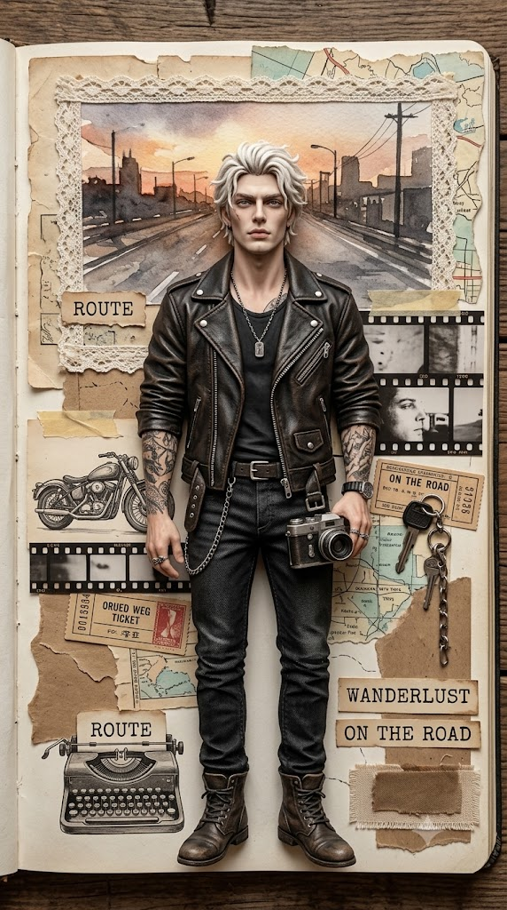
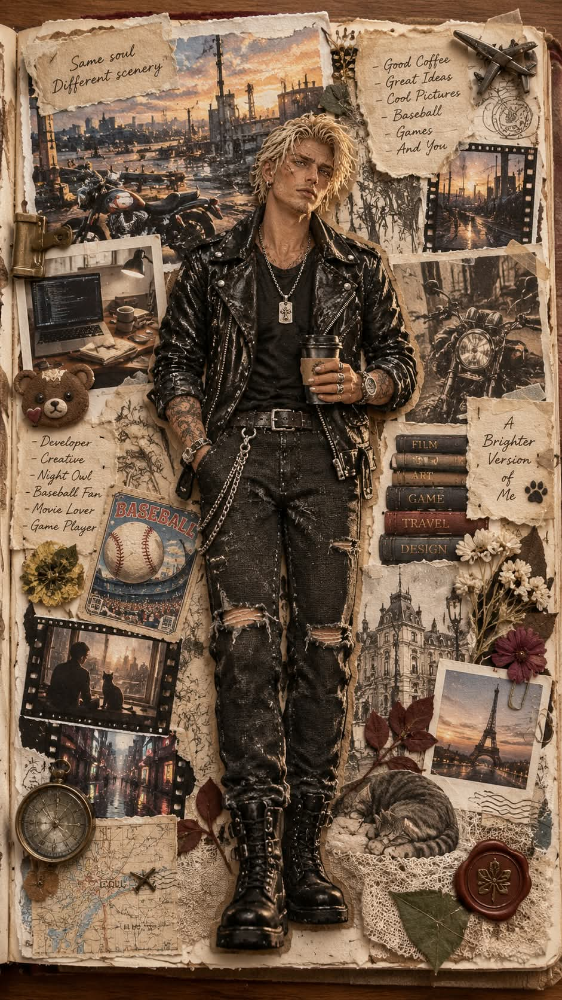

# 나의 스크랩, 사용자 맞춤 핸드메이드 스크랩북 콜라주 프롬프트

## 1. 개요 및 아트 디렉팅 가이드

- **컨셉**: AI가 대화와 기억으로 분석한 사용자의 직업·관심사·취미·성향을 바탕으로 구성 요소를 직접 정해, 펼쳐진 낡은 책 위에 꾸민 핸드메이드 스크랩북 콜라주를 실제 공예 작품 사진처럼 그리는 프롬프트 (세로 9:16)
- **사전 작업 (생성 전 필수)**:
  - 배경 풍경, 주변에 붙일 사진·종이·오브제·글귀, 인물이 손에 든 물건, 전체 색감을 분석 결과로 결정 (정해진 소품 목록 없음)
  - 생성할 때마다 분석한 정보의 다른 측면을 골라 구성이 달라지게 조합
  - 업로드 사진에 보이는 옷을 분석해 전신 의상을 유추하고, 결정한 구성과 의상을 짧은 목록으로 먼저 보여준 뒤 생성
- **업로드 사진 사용 규칙**:
  - 얼굴은 눈·코·입의 생김새만 실제 비율 그대로 가져오고, 눈을 키우거나 미형으로 보정하지 않음
  - 얼굴형·피부·헤어·각도·시선·표정·배경은 가져오지 않음
- **중앙 인물 (가장 중요)**:
  - **형태**: 책 페이지에 붙인 반입체 아트돌 부조. 뒤쪽은 페이지에 밀착되고 앞쪽만 몇 밀리 솟은 얕은 저부조로, 독립된 입체 인형이나 피규어가 아님
  - **비율 & 자세**: 약 7.5등신의 성인 실제 인체 비율, 정면을 보고 똑바로 선 전신, 한 손에 사전 작업에서 정한 물건
  - **얼굴**: 무광 도자기·폴리머 점토로 조각하고 붓으로 채색한 사실적인 성인 얼굴, 무표정에 가까운 담담한 표정과 정면 시선
  - **헤어**: 조각하거나 실·양모를 붙여 만든 듯한 덩어리감 있는 공예 질감
  - **의상**: 사진 속 옷의 디자인·색·무늬를 그대로 유지하고, 실제 원단 조각을 오려 겹쳐 붙인 아플리케로 표현
- **전체 구도 & 화풍**:
  - 나무 테이블 위 낡은 책을 정면 위에서 수직으로 내려다본 원근감 없는 플랫레이
  - 종이·천·압화·실·점토로 만든 얕은 저부조 요소들이 겹겹이 붙어 화면을 빈틈없이 채우고, 겹친 부분에만 얇은 그림자
  - 상단 약 1/3은 수채화 배경 풍경, 부드러운 자연광과 따뜻한 빈티지 톤
- **주요 금지**: 중앙 인물을 입체 인형·실사 인물·애니풍 캐릭터로 그리는 것, 얼굴 미화와 웃는 표정, 사진 속 옷의 디자인 변경, 주변 요소에 업로드한 얼굴 사용

---

## 2. 프롬프트 전문

```text
[사용자 맞춤 핸드메이드 스크랩북 콜라주 — 얼굴 합성 프롬프트]

■ 사전 작업 (생성 전에 반드시 수행)
지금까지 나눈 대화와 네가 알고 있는 나에 대한 정보(직업, 관심사, 취미, 자주 이야기한 주제, 성향, 가치관)를 분석해라.
그 분석을 바탕으로 콜라주에 들어갈 모든 요소(배경 풍경, 주변에 붙일 사진·종이·오브제·글귀 등 종류와 내용, 인물이 손에 든 물건, 전체 색감)를 네가 직접 정해라.

정해진 소품 목록은 없다. 무엇을 넣을지는 전적으로 분석 결과로 결정한다.

매번 생성할 때마다 분석한 정보 중 다른 측면을 골라 구성이 달라지게 랜덤하게 조합해라.

흔한 장식 소품으로 채우지 말고, 나를 아는 사람이 보면 "이 사람 이야기다"라고 알아볼 수 있게 구성해라.
또 업로드 사진에 보이는 옷(목선, 칼라, 어깨, 상의 일부)을 분석해 전신 의상을 유추해라.
결정한 구성과 유추한 의상을 짧은 목록으로 먼저 보여준 뒤 바로 이미지를 생성해라.

■ 업로드 사진 사용 규칙 (매우 중요)

업로드 사진에서 얼굴은 눈·코·입의 생김새만 가져온다.

얼굴형, 피부, 헤어, 이마·헤어라인, 고개 기울기, 얼굴 방향, 시선, 표정, 배경은 사진에서 절대 가져오지 않는다.

눈·코·입은 실제 비율 그대로 옮긴다. 눈을 키우거나 미형으로 보정하지 않는다.

■ 중앙 인물 (가장 중요 — 이 묘사를 정확히 따를 것)
[형태]

책 페이지에 붙인 반입체 아트돌 부조. 뒤쪽은 페이지에 평평하게 밀착되어 있고, 앞쪽만 몇 밀리 정도 도톰하게 솟은 얕은 저부조.

독립된 입체 인형, 피규어, 구체관절인형, 실사 사람이 아니다. 바닥에 서 있는 공간감이나 발밑 그림자가 없다.

주변 꽃과 콜라주 요소가 치맛단과 팔 위로 겹쳐 붙어 같은 평면에 있음이 보인다.

[비율과 자세]

성인 실제 인체 비율, 약 7.5등신, 날씬하고 곧은 체형. 머리가 크거나 귀여운 SD 비율이 아니다.

정면을 보고 똑바로 선 전신. 어깨는 수평, 양팔은 몸 옆으로 자연스럽게 내린다.

한 손은 몸 옆에 가볍게 늘어뜨리고, 다른 손은 허리 높이에서 사전 작업에서 정한 물건을 든다.

화면 정중앙, 머리부터 발끝까지 화면 높이의 약 60%.

[얼굴]

무광 도자기·폴리머 점토로 조각하고 붓으로 채색한 핸드메이드 아트돌 얼굴.

사실적인 성인 얼굴 묘사. 애니메이션, 웹툰, 아이돌 미형, 큰 눈, 뽀샤시 필터 금지.

피부는 매트한 아이보리, 볼에 아주 옅은 홍조, 화장기 거의 없는 자연스러운 채색.

표정은 무표정에 가까운 차분하고 담담한 얼굴, 입은 다물고 웃지 않는다. 시선은 정면을 똑바로 본다.

[헤어]

조각하거나 실·양모를 붙여 만든 듯한 풍성한 질감의 핸드메이드 헤어, 두피에서 볼륨 있게 떠 있다.

머리 색과 스타일은 네가 인물에 맞게 정하되, 결이 덩어리감 있게 표현된 공예 질감을 유지한다.

[의상 표현 — 디자인은 사진에서 유추]

사진에 보이는 옷의 종류, 색, 무늬, 소재, 목선, 칼라, 단추, 액세서리를 그대로 유지하고, 보이지 않는 하의·신발 등은 자연스럽게 유추해 전신을 완성한다.

옷 스타일을 다른 시대나 장르로 바꾸지 않는다.

옷은 실제 원단 조각을 오려 겹쳐 붙인 아플리케. 원단 결, 바느질 스티치, 솔기, 니트 질감이 보이고 주름은 얕게 눌린 형태.

손은 얼굴과 같은 무광 점토 질감.

■ 전체 구도와 화풍

나무 테이블 위에 펼쳐진 낡은 책 한 권, 그 위에 꾸민 핸드메이드 스크랩북 콜라주

세로 9:16, 페이지를 정면 위에서 수직으로 내려다본 플랫레이, 원근감 없음

모든 요소가 종이, 천, 압화, 실, 점토 등으로 만든 얕은 저부조 공예품처럼 페이지에 붙어 있고, 겹친 부분에만 얇은 그림자

부드러운 자연광, 따뜻한 빈티지 톤, 실제 공예 작품을 촬영한 사진 질감

상단 약 1/3은 수채화로 그린 배경 풍경, 그 가장자리를 입체 공예 요소가 프레임처럼 둘러싼다

나머지 요소들은 인물 좌우와 아래를 겹겹이 둘러싸며 화면 전체를 빈틈없이 채운다

■ 금지 사항

중앙 인물을 입체 인형, 피규어, 실사 인물, 애니풍 미형 캐릭터로 그리지 말 것

얼굴을 미화하거나 눈을 키우지 말 것, 웃는 표정 금지

업로드 사진의 얼굴 각도, 표정, 헤어, 배경을 가져오지 말 것

사진 속 옷의 디자인·색·무늬를 바꾸지 말 것

주변 요소에 사람 얼굴이 나올 경우 모두 가상의 인물로 그리고, 업로드한 얼굴은 중앙 인물에만 쓸 것

글자가 들어가면 철자가 깨지지 않게 정확히 쓸 것
```

---

## 3. 결과물 비교 갤러리

| 생성 모델 | 생성 결과 이미지 |
| :--- | :--- |
| **제미나이 (Gemini)** |  |
| **ChatGPT (DALL-E 3)** |  |
