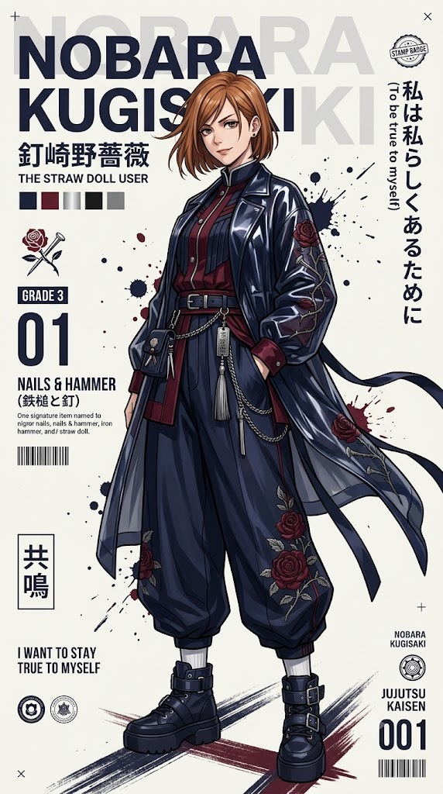
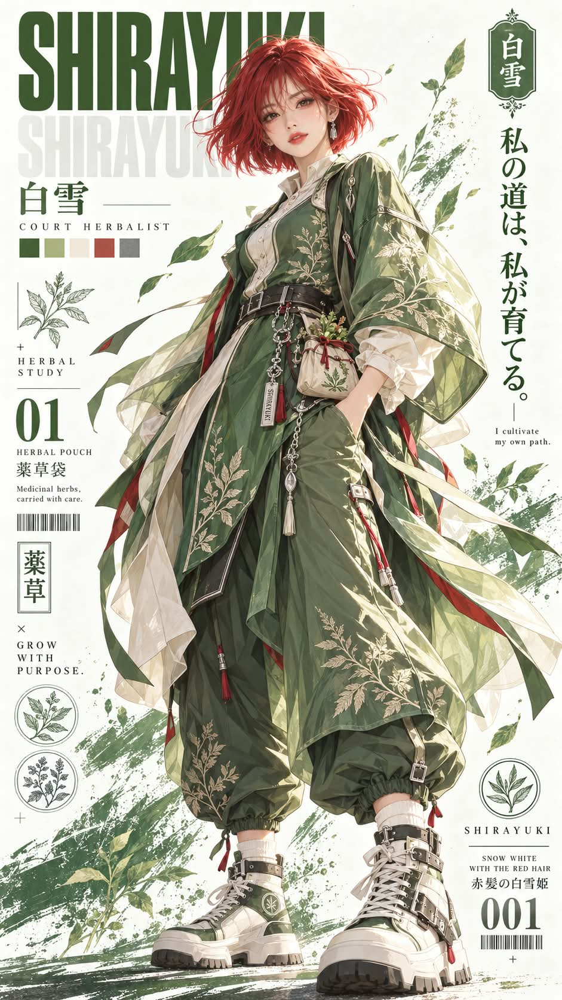

# 나의 애니캐릭터 힙합 버전, 스트릿웨어 패션 화보 캐릭터 포스터 프롬프트

## 1. 개요 및 아트 디렉팅 가이드

- **컨셉**: 얼굴 인상과 가장 잘 맞는 실존 애니메이션 주인공 한 명을 고르고, 그 캐릭터의 원작 의상을 스트릿웨어로 재해석한 세로 9:16 패션 화보 캐릭터 포스터를 그리는 프롬프트
- **프롬프트 구성 (세 가지)**:
  - **2단계 방식 ① (분석)**: 이미지는 만들지 않고 인상 분석과 캐릭터 선정, `CHARACTER IDENTITY LOCK` 블록만 글로 출력
  - **2단계 방식 ② (이미지 생성)**: 바로 위에서 출력한 블록을 그대로 사용해 이미지를 생성. ①에 이어서 같은 대화에 보냄
  - **한 번에**: 위 두 단계를 한 응답 안에서 이어서 수행하는 통합 버전. 분석을 글로 먼저 출력한 뒤 곧바로 이미지 생성
- **분석 & 캐릭터 선정**:
  - 눈매, 눈썹 라인, 전체 분위기, 성향 네 기준으로 인상을 한 줄씩 정리
  - 서로 다른 작품·장르의 실존 애니메이션 주인공 5명을 나열하고, 가장 먼저 떠오른 캐릭터와 지나치게 유명한 선택은 제외
  - 인상 기준 하나와 캐릭터의 확립된 특징 하나를 짝지은 이유 3개 제시 ("멋있다" 같은 일반적인 이유 금지)
- **CHARACTER IDENTITY LOCK**:
  - 캐릭터 이름, 작품명, 헤어, 의상 핵심 요소 3개, 대표 아이템, 모티프, 팔레트, 포스터 표기, 금지 목록을 고정하는 블록
  - 이후 어떤 시각 요소보다 우선하며, 다른 캐릭터로 대체되거나 섞이지 않도록 방지
- **얼굴 규칙**: 사진에서는 눈·코·입의 생김새만 가져오고, 턱을 살짝 내린 정면 응시와 자신감 있는 한쪽 입꼬리 미소로 새로 그림
- **의상 (원작 의상의 스트릿웨어 재해석)**:
  - 광택 있는 반투명 레이어드 원단의 오버사이즈 롱 아우터와 펄럭이는 리본 꼬리, 소매와 등의 큰 모티프 자수
  - 실버 체인과 이름이 새겨진 금속 태그, 패션 액세서리로 착용한 대표 아이템
  - 와이드 벌룬 팬츠와 청키 하이탑 플랫폼 스니커즈, 팔레트 색상만 사용
- **포즈 & 구도**: 약간 낮은 카메라 앵글의 전신, 한 손을 주머니에 넣은 3/4 측면, 발밑과 뒤쪽의 페인트 스플래터와 드라이브러시 스트로크
- **포스터 레이아웃**: 오프화이트 배경, 좌측 상단의 굵은 산세리프 제목과 거대한 연회색 워터마크, 색상 스와치 5개, 좌우 열의 엠블럼·숫자·바코드·한자 라벨·세로 일본어 문장, 얇은 구분선과 넉넉한 여백
- **화풍**: 선명한 라인과 광택 렌더링의 고급 세미리얼 애니메이션 일러스트

---

## 2. 프롬프트 전문

### 2단계 방식 ① 분석

```text
이번 응답에서는 이미지를 만들지 마 (DO NOT generate any image in this response). 텍스트 분석만 출력해.

업로드한 얼굴 사진과 네가 이미 알고 있는 나에 대한 정보를 사용해.
1. 아래 기준으로 내 얼굴 인상을 읽고 항목마다 한 줄씩 출력해: 눈매 (eye shape), 눈썹 라인 (brow line), 전체 분위기 (aura), 성향 (vibe).
2. 실존하는 애니메이션 주인공 5명을 이름으로 나열해 (existing anime PROTAGONISTS only). 내가 남자로 보이면 남주, 여자로 보이면 여주. 각각 서로 다른 작품, 서로 다른 장르 (different series, different genre).
3. 가장 먼저 떠오른 캐릭터와 지나치게 유명한 뻔한 선택은 제외해 (discard the first pick and any extremely famous default pick). 남은 후보 중 내 인상 기준과 가장 구체적으로 맞는 한 명을 골라.
Do not invent an original character. 최종 선택은 반드시 위 5명 중 한 명이어야 해. Do not alter, rename, merge, or reinterpret the chosen character's identity.
4. 이유 3개를 출력해. 각 이유는 내 얼굴 인상 기준 하나와 그 주인공의 확립된 성격 또는 외형 특징 하나를 명확히 짝지어야 해 (pair one facial-impression axis with one established trait). "멋있다", "스타일리시하다", "강하다" 같은 일반적인 이유는 금지 (no generic reasons).
5. 마지막으로 아래 블록을 빈칸 없이 채워서 출력해 (print this block fully filled):

CHARACTER IDENTITY LOCK
Chosen character = [캐릭터 이름 (영문 이름)]
Series = [작품명 (영문 작품명)]
Gender = [남 / 여]
Signature hair = [원작 헤어스타일과 머리색]
Signature outfit cues = [원작 의상의 핵심 요소 3개]
Signature item = [원작의 대표 아이템]
Motif = [상징 모티프]
Palette = [메인 / 서브 / 포인트 색상]
Poster title = [영문 대문자 캐릭터 이름]
Series label = [영문 대문자 작품명]
Forbidden = [나머지 후보 4명의 이름] + any other existing character
```

### 2단계 방식 ② 생성

```text
바로 위에서 출력한 CHARACTER IDENTITY LOCK 블록을 그대로 사용해서 이미지를 생성해. 분석을 다시 하지 마 (do NOT re-analyze or re-select).

CHARACTER IDENTITY LOCK — HIGHEST PRIORITY
IDENTITY LOCK 블록의 캐릭터만 그린다 (draw ONLY the locked character).
이 이름과 작품은 이후 어떤 시각적 요소보다 우선한다 (the locked identity overrides every visual element below).
다른 기존 캐릭터로 대체하거나 연상해서 바꾸지 않는다 (never substitute or drift to another character).
의상·색상·아이템·포즈 때문에 다른 애니메이션 캐릭터로 재해석하지 않는다.
포스터의 모든 이름, 작품명, 한자 표기는 IDENTITY LOCK의 값과 정확히 일치해야 한다 (all text must match the lock exactly).
Forbidden 목록의 캐릭터와 그 의상, 무기, 상징은 절대 사용하지 않는다.

선택한 주인공의 세로 9:16 패션 화보 캐릭터 포스터 (vertical 9:16 fashion editorial character poster).
고급 세미리얼 애니메이션 일러스트 (high-end semi-realistic anime illustration), 선명한 라인 (crisp linework), 광택 렌더링 (glossy rendering), 잡지 수준 완성도 (magazine-quality finish).

얼굴 규칙 (FACE RULES):
업로드한 사진에서는 눈, 코, 입의 생김새만 가져와 (ONLY the shape of eyes, nose, and mouth). 캐릭터가 나라는 걸 알아볼 수 있게 해.
얼굴형, 피부, 헤어라인, 머리카락, 고개 기울기, 고개 방향, 시선은 사진에서 가져오지 마 (do NOT take face shape, skin, hairline, hair, head tilt, head direction, or gaze).
고개 각도, 시선, 표정은 이 프롬프트대로만: 턱을 살짝 내리고 (chin slightly lowered), 정면을 똑바로 응시 (gaze straight at the viewer), 자신감 있는 한쪽 입꼬리 미소 (confident half-smirk).
헤어는 IDENTITY LOCK의 Signature hair 그대로, 머리카락이 바람에 옆으로 흩날림 (flowing sideways in the wind).

의상 (OUTFIT) — Signature outfit cues를 스트릿웨어로 재해석 (streetwear reinterpretation of the locked character's own costume), Palette 색상만 사용:
- 무릎 아래까지 오는 오버사이즈 롱 아우터 (oversized knee-length outer layer). 형태와 소재는 원작 의상에서 가져옴, 광택 있는 반투명 레이어드 원단 (glossy semi-translucent layered fabric), 뒤로 펄럭이는 긴 리본 꼬리 (long fluttering ribbon tails)
- 소매와 등에 Motif를 크게 자수 (large embroidered motif)
- 원작 의상의 핵심 요소를 이너와 디테일에 반영
- 허리에 늘어진 실버 체인과 캐릭터 이름이 새겨진 금속 태그, 작은 태슬 (engraved metal tags, tassels)
- Signature item을 몸에 착용한 패션 액세서리로 표현 (worn as a fashion accessory). 원작에 무기가 없으면 무기를 추가하지 마 (no weapon unless it is the character's own)
- 발목에서 모이는 와이드 벌룬 팬츠 (wide balloon pants), Motif 자수
- 버클 스트랩과 실버 하드웨어가 달린 청키 하이탑 플랫폼 스니커즈 (chunky high-top platform sneakers), 흰 양말
- Palette의 메인 색상 위주, 서브 색상은 레이어, 포인트 색상은 디테일 (main color dominant)

포즈와 구도 (POSE & COMPOSITION):
전신 (full body), 약간 낮은 카메라 앵글 (slightly low angle), 한 손은 주머니에 (one hand in pocket), 한쪽 다리에 체중, 몸은 3/4 측면 (three-quarter turn), 아우터와 머리카락이 옆으로 날림.
발밑과 뒤쪽에 메인 색상의 페인트 스플래터와 대각선 드라이브러시 스트로크 (paint splatter, diagonal dry-brush strokes).

포스터 레이아웃 (POSTER LAYOUT):
- 오프화이트 배경 (off-white background)
- 좌측 상단: Poster title을 메인 색상의 굵은 산세리프체로 크게 (large bold sans-serif title), 그 뒤로 같은 이름의 거대한 연회색 워터마크 (giant faded light-gray watermark)
- 제목 아래: 일본어 이름, 작은 영어 대문자 역할 부제 (small-caps subtitle), Palette를 보여주는 색상 스와치 5개 (5 color swatch squares)
- 왼쪽 열: 작은 엠블럼 아이콘과 2단어 라벨, 큰 숫자 "01", Signature item 이름 (영어 + 한자)과 한 줄 영어 설명, 작은 바코드, 박스 안 세로 한자 라벨, 짧은 오리지널 영어 문구 (ORIGINAL quote in small caps), 작은 원형 인장 아이콘 2개
- 오른쪽 열: 메인 색상의 짧은 세로 일본어 대사, 캐릭터다운 오리지널 문장 (ORIGINAL line, not a verbatim quote), 옆에 작은 영어 번역, 상단에 작은 한자 인장 배지
- 우측 하단: 캐릭터 이름 작게, 원형 엠블럼, Series label, 큰 숫자 "001", 작은 바코드
- 얇은 구분선 (thin divider lines), 작은 "+" "×" 장식, 넉넉한 여백 (generous white space)

스타일 키워드 (STYLE):
anime character poster, fashion editorial, streetwear, glossy fabric, ink splatter, limited color palette, clean typography, high detail, sharp focus.
```

### 한 번에

```text
아래 내용을 모두 한 번의 응답 안에서 수행해 (Do everything in ONE response).
응답은 반드시 STEP 1 분석을 텍스트로 출력하는 것으로 시작해야 해 (MUST begin with STEP 1 printed as text). STEP 1을 먼저 출력하지 않고 이미지를 생성하면 무효야 (invalid). STEP 1 출력 후에는 내 대답을 기다리지 말고 바로 이미지를 생성해 (generate immediately).

[STEP 1 — 분석, 먼저 텍스트로 출력 / ANALYSIS FIRST]
업로드한 얼굴 사진과 네가 이미 알고 있는 나에 대한 정보를 사용해.
1. 아래 기준으로 내 얼굴 인상을 읽고 항목마다 한 줄씩 출력해: 눈매 (eye shape), 눈썹 라인 (brow line), 전체 분위기 (aura), 성향 (vibe).
2. 실존하는 애니메이션 주인공 5명을 이름으로 나열해 (existing anime PROTAGONISTS only). 내가 남자로 보이면 남주, 여자로 보이면 여주. 각각 서로 다른 작품, 서로 다른 장르 (different series, different genre).
3. 가장 먼저 떠오른 캐릭터와 지나치게 유명한 뻔한 선택은 제외해 (discard the first pick and any extremely famous default pick). 남은 후보 중 내 인상 기준과 가장 구체적으로 맞는 한 명을 골라.
Do not invent an original character. 최종 선택은 반드시 위 5명 중 한 명이어야 해. Do not alter, rename, merge, or reinterpret the chosen character's identity.
4. 이유 3개를 출력해. 각 이유는 내 얼굴 인상 기준 하나와 그 주인공의 확립된 성격 또는 외형 특징 하나를 명확히 짝지어야 해 (pair one facial-impression axis with one established trait). "멋있다", "스타일리시하다", "강하다" 같은 일반적인 이유는 금지 (no generic reasons).
5. 마지막으로 아래 IDENTITY LOCK 블록을 STEP 1 결과로 빈칸 없이 채워서 그대로 출력해 (print this block fully filled):

CHARACTER IDENTITY LOCK
Chosen character = [캐릭터 이름 (영문 이름)]
Series = [작품명 (영문 작품명)]
Gender = [남 / 여]
Signature hair = [원작 헤어스타일과 머리색]
Signature outfit cues = [원작 의상의 핵심 요소 3개]
Signature item = [원작의 대표 아이템]
Motif = [상징 모티프]
Palette = [메인 / 서브 / 포인트 색상]
Poster title = [영문 대문자 캐릭터 이름]
Series label = [영문 대문자 작품명]
Forbidden = [나머지 후보 4명의 이름] + any other existing character

[STEP 2 — 이미지 생성 / GENERATE]

CHARACTER IDENTITY LOCK — HIGHEST PRIORITY
STEP 1에서 출력한 IDENTITY LOCK 블록의 캐릭터만 그린다 (draw ONLY the locked character).
이 이름과 작품은 이후 어떤 시각적 요소보다 우선한다 (the locked identity overrides every visual element below).
다른 기존 캐릭터로 대체하거나 연상해서 바꾸지 않는다 (never substitute or drift to another character).
의상·색상·아이템·포즈 때문에 다른 애니메이션 캐릭터로 재해석하지 않는다.
포스터의 모든 이름, 작품명, 한자 표기는 IDENTITY LOCK의 값과 정확히 일치해야 한다 (all text must match the lock exactly).
Forbidden 목록의 캐릭터와 그 의상, 무기, 상징은 절대 사용하지 않는다.

선택한 주인공의 세로 9:16 패션 화보 캐릭터 포스터 (vertical 9:16 fashion editorial character poster).
고급 세미리얼 애니메이션 일러스트 (high-end semi-realistic anime illustration), 선명한 라인 (crisp linework), 광택 렌더링 (glossy rendering), 잡지 수준 완성도 (magazine-quality finish).

얼굴 규칙 (FACE RULES):
업로드한 사진에서는 눈, 코, 입의 생김새만 가져와 (ONLY the shape of eyes, nose, and mouth). 캐릭터가 나라는 걸 알아볼 수 있게 해.
얼굴형, 피부, 헤어라인, 머리카락, 고개 기울기, 고개 방향, 시선은 사진에서 가져오지 마 (do NOT take face shape, skin, hairline, hair, head tilt, head direction, or gaze).
고개 각도, 시선, 표정은 이 프롬프트대로만: 턱을 살짝 내리고 (chin slightly lowered), 정면을 똑바로 응시 (gaze straight at the viewer), 자신감 있는 한쪽 입꼬리 미소 (confident half-smirk).
헤어는 IDENTITY LOCK의 Signature hair 그대로, 머리카락이 바람에 옆으로 흩날림 (flowing sideways in the wind).

의상 (OUTFIT) — IDENTITY LOCK의 Signature outfit cues를 스트릿웨어로 재해석 (streetwear reinterpretation of the locked character's own costume), Palette 색상만 사용:
- 무릎 아래까지 오는 오버사이즈 롱 아우터 (oversized knee-length outer layer). 형태와 소재는 원작 의상에서 가져옴, 광택 있는 반투명 레이어드 원단 (glossy semi-translucent layered fabric), 뒤로 펄럭이는 긴 리본 꼬리 (long fluttering ribbon tails)
- 소매와 등에 Motif를 크게 자수 (large embroidered motif)
- 원작 의상의 핵심 요소를 이너와 디테일에 반영
- 허리에 늘어진 실버 체인과 캐릭터 이름이 새겨진 금속 태그, 작은 태슬 (engraved metal tags, tassels)
- Signature item을 몸에 착용한 패션 액세서리로 표현 (worn as a fashion accessory). 원작에 무기가 없으면 무기를 추가하지 마 (no weapon unless it is the character's own)
- 발목에서 모이는 와이드 벌룬 팬츠 (wide balloon pants), Motif 자수
- 버클 스트랩과 실버 하드웨어가 달린 청키 하이탑 플랫폼 스니커즈 (chunky high-top platform sneakers), 흰 양말
- Palette의 메인 색상 위주, 서브 색상은 레이어, 포인트 색상은 디테일 (main color dominant)

포즈와 구도 (POSE & COMPOSITION):
전신 (full body), 약간 낮은 카메라 앵글 (slightly low angle), 한 손은 주머니에 (one hand in pocket), 한쪽 다리에 체중, 몸은 3/4 측면 (three-quarter turn), 아우터와 머리카락이 옆으로 날림.
발밑과 뒤쪽에 메인 색상의 페인트 스플래터와 대각선 드라이브러시 스트로크 (paint splatter, diagonal dry-brush strokes).

포스터 레이아웃 (POSTER LAYOUT):
- 오프화이트 배경 (off-white background)
- 좌측 상단: Poster title을 메인 색상의 굵은 산세리프체로 크게 (large bold sans-serif title), 그 뒤로 같은 이름의 거대한 연회색 워터마크 (giant faded light-gray watermark)
- 제목 아래: 일본어 이름, 작은 영어 대문자 역할 부제 (small-caps subtitle), Palette를 보여주는 색상 스와치 5개 (5 color swatch squares)
- 왼쪽 열: 작은 엠블럼 아이콘과 2단어 라벨, 큰 숫자 "01", Signature item 이름 (영어 + 한자)과 한 줄 영어 설명, 작은 바코드, 박스 안 세로 한자 라벨, 짧은 오리지널 영어 문구 (ORIGINAL quote in small caps), 작은 원형 인장 아이콘 2개
- 오른쪽 열: 메인 색상의 짧은 세로 일본어 대사, 캐릭터다운 오리지널 문장 (ORIGINAL line, not a verbatim quote), 옆에 작은 영어 번역, 상단에 작은 한자 인장 배지
- 우측 하단: 캐릭터 이름 작게, 원형 엠블럼, Series label, 큰 숫자 "001", 작은 바코드
- 얇은 구분선 (thin divider lines), 작은 "+" "×" 장식, 넉넉한 여백 (generous white space)

스타일 키워드 (STYLE):
anime character poster, fashion editorial, streetwear, glossy fabric, ink splatter, limited color palette, clean typography, high detail, sharp focus.
```

---

## 3. 결과물 비교 갤러리

| 생성 모델 | 생성 결과 이미지 |
| :--- | :--- |
| **제미나이 (Gemini)** |  |
| **ChatGPT (DALL-E 3)** |  |
