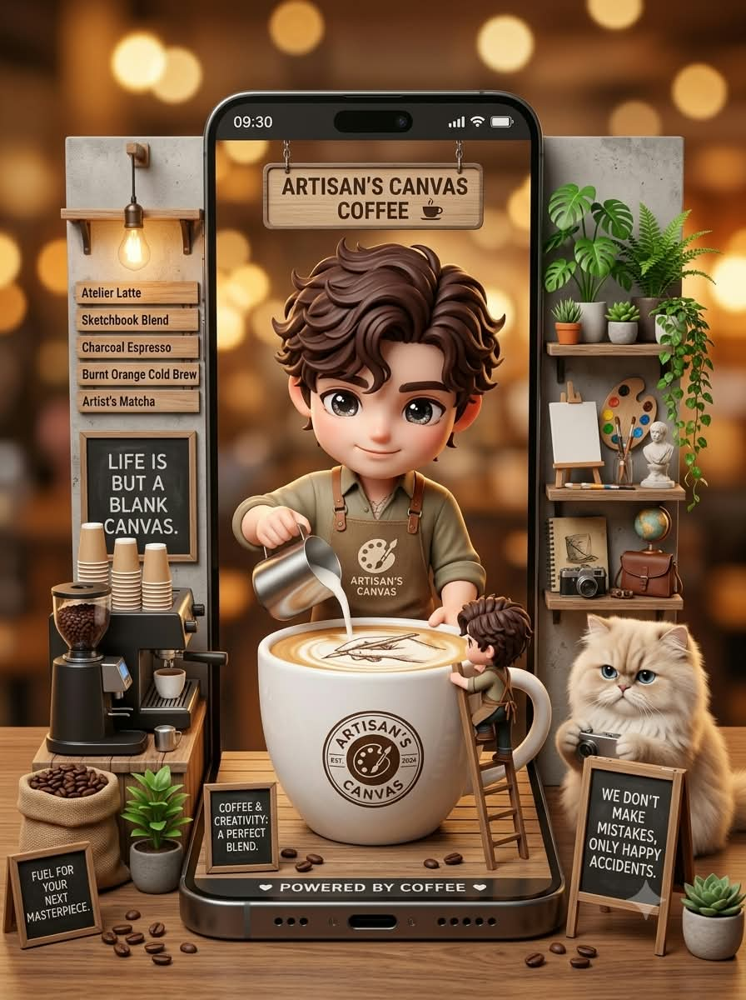
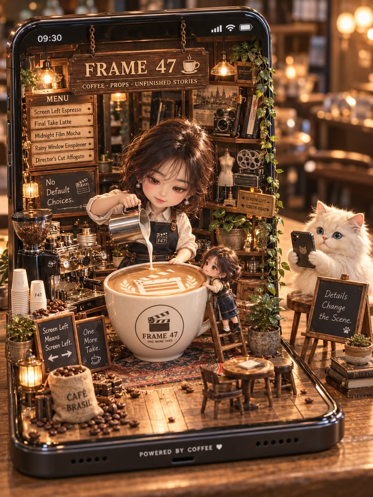

# 나의 커피숍 인테리어, 스마트폰 미니어처 커피숍 디오라마 프롬프트

## 1. 개요 및 아트 디렉팅 가이드

- **컨셉**: AI가 알고 있는 사용자의 직업·관심사·성향과 얼굴 사진의 인상을 종합해 '나만을 위한 커피숍'을 설계하고, 스마트폰이 무대가 된 미니어처 커피숍 디오라마를 3D 렌더로 그리는 2단계 프롬프트 (세로 3:4)
- **1단계 (커피숍 설계, 글만)**:
  - 사진으로는 성별과 안경 착용 여부만 판단하고, 흔한 콘셉트로 쏠리지 않게 분석 결과에 근거해 콘셉트를 결정
  - 표로 정리하는 항목: 카페 콘셉트와 이유, 가게 이름, 인테리어 스타일과 컬러 팔레트, 상징 미니어처 소품 5~7개, 시그니처 메뉴 5개, 칠판 문구 4개, 커피잔 로고 문구와 라떼아트 모양, 바리스타 캐릭터의 헤어·의상·앞치마, 화분 식물, 조명과 보케 색감
  - 마지막에 "이 설정으로 2단계를 진행할까요?"라고 확인
- **2단계 (디오라마 이미지 생성)**:
  - **얼굴 규칙**: 사진에서는 눈·코·입의 생김새만 가져오고 각도·시선·표정은 새로 그림. 안경은 사진에 있을 때만 유지하고, 귀엽고 호감 가게 살짝 미화
  - **전체 구도**: 나무 테이블 위 대형 스마트폰의 화면 부분은 세워져 뒷벽이 되고 하단부는 앞으로 펼쳐져 나무 바닥 무대가 되는 구조. 상단 상태표시줄(09:30)과 하단 베젤의 `POWERED BY COFFEE ♥`
  - **디오라마 내부**: 사슬로 매달린 나무 간판, 왼쪽 벽의 메뉴판과 칠판, 오른쪽 벽의 선반·화분·상징 소품, 왼쪽 하단의 에스프레소 머신과 종이컵 탑·원두 자루
  - **캐릭터**: 거대한 커피잔에 우유를 부어 라떼아트를 만드는 3D 치비 피규어 바리스타, 사다리를 타고 잔 가장자리를 잡은 똑같이 생긴 작은 미니미
  - **고양이**: 무대 바깥에서 앞발로 스마트폰을 들고 디오라마를 촬영하는 크림색 페르시안 고양이와 이젤 칠판
- **마무리**: 흩어진 커피 원두, 따뜻한 카페 실내의 강한 아웃포커스 조명, 미니어처 디오라마 사진 질감의 고퀄리티 3D 렌더, 철자 오류 없는 또렷한 글자

---

## 2. 프롬프트 전문

```text
[1단계: 나에게 어울리는 커피숍 설계]
이미지는 아직 생성하지 마. 텍스트로 설정만 정리해줘.

1. 분석
- 지금까지 네가 알고 있는 나에 대한 정보(직업, 관심사, 취미, 성향, 대화 습관 등)와 첨부한 얼굴 사진의 전체적인 인상(분위기, 이미지)을 종합해서 분석해줘.
- 사진으로는 성별과 안경 착용 여부만 판단해줘.
- 흔하거나 무난한 콘셉트로 쏠리지 말고, 분석 결과에 근거해 나만을 위한 콘셉트를 정해줘.

2. 아래 항목을 표로 정리해줘
- 카페 콘셉트 이름과 그렇게 정한 이유(2~3줄)
- 가게 이름(영어, 상단 나무 간판용)
- 인테리어 스타일, 주요 소재, 메인 컬러 팔레트 3~4색
- 벽 선반과 소품 구성(콘셉트를 상징하는 미니어처 소품 5~7개)
- 메뉴판에 들어갈 메뉴 5개(영어, 콘셉트에 맞는 시그니처 메뉴)
- 칠판 문구 4개(영어, 짧고 위트 있게, 나와 연결된 내용)
- 거대한 커피잔 로고 문구(영어)와 라떼아트 모양
- 바리스타 캐릭터의 헤어스타일·헤어 컬러, 상의, 앞치마 디자인과 앞치마 로고
- 화분 식물 종류
- 조명 분위기와 배경 보케 색감

마지막에 "이 설정으로 2단계를 진행할까요?"라고 물어봐줘.

[2단계: 스마트폰 미니어처 커피숍 디오라마 생성]
1단계에서 정한 설정을 그대로 반영해서 이미지 1장을 생성해줘. 세로 3:4 비율.

■ 얼굴 사용 규칙 (매우 중요)
- 첨부한 사진에서는 눈·코·입의 생김새만 가져온다.
- 얼굴형, 피부, 헤어, 이마, 헤어라인은 사진에서 가져오지 않는다.
- 사진 속 고개 기울기, 얼굴 방향, 시선은 절대 가져오지 않는다. 각도와 포즈는 아래 서술대로만 그린다.
- 표정은 사진을 따르지 않고, 은은하게 미소 지으며 커피에 집중하는 표정으로 새로 그린다.
- 사진에 안경이 있으면 같은 형태의 안경을 씌우고, 없으면 안경을 그리지 않는다.
- 성별은 사진으로 판단한 결과를 따른다.
- 이목구비 특징은 유지하되, 귀엽고 호감 가게 살짝 미화한다.

■ 전체 구도
- 나무 테이블 위에 놓인 대형 스마트폰이 미니어처 무대가 된다. 스마트폰 화면 부분은 세워져 디오라마의 뒷벽이 되고, 하단부는 앞으로 납작하게 펼쳐져 나무 바닥 무대가 된다.
- 화면 상단에 상태표시줄(왼쪽 09:30, 오른쪽 신호·와이파이·배터리 아이콘)이 보인다.
- 스마트폰 하단 베젤 중앙에 작은 흰 글씨 "POWERED BY COFFEE ♥", 양옆에 스피커 구멍.
- 정면에서 약간 내려다보는 시점, 디오라마 전체가 화면 안에 다 들어오게.

■ 디오라마 내부 (1단계 설정 반영)
- 상단 중앙: 사슬로 매달린 나무 간판에 1단계 가게 이름, 옆에 작은 커피잔 아이콘.
- 왼쪽 벽: 나무 선반, 백열전구 펜던트, 위아래로 쌓인 나무 메뉴판(제목 + 1단계 메뉴 5개), 그 아래 칠판 1개(1단계 칠판 문구 1).
- 오른쪽 벽: 선반과 1단계 화분 식물, 넝쿨 식물이 늘어짐, 1단계 상징 소품 배치.
- 왼쪽 하단: 원두 그라인더가 달린 에스프레소 머신, 종이컵 탑, 원두가 담긴 마대 자루, 작은 화분, 작은 칠판 2개(1단계 칠판 문구 2, 3).
- 인테리어 소재·컬러·조명은 1단계 설정대로 통일한다.

■ 캐릭터
- 메인 캐릭터: 3D 치비 피규어 스타일(큰 머리, 작은 몸, 크고 반짝이는 눈, 매끈한 비닐 질감). 무대 중앙 뒤쪽에 서서 스테인리스 스팀 피처로 거대한 커피잔에 우유를 부어 라떼아트를 만드는 중. 헤어·의상·앞치마는 1단계 설정대로.
- 거대한 커피잔: 무대 중앙, 흰색 머그, 측면에 1단계 로고 문구가 들어간 원형 로고, 표면에 1단계 라떼아트.
- 미니미: 메인 캐릭터와 똑같이 생긴 훨씬 작은 버전이 커피잔 오른쪽에 기댄 나무 사다리를 올라가며 잔 가장자리를 잡고 있다. 같은 헤어·의상·안경 여부.

■ 고양이
- 무대 오른쪽 바깥 테이블 위에 크림색 장모 페르시안 고양이가 앉아 앞발로 스마트폰을 들고 디오라마를 촬영하는 중. 동그란 파란 눈, 진지한 표정.
- 고양이 앞에 A자형 이젤 칠판(1단계 칠판 문구 4), 오른쪽 아래에 작은 다육 화분.

■ 주변과 마무리
- 테이블 위와 무대 바닥에 커피 원두가 흩어져 있다.
- 배경은 따뜻한 카페 실내, 1단계 보케 색감의 강한 아웃포커스 조명.
- 고퀄리티 3D 렌더, 미니어처 디오라마 사진 질감, 따뜻하고 아늑한 분위기, 섬세한 디테일.
- 모든 글자는 철자 오류 없이 또렷하게.
```

---

## 3. 결과물 비교 갤러리

| 생성 모델 | 생성 결과 이미지 |
| :--- | :--- |
| **제미나이 (Gemini)** |  |
| **ChatGPT (DALL-E 3)** |  |
