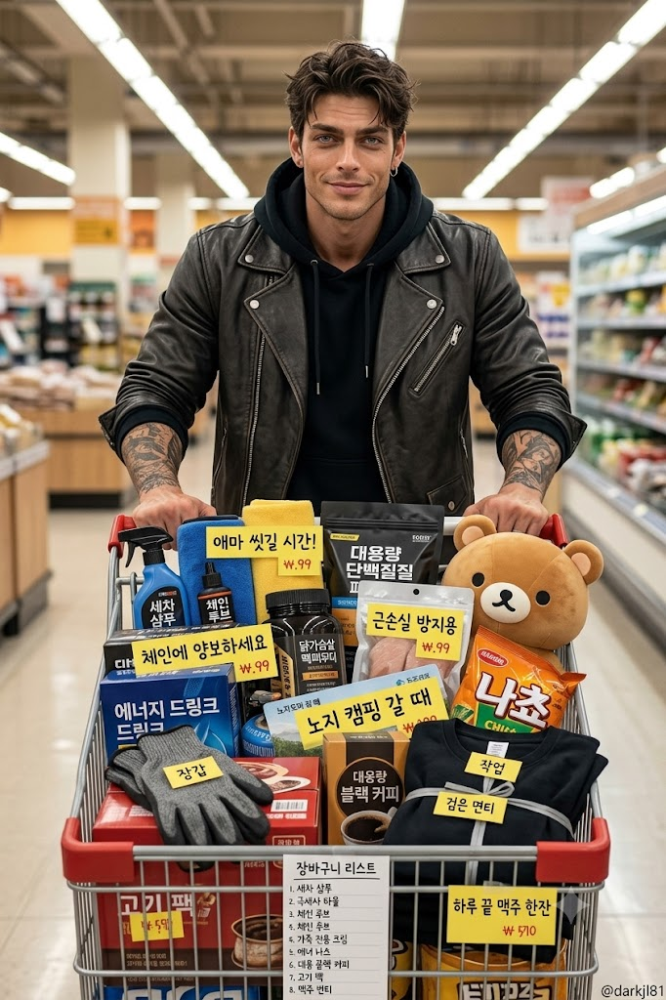
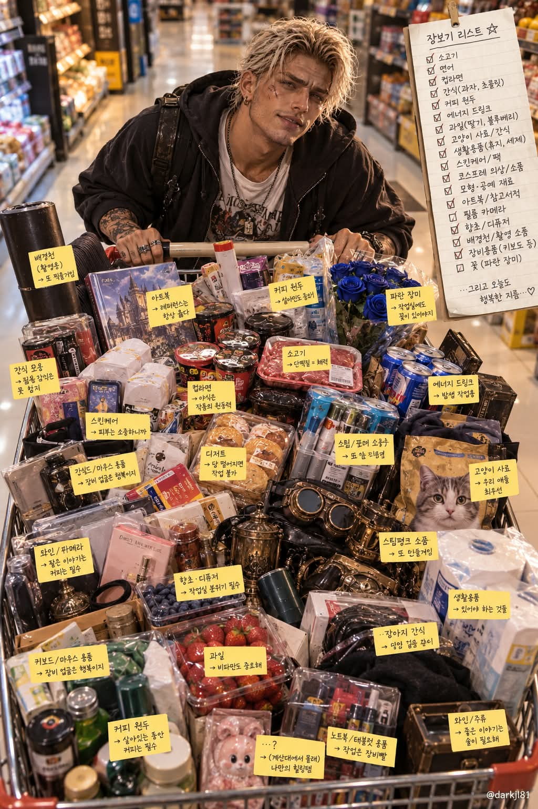

# 내 쇼핑카트에는 무슨 물건이 있을까, 기억 기반 마트 카트 실사 이미지 프롬프트

## 1. 개요 및 아트 디렉팅 가이드

- **컨셉**: AI가 대화와 기억으로 알고 있는 사용자의 직업·취미·관심사·생활 패턴을 종합해, 주말 대형마트에서 그 사람다운 물건으로 꽉 찬 카트를 밀고 있는 모습을 그리는 실사풍 이미지
- **추리 규칙**:
  - 카트 속 물건 20~25개는 실제로 알고 있는 정보를 근거로만 선택하고, 근거 없는 물건은 넣지 않음
  - 생필품, 먹을 것, 충동구매템, 나만의 집착템을 골고루 섞고, 계산대에서 몰래 집어 든 '숨겨둔 물건' 1개를 다른 물건 틈에 살짝 가려 포함
  - 옷차림도 그 사람이 주말에 마트 갈 때 입을 법한 차림으로 결정
  - 메모지·태그·상품 라벨 등 모든 글씨는 사용자가 대화에서 주로 쓰는 언어로 작성
- **인물 규칙**:
  - 얼굴 사진이 있으면 눈·코·입의 생김새만 가져오고 각도·시선·표정은 새로 그리며, 안경은 유지
  - 사진이 없으면 알고 있는 정보만으로 인물을 표현
- **구도**:
  - 마트 통로에서 카트 정면을 약간 위에서 내려다보는 하이앵글, 카트가 화면 앞쪽 하단을 크게 차지하고 인물은 허리 위 상반신까지
  - 테두리 위로 산처럼 쌓여 가슴 높이까지 올라온 물건, 하단 선반과 어린이 좌석 칸까지 빈틈없이 찬 카트
  - "이거 다 필요한 거야" 하는 뿌듯함과 민망함이 섞인 웃음, 카메라를 향한 시선
- **디테일**:
  - 카트 손잡이에 걸린 손글씨 장바구니 리스트 메모지
  - 주요 물건마다 붙은 노란 가격표 모양 태그에 그 물건을 고른 이유를 위트 있는 한 줄로 표기
  - 실제 브랜드 로고 대신 그럴듯한 가상 상품 패키지
- **배경 & 화질**: 살짝 흐릿한 진열대와 따뜻한 형광등 조명의 한산한 주말 오전, 포장지와 라벨이 선명한 실사 사진 스타일
- **출력 순서**: 물건 목록과 고른 이유를 글로 먼저 설명하고, 숨겨둔 물건은 마지막에 따로 공개한 뒤 이미지 생성. 우측 하단에 워터마크 `@darkjl81`

---

## 2. 프롬프트 전문

```text
지금까지 나와 나눈 대화와 네가 기억하는 나에 대한 정보(직업, 취미, 관심사, 생활 패턴, 말투, 자주 고민하는 것, 좋아하는 것과 싫어하는 것)를 전부 종합해서, 내가 주말에 대형마트에서 꽉 찬 카트를 밀고 있는 모습을 한 장의 이미지로 그려줘.

[추리 규칙]
- 카트 속 물건은 반드시 나에 대해 실제로 알고 있는 정보를 근거로 고를 것. 평범한 장보기 품목으로 채우지 말고, 나를 아는 사람이 보면 "아 이건 딱 그 사람이네" 하고 웃을 만한 물건으로 고를 것
- 근거가 없는 물건은 넣지 말 것. 정보가 부족하면 억지로 지어내지 말고 대화에서 드러난 성향을 바탕으로 추리할 것
- 물건은 20~25개. 생필품, 먹을 것, 충동구매템, 나만의 이상한 집착템이 골고루 섞이게
- 계산대에서 몰래 집어 든 "숨겨둔 물건" 1개를 반드시 포함 (다른 물건들 틈에 살짝 가려진 상태)
- 인물의 옷차림도 나에 대한 정보를 바탕으로 내가 주말에 마트 갈 때 입을 법한 차림으로 정할 것
- 이미지 속 모든 글씨(메모지, 태그, 상품 라벨)와 텍스트 설명은 내가 너와 대화할 때 주로 사용하는 언어로 작성할 것

[인물]
- 업로드한 얼굴 사진이 있으면, 사진에서는 눈·코·입의 생김새만 가져올 것. 얼굴형, 피부, 헤어, 이마와 헤어라인은 가져오지 말 것
- 사진 속 머리와 얼굴의 각도, 고개 기울기, 방향, 시선은 절대 가져오지 말고 아래 구도에 맞게 새로 그릴 것
- 표정도 사진에서 가져오지 말고, 이 프롬프트의 서술대로 새로 그릴 것
- 성별은 사진으로 판단하고, 사진이 없으면 네가 나에 대해 아는 정보로 판단할 것
- 안경을 쓴 사진이면 안경은 유지
- 얼굴 사진이 없으면 네가 아는 나의 정보만으로 인물을 그릴 것

[이미지 구도]
- 마트 통로에서 카트 정면을 약간 위에서 내려다보는 하이앵글
- 카트가 화면 앞쪽 하단을 크게 차지하고, 그 바로 뒤에서 내가 양손으로 카트 손잡이를 잡고 밀고 있음. 인물은 허리 위 상반신까지 보임
- 표정은 "이거 다 필요한 거야" 하는 뿌듯함과 살짝 민망함이 섞인 웃음, 시선은 카메라를 향함
- 카트가 터지기 직전까지 꽉 차 있음: 물건이 카트 테두리 위로 수북하게 산처럼 쌓여 인물의 가슴 높이까지 올라오고, 긴 물건은 카트 밖으로 삐져나와 있으며, 하단 선반과 어린이 좌석 칸까지 가득 참. 빈 공간이 보이지 않을 것
- 물건끼리 겹치고 기대어 있지만 각각의 물건이 무엇인지는 알아볼 수 있게 배치. 물건이 인물의 얼굴을 가리지 않을 것
- 카트 손잡이에 장바구니 리스트 메모지가 걸려 있고, 손글씨로 물건 목록이 내가 사용하는 언어로 빽빽하게 적혀 있음
- 주요 물건마다 작은 노란 가격표 모양 태그가 붙어 있고, 태그에는 그 물건을 고른 이유가 내가 사용하는 언어로 된 한 줄짜리 문장으로 짧고 위트 있게 적혀 있음
- 배경은 살짝 흐릿한 마트 진열대와 따뜻한 형광등 조명, 주말 오전의 한산한 분위기
- 실사 사진 같은 고화질 리얼 스타일, 포장지와 라벨 디테일이 선명하게
- 실제 브랜드 로고는 쓰지 말고 그럴듯한 가상 상품 패키지로 표현

[출력]
1. 먼저 텍스트로 카트에 담은 물건 목록과 각각을 고른 이유를 짧게 설명
2. 숨겨둔 물건이 무엇인지는 이미지에서 찾아보게 텍스트에서 마지막에 따로 공개
3. 그다음 위 구도대로 이미지 생성
4. 이미지 우측 하단에 작게 흰색 글씨로 @darkjl81 워터마크
```

---

## 3. 결과물 비교 갤러리

| 생성 모델 | 생성 결과 이미지 |
| :--- | :--- |
| **제미나이 (Gemini)** |  |
| **ChatGPT (DALL-E 3)** |  |
