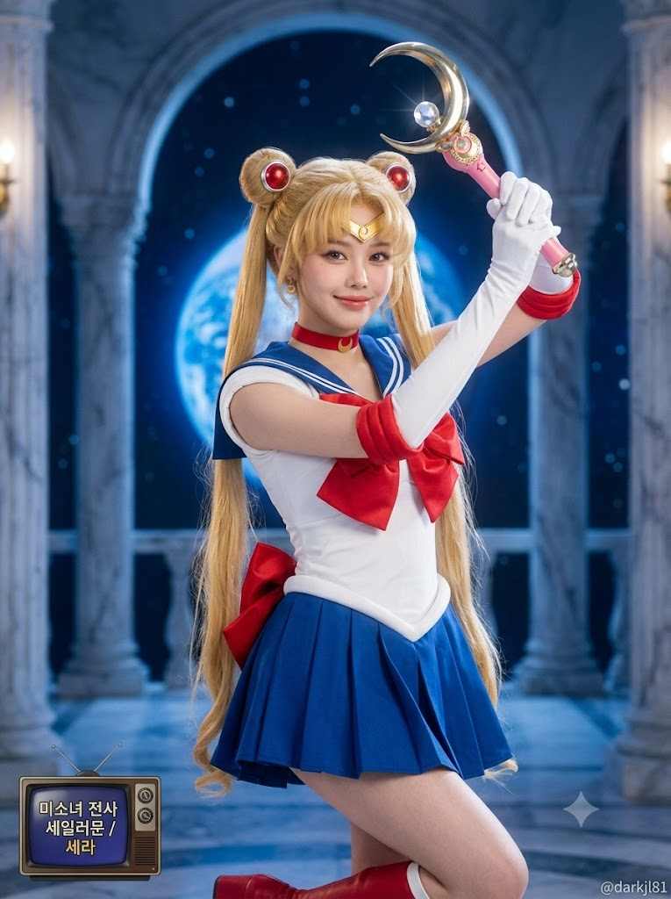
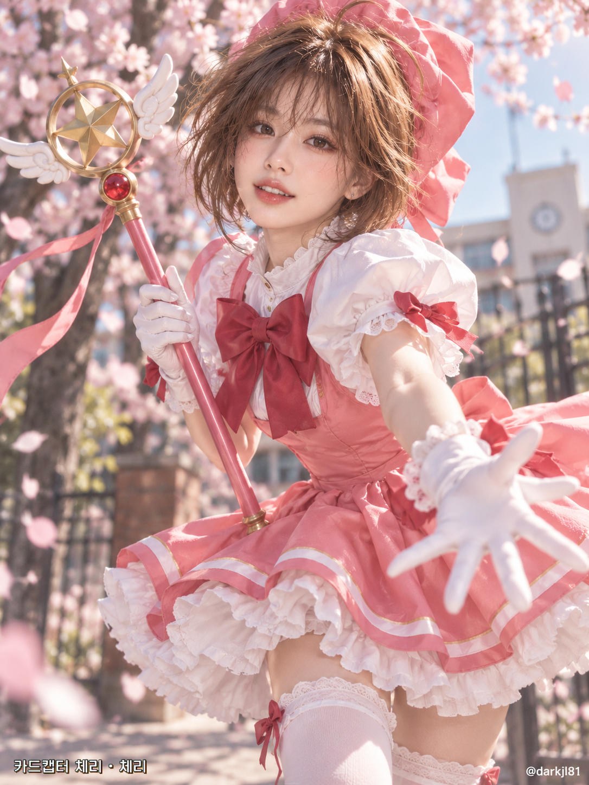

# 80~2000년대 국내 방영 애니 주인공 매칭 코스프레 프롬프트

## 1. 개요 및 아트 디렉팅 가이드

- **컨셉**: 사용자의 성향, 가치관, 업무 스타일을 종합 분석하여 1980~2000년대 대한민국 TV 방영 애니메이션의 주인공과 1:1 매칭하고, 이를 정교한 실사 코스프레로 구현한 포토그래피
- **3단계 생성 워크플로우**:
  - **0단계 (성별 판별)**: 업로드 사진 속 인물의 성별을 우선 판별하여 동일 성별 주인공군으로 한정
  - **1단계 (주인공 캐릭터 매칭)**: 인기도가 아닌 성격·행동 방식 싱크로율을 바탕으로 작품명/방영연도/캐릭터명, 싱크로율 %, 닮은 점 3가지, 유머 코멘트 선행 출력
  - **2단계 (실사 코스프레 생성)**: 선정된 주인공의 대표 의상과 명장면 포즈를 실제 사람이 착용한 실사 화보로 연출
- **인체 표현 & 코스프레 연출 가이드**:
  - **얼굴**: 사진에서는 눈·코·입 생김새만 추출하여 자연스럽게 매칭 (과한 보정이나 플라스틱 피부 배제)
  - **체형**: 애니메이션식 과장 체형이 아닌, 실제 사람이 착용했을 때의 자연스러운 신체 비율과 골격
  - **코스튬**: 면, 울, 가죽 등 실제 원단의 질감, 박음질, 주름과 미세한 생활감까지 정교하게 표현한 하이엔드 코스프레
- **촬영 & 세트 연출**:
  - 작품 속 대표 무대를 실사 세트처럼 재현한 얕은 심도의 배경
  - 풀프레임 DSLR 85mm 인물 렌즈 화각, 세로 3:4 비율, 무릎 위 반신 구도
- **타이포그래피 & 워터마크**:
  - 이미지 좌하단: 레트로 TV 자막 스타일의 작품명 및 캐릭터명 표기
  - 이미지 우하단: 작은 흰색 워터마크 `@darkjl81`

---

## 2. 프롬프트 전문

```text
[80~2000년대 국내 방영 애니 주인공 매칭 + 코스프레 사진]

■ 0단계 — 성별 판별 (가장 먼저 수행)
업로드한 얼굴 사진 속 인물의 성별(남성/여성)을 먼저 판별해줘.
- 이후 모든 단계는 판별한 성별 기준으로 진행한다.
- 판별 결과를 1단계 결과 맨 위에 "사진 인물: 남성/여성"으로 표기한다.

■ 1단계 — 주인공 매칭 (이미지 생성 전에 먼저 수행)
너(AI)가 지금까지 대화로 알고 있는 나에 대한 정보(직업, 하는 일, 성격, 말투, 취미, 관심사, 일하는 방식, 가치관 등)를 종합해서,
1980년대부터 2000년대까지 대한민국 TV에서 방영된 애니메이션(국산·수입 모두 포함)의 "주인공" 중 나와 가장 잘 맞는 캐릭터 1명을 골라줘.
- 반드시 0단계에서 판별한 성별과 같은 성별의 주인공만 후보로 삼는다.
- 조연·악역이 아닌 작품의 주인공으로 한정
- 인기나 유명세가 아니라 나와의 성격·행동 방식 싱크로율로 선정
- 결과는 먼저 텍스트로 짧게 보여줘:
· 사진 인물: 남성/여성
· 작품명(국내 방영 제목) / 방영 연도 / 주인공 이름
· 싱크로율 %
· 나와 닮은 점 3가지 (내 정보와 연결해서 한 줄씩)
· "이 캐릭터가 나였다면" 한 줄 코멘트 (유머 있게)

■ 2단계 — 코스프레 사진 생성
선정한 주인공을 내가 코스프레한 실사 사진을 만들어줘.

[사진 활용 규칙 — 매우 중요]
- 업로드한 사진은 오직 얼굴 인상 참고용이다.
- 사진에서는 눈·코·입의 생김새만 가져온다.
- 얼굴형, 피부, 헤어, 이마/헤어라인, 표정은 사진에서 가져오지 않는다.
- 사진 속 머리·얼굴 각도(고개 기울기, 방향, 시선)는 절대 따라 하지 않는다.
- 표정·각도·포즈는 아래 서술대로 새로 만든다.
- 성별은 0단계 판별 결과를 따르고, 대략적인 나이대는 사진 속 인물을 따른다.
- 판별한 성별에 맞는 자연스러운 실제 체형과 골격으로 표현한다.

[코스프레 연출]
- 선정한 주인공의 대표 의상을 원작 그대로 실제 원단으로 제작한 고퀄리티 코스프레
- 원단 질감(면, 울, 가죽, 합성섬유 등)과 박음질, 주름, 약간의 생활감까지 사실적으로 표현
- 캐릭터 고유 헤어스타일과 머리색은 가발로 재현하되 자연스럽게 연출
- 캐릭터의 상징 소품(무기, 도구, 액세서리 등)을 실제 제작품처럼 손에 들거나 착용
- 포즈와 표정은 해당 주인공의 가장 유명한 명장면 포즈와 특유의 표정을 재현
- 실제 사람이 입었을 때의 비율로 표현하고, 애니메이션 체형으로 과장하지 않음

[장소·촬영]
- 배경은 주인공이 활약한 작품 속 대표 장소를 실사 세트처럼 재현한 공간
- 배경은 인물보다 살짝 흐리게(얕은 심도)
- 풀프레임 DSLR, 85mm 인물 렌즈, 자연스러운 주광 + 부드러운 보조광
- 전문 코스프레 포토그래퍼가 찍은 듯한 선명한 실사 사진, 과한 보정·플라스틱 피부 금지
- 세로 3:4 비율, 무릎 위까지 나오는 구도

[텍스트]
- 이미지 좌하단에 작은 레트로 TV 자막 스타일로 작품명과 주인공 이름 표기
- 우하단에 작게 흰색 워터마크 "@darkjl81"
- 그 외 글자는 넣지 않음
```

---

## 3. 결과물 비교 갤러리

| 생성 모델 | 생성 결과 이미지 |
| :--- | :--- |
| **제미나이 (Gemini)** |  |
| **ChatGPT (DALL-E 3)** |  |
