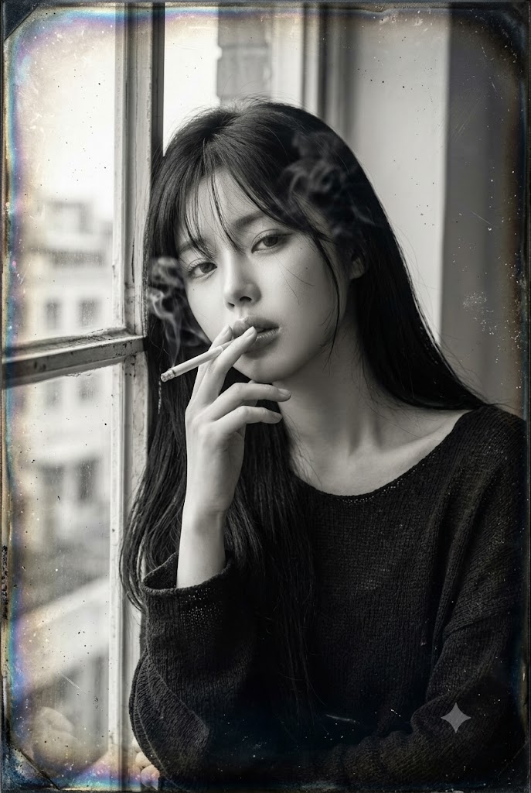
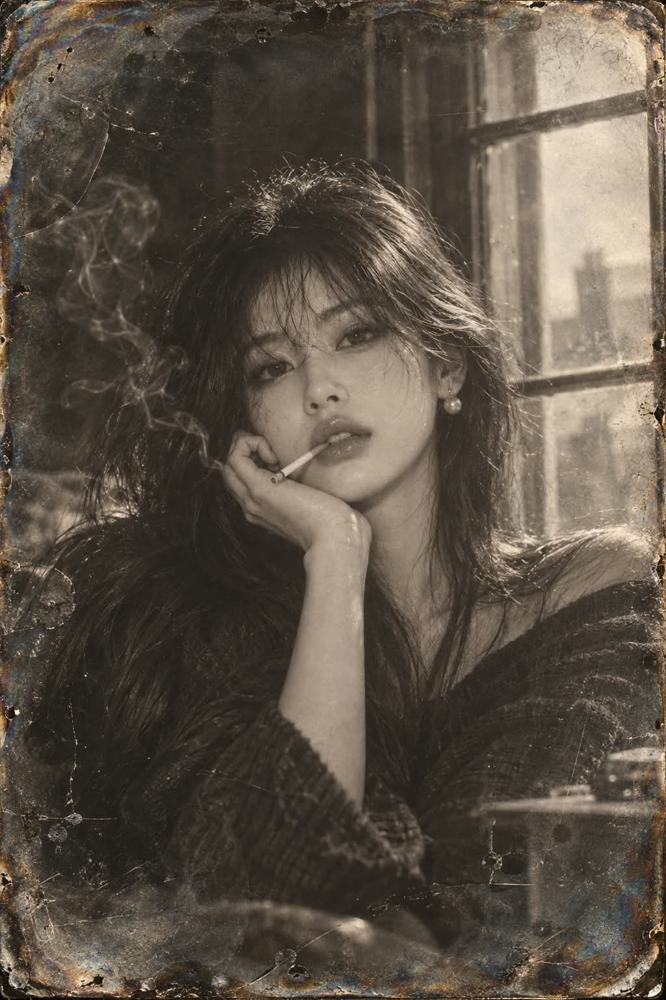

# 1850년대 다게레오타입(은판 사진) 초상화 프롬프트

## 1. 개요 및 아트 디렉팅 가이드

- **컨셉**: 1840~1850년대 광택 나는 은도금 동판 위에 맺힌 역사적인 다게레오타입(Daguerreotype) 모노크롬 인물 초상
- **성별 자동 판별 분기 (혼합 금지)**:
  - **남성 [장면 A]**: 세로 4:5 비율, 로우앵글, 낡은 패브릭 안락의자에 비스듬히 기대어 손가락 사이에 담배를 낀 채 권태롭고 여유로운 분위기 / 핀스트라이프 울 재킷과 풀어진 셔츠 칼라 / 머리 위 강한 단일광과 장노출로 희뿌옇게 번진 담배 연기
  - **여성 [장면 B]**: 세로 2:3 비율, 눈높이보다 살짝 높은 45도 앵글, 창가에 기대어 입술 끝에 가볍게 문 담배와 턱 아래 굽힌 손가락 / 흑발 롱 헤어와 루즈핏 니트 / 왼쪽 창에서 들어오는 부드러운 자연광과 얼굴 옆 실안개 같은 연기
- **얼굴 합성 및 정체성 보존 규칙**:
  - 원본의 얼굴형, 눈·코·입 모양 및 비율, 고유 인상 유지
  - 현대적 메이크업(아이라이너, 속눈썹 강조, 립 컬러) 배제, 19세기 인물 같은 깨끗한 맨얼굴
  - 매끄러운 콧대와 대칭 콧볼, 한쪽으로 떨어지는 부드러운 콧대 음영
  - 은판 톤과 장노출 흐림, 하이라이트 번짐을 얼굴에도 동일하게 적용하여 완벽한 화면 일체화 (스티커 합성감 금지)
- **다게레오타입 고유 질감 및 디테일**:
  - 컬러가 전혀 없는 은회색 모노크롬 (청회색과 갈회색의 미세한 조화), 거울 같은 금속 광택
  - 가장자리 쪽에만 나타나는 옅은 산화 번짐(Tarnish), 미세 스크래치 및 먼지 (눈·코·입 등 얼굴 중심부에는 손상 배치 금지)
  - 액자, 타원형 매트, 케이스, 테두리가 없는 풀블리드(Full-bleed) 화면 구성

---

## 2. 프롬프트 전문

```text
업로드한 얼굴 사진 속 인물을 1850년대 다게레오타입(은판 사진) 초상화로 생성해 주세요.

[1단계: 성별 자동 판별]
업로드한 얼굴 사진을 분석해 인물의 성별을 먼저 판별하세요.

남성이면 [장면 A]만 사용하세요.

여성이면 [장면 B]만 사용하세요.
두 장면을 섞지 말고, 판별된 장면 하나만 적용하세요.

[얼굴 합성: 공통, 최우선 규칙]
업로드한 얼굴 사진은 정체성(얼굴형, 눈·코·입 모양과 비율, 눈썹, 골격)을 추출하는 용도로만 사용하세요. 사진의 조명, 표정, 각도, 배경, 색상, 화질, 화장은 가져오지 마세요.

정체성과 미화: 업로드한 사진과 동일 인물로 명확히 알아볼 수 있어야 합니다. 그 안에서 자연스럽고 은은하게 미화하세요. 피부결을 정돈하고, 좌우 대칭을 살짝 보정하고, 이목구비를 또렷하게 다듬으세요. 다만 눈을 과하게 키우거나 턱을 뾰족하게 깎는 등 다른 사람처럼 보이게 만드는 변형은 금지합니다.

코: 원본 코의 형태를 기반으로 콧대는 곧고 매끄럽게, 코끝은 자연스럽게 둥글게 표현하세요. 콧볼은 좌우 대칭으로 정돈하세요. 콧구멍이 도드라지거나 검은 점처럼 보이면 안 되며, 콧대 음영은 광원 방향에 맞춰 한쪽으로만 부드럽게 떨어뜨리세요.

맨얼굴: 아이라이너, 속눈썹 강조, 컬러 립, 립 광택, 컨투어링 등 현대 메이크업을 배제하세요. 19세기 인물처럼 화장기 없는 깨끗한 맨얼굴로 표현하세요.

각도: 선택된 장면의 카메라 각도와 고개 기울기에 맞춰 얼굴의 원근을 새로 재구성하세요.

표정: 장면에 지정된 표정으로 바꾸되, 이목구비 특징은 유지하세요.

조명 일치: 얼굴에는 장면에 지정된 광원 방향의 빛만 받게 하세요. 정면 플랫 조명은 금지합니다. 반대편 뺨, 콧날 옆, 턱 아래에는 부드러운 그림자를 두세요.

질감 일치: 얼굴에도 배경과 같은 은판 톤, 부드러운 흐림, 하이라이트 과노출 번짐을 적용해 한 장의 사진처럼 보이게 하세요. 얼굴만 현대 사진처럼 날카롭거나 도드라지면 안 됩니다.

손상 제외 구역: 스크래치, 먼지 반점, 은 얼룩, 산화 번짐은 눈, 코, 입술, 눈썹 위에 절대 올리지 마세요. 얼굴 중앙은 깨끗하게 유지하고, 손상은 이마 가장자리, 머리카락, 옷, 배경, 화면 가장자리에만 두세요.

경계: 헤어라인, 목, 옷깃이 끊김 없이 이어지게 하세요. 연기와 머리카락이 얼굴 가장자리에 살짝 겹치게 해 합성감을 없애세요.

[장면 A: 남성, 안락의자 미디엄 클로즈업]

구도: 세로 4:5 비율, 허리 위부터 머리 위까지 담습니다. 인물은 중앙에서 약간 왼쪽에 두고, 가슴 높이에서 살짝 올려다보는 로우앵글로 잡습니다.

포즈: 낡은 패브릭 안락의자에 등을 깊게 기대 비스듬히 반쯤 누운 자세입니다. 오른손은 얼굴 옆 어깨 높이로 들어 올려 검지와 중지 사이에 가느다란 담배를 끼웁니다. 고개는 살짝 뒤로 젖혀 턱을 들고, 반쯤 감은 눈과 힘을 뺀 입술로 권태롭고 여유로운 표정을 짓습니다. 왼팔은 팔걸이에 느슨하게 걸칩니다.

의상: 짙은 핀스트라이프 울 재킷에 밝은 셔츠를 입고, 단추를 두세 개 풀어 칼라를 벌립니다. 넥타이는 매지 않습니다.

헤어: 볼륨 있는 웨이브 컷이며, 앞머리 몇 가닥이 이마로 흘러내립니다.

배경·소품: 어두운 방입니다. 오른쪽 뒤에 원통형 갓을 씌운 테이블 램프가 있고, 사이드 테이블에는 크리스털 로우볼 잔이 놓여 있습니다.

빛: 머리 위 앞쪽에서 강한 단일광이 떨어집니다. 이마와 광대는 밝고, 눈 아래와 턱 밑, 몸 아래로 갈수록 깊이 어두워집니다. 담배 연기는 장노출로 번진 희뿌연 안개처럼 머리 위에 떠 있습니다.

[장면 B: 여성, 창가 클로즈업]

구도: 세로 2:3 비율, 가슴 위부터 머리 위까지 담습니다. 얼굴은 중앙에서 약간 왼쪽에 두고, 눈높이보다 살짝 높은 45도 각도로 잡습니다.

포즈: 창가에 몸을 살짝 기댑니다. 가느다란 담배를 입술 왼쪽 끝에 가볍게 물어 대각선 아래로 향하게 하고, 오른손은 턱 아래에서 손가락을 부드럽게 구부립니다. 고개를 살짝 기울이고 입술을 살짝 벌린 채, 무표정하게 카메라를 응시하는 나른하고 도도한 분위기입니다.

헤어: 가슴 아래까지 오는 긴 스트레이트 흑발입니다. 앞머리가 눈썹을 살짝 덮고, 몇 가닥이 얼굴과 뺨에 흩어져 걸칩니다.

의상: 목선이 넉넉한 어두운 루즈핏 니트 상의입니다.

배경: 왼쪽 뒤에 오래된 격자 창틀이 있고, 뿌연 유리창 너머로 건물 윤곽이 흐릿하게 보입니다.

빛: 왼쪽 창에서 넓고 부드러운 자연광이 들어옵니다. 얼굴 왼쪽은 은빛으로 밝고, 오른쪽 뺨과 콧날 옆, 턱 아래에는 부드러운 그림자가 집니다. 담배 연기는 장노출로 번진 희미한 실안개처럼 얼굴 옆에 떠 있습니다.

[다게레오타입 스타일: 공통]

매체: 광택 나는 은도금 동판 위에 맺힌 1840~1850년대 은판 사진입니다. 컬러가 전혀 없는 은회색 모노크롬이며, 미세하게 차가운 청회색과 따뜻한 갈회색이 섞여 있습니다.

질감: 거울처럼 반사되는 금속 표면입니다. 하이라이트는 은빛으로 번쩍이고 암부는 깊은 흑연색이며, 은판 특유의 부드러운 광채가 있습니다.

장노출 흔적: 담배를 든 손끝과 연기는 약간 흐립니다. 화면 가장자리는 초점이 무르고, 중앙의 얼굴은 부드럽게 또렷합니다.

경년 변화: 이미지 가장자리를 따라 무지갯빛 청색·자주·황금색의 옅은 산화 번짐(tarnish)이 있습니다. 배경, 옷, 머리카락, 가장자리에 미세한 스크래치, 먼지 반점, 은 얼룩이 있고, 모서리로 갈수록 비네팅이 진해집니다. 얼굴 중앙은 제외합니다.

화면 구성: 이미지가 캔버스 전체를 가장자리까지 채우는 풀블리드입니다. 액자, 황동 매트, 타원형 창, 가죽 케이스, 테두리, 여백은 절대 넣지 마세요.

전체 인상: 19세기 은판 사진의 판 표면을 고해상도로 스캔한 듯한 사실감입니다. 컬러와 현대 디지털 필터 느낌은 넣지 마세요.

[금지]
두 장면 혼합 / 액자·매트·케이스·테두리·여백 / 컬러 출력 / 눈·코·입 위의 스크래치·반점·얼룩 / 비뚤어지거나 꺾인 콧대, 검은 점처럼 보이는 콧구멍, 비대칭 콧볼 / 얼굴만 떠 보이는 스티커 합성감 / 정면 플랫 조명 / 다른 사람처럼 보일 정도의 과도한 성형 미화, 인형 같은 큰 눈 / 아이라이너 등 현대 메이크업 / 원본 사진의 조명·배경 잔재
```

---

## 3. 결과물 비교 갤러리

| 생성 모델 | 생성 결과 이미지 |
| :--- | :--- |
| **제미나이 (Gemini)** |  |
| **ChatGPT (DALL-E 3)** |  |
