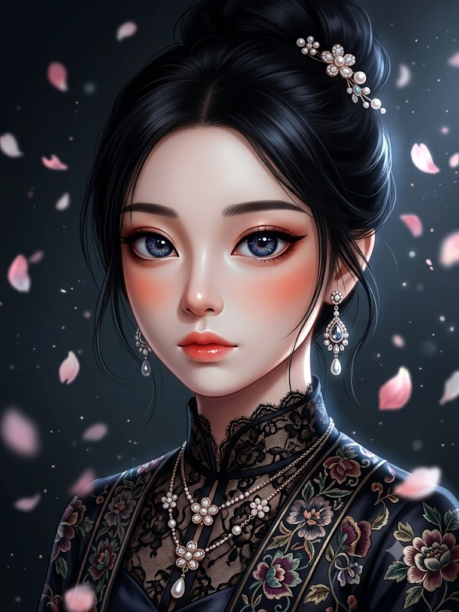
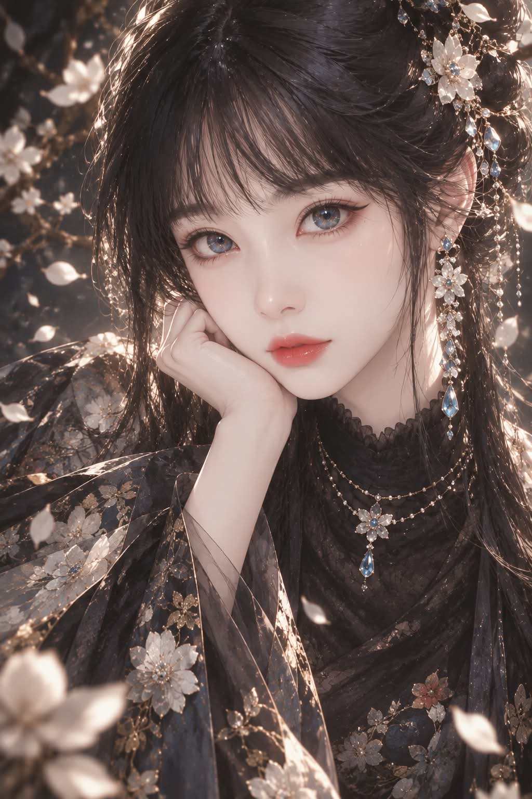

# 미드저니풍 반실사 디지털 일러스트 '달빛 아래의 동양 여인' 프롬프트

## 1. 개요 및 아트 디렉팅 가이드
- **콘셉트 테마**: 업로드 사진에서 인물 고유의 핵심 특징(키워드)만 내부 추출하여 반영하고, 미드저니(Midjourney) 특유의 신비롭고 고혹적인 반실사 디지털 페인팅으로 재해석한 고전 오리엔탈 여성 초상화
- **핵심 아트 디렉팅 & 조형 원리**:
  - **내부 특징 키워드 추출 & 인형 같은 정제 비율 (Feature Keywords & Doll Proportion)**:
    - 사진을 그대로 리터칭하지 않고, 눈매·콧대·입술선 등 '그 사람만의 차별화 특징 3~5가지'만 키워드로 도출하여 반영.
    - 실제 사진의 골격 비율에 구속되지 않고 정제된 인형 같은 일러스트 비율로 과장 및 미화.
  - **신비로운 벽안(Mystical Deep Blue) & 도자기 피부**:
    - 크고 깊은 아몬드형 눈매, 몽환적으로 빛나는 딥블루(벽안) 홍채, 또렷한 윙 아이라이너와 은은한 치크 블러셔.
    - 사실적인 모공을 배제한 매끈한 도자기 질감의 피부톤과 작고 윤기 나는 코랄빛 글로시 립.
  - **오리엔탈 퓨전 하이패션 스타일링 (Oriental High Fashion Styling)**:
    - 윤기 나는 흑발의 하이 업스타일 번과 자연스럽게 흘러내린 잔머리, 보석·플라워 헤어핀 장식.
    - 화려한 보석 드롭 귀걸이와 꽃 펜던트 레이어드 네크리스, 블랙 레이스/실크 하이넥 위에 동양풍 플로럴 자수를 겹쳐 입은 의상.
  - **달빛 아래의 몽환적 배경 & 순수 단일 초상화 출력**:
    - 어두운 밤하늘 톤 위에 은은하게 흩날리는 꽃잎과 반짝이는 빛 입자, 시네마틱 조명 연출.
    - 텍스트, 설명, 인포그래픽, 분할 컷 없이 화면 전체를 오직 완성된 단 한 장의 초상화로만 꽉 채워 출력.

---

## 2. 프롬프트 전문 (코드 블록)

```text
업로드한 사진을 그대로 편집하지 말고, 아래 순서로 내부적으로만 작업해줘. 절대 과정을 이미지로 보여주지 말고, 최종 결과 이미지 한 장만 출력해.

1단계(내부 처리, 화면에 표시 금지): 사진 속 인물에서 다른 사람과 구별되는 핵심 특징만 3~5가지 뽑아. 전체 얼굴 비율이나 사진 그대로의 형태는 무시하고, 눈매 모양(처진눈/올라간눈 등), 콧대 라인, 입술 형태, 눈썹 모양, 점 등 "이 사람만의 특징"만 키워드로 정리해.

2단계(내부 처리, 화면에 표시 금지): 그 특징 키워드만 참고해서, 사진의 비율이나 형태에 구속되지 말고 완전히 새로운 반실사 디지털 페인팅 일러스트를 그려.

화풍: 미드저니풍 반실사 디지털 일러스트.

눈: 과장되게 크고 아몬드 모양, 눈동자 색은 신비한 벽안(mystical deep blue), 정교하고 반짝이는 눈동자 묘사, 진한 윙 아이라이너와 은은한 볼터치

피부: 매끈한 도자기 질감, 사실적인 모공/텍스처 없음

입술: 작고 코랄빛 글로시 톤

코: 오뚝하고 갸름한 라인

얼굴 비율: 인형처럼 정제된 일러스트 비율로 과장, 사진의 실제 비율은 무시

헤어: 윤기나는 흑발, 잔머리가 흘러내리는 하이 업스타일 번, 장신구(꽃/보석 헤어핀)
장신구: 화려한 보석 드롭 귀걸이, 꽃 펜던트 레이어드 목걸이
의상: 블랙 레이스/실크 하이넥에 동양풍 플로럴 자수 소재를 겹쳐 입은 형태
배경: 어두운 톤에 흩날리는 꽃잎과 은은한 빛 입자, 시네마틱 조명

★★★ 출력 규칙 (가장 중요) ★★★

최종 이미지는 딱 한 장, 완성된 일러스트 초상화만 출력해.

원본 사진, 1단계/2단계 라벨, 특징 크롭 이미지, 텍스트 설명, 콜라주/인포그래픽 형태는 절대 포함하지 마.

어떤 텍스트나 캡션도 이미지 안에 넣지 마.

전체 화면을 인물 초상화 하나로만 채워줘.
```

---

## 3. 결과물 비교 갤러리

| 생성 모델 | 결과 이미지 |
| :--- | :--- |
| **Google Gemini** |  |
| **OpenAI GPT** |  |
