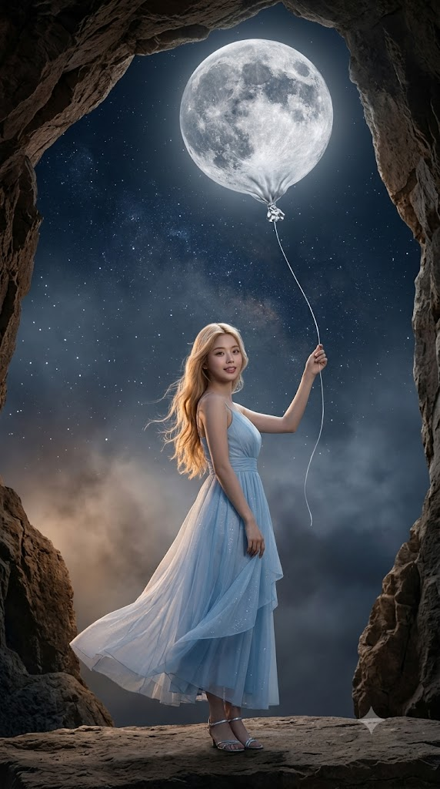
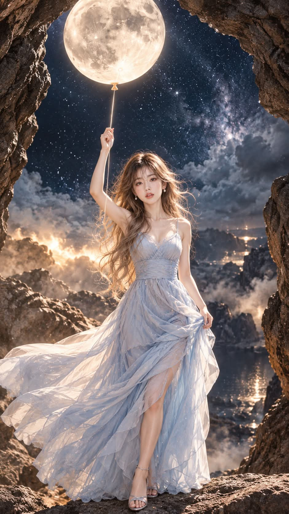

# 달 풍선을 든 밤, 동굴 입구 초현실 판타지 합성 사진 프롬프트

## 1. 개요 및 아트 디렉팅 가이드

- **컨셉**: 바위 동굴 입구에 서서, 풍선이 된 보름달을 한 가닥 실로 쥐고 있는 인물을 담은 초현실 판타지 합성 사진 (세로 9:16, 시네마틱 실사 톤)
- **얼굴 규칙 (기본 보정만, 미화 금지)**:
  - 사진 속 인물과 한눈에 같은 사람으로 알아보이는 것이 최우선
  - 눈·코·입의 생김새와 눈 사이 간격, 인중 길이까지 사진과 똑같이 유지하고, 사진관 기본 보정 수준의 피부 톤 정리만 허용
  - 눈 키우기, V라인, 아이돌·인형풍 변형, 진한 메이크업과 컬러렌즈는 금지. 모공과 결이 살아 있는 실제 피부로 표현
  - 사진으로는 성별과 나이대만 판단하고, 각도·시선·표정은 새로 그림
- **화면 & 구도**:
  - 거친 갈색·회갈색 암석이 둥근 아치처럼 화면을 감싸는 동굴 안쪽 시점
  - 동굴 너머로 별이 촘촘한 검푸른 밤하늘과 옅은 성운, 은회색 안개구름
  - 화면 상단 중앙에 크레이터가 선명한 실제 달 표면 질감의 달 풍선, 아래쪽의 작은 은색 매듭 꼭지
  - 평평한 바위 턱 위에 선 무릎 위 미디엄 풀샷, 눈높이 정면에서 아주 살짝 올려다보는 카메라
- **풍선 줄 (매우 중요)**:
  - 화면 전체에 줄은 단 한 가닥. 풍선 꼭지에서 시작해 끊김 없이 머리 위로 든 손 안으로 이어짐
  - 늘어진 리본이나 두 번째 줄, 풍선을 비껴가거나 화면 밖으로 사라지는 줄은 금지
- **포즈 & 표정**:
  - 거의 정면으로 선 자세, 오른팔을 머리 옆 바깥쪽으로 올려 줄을 손끝으로 가볍게 쥠
  - 완전한 정면 얼굴과 카메라를 향한 시선, 달을 손에 넣은 듯한 설렘이 담긴 자연스러운 미소
- **헤어 & 의상**:
  - **여성**: 허리까지 내려오는 연한 골드 블론드 롱 웨이브, 바람에 흩날리는 파스텔 하늘색 시폰 롱드레스와 은색 스트랩 샌들
  - **남성**: 이마가 드러나게 넘긴 연갈색 미디엄 헤어, 파스텔 하늘색 실크 셔츠와 짙은 남색 슬랙스, 갈색 가죽 로퍼
- **조명 & 색감**:
  - 달 풍선에서 내려오는 은백색 달빛이 정면 얼굴을 그림자 없이 고르게 밝힘
  - 뒤편 안개에서 번지는 따뜻한 호박색 림라이트, 깊은 남색과 은색 위주에 암석의 갈색과 의상의 하늘색이 포인트
- **품질**: 영화 스틸컷 같은 실사 질감, 텍스트와 워터마크 없음

---

## 2. 프롬프트 전문

```text
[이미지 생성 프롬프트 – 달 풍선을 든 성인 / 얼굴 합성용]

업로드한 사진은 얼굴 참고용으로만 사용한다. 사진에서는 눈·코·입의 생김새만 가져온다. 얼굴형, 피부, 헤어, 이마와 헤어라인은 가져오지 않는다. 사진 속 머리 각도, 고개 기울기, 얼굴 방향, 시선, 표정도 절대 가져오지 않는다. 각도와 표정은 아래 서술대로 새로 그린다. 사진으로는 성별과 나이대만 판단해 버전을 정하고, 인물은 성인으로 그린다. 그 외의 구도, 배경, 조명, 헤어, 의상은 아래 서술에서 전혀 바꾸지 않는다.

■ 얼굴 (기본 보정만, 미화 금지)

최우선은 사진 속 인물과 한눈에 같은 사람으로 알아보이는 것이다.

다음 생김새는 사진과 똑같이 유지한다: 눈의 크기와 모양, 쌍꺼풀 유무와 형태, 눈꼬리 방향, 눈 사이 간격, 콧대와 코끝·콧볼 모양, 입술 두께와 입 모양, 인중 길이.

보정은 사진관 기본 보정 수준으로만 한다: 피부 톤 정리, 가벼운 잡티 정리, 자연스러운 선명도.

눈 키우기, 코 높이기, 입술 키우기, V라인 만들기, 아이돌·인형·애니메이션풍 얼굴 변형은 금지한다.

진한 메이크업, 컬러렌즈, 과한 블러셔, 광택 피부 표현도 금지한다. 맨얼굴에 가까운 내추럴 메이크업만 허용한다.

피부는 모공과 결이 살아 있는 실제 사람의 피부로 표현한다.

체형은 자연스러운 보통 성인 체형이다.

■ 화면 / 구도

세로 9:16 비율의 초현실 판타지 합성 사진이고, 시네마틱 실사 톤이다.

시점은 거대한 바위 동굴 입구 안쪽이다. 거칠고 결이 깊은 갈색·회갈색 암석이 화면 좌상단, 좌하단, 우측을 둥근 아치처럼 감싸 액자 프레임이 된다.

동굴 너머로 별이 촘촘한 검푸른 밤하늘이 보인다. 옅은 성운과 은회색 안개구름이 오른쪽 중간에 흐른다.

화면 상단 중앙에는 보름달이 풍선이 되어 떠 있다. 크레이터와 바다 무늬가 선명한 실제 달 표면 질감이다. 아래쪽은 풍선처럼 살짝 오므라들고, 작은 은색 매듭 꼭지가 달려 있다.

인물은 화면 하단 1/3 지점의 평평한 바위 턱 위에 서 있다. 무릎 위까지 보이는 미디엄 풀샷이며, 인물이 화면 세로의 약 45%를 차지할 만큼 크게 배치한다.

카메라는 인물의 눈높이와 거의 같은 높이에서 정면으로 촬영하고, 아주 살짝 올려다본다. 인물과 달 풍선이 한 화면에 모두 담긴다.

■ 풍선 줄 (매우 중요)

줄은 화면 전체에 단 한 가닥만 존재한다.

그 한 가닥은 달 풍선 아래 은색 매듭 꼭지에서 시작해 끊김 없이 이어져, 인물이 머리 위로 든 손 안으로 들어간다.

줄의 시작점은 반드시 풍선 꼭지이고 끝점은 반드시 인물의 손이다. 두 점 사이가 하나의 연속된 선으로 연결되어야 한다.

달 풍선은 인물이 든 손의 바로 위쪽에 있어서, 줄이 거의 수직으로 살짝 휘며 내려온다.

꼭지에 따로 늘어진 리본, 매듭 끝의 남는 꼬리, 두 번째 줄은 그리지 않는다.

손에서 위로 뻗은 줄이 풍선을 비껴가거나, 하늘이나 화면 밖으로 사라지는 것은 금지한다.

줄은 얇은 흰색 실이며, 달빛을 받아 은은하게 빛난다.

■ 인물 포즈 / 얼굴 각도 (사진과 무관하게 이대로)

몸은 관객을 향해 거의 정면으로 서 있고, 한쪽 어깨만 아주 살짝 비튼다.

오른팔을 머리 위로 뻗어 달 풍선 꼭지에서 내려온 줄을 손끝으로 가볍게 쥔다. 손은 풍선 바로 아래에 오고, 팔이 얼굴을 가리지 않게 머리 옆 바깥쪽으로 올린다.

왼손은 치맛자락 또는 옆선에 자연스럽게 둔다.

얼굴은 완전한 정면이며, 좌우 대칭이 보이도록 카메라를 똑바로 향한다.

턱은 아주 살짝만 들어 달빛이 얼굴 전체에 고르게 닿게 한다.

눈·코·입이 모두 또렷하게 보여야 한다. 얼굴이 머리카락, 팔, 줄, 그림자에 가려지면 안 된다.

시선은 카메라(관객)를 정면으로 바라본다.

■ 표정

달을 손에 넣은 듯한 설렘이 담긴 표정이다. 입꼬리가 살짝 올라간 편안하고 자연스러운 미소로 관객을 바라본다.

위쪽 달빛이 두 눈동자에 작은 하이라이트로 맺힌다.

■ 헤어

여성: 허리까지 내려오는 연한 골드 블론드 롱 웨이브다. 끝이 바람에 흩날리고, 얼굴 양옆 선이 드러나도록 한쪽을 귀 뒤로 넘긴다. 앞머리는 이마를 가리지 않는다.

남성: 이마가 시원하게 드러나도록 부드럽게 넘긴 연갈색 미디엄 헤어로, 자연스러운 볼륨이 있다.

■ 의상

여성: 발목까지 내려오는 파스텔 하늘색 시폰 롱드레스다. 가는 끈 어깨에 허리선이 잘록하게 잡혀 있다. 여러 겹의 얇은 치맛자락이 바람에 길게 흩날리고, 원단에 은빛 미세한 반짝임이 있다. 발에는 은색 스트랩 샌들을 신는다.

남성: 파스텔 하늘색 실크 셔츠의 단추를 두 개 풀고 소매를 반쯤 걷는다. 짙은 남색 슬림 슬랙스와 짙은 갈색 가죽 로퍼를 신는다.

■ 조명 / 색감

주광은 위쪽 달 풍선에서 내려오는 차갑고 은은한 은백색 달빛이다. 정면을 향한 얼굴 전체를 그림자 없이 부드럽고 고르게 밝힌다.

얼굴은 화면에서 가장 선명한 초점 영역이며, 실제 사진 같은 자연스러운 피부 질감이 보인다.

인물 뒤편 왼쪽 아래 안개에서 따뜻한 호박색 빛이 번져 머리카락과 어깨, 드레스 끝자락에 은은한 림라이트를 만든다.

전체 톤은 깊은 남색과 은색 위주이고, 암석의 따뜻한 갈색과 의상의 하늘색이 포인트다.

배경 암석과 하늘은 약간의 피사계 심도로 부드럽게 처리하고, 인물 얼굴에 핀을 맞춘다.

■ 품질
초고해상도, 사실적인 피부와 머리카락 디테일, 영화 스틸컷 같은 실사 질감. 얼굴 왜곡이나 흐림, 손가락 이상, 줄 끊김이나 중복이 없어야 한다. 텍스트와 워터마크는 넣지 않는다.
```

---

## 3. 결과물 비교 갤러리

| 생성 모델 | 생성 결과 이미지 |
| :--- | :--- |
| **제미나이 (Gemini)** |  |
| **ChatGPT (DALL-E 3)** |  |
