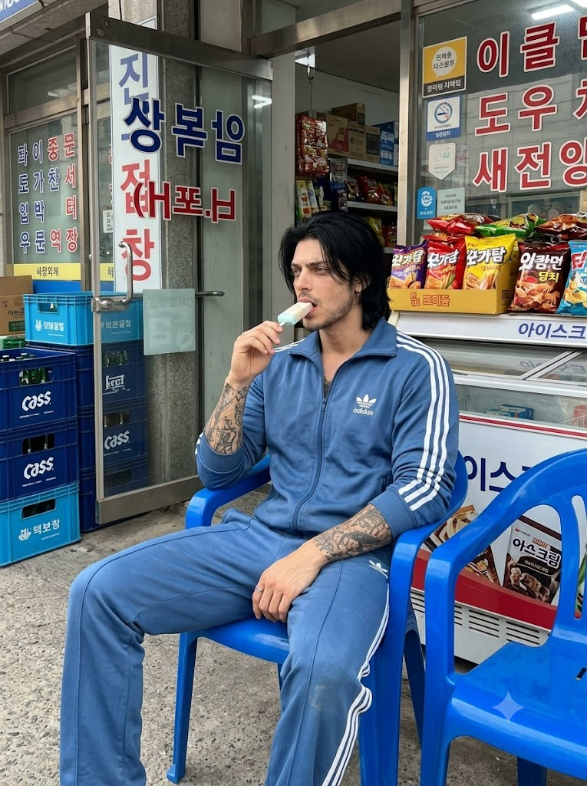
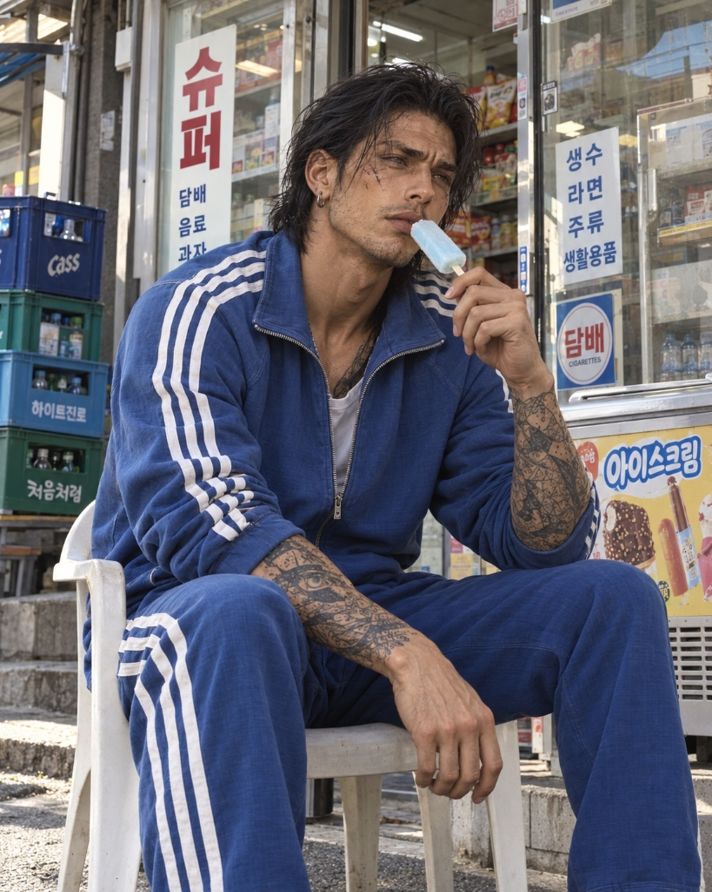

# 동네 골목 슈퍼 앞 일상 (빈티지 트레이닝복) 프롬프트

## 1. 개요 및 콘셉트 설명
- **콘셉트 테마**: '동네 백수'의 여유롭고 나른한 일상 스케치 (정겨운 한국 골목 감성)
- **상황 및 연출**: 
  주택가 골목길 작은 동네 슈퍼 앞 플라스틱 의자에 편안하게 걸터앉아, 멍하니 먼 곳을 응시하며 아이스바를 베어 물고 있는 자연스러운 일상의 찰나입니다. 연출된 포즈가 아닌 지나가다 우연히 찍힌 듯한 캔디드 스냅샷 분위기를 지향합니다.
- **핵심 디테일**:
  - **의상 (핵심)**: 90년대 말~2000년대 초 레트로 감성의 파란색 삼선 트레이닝복 셋업.
    - *질감*: 때가 타거나 찢어진 것이 아니라, **수년간의 일상 착용과 반복된 세탁으로 자연스럽게 채도가 빠진 '깨끗하지만 부드럽게 바랜 빈티지 블루'**.
    - *핏*: 스키니나 조거 형태가 아닌, 다리 라인을 편안하게 감싸며 툭 떨어지는 클래식 스트레이트 핏.
  - **헤어 & 수염**: 귀를 덮고 어깨선까지 닿는 헝클어진 단발머리. 며칠 감지 않아 살짝 숨이 죽은 내추럴한 결감과 손질하지 않아 듬성듬성 자란 턱수염·콧수염.
  - **인물 인상**: 노숙자나 궁핍한 느낌이 아닌, 그저 동네에서 꾸미지 않고 늘어지게 휴식을 취하는 자연스럽고 매력적인 생활감.
  - **배경 공간**: 아이스크림 냉동고, 주류/음료 박스, 과자 매대, 유리문 한글 스티커 등 사람 냄새 나는 전형적인 동네 슈퍼 앞마당.
  - **촬영 스타일**: 과도한 시네마틱 조명이나 보정을 뺀, 한낮 자연광 아래 스마트폰/미러리스로 담아낸 담백한 다큐멘터리 스냅 사진.

---

## 2. 프롬프트 전문 (코드 블록)

```text
Sure. Here is a polished English image-generation prompt that emphasizes that the tracksuit is clean but faded from age and repeated washing—not dirty or homeless-looking.

> [Face Reference / Identity]

Use the uploaded face photo as the only identity reference for the character.

Preserve the original person’s recognizable facial identity: face shape, bone structure, eye shape and spacing, nose shape and size, lips, jawline, skin tone, apparent age, and overall facial proportions.

The final image should clearly look like the same person. Do not beautify, reconstruct, or significantly alter the face. Keep realistic pores, subtle skin texture, and natural imperfections.

[Scene]

Create a photorealistic everyday scene in front of a small, slightly old-fashioned Korean neighborhood grocery store (dongne super) located in a residential alley.

The man is casually sitting on a simple plastic chair outside the store, comfortably relaxed, eating an ice pop. He is not posing for the camera. He looks slightly absent-minded, quietly gazing somewhere into the distance while enjoying the ice pop.

Behind him are ordinary details of a Korean neighborhood grocery store: glass entrance doors, snack shelves, bottled drinks, an outdoor ice-cream freezer, beverage crates, and simple Korean signs. The environment should feel lived-in and ordinary, but reasonably clean and maintained.

[Tracksuit — VERY IMPORTANT]

He is wearing a matching vintage blue Adidas-style tracksuit, both jacket and pants, similar to a classic Korean tracksuit from the late 1990s or early 2000s.

The jacket is a full-zip track jacket with a stand collar and the classic three white stripes running down both sleeves.

The matching blue track pants have three white stripes running vertically down the outer sides of both legs.

The pants must NOT be skinny, tapered, or tight-fitting.

His actual legs are relatively slim, but the pants themselves have a comfortable straight-leg classic tracksuit fit, with moderate room around the thighs, knees, and calves. The fabric hangs naturally instead of clinging to the shape of his legs.

The tracksuit is CLEAN. It is not dirty, stained, dusty, damaged, or neglected.

The blue fabric has simply become slightly faded after years of normal wear and repeated washing.

The original bright royal-blue color has gradually lost some saturation, creating a soft washed-out vintage blue appearance.

There may be extremely subtle and natural variations in fading caused by washing and sunlight, but there are absolutely no dirt stains, mud marks, grease stains, tears, heavy pilling, or damaged fabric.

Think:

“A clean, well-kept tracksuit whose color has naturally faded after many years of washing and normal use.”

NOT:

“A dirty or neglected old tracksuit.”

The white stripes are also clean and intact, although their white color may be very slightly softened with age rather than looking factory-new.

[Hair]

His black hair is now naturally grown out into medium-long hair reaching just above the shoulders.

The hair covers the ears and falls naturally around the sides and back of the head.

He has not washed his hair for a couple of days, so it has slightly reduced volume and a few naturally separated strands. It can look mildly greasy or clumped in small areas, but keep this extremely subtle.

Do not make the hair filthy, severely oily, matted, or unhygienic.

He simply looks like an ordinary person who has not bothered to wash or style his hair for a few days.

[Facial Hair]

He has also skipped shaving for several days.

Show short, uneven, patchy stubble naturally appearing around the upper lip, chin, jawline, and parts of the cheeks.

The facial hair should be sparse and irregular rather than a full beard. It should look like several days of unshaven growth, not deliberately styled facial hair.

[Overall Appearance]

He should look casual, slightly unkempt, and completely ordinary—not homeless, impoverished, filthy, sick, or severely neglected.

The contrast is important: his hair is slightly untidy and he has several days of stubble, but his skin, body, and clothing are reasonably clean.

He simply looks like someone spending a lazy day in his neighborhood without bothering to dress up.

[Body Proportions]

Maintain realistic proportions based on the reference person.

His legs are relatively slim, but this should be visible only subtly through his overall body proportions. Do not compensate by making the pants skinny. The loose straight-leg tracksuit pants should naturally conceal much of the exact leg shape.

[Photography]

High-resolution photorealistic photography.

Natural daytime lighting in a Korean residential neighborhood. Realistic skin texture and fabric texture. Casual smartphone or mirrorless-camera snapshot aesthetic.

The photograph should feel spontaneous and observational, as though someone casually photographed him while he was sitting outside the neighborhood store.

Avoid glamorous fashion photography, dramatic movie lighting, exaggerated cinematic color grading, or artificial studio lighting.

Overall mood:
An ordinary Korean man with slightly untidy shoulder-length hair and a few days of patchy stubble, casually sitting outside his neighborhood grocery store and eating an ice pop. He is wearing a clean vintage blue tracksuit whose color has become subtly faded from years of washing—not dirty or neglected.

Avoid / Negative Prompt:
homeless appearance, beggar appearance, extreme poverty aesthetic, dirty clothes, stained tracksuit, muddy clothes, dusty fabric, grease stains, torn clothes, holes, damaged tracksuit, excessive pilling, filthy hair, severely greasy hair, matted hair, long beard, thick beard, extremely disheveled appearance, sickly appearance, emaciated appearance, exaggerated aging, obese body, skinny-fit pants, leggings, tight pants, tapered joggers, brand-new bright blue tracksuit, overly saturated royal blue, fashion editorial, luxury styling, dramatic cinematic lighting.
```

---

## 3. 생성 예제

| Gemini | GPT |
| :---: | :---: |
|  |  |

