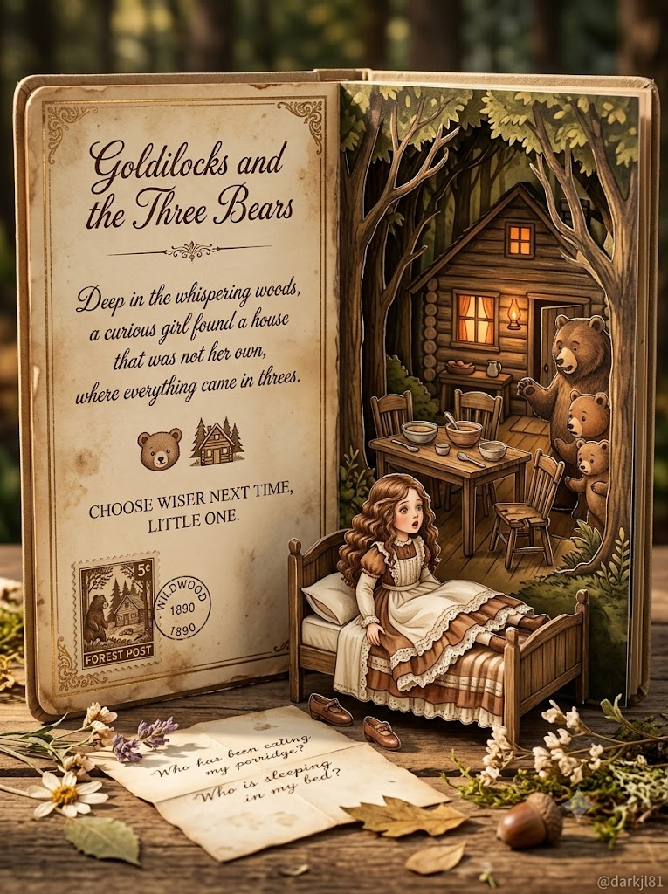
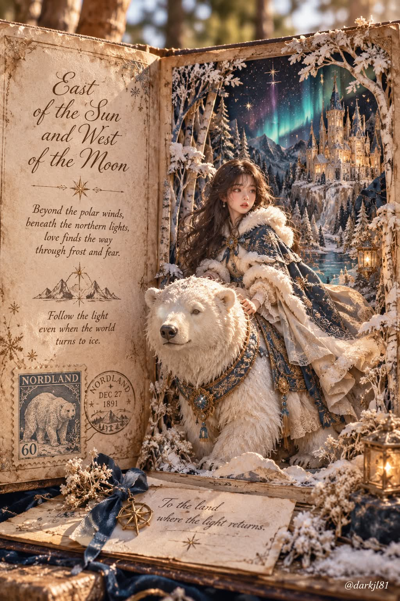

# 숫자로 뽑는 세계 동화 빈티지 팝업북 포토리얼 접사 프롬프트

## 1. 개요 및 아트 디렉팅 가이드

- **컨셉**: 좋아하는 숫자 하나로 세계 동화 100편 가운데 한 편을 뽑아, 펼쳐 세운 빈티지 동화 팝업북을 포토리얼 접사 제품 사진으로 그리는 프롬프트
- **진행 규칙 (가장 먼저)**:
  - 이미지를 바로 그리지 않고 "좋아하는 숫자 하나를 알려주세요 (1~100)."라고만 먼저 질문
  - 숫자를 받으면 어떤 동화인지 미리 말하지 않고 바로 이미지 생성
  - 프롬프트의 `[동화 이름: ]` 칸에 동화를 적어 두면 숫자 질문 없이 그 동화로 진행
- **동화 선택 절차**:
  1. 대륙과 문화권을 고르게 섞은 고전 동화·민담·전래동화 후보 100개 작성
  2. 제목 알파벳순으로 정렬
  3. 좋아하는 숫자에 해당하는 순번의 동화 선택
  4. 얼굴 사진이 있으면 가장 가까운 순번 중 주인공 성별이 맞는 동화 선택
  5. 자주 쓰이는 대표 동화로 되돌아가지 않고 결과를 그대로 따름
- **책 구조 (고정)**:
  - 세로로 펼쳐 세운 하드커버 팝업북, 정면에서 살짝 오른쪽으로 비켜선 눈높이의 세로 구도
  - **왼쪽 페이지**: 가장자리가 해진 낡은 양피지색 카드에 영어 손글씨 캘리그래피로 동화 제목, 짧은 시적 문장, 상징 아이콘, 명령형 한 문장
  - **오른쪽 페이지**: 종이를 여러 겹 오려 쌓아 카드 테두리 밖으로 튀어나오는 3D 팝업 디오라마
- **소품**: 동화 세계의 가상 우체국 우표와 원형 소인 도장, 쪽지·편지·초대장·미니 책 중 하나, 페이지 위로 흘러넘치는 꽃과 식물
- **팝업 디오라마 장면**:
  - 동화의 가장 상징적인 한 장면을 주인공 피규어, 대표 배경 요소, 원경으로 겹겹이 재현
  - 동작 중인 순간의 주인공, 레이스·자수·금박 디테일의 의상, 도자기 인형처럼 매끈한 얼굴, 이야기를 단번에 알아볼 수 있는 상징 아이템
  - 특정 영화·애니메이션의 캐릭터 디자인을 따르지 않는 독창적인 디자인
- **얼굴 합성 (사진이 있을 때만)**: 눈·코·입의 생김새만 주인공 피규어에 반영하고, 헤어와 각도·시선은 동화 설정과 장면대로 새로 그리며 안경은 유지
- **배경 & 질감**: 동화와 어울리는 실제 야외 장소의 부드러운 보케, 따뜻한 황금빛 자연광과 디오라마 안쪽의 작은 불빛, 종이 섬유와 금박 반사까지 보이는 매크로 디테일
- **워터마크**: 오른쪽 아래 구석에 작은 흰색 `@darkjl81`

---

## 2. 프롬프트 전문

```text
[진행 규칙 — 가장 먼저 지킬 것]

이 프롬프트를 받으면 이미지를 바로 그리지 말고, 먼저 사용자에게 다음 한 문장으로만 질문한다:
"좋아하는 숫자 하나를 알려주세요 (1~100)."

사용자가 숫자를 답하기 전에는 절대 이미지를 생성하지 않는다. 질문에 다른 설명이나 동화 추천을 덧붙이지 않는다.

사용자가 숫자가 아닌 답을 하거나 범위를 벗어나면, 1~100 사이 숫자를 다시 묻는다.

숫자를 받으면 그 숫자를 [좋아하는 숫자]로 사용해 아래 절차대로 동화를 정하고 바로 이미지를 생성한다. 어떤 동화를 골랐는지 미리 말하지 않는다.

[동화 이름: ] ← 원하는 동화가 있으면 적음. 적혀 있으면 숫자 질문 없이 바로 이 동화로 그린다.

[동화 선택 절차 — 동화 이름이 비어 있을 때]

1. 세계 여러 지역의 고전 동화·민담·전래동화 후보 100개를 만든다. 한 나라·한 작가·한 지역에 몰리지 않게 대륙과 문화권을 고르게 섞고, 너무 유명한 작품만으로 채우지 않는다.

2. 후보를 제목 알파벳순으로 정렬한다.

3. [좋아하는 숫자]에 해당하는 순번의 동화를 선택한다.

4. 업로드한 얼굴 사진이 있으면, 그 순번에서 가장 가까운 순번 중 사진의 성별과 주인공 성별이 맞는 동화를 선택한다.

5. 자주 쓰이는 대표 동화로 되돌아가지 않는다. 절차로 나온 결과를 그대로 따른다.

색감 팔레트, 장면, 문구, 소품은 모두 선택된 동화에 맞게 AI가 직접 결정한다.

특정 영화·애니메이션의 캐릭터 디자인을 따라 하지 말고, 원작 동화를 바탕으로 한 독창적인 디자인으로 그린다.

────────────────────

펼쳐 세운 빈티지 동화 팝업북을 찍은 포토리얼 접사 제품 사진.

[책 구조 — 고정]

하드커버 팝업북이 세로로 펼쳐져 서 있고, 아래쪽 페이지는 바닥에 평평하게 놓임.

카메라는 정면에서 살짝 오른쪽으로 비켜선 눈높이, 책 전체가 화면을 꽉 채우는 세로 구도.

왼쪽 페이지: 모서리가 둥글고 가장자리가 해지고 얼룩진 낡은 양피지색 카드. 테두리에 가는 금색·갈색 빈티지 장식 선과 모서리 당초문.

오른쪽 페이지: 종이를 여러 겹 오려 쌓은 정교한 3D 팝업 디오라마. 카드 테두리 밖으로 장면이 튀어나와 입체감이 강함.

[왼쪽 카드 문구 — 영어, 우아한 손글씨 캘리그래피, 짙은 갈색 잉크]

1. 맨 위: 동화 제목을 큰 필기체로. 제목 아래 가는 장식 구분선과 작은 장식 문양.

2. 가운데: 동화의 핵심 정서를 담은 짧은 시적 문장 1개 (3~4줄로 줄바꿈).

3. 동화를 상징하는 작은 아이콘 장식 하나.

4. 그 아래: 짧은 명령형 한 문장 (2줄).

문구는 AI가 동화에 맞게 새로 지어내며, 철자가 정확하고 깨끗하게 읽혀야 함.

[소품 — 고정 구성, 내용은 동화에 맞게]

왼쪽 카드 하단에 톱니 테두리 빈티지 우표 1장: 동화 속 상징물이 그려진 판화풍 그림, 동화 세계의 가상 우체국 이름과 액면가 숫자.

우표 옆에 원형 우체국 소인 도장: 동화 세계의 지명과 날짜.

아래 페이지 위에 쪽지·편지·초대장·미니 책 중 동화에 어울리는 소품 1개를 비스듬히 놓고, 동화와 관련된 짧은 영어 문장을 손글씨로.

장면에 어울리는 꽃·식물·오브제가 디오라마 아래쪽과 페이지 위로 흘러넘치듯 배치.

[팝업 디오라마 장면]

동화에서 가장 상징적인 한 장면을 입체 종이공예로 재현: 앞쪽에는 주인공 피규어, 중간에는 동화의 대표 배경 요소, 뒤쪽 깊숙이 동화에 맞는 원경이 겹겹이 원근감 있게.

주인공은 동작 중인 순간을 포착하고, 고개를 살짝 돌려 장면 속 무언가를 바라봄. 동작과 시선은 장면에 맞게 AI가 정함.

주인공 의상은 섬세한 레이스·주름·자수·금박 디테일, 머리카락은 결이 살아 있는 웨이브.

피부와 얼굴은 정교한 도자기 인형처럼 매끈하고 아름답게, 살짝 미화.

동화의 상징 아이템(그 이야기를 단번에 알아볼 수 있는 물건)을 장면 안에 반드시 포함.

[얼굴 합성 — 업로드 사진이 있을 때만 적용]

업로드 사진은 얼굴 참고용으로만 쓴다. 사진에서는 눈·코·입의 생김새만 가져와 주인공 피규어 얼굴에 반영한다.

얼굴형·피부·헤어·이마/헤어라인은 사진에서 가져오지 않는다. 헤어스타일과 머리색은 동화 주인공 설정을 따른다.

사진 속 머리·얼굴 각도, 고개 기울기, 시선 방향은 절대 가져오지 않는다. 얼굴 방향과 표정은 위 장면 서술대로 새로 그린다.

사진 속 인물이 안경을 쓰고 있으면 피규어에도 같은 형태의 안경을 씌운다.

얼굴 외의 구도·각도·헤어·의상·장면은 전혀 바뀌지 않는다.

사진이 없으면 이 항목은 무시하고 AI가 주인공 얼굴을 자유롭게 디자인한다.

[배경·조명·질감]

책은 동화와 어울리는 실제 야외 장소에 놓여 있고, 배경은 얕은 심도로 부드럽게 흐려진 보케.

따뜻한 황금빛 자연광 + 디오라마 안쪽의 작은 랜턴·창문 불빛.

종이 섬유, 낡은 모서리, 금박의 반사, 꽃잎 질감까지 보이는 초고해상도 매크로 디테일.

색은 동화 테마 색 하나를 중심으로 빈티지 톤으로 차분하게.

오른쪽 아래 구석에 작은 흰색 워터마크 "@darkjl81".

[금지]

숫자를 받기 전에 이미지 생성

깨지거나 뜻 없는 글자, 철자 오류

평면 일러스트처럼 보이는 결과 (반드시 실물 종이 팝업북 사진처럼)

영화·애니메이션 캐릭터 그대로의 디자인

업로드 사진의 얼굴 각도·시선·헤어 반영
```

---

## 3. 결과물 비교 갤러리

| 생성 모델 | 생성 결과 이미지 |
| :--- | :--- |
| **제미나이 (Gemini)** |  |
| **ChatGPT (DALL-E 3)** |  |
