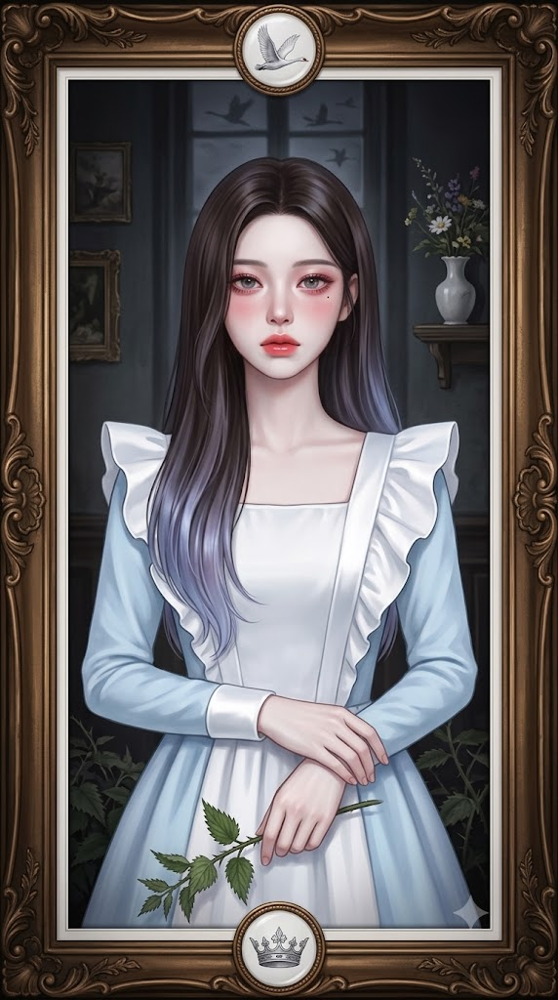
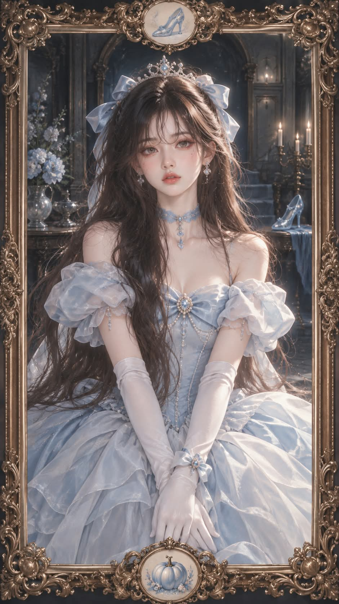

# 동화 주인공 액자 초상화 일러스트 프롬프트

## 1. 개요 및 아트 디렉팅 가이드

- **컨셉**: 사진 속 인물의 인상과 가장 잘 어울리는 동화 주인공을 AI가 고르고, 그 주인공 차림의 인형 같은 인물을 두꺼운 바로크 액자 안에 담은 반실사 애니메이션풍 초상 일러스트 (세로 9:16)
- **화풍 (최우선 고정)**:
  - 사진이 아닌 일러스트. 붓 터치와 질감을 최소화하고 면을 부드럽게 블렌딩한 매끈한 에어브러시 디지털 페인팅
  - 원단은 무늬·자수·레이스 없이 단색의 매끈한 면에 부드러운 새틴 광택만, 프릴은 크고 단순한 형태
  - 큰 덩어리로 단순화한 윤기 있는 직모와 머리끝의 파스텔 그라데이션
  - 차가운 톤의 색보정, 맑은 파스텔 의상과 매우 어두운 청록 흑색 배경. 누런 톤과 세피아는 금지
  - 검은색이 살짝 떠 보이는 저대비 매트 톤, 옅은 필름 헤이즈와 가장자리 비네팅
  - 창백한 도자기 인형 같은 피부, 눈가에 짙게 번진 붉은 장밋빛 아이섀도, 유리처럼 반짝이는 눈동자와 반쯤 내리깐 눈꺼풀, 광택 나는 코랄 핑크 입술
- **동화 주인공 결정**:
  - 인상·분위기·성별·나이대를 분석해 전 세계적으로 알려진 동화 주인공 한 명을 선택
  - 가장 유명한 몇몇 동화나 공주 캐릭터로 쏠리지 않게 넓은 범위에서 선택
  - 상징 의상과 헤어 색을 화풍 규칙에 맞게 재해석하고, 이미지 생성 후 고른 동화와 이유를 한 줄로 안내
- **얼굴 사용 규칙**: 사진에서는 눈·코·입의 생김새만 가져오고 각도·시선·표정은 새로 그림. 안경은 유지하고 화풍에 맞는 인형 같은 얼굴로 살짝 미화
- **표정 & 포즈**: 정면을 똑바로 보는 좌우 대칭 구도, 나른하고 쓸쓸한 무표정, 배꼽 아래에서 양 손목을 가볍게 교차한 자세, 머리 위부터 허벅지까지
- **액자**: 입체적으로 깊게 조각된 소용돌이 장식의 앤틱 브론즈·구릿빛 바로크 액자, 상단과 하단 중앙의 흰 도자기 메달리온에 동화를 상징하는 사물, 안쪽의 얇은 흰색 매트
- **배경 & 조명**: 안쪽으로 길게 이어지는 어둡고 깊은 빅토리아풍 실내와 동화를 은근히 암시하는 소품, 정면에서 부드럽게 퍼지는 확산광
- **출력**: 이미지 안에 글자·로고·워터마크 없음

---

## 2. 프롬프트 전문

```text
[동화 주인공 액자 초상화 – 얼굴 합성 프롬프트 v2]

업로드한 사진은 얼굴 참고용입니다. 이 사진 한 장으로 이미지 1장을 생성해 주세요.
이 프롬프트에서 가장 중요한 것은 아래 "화풍" 항목입니다. 화풍이 다르면 실패입니다.

■ 화풍 (최우선 고정)

- 사진이 아닌 일러스트입니다. 실사 사진 질감, 모공, 사진 같은 피부 디테일 금지.
- 매끈한 에어브러시 디지털 페인팅. 붓 터치와 질감을 최소화하고 면을 부드럽게 블렌딩한 반실사 애니메이션풍 인물 일러스트.
- 디테일은 적고 형태는 단순하게. 원단은 무늬·자수·레이스·뜨개 질감 없이 단색의 매끈한 면으로 칠하고, 접힌 부분에만 부드러운 새틴 광택을 넣습니다. 프릴은 크고 단순한 형태로만.
- 머리카락은 매끈하고 윤기 있는 직모, 큰 덩어리로 단순화해 칠하고 잔머리·곱슬·부스스함 금지. 머리끝에 주인공 색과 어울리는 파스텔 그라데이션.
- 색감: 전체를 차가운 톤으로 색보정. 누런 톤, 세피아, 금빛 필터, 따뜻한 갈색 톤 금지.
의상과 헤어는 맑은 파스텔 색(흰색은 깨끗한 흰색), 배경은 매우 어두운 청록 흑색.
- 검은색이 살짝 떠 보이는 저대비 매트 색보정, 화면 전체에 옅은 안개 같은 필름 헤이즈와 아주 약한 그레인. 가장자리는 어둡게 비네팅.
- 피부는 창백한 도자기 인형처럼 매끈하고 하얗게. 눈가 아래와 눈꼬리에 붉은 장밋빛 아이섀도가 짙게 번지고, 볼과 코끝에도 붉은 블러셔.
- 눈은 크고 유리처럼 투명하게 반짝이는 눈동자, 무겁게 반쯤 내리깐 눈꺼풀.
- 입술은 도톰하고 젖은 듯 광택 나는 코랄 핑크. 눈 아래에 작은 점 하나.

■ 1단계: 동화 주인공 결정

- 사진 속 인물의 인상, 분위기, 성별, 나이대를 분석해 전 세계적으로 알려진 동화 주인공 중 이 사람과 가장 잘 어울리는 주인공 한 명을 직접 고르세요.
- 가장 유명한 몇몇 동화로 쏠리지 말고 넓은 범위에서 고르세요. 공주 캐릭터에 한정하지 마세요.
- 남성이면 남성 주인공, 여성이면 여성 주인공. 남성도 같은 화풍(창백한 피부, 붉은 눈가, 매끈한 직모)으로 그립니다.
- 주인공의 상징 의상과 헤어 색을 위 화풍 규칙(단순하고 매끈한 원단, 파스텔 색)에 맞게 재해석합니다.

■ 얼굴 사용 규칙

- 사진에서는 눈, 코, 입의 생김새만 가져옵니다. 얼굴형, 피부, 헤어, 이마·헤어라인은 가져오지 마세요.
- 사진의 머리·얼굴 각도, 고개 기울기, 방향, 시선, 표정은 절대 가져오지 마세요.
- 안경을 쓰고 있다면 같은 형태의 안경을 유지합니다.
- 인상은 알아볼 수 있게 유지하되 위 화풍의 인형 같은 얼굴로 살짝 미화합니다.

■ 표정과 포즈

- 정면을 똑바로 보는 좌우 대칭 구도, 고개를 기울이지 않음.
- 무표정에 가까운 나른하고 쓸쓸한 표정, 입은 다문 상태.
- 양팔을 내려 배꼽 아래에서 양 손목을 가볍게 교차해 모은 자세.
- 머리 위부터 허벅지까지 보이는 세로 구도, 인물이 화면 중앙에 크게.

■ 액자

- 이미지 가장자리를 두꺼운 앤틱 브론즈·구릿빛 바로크 액자가 감쌉니다. 납작한 금박 무늬가 아니라 입체적으로 깊게 조각된 소용돌이 장식, 그림자가 진 양감.
- 액자 상단 중앙과 하단 중앙에 둥근 메달리온이 하나씩 있고, 안쪽은 흰 도자기 원판에 고른 동화를 상징하는 사물이 섬세하게 그려져 있습니다.
- 액자 안쪽에 얇은 흰색 매트.

■ 배경

- 어둡고 깊은 빅토리아풍 실내가 안쪽으로 길게 이어지는 원근 구도. 벽에 작은 빈티지 액자들, 앤틱 선반, 꽃이 꽂힌 흰 도자기 화병.
- 소품과 바닥 무늬로 고른 동화를 은근히 암시.
- 배경은 인물보다 훨씬 어둡고 흐리게 처리해 파스텔 인물이 떠올라 보이게.

■ 조명과 출력

- 정면에서 부드럽게 퍼지는 확산광, 강한 하이라이트 없음.
- 세로 9:16, 고해상도, 이미지 안에 글자·로고·워터마크 없음.

이미지 생성 후, 어떤 동화의 주인공으로 골랐는지와 이유를 한 줄로만 알려 주세요.
```

---

## 3. 결과물 비교 갤러리

| 생성 모델 | 생성 결과 이미지 |
| :--- | :--- |
| **제미나이 (Gemini)** |  |
| **ChatGPT (DALL-E 3)** |  |
