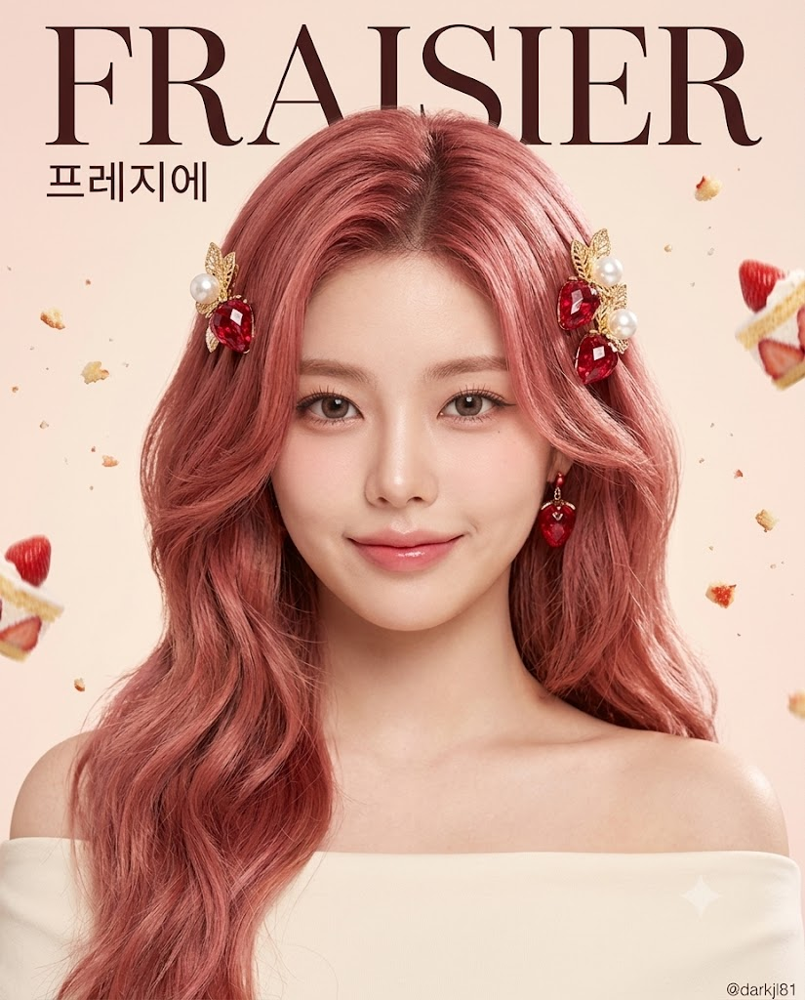
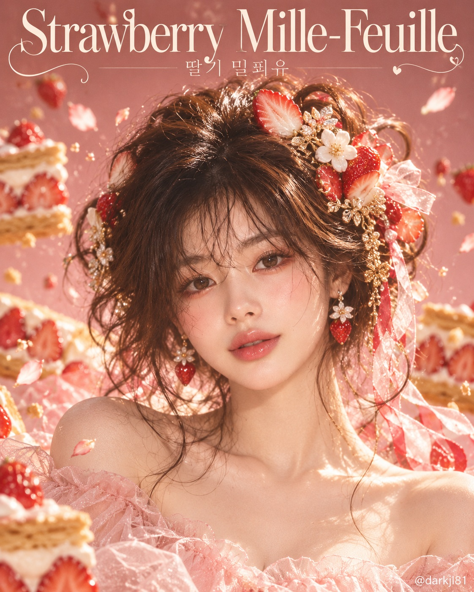

# 관상 디저트 헤어 포트레이트 뷰티 매거진 화보 프롬프트

## 1. 개요 및 아트 디렉팅 가이드

- **컨셉**: 인물의 관상을 분석해 디저트 하나를 정하고, 그 디저트가 떠오르는 헤어스타일과 디저트 모티프 하이주얼리 헤어 액세서리를 한 뷰티 매거진 화보 포트레이트
- **1단계 (관상으로 디저트 정하기)**:
  - **A. 눈매 → 문화권**: 눈매 유형에 따라 프랑스·서유럽, 동아시아, 미국·중남미, 중동·인도·동남아, 남유럽, 북유럽·동유럽 중 하나로 판정
  - **B. 입매 → 디저트 종류**: 크림·무스 케이크류, 구움과자·타르트·파이류, 시럽·꿀·과일 디저트, 차갑게 먹는 디저트, 쫀득한 전통 디저트 중 하나로 판정
  - **C. 전체 인상 → 대표 색감**: 크림·캐러멜, 핑크·과일색, 초콜릿·브라운, 화이트·민트, 말차·보라·원색 중 하나로 판정
  - 세 조건을 모두 만족하는 실제 디저트 하나를 정하고(없으면 C부터 완화), 판정 결과와 선택 이유를 이미지 생성 전에 먼저 안내
- **2단계 (디저트가 연상되는 헤어스타일)**:
  - 머리카락은 진짜 사람의 머리카락으로, 디저트의 형태와 구조를 레이어드·업스타일·웨이브·컷 등 실제 살롱에서 연출 가능한 헤어스타일로 번역
  - 디저트의 대표 색을 투톤·옴브레·하이라이트로 옮기고, 글레이즈의 윤기나 크림의 폭신함 같은 질감까지 머릿결로 표현
- **3단계 (디저트 모티프 헤어 액세서리)**:
  - 유리·레진·에나멜·진주·크리스털·금속으로 디저트를 정교하게 미니어처화한 헤어 액세서리 2~4개와 같은 모티프의 작은 이어링
- **4단계 (인물 & 구도)**:
  - 정면 상반신 바스트샷, 장난스러운 미소와 자신감 있는 눈빛, 디저트 색감의 심플한 단색 오프숄더 톱
  - 디저트 색감의 파스텔 단색 스튜디오 배경, 공중에 살짝 떠 있는 디저트 조각과 가루, 머릿결과 액세서리를 살리는 림라이트
- **타이포그래피 & 워터마크**:
  - 세로 4:5 비율, 상단에 영문 세리프 디저트 이름(크게)과 한글 디저트 이름(작게)
  - 우하단: 작은 흰색 워터마크 `@darkjl81`

---

## 2. 프롬프트 전문

```text
[관상 디저트 헤어 포트레이트]

업로드한 사진은 얼굴 참고용으로만 사용합니다. 사진 속 인물의 관상을 분석해서 디저트 하나를 정하고, 그 디저트가 떠오르는 헤어스타일과 디저트 모티프 헤어 액세서리를 한 뷰티 매거진 화보 포트레이트를 그려주세요.

■ 1단계 – 관상으로 디저트 정하기
디저트를 고를 때는 아래 2단계(헤어) 내용을 전혀 생각하지 않고, 반드시 아래 세 가지 판정 결과만으로 정합니다.

A. 눈매 → 디저트의 문화권
- 눈꼬리가 올라간 날카로운 눈매 → 프랑스·서유럽
- 눈꼬리가 내려간 순한 눈매 → 한국·일본·중국 등 동아시아
- 크고 둥근 눈 → 미국·중남미
- 가늘고 긴 눈 → 중동·인도·동남아
- 수평으로 곧은 눈매 → 이탈리아·스페인·포르투갈 등 남유럽
- 깊고 그윽한 눈매 → 북유럽·동유럽

B. 입매 → 디저트의 종류
- 입꼬리가 올라간 입 → 크림·무스가 중심인 케이크류
- 일자로 다문 입 → 구움과자·타르트·파이류
- 도톰한 입술 → 시럽·꿀·과일이 중심인 디저트
- 얇은 입술 → 차갑게 먹는 디저트(얼음·젤리·푸딩류)
- 작고 오목한 입 → 쫀득하거나 찰진 전통 디저트

C. 전체 인상 → 대표 색감
- 따뜻하고 부드러운 인상 → 크림색·캐러멜·베이지
- 화사하고 밝은 인상 → 핑크·레드·과일색
- 차분하고 깊은 인상 → 초콜릿·커피·진한 브라운
- 시원하고 맑은 인상 → 화이트·민트·하늘색·투명
- 개성 강하고 강렬한 인상 → 녹차·말차·보라·선명한 원색

- A의 문화권에서 실제로 먹는 디저트 중, B의 종류에 속하고 C의 색감을 가진 디저트 하나를 정합니다. 세 조건을 모두 만족하는 것이 없으면 C를 가장 먼저 완화합니다.
- 이미지 생성 전에 다음을 한국어로 먼저 짧게 알려주세요.
· A·B·C 판정 결과 각 한 줄
· 관상 한 줄 풀이
· 선택한 디저트 이름
· 헤어스타일과 액세서리에 디저트를 어떻게 녹였는지 한 줄

■ 2단계 – 디저트가 연상되는 헤어스타일
- 머리카락은 진짜 사람의 머리카락입니다. 디저트 재료로 만든 머리가 아닙니다.
- 디저트의 형태와 구조를 실제 헤어스타일로 번역합니다. 디저트가 층으로 되어 있으면 층이 보이는 레이어드 스타일, 둥글게 쌓인 디저트면 둥근 볼륨의 업스타일이나 번, 흘러내리는 재료가 있으면 흐르는 웨이브, 각진 디저트면 선이 또렷한 컷 등, 디저트를 아는 사람이 보면 실루엣만으로 떠올릴 수 있게 디자인합니다.
- 헤어 컬러는 디저트의 대표 색을 그대로 옮깁니다. 디저트에 여러 층이나 재료 색이 있으면 투톤, 옴브레, 하이라이트, 안쪽 컬러로 층별 색을 표현합니다.
- 머릿결의 광택과 질감도 디저트를 닮게 합니다(글레이즈처럼 윤기 나는 결, 크림처럼 부드럽고 폭신한 컬, 구움과자처럼 보송하고 결이 살아있는 질감 등 선택한 디저트에 맞게).
- 헤어스타일 자체는 실제 헤어 살롱에서 연출 가능한 수준으로 자연스럽고 세련되게 완성합니다.

■ 3단계 – 디저트 모티프 헤어 액세서리
- 선택한 디저트의 대표 재료, 토핑, 장식을 모티프로 한 하이주얼리급 헤어 액세서리를 2~4개 착용합니다(헤어핀, 헤어 클립, 헤어밴드, 리본, 비녀, 헤어 체인 중 디저트와 헤어스타일에 어울리는 것을 선택).
- 액세서리는 유리, 레진, 에나멜, 진주, 크리스털, 금속 등 실제 주얼리 소재로 디저트 모양을 정교하게 미니어처화한 것입니다. 진짜 음식을 꽂은 것처럼 보이면 안 됩니다.
- 액세서리 크기는 실제 착용 가능한 크기로, 헤어스타일을 가리지 않고 포인트가 되도록 배치합니다.
- 같은 모티프의 작은 이어링 하나를 더해 헤어 액세서리와 세트처럼 맞춥니다.

■ 4단계 – 인물과 구도
- 정면을 향한 상반신 바스트샷, 고개는 똑바로, 시선은 카메라 정면, 두 손은 화면에 나오지 않습니다.
- 표정은 사진과 상관없이 새로 그립니다: 입꼬리가 살짝 올라간 장난스러운 미소, 자신감 있는 눈빛.
- 의상은 선택한 디저트의 색감과 어울리는 심플한 단색 오프숄더 톱. 헤어와 액세서리가 주인공이 되도록 의상은 절제합니다.
- 배경은 디저트 색감에서 뽑은 파스텔 단색 스튜디오 배경, 주변에 실제 디저트 조각 몇 개와 가루·부스러기가 공중에 살짝 떠 있는 연출.
- 조명은 부드러운 뷰티 스튜디오 조명, 머릿결의 윤기와 액세서리 반짝임이 살아나는 림라이트.

■ 얼굴 합성 규칙 (반드시 지킬 것)
- 업로드 사진에서는 눈, 코, 입의 생김새만 가져옵니다.
- 얼굴형, 피부, 헤어, 이마, 헤어라인은 사진에서 가져오지 않습니다.
- 사진 속 머리·얼굴 각도, 고개 기울기, 방향, 시선은 절대 가져오지 않습니다. 구도와 각도는 위 서술대로만 그립니다.
- 표정은 사진 표정이 아니라 위에 서술한 표정으로 새로 그립니다.
- 얼굴 외의 구도, 각도, 헤어스타일, 액세서리, 의상, 배경은 이 프롬프트 서술에서 바뀌면 안 됩니다.

■ 마감
- 세로 4:5 비율, 고급 뷰티 매거진 화보 퀄리티, 초고해상도.
- 이미지 상단에 선택한 디저트 이름을 영문 세리프 타이포로 크게, 그 아래 한글 디저트 이름을 작게 넣습니다.
- 우하단에 작은 흰색 글씨로 @darkjl81 워터마크를 넣습니다.
```

---

## 3. 결과물 비교 갤러리

| 생성 모델 | 생성 결과 이미지 |
| :--- | :--- |
| **제미나이 (Gemini)** |  |
| **ChatGPT (DALL-E 3)** |  |
