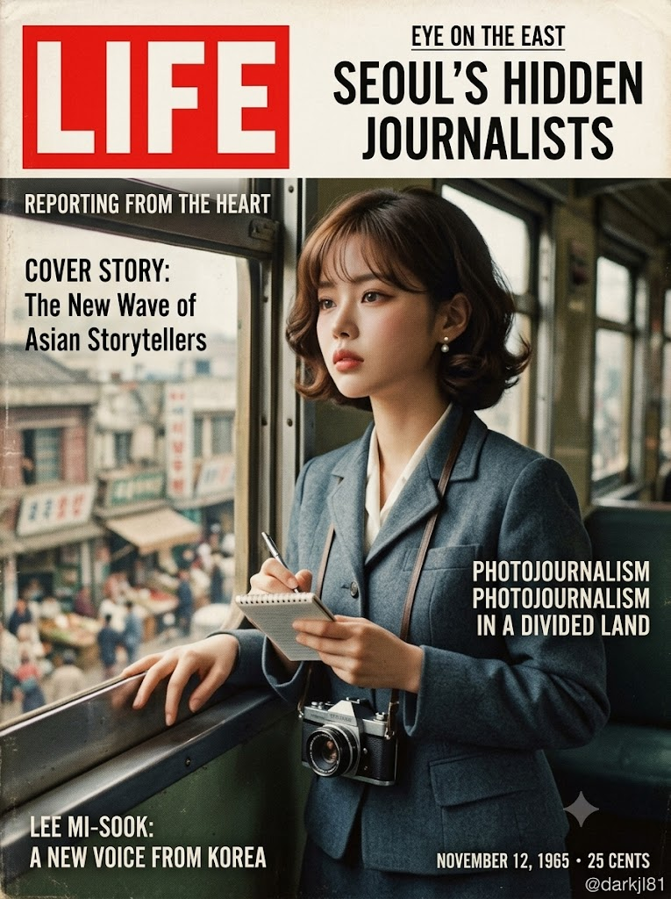
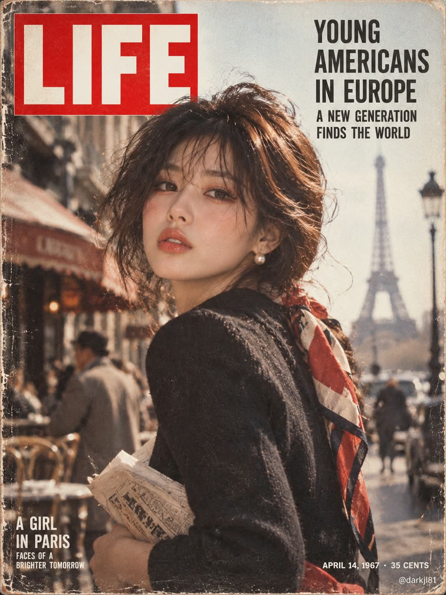

# 1950~70년대 미국 LIFE 매거진 빈티지 포토저널리즘 표지 프롬프트

## 1. 개요 및 아트 디렉팅 가이드
- **컨셉/장르**: 1950~1970년대 미국 전설적인 시사 포토저널리즘 잡지 《LIFE》의 실제 표지 스타일을 완벽하게 재현한 빈티지 인물 표지 (3:4 세로 비율).
- **포토저널리즘 감성 & 질감**:
  - 연출된 광고가 아닌 역사의 한순간을 포착한 다큐멘터리 스냅 사진 느낌.
  - 흑백 은염 필름의 깊은 계조 또는 빛바랜 빈티지 컬러 필름 색감, 자연스러운 피부 결, 필름 그레인 및 오래된 인쇄 잡지의 미세한 망점 텍스처.
  - 손과 관절, 팔꿈치에서 손목으로 이어지는 인체 해부학적 자연스러움 엄격 준수.
- **인물 & 스토리텔링 (AI 자율 구성)**:
  - 인물의 이목구비와 분위기에서 풍기는 인상을 분석하여, 1950~70년대 당시의 시대적 배경(시대, 직업, 역사적 사건 등)에 걸맞은 이야기의 주인공으로 재해석.
  - 당시 시대상에 정확히 부합하는 클래식 헤어스타일, 의상, 메이크업 및 자연스러운 현장 배경 구성.
- **LIFE 매거진 고증 레이아웃**:
  - 좌측 상단: 시그니처 붉은 직사각형 박스 속 흰색 산세리프 "LIFE" 로고.
  - 상단/측면: 인물의 서사를 압축한 영문 대문자 헤드라인 (Condensed Sans-serif).
  - 좌측 하단: 인물 소개 한 줄 캡션.
  - 우측 하단: 시대에 맞는 발행일과 가격 표기(예: `OCTOBER 15, 1968 · 40 CENTS`) 및 우하단 모서리 워터마크 `@darkjl81`.

## 2. 프롬프트 전문

```text
[LIFE 매거진 표지 모델 – 얼굴 합성 프롬프트]

업로드한 사진은 얼굴 참고용 한 장뿐이다. 이 사진으로 1950~1970년대 미국 LIFE 매거진의 실제 표지처럼 보이는 세로형 잡지 표지 이미지를 한 장 만든다. 비율 3:4 세로.

■ 얼굴 사용 규칙 (가장 중요)

사진에서는 눈·코·입의 생김새만 가져온다. 얼굴 전체 윤곽, 얼굴형, 피부, 헤어, 이마/헤어라인은 가져오지 않는다.

사진 속 고개 기울기, 얼굴 방향, 시선, 표정은 절대 가져오지 않는다. 각도와 표정은 아래에서 정한 장면에 맞게 새로 그린다.

눈·코·입은 사진 속 인물과 같은 사람으로 확실히 알아볼 수 있을 정도로 닮게 유지한다.

성별과 나이대는 사진의 인상을 따른다.

■ AI가 직접 정할 것
얼굴 인상(분위기, 눈빛, 이목구비의 느낌)을 먼저 분석한 뒤, 이 사람이 LIFE 표지에 실린다면 어떤 이야기의 주인공일지 스스로 정한다. 그 이야기에 맞춰 아래를 모두 AI가 결정한다.

시대(1950~70년대 중)와 흑백 또는 빈티지 컬러 필름 여부

장소·배경, 포즈, 구도(클로즈업/반신/전신), 카메라 각도

헤어스타일, 메이크업, 의상, 소품

표정과 시선
모든 요소는 그 시대에 실제로 있었을 법한 것만 쓴다. 현대적인 옷, 소품, 헤어는 금지.

■ 사진 스타일

연출된 광고 사진이 아니라 포토저널리즘 다큐 사진처럼, 그 순간을 포착한 느낌

흑백이면 은염 필름 특유의 깊은 계조와 입자, 컬러면 바랜 빈티지 컬러 필름 색감

필름 그레인, 약간의 부드러운 초점, 오래된 인쇄 잡지의 종이 질감과 미세한 망점

자연스러운 피부 질감, 과한 보정이나 디지털 광택 금지

■ 손과 팔 해부학 (필수)

손이 보이면 손가락 5개, 관절이 자연스럽게 꺾이는 실제 사람 손으로 그린다.

손목이 비틀리거나 손바닥과 손등 방향이 뒤집히지 않게 한다. 팔꿈치→팔뚝→손목→손이 한 방향으로 자연스럽게 이어져야 한다.

턱이나 볼에 손을 댈 경우: 손바닥 또는 손등 중 하나가 얼굴에 닿고, 엄지는 몸 바깥쪽이 아니라 얼굴 아래쪽에 자연스럽게 위치한다. 손가락이 얼굴 쪽으로 기괴하게 말려 들어가지 않는다.

손 모양이 애매하면 손을 얼굴에 대지 말고, 손을 프레임 밖으로 빼거나 소품을 자연스럽게 쥔 포즈로 대체한다.

■ 표지 레이아웃

좌측 상단: 빨간 사각형 박스 안에 흰색 굵은 세리프 없는 대문자 "LIFE" 로고. 인물 머리가 로고를 살짝 가려도 된다.

상단 또는 측면: 인물의 이야기에 맞는 영어 헤드라인 1~2줄. 문구는 AI가 정하고, 컨덴스드 산세리프 대문자.

좌측 하단: 인물을 소개하는 짧은 영어 캡션 한 줄 (작은 흰색 대문자).

우측 하단: 정한 시대에 맞는 발행일과 가격 (월 일, 연도 · 가격 형식), 작은 글씨.

모든 글자는 철자 오류 없이 깔끔하게. 글자는 인물 얼굴을 가리지 않는다.

맨 오른쪽 아래 모서리, 발행일보다 더 작게 "@darkjl81" 흰색 워터마크.

■ 금지

실존 유명인의 얼굴이나 실제 LIFE 과거 표지 사진을 그대로 재현하지 않는다.

사진 속 배경, 옷, 머리, 각도를 가져오지 않는다.

뒤집히거나 꼬인 손, 손가락 개수 오류, 비틀린 손목 금지.

현대적인 디지털 일러스트 느낌, 플라스틱 피부, 과한 HDR 금지.
```

## 3. 결과물 비교 갤러리

| 제미나이 (Gemini) | GPT (DALL-E 3) |
| :---: | :---: |
|  |  |
