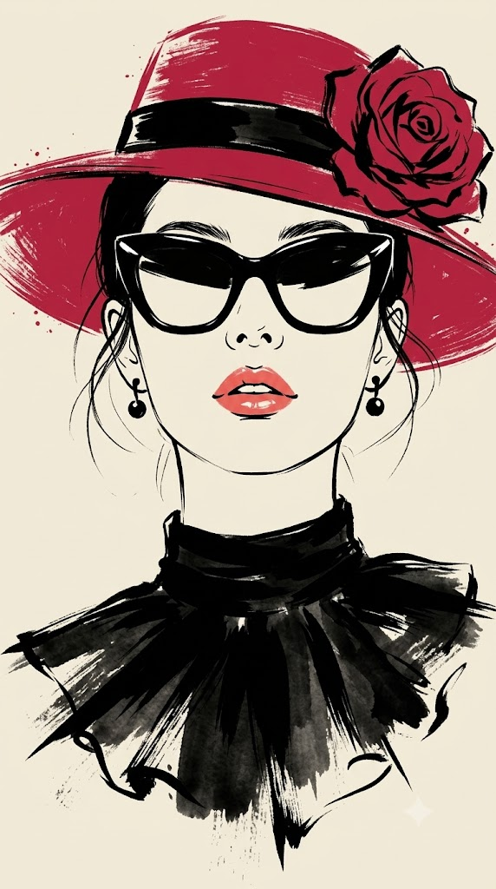
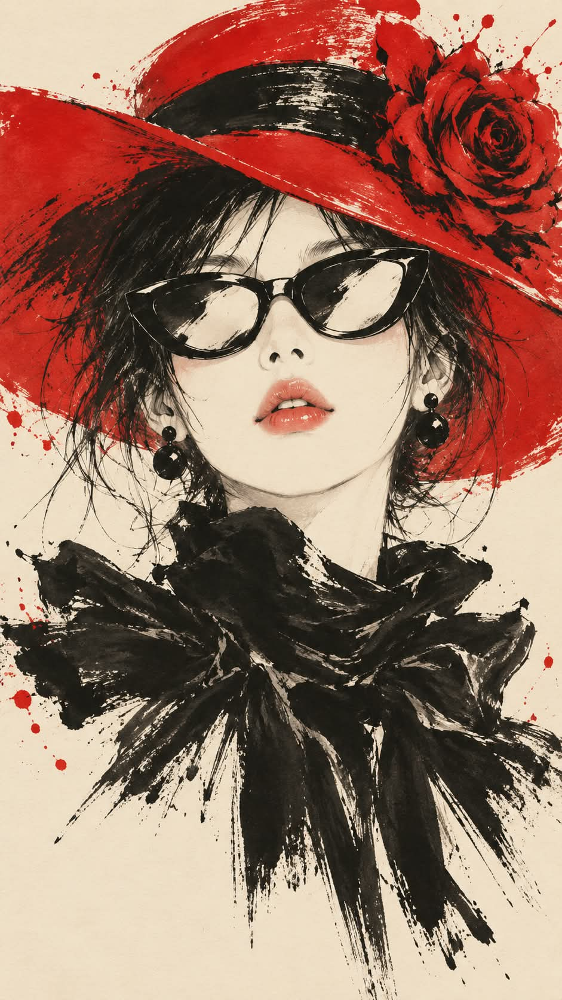

# 레드햇 미니멀 잉크 브러시 패션 일러스트 프롬프트

## 1. 개요 및 아트 디렉팅 가이드

- **컨셉**: 크림슨 레드 모자와 큰 블랙 선글라스, 블랙 러플 스카프를 두른 정면 흉상을 크림·블랙·레드 세 가지 색만으로 그린 미니멀 잉크 브러시 패션 일러스트 (세로 9:16). 사진 속 주인공이 여성·남성·동물 중 무엇인지에 따라 해당 조정만 적용
- **사진 사용 규칙**: 업로드 사진은 얼굴 특징 참고용으로만 사용하고, 머리 각도·시선·표정·배경·옷·소품은 반영하지 않음
- **화풍**:
  - 수묵화처럼 굵고 빠른 붓 터치, 마른 붓 질감, 먹이 튄 자국과 흩날리는 가는 선
  - 색은 크림색 종이 배경, 먹색 블랙, 선명한 크림슨 레드만 사용
  - 사실적인 묘사나 그라데이션 없이 평면적이고 그래픽한 빈티지 패션 판화 분위기
- **구도**: 얼굴과 목, 어깨 윗부분까지의 클로즈업 흉상, 턱을 살짝 든 정면 응시, 아래로 갈수록 붓 터치가 흩어지며 여백으로 사라지는 구성
- **고정 요소**:
  - **모자**: 약간 비스듬히 쓴 크림슨 레드 넓은 챙 모자, 굵은 블랙 밴드와 옆면의 커다란 레드 장미
  - **선글라스**: 눈을 완전히 가리는 두껍고 큰 블랙 뿔테 캣아이형, 하얗게 비어 보이는 렌즈
  - **의상**: 블랙 하이넥 위로 크게 부풀린 블랙 러플 스카프
- **대상별 조정**:
  - **여성**: 코와 입술의 생김새만 가져옴. 광택 있는 코랄 핑크~레드 립과 무심하고 도도한 표정, 흩날리는 잔머리와 블랙 드롭 귀걸이
  - **남성**: 코와 입술의 생김새만 가져옴. 넓은 챙 모자 대신 크림슨 레드 중절모와 작은 장미, 각진 턱선과 광택 없는 은은한 코랄 입술, 귀걸이 없음
  - **동물**: 종류·귀 모양·주둥이 형태·얼굴 무늬 배치만 가져와 의인화한 흉상으로 표현. 어두운 털은 먹으로, 밝은 털은 종이 여백으로 옮기고 모자·선글라스·스카프는 여성 버전과 동일
- **금지**: 실사 질감과 3D 렌더링, 컬러 배경, 지정한 색 외의 색, 글자나 서명

---

## 2. 프롬프트 전문

```text
업로드한 사진은 얼굴 특징 참고용으로만 사용해. 사진 속 머리 각도, 고개 기울기, 방향, 시선, 표정은 절대 따라 하지 말고, 아래 서술대로 새로 그려. 사진 속 배경·옷·소품도 전혀 반영하지 마.
먼저 사진 속 주인공이 여성인지, 남성인지, 동물인지 판단해서 아래 [대상별 조정] 중 해당 항목만 적용하고, 나머지 구성은 모두 동일하게 유지해.

[화풍]
미니멀한 잉크 브러시 패션 일러스트. 수묵화처럼 굵고 빠른 붓 터치, 마른 붓(드라이 브러시) 질감, 먹이 튄 자국과 흩날리는 가는 선. 색은 오직 세 가지만 사용: 크림색 종이 배경(#F3EBDD 느낌), 먹색 블랙, 선명한 크림슨 레드. 사진처럼 사실적인 묘사나 그라데이션 셰이딩 없이, 평면적이고 그래픽한 포스터 느낌. 빈티지 패션 일러스트 판화 같은 분위기.

[구도]
세로 9:16 비율. 정면을 향한 얼굴과 목, 어깨 윗부분까지의 클로즈업 흉상. 얼굴은 화면 중앙보다 약간 위, 턱은 살짝 들고 정면 응시. 하단으로 갈수록 붓 터치가 거칠게 흩어지며 종이 여백으로 사라짐. 배경은 아무것도 없는 크림색 여백.

[모자]
(남성은 이 항목 대신 [대상별 조정]의 남성 모자를 적용)
크림슨 레드의 넓은 챙 모자를 머리 위에 약간 비스듬히 씀. 모자는 거친 레드 붓질로 표현하고 가장자리에는 붓 끝이 갈라진 자국과 레드 물감 튄 자국. 모자 크라운 아래에 굵고 광택 있는 블랙 밴드. 화면 오른쪽 위, 모자 옆면에 커다란 레드 장미 한 송이가 붙어 있고 꽃잎 결은 블랙 붓선으로 거칠게 그림.

[선글라스]
두껍고 큰 블랙 뿔테 캣아이형 선글라스가 눈을 완전히 가림. 렌즈는 반사되어 하얗게 비어 보이고 테 위쪽에 날카로운 흰색 하이라이트. 눈은 보이지 않음.

[의상]
목을 감싸는 블랙 하이넥과 그 위로 크게 부풀린 블랙 러플 스카프(또는 리본 칼라). 전부 굵은 먹 붓질로 덩어리감 있게 칠하고, 가장자리는 날카롭게 뻗은 붓 끝과 갈라진 마른 붓 자국, 아래쪽은 먹이 옅어지며 흩어짐.

[대상별 조정]
■ 여성

사진에서 코와 입술의 생김새(형태·비율·두께)만 가져옴. 얼굴형·피부·헤어·헤어라인·이마는 가져오지 않음.

피부는 종이색 그대로의 밝은 크림 화이트, 음영 거의 없음. 갸름하고 매끈한 턱선.

코는 콧볼과 콧구멍만 최소한의 먹선으로 간결하게.

입술은 광택 있는 코랄 핑크~레드 립, 하이라이트로 촉촉하게. 입을 살짝 벌려 윗니가 아주 조금 보이는 무심하고 도도한 표정.

검은 머리를 모자 안에 넣어 묶고, 얼굴 양옆과 귀 주변으로 가는 잔머리 몇 가닥이 붓선처럼 흩날림.

양쪽 귀에 작은 블랙 드롭 귀걸이(둥근 구슬이 매달린 형태).

■ 남성

사진에서 코와 입술의 생김새(형태·비율·두께)만 가져옴. 얼굴형·피부·헤어·헤어라인·이마는 가져오지 않음.

피부는 밝은 크림 화이트, 음영 거의 없음. 여성보다 조금 더 각진 턱선과 단단한 목선.

코는 콧볼과 콧구멍만 최소한의 먹선으로 간결하게.

입술은 광택 없는 은은한 코랄 톤, 입은 다물거나 아주 살짝만 벌린 무심하고 시크한 표정.

모자는 크림슨 레드 중절모(페도라). 가운데가 움푹 들어간 크라운, 앞쪽이 살짝 아래로 꺾인 챙을 한쪽으로 약간 기울여 씀. 거친 레드 붓질로 표현하고 가장자리에 붓 끝 갈라짐과 레드 물감 튄 자국. 크라운 아래 굵고 광택 있는 블랙 밴드, 밴드 옆면(화면 오른쪽)에 작은 레드 장미 한 송이를 꽂음.

짧은 검은 머리가 모자 아래로 살짝 보이고, 귀 옆으로 짧은 머리 몇 가닥이 붓선처럼 삐져나옴.

귀걸이 없음.

선글라스·러플 스카프는 여성 버전과 동일하게 유지.

■ 동물

사진에서 동물의 종류(품종), 귀 모양, 주둥이·코 형태, 얼굴 무늬 배치만 가져옴. 사진의 털 색은 그대로 쓰지 말고, 어두운 털은 블랙 먹으로, 밝은 털은 크림색 종이 여백으로 번역해 표현.

동물을 사람처럼 의인화한 흉상으로, 사람과 같은 자세(정면, 턱 살짝 듦)로 그림.

털은 짧고 빠른 붓선과 마른 붓 자국으로 결만 암시하고, 얼굴 안쪽은 여백을 많이 남김.

코는 먹으로 진하게 간결하게, 입은 살짝 벌린 듯한 도도한 표정. 입가나 코끝에 아주 은은한 코랄 톤 한 점만 허용.

귀가 있는 동물이면 모자 양옆으로 귀가 자연스럽게 빠져나오게 하고, 한쪽 귀에 작은 블랙 드롭 귀걸이.

모자(넓은 챙 + 큰 장미)·선글라스·러플 스카프는 여성 버전과 완전히 동일하게 착용.

[금지]
사진 같은 실사 질감, 3D 렌더링, 컬러 배경, 레드·블랙·크림(그리고 입술의 코랄) 외의 색, 글자나 서명, 업로드 사진의 머리 각도·시선·표정·헤어·옷 반영 금지.
```

---

## 3. 결과물 비교 갤러리

| 생성 모델 | 생성 결과 이미지 |
| :--- | :--- |
| **제미나이 (Gemini)** |  |
| **ChatGPT (DALL-E 3)** |  |
