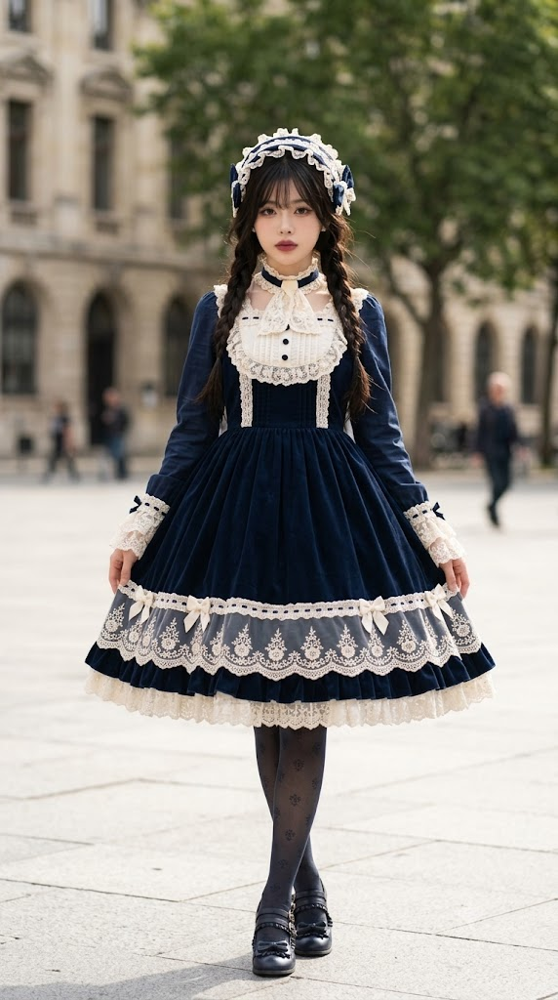
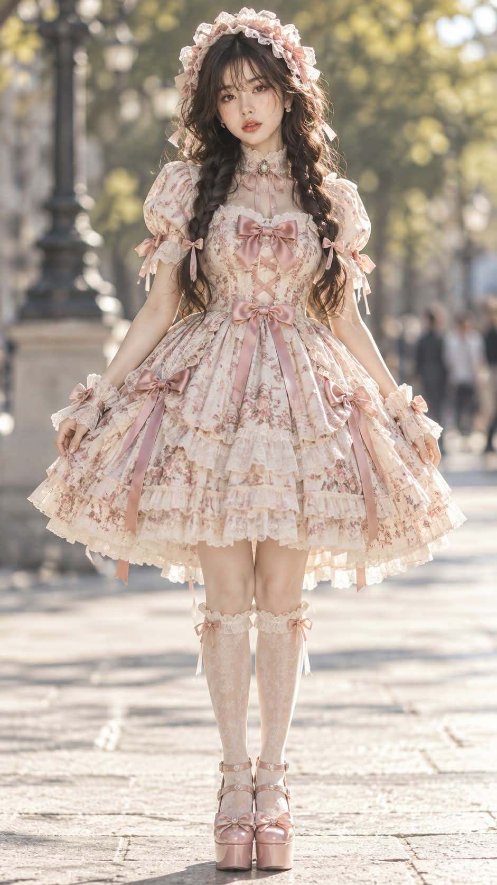

# 로리타 패션 실사 전신 화보 프롬프트

## 1. 개요 및 아트 디렉팅 가이드

- **컨셉**: 사진 속 인물의 나이와 얼굴을 그대로 유지한 채, AI가 인상에 맞춰 고른 정통 로리타 패션 코디를 입힌 실사 전신 패션 화보 (세로 9:16). 성숙한 성인 모델이 로리타 패션을 입은 고급 화보로 표현. GPT용과 Gemini용 두 버전으로 작성
- **버전별 차이**:
  - **GPT 버전**: 최우선 규칙, 인상 고정, 미화 방법, 성별 처리, 의상 결정 등을 항목별로 나눈 규칙형 프롬프트
  - **Gemini 버전**: 같은 내용을 얼굴, 성별, 의상, 장면 네 묶음으로 줄여 대화체로 풀어 쓴 프롬프트
- **최우선 규칙**:
  - 사진 속 인물의 실제 나이대를 그대로 유지 (30대면 30대, 40대면 40대 성인)
  - 목표는 "전문 메이크업과 화보 조명을 받은 본인". 미화보다 닮음이 우선
  - 눈 키우기, 볼살 통통하게, 턱 짧게 줄이기 등 얼굴을 어려 보이게 만드는 변형은 모두 금지
- **인상 고정 & 미화 방법**:
  - 눈·코·입의 크기와 형태, 얼굴형, 광대, 턱, 이마·코·턱 길이 비율은 바꾸지 않고, 그 사람만의 특징은 오히려 또렷하게 표현
  - 달라지는 것은 메이크업과 조명뿐: 맑고 고른 피부, 원래 눈·입술 모양을 따라 그린 메이크업, 결만 정돈한 눈썹, 선명한 캐치라이트
- **성별 처리**: 사진 속 인물이 남성이면 같은 얼굴 생김새와 같은 나이를 유지한 여자 버전으로 표현하고, 여성이면 그대로 표현
- **의상 결정 (AI가 직접 판단)**:
  - 얼굴 인상과 분위기에서 출발해 로리타 스타일, 메인·포인트 컬러, 원단 무늬, 디테일을 개성 있게 선택
  - 무릎 위~무릎 길이의 풍성한 파니에 스커트, 레이스·프릴·리본이 풍부한 고급 원피스, 실제 브랜드 옷처럼 사실적인 원단 질감
  - 헤드드레스, 넥·손목 장식, 양말이나 스타킹, 구두까지 한 세트로 구성하고 고른 이유를 한두 줄로 안내
- **포즈 & 표정**: 카메라를 정면으로 보고 똑바로 선 자세, 두 다리를 곧게 모으고 두 팔은 몸 옆으로 자연스럽게, 입술을 다문 차분하고 도도한 표정
- **헤어**: 윤기 있는 흑갈색 긴 머리, 가벼운 시스루 뱅, 어깨 앞으로 가슴 아래까지 내려오는 느슨한 트윈 땋은머리
- **배경 & 조명**: 밝은 오후의 야외 광장, 강하게 흐려진 나무와 행인의 보케, 부드럽게 뿌연 자연광과 반사판을 댄 듯 맑은 얼굴 빛, 맑고 몽환적인 필름 사진 톤
- **촬영**: 85mm 망원 렌즈의 얕은 심도, 머리부터 구두까지 들어오는 전신 구도에서도 얼굴은 선명하게

---

## 2. 프롬프트 전문

### GPT 버전

```text
[최우선 규칙 - 다른 모든 항목보다 우선]

- 결과 인물은 업로드 사진 속 인물의 실제 나이대를 그대로 유지한다. 사진이 30대면 30대, 40대면 40대 성인으로 그린다.
- 목표는 "전문 메이크업과 화보 조명을 받은 본인"이다. 성형한 것처럼 보이거나 다른 사람처럼 보이면 실패.
- 가족이나 친구가 보면 1초 만에 "이거 ○○이네" 하고 알아봐야 한다. 미화보다 닮음이 우선이고, 미화는 닮음을 해치지 않는 범위에서만 한다.
- 동안화 금지: 눈을 크게 키우기, 볼살 통통하게, 인중·턱 짧게 줄이기, 얼굴 둥글게 만들기, 아이 같은 비율 모두 금지.
- 로리타 의상은 "성숙한 성인 모델이 로리타 패션을 입은 고급 화보"로 표현한다. 의상이 귀엽다고 얼굴까지 어려지면 실패.

[업로드한 얼굴 사진 사용 규칙]

- 가져오는 것: 눈·코·입의 생김새, 눈 사이 간격, 눈매 기울기, 눈썹과 눈 사이 거리, 코 길이, 인중 길이, 광대 위치, 턱 길이와 턱끝 모양, 얼굴 길이와 폭의 비율, 전체 인상과 분위기.
- 가져오지 않는 것: 피부 상태, 헤어, 이마/헤어라인, 표정, 고개 기울기, 얼굴 방향, 시선 각도.
- 표정·각도·헤어·포즈·구도·배경은 아래 서술대로만 새로 그린다.

[인상 고정 - 절대 바꾸지 않는 것]

- 눈: 눈 크기, 눈 모양, 쌍꺼풀 유무와 라인 형태, 눈꼬리 방향, 눈 사이 간격.
- 코: 콧대 높이, 코 길이, 코끝 모양, 콧볼 넓이.
- 입: 입술 두께, 입 크기, 입꼬리 모양, 윗입술과 아랫입술 비율.
- 얼굴: 얼굴형, 광대, 턱 모양, 이마·코·턱 길이 비율.
- 이 사람만의 특징(눈매의 날카로움이나 순함, 눈의 비대칭 정도, 코의 특징, 입매의 인상)은 오히려 살려서 또렷하게 보이게 한다.

[미화 방법 - 생김새는 그대로, 완성도만 올린다]

- 피부: 잡티·모공·다크서클·붉은기 없이 맑고 고르게, 은은한 윤기. 성인 피부 질감은 살짝 남긴다.
- 메이크업: 원래 눈 모양을 따라 그린 아이라인과 음영, 마스카라로 정리된 속눈썹, 원래 입술 모양 그대로 선명하게 바른 립. 메이크업으로 눈이나 입 모양을 바꾸지 않는다.
- 눈썹: 원래 모양과 두께를 살려 결만 정돈.
- 눈빛: 흰자를 맑게, 눈동자에 선명한 캐치라이트.
- 조명: 얼굴에 반사판을 댄 듯 맑고 고른 빛, 자연스러운 입체감.
- 머릿결: 윤기 있고 정돈된 상태.
- 표정과 자세에서 나오는 자신감 있는 분위기.
- 이 범위를 넘는 얼굴 보정(눈 키우기, 코 세우기, 턱 깎기, 입술 부풀리기)은 하지 않는다.

[성별 처리]

- 사진 속 인물이 남성이면 여성으로 바꿔 그린다. "같은 나이의 여자 버전"처럼 보여야 하며, 나이를 낮추지 않는다.
- [인상 고정] 항목은 그대로 지키고, 표면만 여성스럽게 다듬는다: 눈썹을 원래 모양을 살린 채 가늘고 부드럽게, 속눈썹을 길게, 턱선 모서리만 살짝 둥글게, 피부결을 부드럽게. 수염·수염 자국·목젖 없음.
- 체형은 여성으로: 좁은 어깨, 가는 목과 팔, 잘록한 허리, 곧은 다리.
- 남성적인 흔적이 남으면 실패이고, 다른 사람이 되어도 실패.
- 사진 속 인물이 여성이면 이 항목은 무시한다.

[의상 결정 - AI가 직접 판단]

- 업로드 사진의 얼굴 인상과 분위기를 분석해서, 이 사람에게 가장 잘 어울리는 로리타 패션 스타일·메인 컬러·포인트 컬러·원단 무늬·디테일 디자인을 AI가 직접 정한다.
- 흔하고 무난한 조합으로 고르지 말고, 이 사람의 인상에서 출발한 개성 있는 선택을 한다.
- 고정 조건: 정통 로리타 패션 장르일 것. 무릎 위~무릎 길이의 풍성한 파니에 스커트, 레이스·프릴·리본이 풍부한 고급스러운 원피스 코디. 실제 브랜드 로리타 옷처럼 정교하고 원단 질감이 사실적일 것.
- 헤드드레스, 넥 장식, 손목 장식, 양말 또는 스타킹 여부, 구두 디자인과 색까지 모두 의상과 한 세트로 AI가 맞춰서 정한다.
- 결과 이미지와 함께 고른 스타일과 색 조합, 그렇게 고른 이유를 한두 줄로 설명한다.

[이미지 설정]
세로 9:16 비율의 실사 전신 패션 화보 사진. 85mm 망원 렌즈로 찍은 듯한 얕은 심도, 머리부터 구두까지 전신이 화면 중앙에 모두 들어온다. 전신 구도여도 얼굴은 선명하고 디테일하게 묘사해 이목구비가 또렷이 보인다. 사진 속 나이 그대로의 성인 모델.

[포즈]
카메라를 정면으로 바라보고 똑바로 선 자세. 고개는 정면, 턱은 살짝 당김. 두 다리는 곧게 모으고 발끝은 살짝 벌린 채 나란히 선다. 두 팔은 몸 옆으로 자연스럽게 내리되 몸에서 약간 띄우고, 손가락을 부드럽게 펴서 손끝이 치마 옆에 가볍게 닿을 듯한 위치. 어깨는 편안하게 내려 단정하고 우아한 실루엣.

[표정]
입술을 살짝 다문 차분하고 절제된 표정, 성숙하고 도도한 눈빛으로 카메라를 정면으로 응시. 메이크업 색감은 의상 컬러에 맞춘 성인 화보 메이크업, 볼에 옅은 블러셔.

[헤어]
흑갈색 긴 머리, 윤기 있고 결이 고운 머릿결. 앞머리는 눈썹 위로 살짝 갈라지는 가벼운 시스루 뱅으로 이마가 군데군데 비친다. 옆머리는 얼굴선을 따라 자연스럽게 내려온다. 양쪽으로 나눈 긴 트윈 땋은머리가 어깨 앞으로 가슴 아래까지 내려오며, 땋은 결이 느슨하고 정돈된 성인 스타일. 머리 장식은 [의상 결정]에서 정한 헤드드레스를 사용한다.

[배경·조명]
야외 광장의 밝은 오후. 뒤편에 나무들이 크게 흐려진 보케로 보이고, 멀리 지나가는 사람들이 형체만 흐릿하게 보인다. 바닥은 밝은 회색 보도. 부드럽고 은은하게 뿌연 자연광이 인물을 감싸고, 얼굴에는 화보용 반사판을 댄 듯 맑고 고른 빛이 들어간다. 전체 톤은 의상 컬러와 어우러지는 맑고 몽환적인 필름 사진 느낌. 인물은 선명하게, 배경은 강한 아웃포커스.

[금지]
글자, 로고, 워터마크, 사진 프레임 넣지 말 것. 업로드 사진의 배경·옷·머리·얼굴 각도 사용 금지. 얼굴을 어리게 만들거나 이목구비 모양·비율을 바꾸는 것 금지. 손가락 개수와 다리 비율은 자연스럽게.
```

### Gemini 버전

```text
첨부한 사진 속 바로 이 사람을 주인공으로, 새로운 실사 전신 패션 화보 사진을 만들어줘. 세로 9:16 비율.

[얼굴 – 가장 중요]
결과물의 얼굴은 사진 속 이 사람 본인이어야 해. 가족이 보면 바로 알아볼 정도로 똑같이.
사진 속 눈 크기와 눈 모양, 쌍꺼풀 라인, 눈꼬리 방향, 눈 사이 간격, 코 길이와 코끝 모양, 콧볼 넓이, 입술 두께와 입꼬리 모양, 인중 길이, 광대 위치, 턱 길이와 턱끝 모양, 얼굴 길이와 폭의 비율을 그대로 유지해.
나이도 사진 속 나이 그대로, 성숙한 성인의 얼굴로 그려. 이 사람만의 눈매와 입매의 인상은 오히려 또렷하게 살려줘.
달라지는 건 메이크업과 조명뿐이야: 맑고 고른 피부, 원래 눈 모양을 따라 그린 아이라인과 정돈된 속눈썹, 원래 입술 모양 그대로 바른 립, 결만 정돈한 원래 눈썹, 눈동자의 선명한 캐치라이트. "전문 메이크업과 화보 조명을 받은 본인"처럼 보이게.
사진에서는 얼굴 생김새만 가져오고, 사진 속 머리 모양, 표정, 고개 각도, 시선, 옷, 배경은 사용하지 마.

[성별]
사진 속 인물이 남성이면, 같은 얼굴 생김새와 같은 나이를 그대로 유지한 이 사람의 여자 버전으로 그려줘. 수염 없이 부드러운 피부, 조금 더 가늘게 다듬은 원래 눈썹, 긴 속눈썹, 좁은 어깨와 가는 팔, 잘록한 허리의 여성 체형. 사진 속 인물이 여성이면 그대로 그려.

[의상 – 네가 직접 결정]
사진 속 이 사람의 인상과 분위기를 보고, 가장 잘 어울리는 정통 로리타 패션 코디를 직접 정해줘. 스타일, 메인 컬러, 포인트 컬러, 원단 무늬, 디테일까지 이 사람의 인상에서 출발한 개성 있는 선택으로.
무릎 위에서 무릎 길이의 풍성한 파니에 스커트, 레이스와 프릴과 리본이 풍부한 고급 원피스. 실제 브랜드 로리타 옷처럼 정교하고 원단 질감이 사실적이게. 헤드드레스, 넥 장식, 손목 장식, 양말이나 스타킹, 구두까지 한 세트로 맞춰줘.
성숙한 성인 모델이 로리타 패션을 입은 고급 화보 느낌이야.

[장면]
85mm 망원 렌즈로 찍은 얕은 심도의 전신 사진. 인물이 화면 세로를 거의 꽉 채우도록 가깝게 서 있어서, 머리부터 구두까지 다 들어오면서도 얼굴이 크고 선명하게 보이게.
인물은 카메라를 정면으로 보고 똑바로 서 있어. 턱은 살짝 당기고, 두 다리는 곧게 모으고 발끝만 살짝 벌렸어. 두 팔은 몸 옆으로 자연스럽게 내리고 손끝이 치마 옆에 가볍게 닿을 듯해. 어깨는 편안하게 내려 단정하고 우아한 실루엣.
표정은 입술을 살짝 다문 차분하고 도도한 표정, 성숙한 눈빛으로 카메라를 응시. 메이크업 색감은 의상 컬러에 맞추고 볼에 옅은 블러셔.
헤어는 윤기 있는 흑갈색 긴 머리, 눈썹 위로 살짝 갈라지는 가벼운 시스루 뱅, 얼굴선을 따라 내려오는 옆머리, 어깨 앞으로 가슴 아래까지 내려오는 느슨한 트윈 땋은머리. 그 위에 네가 고른 헤드드레스.
배경은 밝은 오후의 야외 광장. 밝은 회색 보도 위에 서 있고, 뒤로 나무들과 멀리 지나가는 사람들이 강하게 흐려진 보케로 보여. 부드럽게 뿌연 자연광이 인물을 감싸고, 얼굴에는 반사판을 댄 듯 맑고 고른 빛. 의상 컬러와 어우러지는 맑고 몽환적인 필름 사진 톤.
이미지 안에는 글자, 로고, 워터마크, 프레임 없이 사진만.

이미지와 함께, 고른 로리타 스타일과 색 조합, 그렇게 고른 이유를 한두 줄로 설명해줘.
```

---

## 3. 결과물 비교 갤러리

| 생성 모델 | 생성 결과 이미지 |
| :--- | :--- |
| **제미나이 (Gemini)** |  |
| **ChatGPT (DALL-E 3)** |  |
