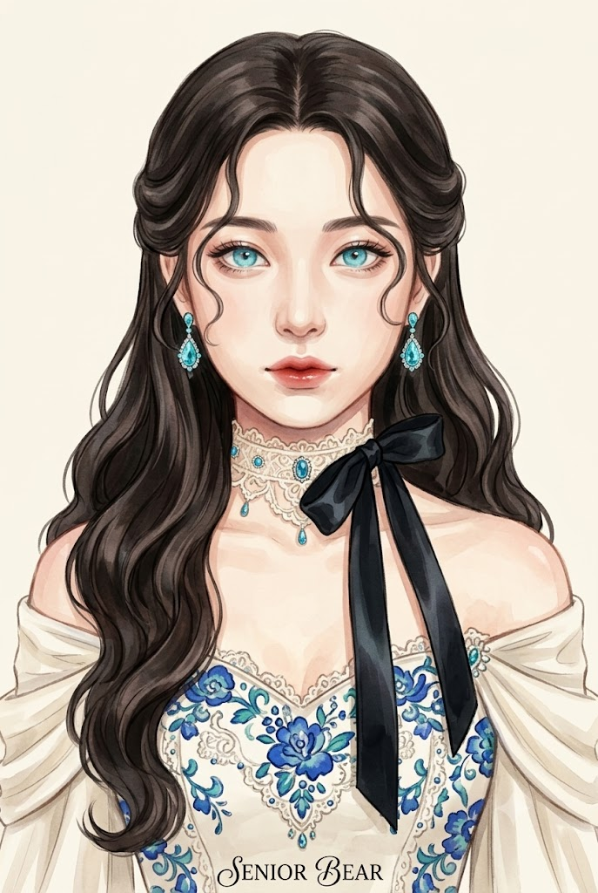
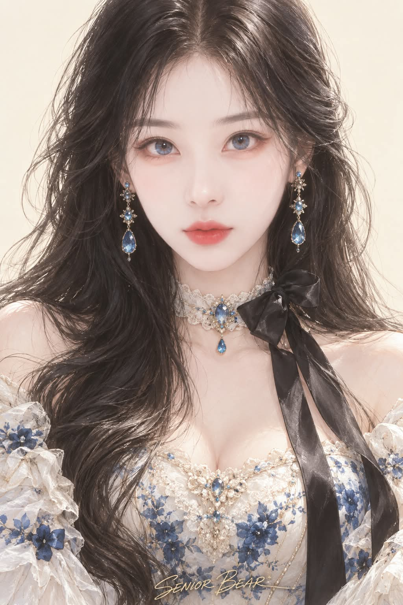

# 완전 정면 로맨스 판타지 디지털 페인팅 초상화 프롬프트

## 1. 개요 및 아트 디렉팅 가이드
- **콘셉트 테마**: 참조 사진의 인물 고유 얼굴 정체성만 추출하여 백지에서부터 새로 구축하고, 카메라 렌즈를 정면으로 응시하는 완전한 정면(Full Frontal View) 구도의 고급 로맨스 판타지 세미리얼 디지털 페인팅 초상화 (세로 2:3)
- **핵심 아트 디렉팅 & 조형 원리**:
  - **절대 고정 완전 정면 & 수직 중심축 (Strict Full Frontal Axis)**:
    - 3/4 각도나 고개 기울임을 일체 배제하고, 이마 중앙→미간→코→인중→입술→턱→목→가슴 중앙이 화면의 세로 중심축과 정확히 일치하는 엄격한 정면 구도.
    - 양쪽 어깨와 상체 모두 카메라와 수평으로 마주하며, 두 눈 모두 카메라 렌즈 정중앙을 흔들림 없이 응시.
  - **사진 복사 배제 & 회화적 세미리얼 화풍 (Hand-Painted Semi-Real Artwork)**:
    - 실사 피부 모공, 솜털, 사진 텍스처, AI 뷰티 필터 느낌을 엄격히 배제.
    - 섬세한 선 드로잉, 회화적인 색면, 부드러운 수채·과슈 느낌의 브러시 스트로크가 느껴지는 순수 디지털 페인팅 구현.
  - **로판 시그니처 스타일링 & 우아한 디테일**:
    - 앞머리가 전혀 없는 센터파트의 긴 짙은 흑갈색 웨이브 헤어, 관자놀이의 부드러운 S자 잔머리.
    - 신비로운 아이스/아쿠아 블루 홍채, 아쿠아 블루 보석 드롭 이어링.
    - 섬세한 아이보리 레이스 초커 + 가슴으로 길게 떨어지는 대형 블랙 실크 리본 + 블루 펜던트.
    - 코발트 블루와 청록색 꽃무늬가 수놓아진 아이보리 오프숄더 드레스와 웜 아이보리(Warm Ivory) 단색 배경.
  - **하단 중앙 작가 서명 ("SENIOR BEAR")**:
    - 이미지 하단 중앙에 Mr Dafoe 폰트 스타일의 유려한 영문 필기체 스크립트로 **"SENIOR BEAR"** 서명 표기.

---

## 2. 프롬프트 전문 (코드 블록)

```text
━━━━━━━━━━━━━━━━━━━━
[최우선 원칙 — 첨부 사진의 역할]
━━━━━━━━━━━━━━━━━━━━

사용자가 첨부하는 사진은 오직
'주인공이 누구인지 판단하기 위한 얼굴 특징 참고자료'이다.

첨부 사진 자체를 변환하거나 리스타일링하지 않는다.
사진을 기반 이미지, 포즈, 구도 참고 이미지로 사용하지 않는다.

완성 이미지는 아래에 지정된 얼굴 각도, 헤어스타일, 의상,
액세서리, 배경과 화풍을 사용하여 백지에서 처음부터 새롭게 그린
고급 로맨스 판타지 디지털 페인팅 일러스트이다.

첨부 사진에서 완성 이미지로 가져올 수 있는 것은
오직 '누구인지 알아보게 만드는 얼굴의 고유한 형태적 특징'뿐이다.

━━━━━━━━━━━━━━━━━━━━
[얼굴 정체성 — 반드시 유지]
━━━━━━━━━━━━━━━━━━━━

사진 속 인물을 알아볼 수 있도록 다음 특징을 분석하여 유지한다.

얼굴의 가로·세로 비율과 전체적인 인상

눈매의 형태와 기울기

눈의 크기와 눈 사이 간격

눈꼬리와 쌍꺼풀 특징

눈썹의 형태와 위치

코의 길이·폭·콧대·코끝

입술의 폭·두께·입꼬리

광대와 볼의 기본 구조

턱의 길이와 턱선

눈·코·입 사이의 상대적인 위치와 비율

사진 픽셀이나 얼굴 이미지를 그대로 복사하지 않는다.

사진 속 인물을 모델로 삼아
로맨스 판타지 일러스트레이터가 처음부터 새롭게 그린
초상화처럼 재구성한다.

단순히 비슷한 미인을 만드는 것이 아니라,
완성된 그림에서도 사진 속 인물의 고유한 인상이 남아 있어야 한다.

━━━━━━━━━━━━━━━━━━━━
[사진에서 가져오지 않을 것]
━━━━━━━━━━━━━━━━━━━━

사진 속 다음 요소는 모두 폐기한다.

헤어스타일, 앞머리, 머리 길이와 색,
머리 장식, 귀걸이, 목걸이,
의상, 손, 팔, 몸,
포즈, 자세, 표정, 시선,
고개 방향, 얼굴 각도,
카메라 각도, 렌즈 원근,
배경과 소품,
조명, 명암, 피부 밝기와 피부색,
화이트밸런스, 필터, 사진 질감.

첨부 사진에 앞머리가 있더라도 완성 이미지에는 가져오지 않는다.
사진의 손이나 의상, 배경 역시 절대로 재현하지 않는다.

━━━━━━━━━━━━━━━━━━━━
[절대 고정 — 무조건 완전 정면]
━━━━━━━━━━━━━━━━━━━━

완성 이미지의 인물은 반드시 완전한 정면이다.

FULL FRONTAL VIEW
DIRECT FRONT VIEW
STRAIGHT-ON PORTRAIT
PERFECTLY CENTERED FRONTAL PORTRAIT

'거의 정면', '정면에 가까운 각도',
'살짝 돌아간 얼굴', '자연스러운 3/4 각도'는 허용하지 않는다.

카메라는 얼굴 정중앙 바로 앞,
정확한 눈높이에 위치한다.

머리, 얼굴, 목, 양쪽 어깨와 상체가
모두 카메라와 정확하게 정면으로 마주한다.

얼굴과 몸을 좌우 어느 방향으로도 돌리지 않는다.
고개를 좌우로 기울이지 않는다.

━━━━━━━━━━━━━━━━━━━━
[정면 중심축 — 필수]
━━━━━━━━━━━━━━━━━━━━

이마 중앙
↓
미간
↓
코 중앙
↓
인중
↓
입술 중앙
↓
턱 중앙
↓
목 중앙
↓
가슴 중앙

이 축이 하나의 수직선으로 이어지며
화면의 정확한 세로 중심축과 일치한다.

양쪽 눈은 같은 정면 원근으로 보인다.
한쪽 눈이 원근 때문에 작아지지 않는다.

코는 정확히 정면을 향한다.
양쪽 볼과 광대, 턱선 역시 같은 정면 원근으로 표현한다.

양쪽 귀도 비슷한 정도로 보인다.

단, 실제 인물에게 존재하는 자연스러운 얼굴 비대칭까지
거울처럼 강제로 복제하지 않는다.

'자세와 카메라가 완전 정면'이라는 뜻이지
얼굴 자체를 인위적으로 완전 대칭화하라는 뜻은 아니다.

━━━━━━━━━━━━━━━━━━━━
[시선 — 정면 고정]
━━━━━━━━━━━━━━━━━━━━

두 눈 모두 카메라 렌즈 정중앙을 직접 바라본다.

홍채와 동공 역시 명확한 정면 응시 위치에 둔다.

옆을 보거나 위·아래를 바라보지 않는다.
비스듬한 시선도 금지한다.

━━━━━━━━━━━━━━━━━━━━
[로맨스 판타지식 얼굴 재구성]
━━━━━━━━━━━━━━━━━━━━

첨부 사진의 얼굴을 그대로 옮겨 그리지 않는다.

사진 얼굴
→ 고유한 얼굴 특징 분석
→ 완전 정면 구조로 재구성
→ 로맨스 판타지 일러스트 얼굴로 회화적 미화

순서로 새롭게 그린다.

원본 눈매의 특징과 눈 사이 간격은 유지하면서
더 섬세하고 우아한 선으로 정돈한다.

코와 입술 역시 원본의 특징적인 형태를 유지하면서
사진식 세부 묘사 대신 아름다운 선과 회화적인 명암으로 표현한다.

원본 얼굴형과 전체적인 인상을 유지하되
윤곽을 부드럽고 세련되게 정돈한다.

그러나 미화를 위해:

눈을 무조건 크게 만들지 않는다.

눈 사이 간격을 바꾸지 않는다.

코를 무조건 높거나 지나치게 좁게 만들지 않는다.

턱을 극단적인 V라인으로 만들지 않는다.

전혀 다른 전형적인 AI 미인 얼굴로 바꾸지 않는다.

목표는:

'사진 속 바로 그 사람을 모델로 삼아
고급 로맨스 판타지 표지 일러스트레이터가
완전 정면에서 새롭게 그린 아름다운 초상화.'

━━━━━━━━━━━━━━━━━━━━
[헤어스타일 — 사진과 무관하게 고정]
━━━━━━━━━━━━━━━━━━━━

긴 짙은 흑갈색 머리.

앞머리는 없다.

이마가 자연스럽게 완전히 드러나는
우아한 중앙 가르마.

관자놀이 주변에 부드러운 S자형 잔머리.

긴 머리카락이 양쪽 어깨를 따라 풍성하게 내려오며
일부는 어깨 앞으로 흐른다.

머리 끝에는 매우 완만하고 큰 웨이브가 있다.

첨부 사진에 일자 앞머리, 시스루뱅 등
어떤 앞머리가 있어도 절대로 따라 하지 않는다.

━━━━━━━━━━━━━━━━━━━━
[눈 · 액세서리]
━━━━━━━━━━━━━━━━━━━━

눈동자는 맑고 신비로운
아이스 블루 / 아쿠아 블루.

양쪽 귀에는 화려하고 우아한
아쿠아 블루 보석 드롭 이어링.

목에는 섬세하고 정교한
아이보리 레이스 초커.

초커에는 작은 블루 보석 장식이 있다.

초커 한쪽에는 크고 풍성한
검은색 실크 리본이 묶여 있다.

검은 리본의 긴 꼬리가
가슴 중앙 방향으로 우아하게 내려온다.

가슴 중앙에는 작은 블루 보석 펜던트.

━━━━━━━━━━━━━━━━━━━━
[의상]
━━━━━━━━━━━━━━━━━━━━

아이보리 바탕의 우아한
로맨스 판타지 오프숄더 드레스.

드레스에는 코발트 블루와 청록색 계열의
섬세하고 회화적인 꽃무늬가 들어간다.

레이스, 섬세한 자수와 작은 보석 장식을 사용하되
전체적으로 고급 로맨스 판타지 표지 의상처럼 표현한다.

양쪽 어깨 주변에는
얇고 부드러운 아이보리 천이 자연스럽게 걸쳐진다.

의상 역시 사진처럼 렌더링하지 않고
붓으로 그린 직물과 레이스처럼 표현한다.

━━━━━━━━━━━━━━━━━━━━
[구도]
━━━━━━━━━━━━━━━━━━━━

세로 2:3.

머리 위부터 가슴 아래까지 충분히 담는
완전 정면 상반신 패션 초상화.

인물은 화면 정확한 중앙.

눈높이 카메라.

얼굴과 몸통 모두 완전 정면.

양쪽 어깨가 비슷한 높이와 원근으로 보인다.

머리카락, 양쪽 귀걸이,
레이스 초커, 검은 리본,
드레스 상단이 충분히 보인다.

손은 화면에 등장하지 않는다.

얼굴을 만지거나 턱을 괴는 포즈 금지.

━━━━━━━━━━━━━━━━━━━━
[배경]
━━━━━━━━━━━━━━━━━━━━

깨끗하고 단순한
WARM IVORY 단색 배경.

풍경이나 공간을 만들지 않는다.

건물, 정원, 꽃밭, 창문,
가구, 나무, 하늘, 실내 장식,
별도의 꽃이나 장식물은 넣지 않는다.

인물 외에는 아무것도 배치하지 않는다.

━━━━━━━━━━━━━━━━━━━━
[화풍 — 사진처럼 만들지 말 것]
━━━━━━━━━━━━━━━━━━━━

고급 로맨스 판타지 소설 표지 일러스트.

세미리얼 디지털 페인팅.

단, 여기서 '세미리얼'은
사진에 가깝다는 뜻이 아니다.

인체의 구조와 입체감만 자연스럽고,
표현 방식은 누가 보아도 명백한 그림이어야 한다.

섬세한 드로잉,
우아한 선,
회화적인 색면,
부드러운 브러시 그라데이션,
부분적으로 보이는 브러시 스트로크,
약간의 수채화와 과슈 느낌.

피부 역시 매끈한 사진 피부가 아니라
회화적으로 정돈된 피부 표현.

눈, 코, 입술도 붓으로 섬세하게 그린 표현.

머리카락 역시 실제 사진의 머리카락처럼
한 올씩 포토리얼하게 렌더링하지 않고,
섬세한 선과 브러시 스트로크가 느껴지는 그림으로 표현한다.

레이스, 리본, 천, 보석도
동일한 작품의 회화적 질감으로 통일한다.

얼굴만 사진처럼 튀어나와 보이면 실패다.

━━━━━━━━━━━━━━━━━━━━
[절대 실사화 금지]
━━━━━━━━━━━━━━━━━━━━

금지:

포토리얼 인물 사진,
실제 피부 모공,
피부 솜털,
사진식 피부 반사,
초정밀 포토리얼 피부,
사진 같은 눈동자,
사진 같은 머리카락,
카메라 촬영 특유의 질감,
AI 뷰티 사진,
사진 얼굴 위에 그림 필터를 씌운 표현.

얼굴, 머리카락, 목, 의상, 액세서리까지
전부 동일한 화가가 하나의 작품으로 그린 것처럼 통일한다.

━━━━━━━━━━━━━━━━━━━━
[작가 서명 — 반드시 포함]
━━━━━━━━━━━━━━━━━━━━

완성 이미지 하단 중앙에
작가 서명을 반드시 넣는다.

정확한 표기:

SENIOR BEAR

철자 변경 금지.
다른 단어나 문구로 바꾸지 않는다.

Mr Dafoe 폰트 스타일의
우아하고 자연스럽게 이어지는
영문 캘리그래피 스크립트 형태로 표현한다.

서명은 이미지 하단 중앙에 수평으로 배치한다.

작품을 방해하지 않을 정도로
작고 세련된 크기로 표현하되,
"SENIOR BEAR"라는 글자가 읽을 수 있어야 한다.

인물, 얼굴, 의상 주요 장식을 가리지 않는다.

다른 워터마크, 로고, 문구는 추가하지 않는다.

━━━━━━━━━━━━━━━━━━━━
[최우선 순위]
━━━━━━━━━━━━━━━━━━━━

1. 첨부 사진에서는 얼굴 정체성 특징만 참고

2. 원본 인물의 고유한 얼굴 인상 유지

3. 무조건 FULL FRONTAL VIEW

4. 얼굴 중심축을 화면 중앙에 정확히 고정

5. 두 눈 모두 카메라 정중앙 응시

6. 얼굴·목·양쪽 어깨·상체까지 완전 정면

7. 사진의 헤어·의상·포즈·손·배경 완전 폐기

8. 앞머리 없는 긴 센터파트 흑갈색 헤어

9. 로맨스 판타지 수준으로 아름답게 회화적 재구성

10. 얼굴까지 명확한 디지털 페인팅

11. 블루 드롭 이어링

12. 아이보리 레이스 초커 + 대형 검정 실크 리본

13. 청백색 플라워 오프숄더 드레스

14. 손 없는 정면 상반신 2:3 구도

15. 웜 아이보리 단색 배경

16. 하단 중앙에 Mr Dafoe 폰트 스타일의 "SENIOR BEAR" 서명

━━━━━━━━━━━━━━━━━━━━
[실패 조건]
━━━━━━━━━━━━━━━━━━━━

3/4 얼굴이 됨,
얼굴이 조금이라도 의도적으로 좌우로 돌아감,
고개가 기울어짐,
비스듬한 시선,
몸통이 회전됨,
한쪽 어깨가 앞으로 나옴,
첨부 사진의 얼굴 각도를 따라감,
첨부 사진의 앞머리가 따라옴,
첨부 사진의 의상이 따라옴,
첨부 사진의 손이나 포즈가 따라옴,
첨부 사진의 배경 또는 액세서리가 따라옴,
얼굴만 포토리얼하게 표현됨,
피부가 실제 사진처럼 표현됨,
사진에 그림 필터만 씌운 것처럼 보임,
얼굴과 몸의 그림체가 다름,
미화 과정에서 원본 특징이 사라짐,
전혀 다른 AI 미인으로 변경됨,
SENIOR BEAR 서명이 빠짐,
SENIOR BEAR의 철자가 변경됨.

최종 결과는 반드시:

'사진 속 인물의 고유한 얼굴 특징을 유지하면서,
얼굴과 상체가 카메라와 정확히 평행하게 마주하고
두 눈이 렌즈 정중앙을 바라보는 완전 정면 구도의
정교하게 손으로 그린 듯한 로맨스 판타지 디지털 페인팅 초상화.'

이어야 한다.
```

---

## 3. 결과물 비교 갤러리

| 생성 모델 | 결과 이미지 |
| :--- | :--- |
| **Google Gemini** |  |
| **OpenAI GPT** |  |
