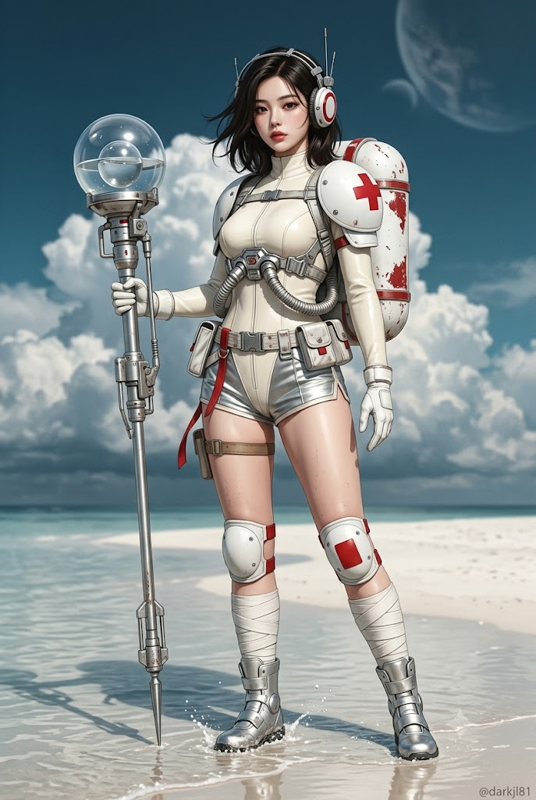
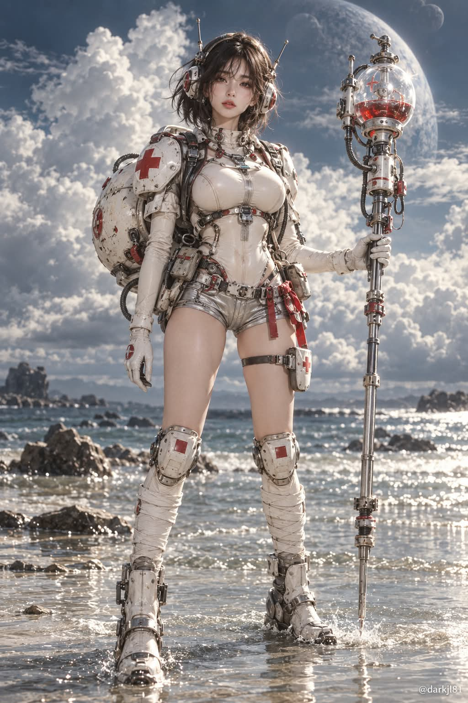

# 레트로 퓨처 우주 메딕 전신 SF 영화 스틸컷 실사 프롬프트

## 1. 개요 및 아트 디렉팅 가이드

- **컨셉**: 얕은 물이 고인 하얀 모래 해변에 선 레트로 퓨처 우주 의무병(메딕)의 정면 전신을 담은 SF 영화 스틸컷 느낌의 하이엔드 실사 사진 (세로)
- **얼굴 규칙**:
  - 업로드 사진에서는 눈·코·입의 생김새만 가져오고, 얼굴형·피부·헤어·표정·각도·시선은 프롬프트 서술대로 새로 그림
  - 로맨스판타지 표지 주인공급으로 미화하되 피부 결과 자연스러운 빛·그림자 등 실사 질감은 유지
- **인물**: 20대 중반 성인 여성, 키가 크고 다리가 긴 체형, 무심하고 차분하게 정면을 응시하는 시크한 표정, 바람에 흩날리는 어깨 길이 흑갈색 단발
- **의상 (실제 제작된 영화 소품 질감의 레트로 퓨처 우주복)**:
  - 붉은 링이 들어간 원형 기계식 헤드셋과 작은 안테나 2개
  - 아이보리 화이트 하이넥 밀착 슈트, 은색 금속 부품·주름 호스·버클 하네스
  - 빨간 적십자 마크가 그려진 크고 둥근 흰색 숄더 아머, 웨더링된 흰색 구형 백팩 탱크
  - 은색·아이보리 메탈 쇼츠와 벨트 파우치, 흰색 니가드와 레그 워머, 은색 기계식 부츠, 흰 장갑
  - 흰색·은색·크림색 위주에 포인트 컬러는 빨강만, 긁힘·먼지·물때 등 실제 사용감
- **장비**: 왼손으로 세워 든 사람 키만 한 기계식 의료 장비 지팡이. 위쪽은 투명한 유리 돔과 액체가 담긴 구형 캡슐, 아래 끝은 바닥에 꽂힌 금속 침
- **포즈 & 구도**: 다리를 살짝 벌리고 무게중심을 한쪽에 둔 여유로운 선 자세, 허리 높이 정면 카메라, 머리부터 발끝까지 화면 중앙에 배치
- **배경**: 발밑의 잔물결과 튀는 물방울, 부츠 주변의 물 반사, 거대하게 피어오른 뭉게구름과 짙은 청회색 하늘, 희미하게 떠 있는 행성
- **촬영**: 풀프레임 50mm f/4, 흐린 날의 부드러운 자연광, 차분하고 살짝 바랜 시네마틱 컬러 그레이딩과 은은한 필름 그레인
- **워터마크**: 우하단에 작은 흰색 텍스트 `@darkjl81`

---

## 2. 프롬프트 전문

```text
[얼굴 합성용 · 우주 메딕 전신 실사 사진]

업로드한 사진은 얼굴 참고용입니다. 사진에서는 눈·코·입의 생김새만 가져오세요.
얼굴형, 피부, 헤어, 이마·헤어라인, 표정은 사진에서 가져오지 마세요.
사진 속 고개 기울기, 얼굴 방향, 시선, 머리 각도도 절대 따라 하지 마세요.
얼굴은 아래 서술대로 새로 그리고, 얼굴 외의 구도·각도·헤어·의상·배경은 아래 설명에서 조금도 바뀌면 안 됩니다.

■ 인물
20대 중반 성인 여성 우주 의무병(메딕). 키가 크고 다리가 긴 글래머러스한 체형 — 볼륨 있는 가슴, 잘록한 허리, 곡선이 뚜렷한 골반과 탄탄한 허벅지. 몸에 밀착된 슈트가 실루엣을 그대로 드러냄.
얼굴은 로맨스판타지 웹소설 표지 주인공급으로 강하게 미화 — 작고 갸름한 V라인 얼굴, 크고 맑은 눈과 긴 속눈썹, 높고 오똑한 콧대, 도톰하고 윤기 있는 입술, 잡티 없이 맑고 투명한 도자기 피부. 단, 실사 사진의 질감(피부 결, 자연스러운 빛과 그림자)은 유지하여 그림처럼 보이지 않게. 은은한 붉은 립의 메이크업. 표정은 무심하고 차분한 시크함, 입은 살짝 다문 채 정면을 응시.
헤어: 어깨 길이 흑갈색 단발, 끝이 바람에 흩날리며 잔머리가 얼굴 옆으로 떨어짐.

■ 의상 (레트로 퓨처 우주복, 실제 제작된 영화 소품 질감)

머리: 양쪽 귀에 붉은 링이 들어간 원형 기계식 헤드셋, 정수리를 가로지르는 금속 프레임과 작은 안테나 2개

상체: 아이보리 화이트 하이넥 밀착 슈트(무광 고무·네오프렌 질감), 가슴 아래부터 은색 금속 부품·주름 호스·버클 하네스가 복잡하게 얽힘

오른쪽 어깨: 크고 둥근 흰색 하드셸 숄더 아머, 선명한 빨간 적십자 마크

등: 흰색 구형 대형 백팩 탱크, 표면에 붉은 도장이 벗겨진 웨더링

하체: 짧은 은색·아이보리 메탈 쇼츠, 허리에 벨트 파우치와 붉은 리본 끈, 맨 허벅지 노출, 허벅지 스트랩

다리: 무릎에 둥근 흰색 니가드(빨간 사각 패치), 정강이를 흰 붕대처럼 감싼 레그 워머, 은색 기계식 부츠

손: 흰 장갑, 오른손은 자연스럽게 아래로

전체적으로 흰색·은색·크림색 위주, 포인트 컬러는 빨강만, 긁힘·먼지·물때 등 실제 사용감

■ 장비
왼손으로 사람 키만 한 기계식 의료 장비 지팡이를 세워 듦 — 위쪽은 투명한 유리 돔과 액체가 담긴 구형 캡슐(유리 반사와 굴절이 사실적으로 보임), 중간은 은색 금속 몸체, 아래 끝은 바닥에 꽂힌 뾰족한 금속 침.

■ 포즈·구도
정면 전신, 세로 비율. 다리를 살짝 벌리고 무게중심을 한쪽에 둔 여유로운 선 자세. 카메라는 허리 높이 정면, 인물이 화면 중앙에 머리부터 발끝까지 전부 들어옴.

■ 배경
얕은 물이 고인 하얀 모래 해변, 발밑에 잔물결과 튀는 물방울, 부츠 주변 물에 비친 반사. 뒤로 거대하게 피어오른 뭉게구름과 짙은 청회색 하늘, 하늘 위쪽에 희미하게 떠 있는 행성.

■ 촬영
SF 영화 스틸컷 같은 하이엔드 실사 사진. 풀프레임 카메라 50mm, f/4, 흐린 날의 부드러운 자연광, 피부·금속·유리·물의 질감이 모두 실제처럼 표현. 차분하고 살짝 바랜 시네마틱 컬러 그레이딩, 은은한 필름 그레인. 일러스트·그림·3D 렌더 느낌 금지.

■ 워터마크
우하단에 작은 흰색 텍스트 "@darkjl81"
```

---

## 3. 결과물 비교 갤러리

| 생성 모델 | 생성 결과 이미지 |
| :--- | :--- |
| **제미나이 (Gemini)** |  |
| **ChatGPT (DALL-E 3)** |  |
