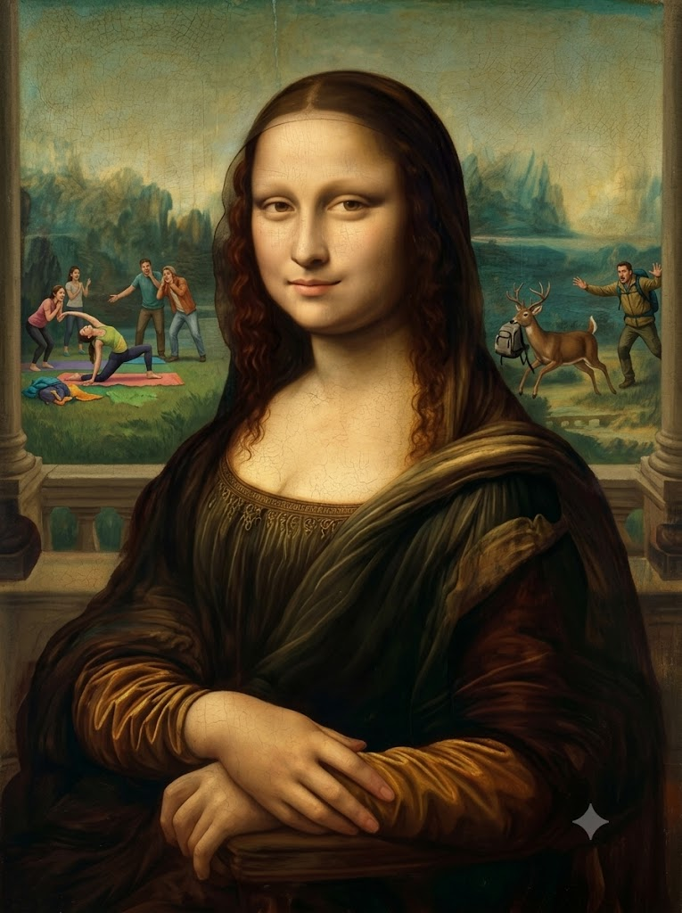
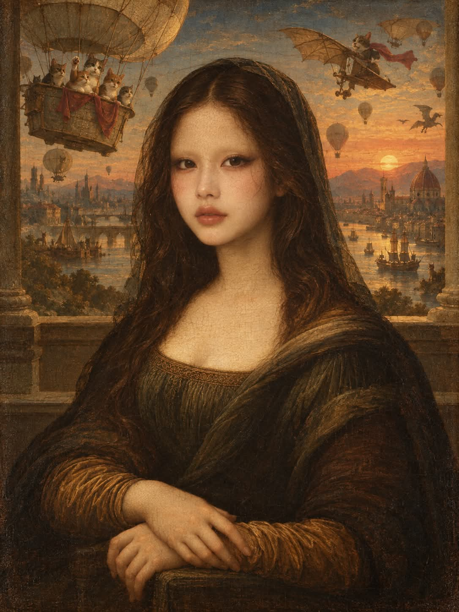

# 숫자로 배경이 정해지는 모나리자 르네상스 유화 패러디 프롬프트

## 1. 개요 및 아트 디렉팅 가이드

- **컨셉**: 얼굴 사진의 인물을 레오나르도 다 빈치의 「모나리자」로 다시 그리되, 입력한 숫자로 계산한 엉뚱하고 황당한 배경을 난간 너머에 펼치는 프롬프트. 배경은 소란스러운데 모나리자만 원작 그대로 고요한 대비가 웃음의 핵심
- **진행 방식**:
  - **1단계**: 이미지를 바로 만들지 않고 "1부터 9999 사이의 숫자를 하나 입력해 주세요."라고만 먼저 질문
  - **2단계**: 숫자를 받으면 계산 과정은 글로 출력하지 않고 이미지만 생성
- **사진에서 가져올 것**: 눈·코·입의 생김새만 가져와 본인임을 알아볼 수 있게 하고, 얼굴형·피부·헤어·눈썹·표정·각도·시선·배경·옷은 가져오지 않음
- **고정 요소 (원작 그대로)**:
  - **구도**: 피라미드형 세로 반신 초상, 3/4로 튼 몸과 정면에 가까운 얼굴, 팔걸이 위에 포갠 두 손, 인물 뒤의 낮은 난간
  - **표정 & 얼굴**: 웃는 건지 아닌지 애매한 신비로운 미소, 눈썹과 속눈썹이 없는 넓고 매끈한 이마, 스푸마토로 번지는 상아빛 피부
  - **헤어 & 의상**: 가운데 가르마의 어두운 갈색 웨이브 머리와 얇은 검은 베일, 금실 자수 네크라인의 짙은 갈색·암녹색 드레스와 어두운 숄. 남성은 같은 색과 소재의 르네상스 남성 상의로 조정
- **배경 계산 (입력한 숫자 N)**:
  - **시대**: N을 3으로 나눈 나머지로 현재, 먼 과거, 먼 미래 중 결정
  - **공간 유형**: 십의 자리 숫자로 실내 생활공간, 도시 바깥, 자연, 움직이는 탈것 중 결정
  - **웃음 포인트 개수**: 백의 자리 숫자로 1~3개 결정
  - **시간대**: N × 7을 4로 나눈 나머지로 아침, 한낮, 노을, 밤 중 결정
  - **다른 존재**: 짝수면 사람이나 동물이 등장, 홀수면 사물과 상황만으로 구성
  - 계산값의 틀 안에서 구체적인 장소와 상황은 인물의 인상에 어울리게 AI가 결정
- **화풍 & 질감 (배경까지 동일하게)**:
  - 포플러 나무 패널에 그린 16세기 초 이탈리아 르네상스 유화, 배경의 황당한 장면도 같은 기법과 스푸마토로 표현
  - 공기원근법, 누렇게 변한 바니시, 표면 전체의 미세한 균열(크라클뤼르)
- **금지**: 글자·숫자·서명·액자 테두리, 원작보다 화사한 색, 배경에 맞춰 인물의 표정·각도·손·의상을 바꾸는 것, 불쾌하거나 잔인한 요소

---

## 2. 프롬프트 전문

```text
[1단계 — 숫자 입력받기 · 가장 먼저 실행]

이 메시지를 받으면 이미지를 바로 만들지 말고, 먼저 나에게 이렇게만 물어볼 것:
"1부터 9999 사이의 숫자를 하나 입력해 주세요. (생일, 좋아하는 숫자 등 아무거나)"

내가 숫자를 답하기 전에는 절대 이미지를 생성하지 말 것

범위를 벗어난 숫자나 숫자가 아닌 답이 오면 다시 물어볼 것

[2단계 — 숫자를 받으면 이미지 생성]

첨부한 얼굴 사진의 인물을 레오나르도 다 빈치의 「모나리자」로 다시 그릴 것

받은 숫자로 아래 [배경] 값을 계산해서 이미지에 반영할 것

계산 과정과 결과값은 글로 출력하지 말고 이미지만 생성할 것

[사진에서 가져올 것 — 이것만]

눈, 코, 입의 생김새(모양·비율·간격)만 가져와서 이 사람임을 알아볼 수 있게 할 것

얼굴형, 피부, 헤어, 이마·헤어라인, 눈썹, 표정은 사진에서 절대 가져오지 말 것

사진 속 머리·얼굴 각도, 고개 기울기, 방향, 시선도 절대 가져오지 말 것. 아래 서술한 각도로 새로 그릴 것

사진의 배경, 옷, 액세서리, 조명도 전혀 반영하지 말 것

사진 속 인물의 전체 인상은 배경 장면을 정할 때만 참고할 것

[구도 — 고정]

세로형 반신 초상화. 피라미드형 안정된 구도

인물은 화면 중앙에 앉아 있고, 몸은 관람자 기준 왼쪽으로 약 3/4 틀어져 있음

얼굴은 몸보다 정면에 가깝게 살짝만 돌아가 있고, 고개는 똑바로 세움

시선은 관람자를 정면으로 바라봄

두 손은 배 앞쪽 의자 팔걸이 위에 포개어 올림. 오른손이 왼손 손목 위에 부드럽게 얹혀 있음

인물 뒤로 낮은 난간(로지아 발코니)이 있고, 화면 양 끝에 기둥 받침이 희미하게 보임

인물과 난간은 원작 위치 그대로, 난간 너머 배경만 바뀜

[표정 — 사진이 아니라 이 서술대로 새로 그림]

입꼬리만 아주 미세하게 올라간 신비로운 미소. 웃는 건지 아닌지 애매한 느낌

눈가에도 은은한 미소가 머물고, 차분하고 고요한 인상

배경이 아무리 소란스러워도 표정은 전혀 흔들리지 않을 것. 뒤에서 무슨 일이 벌어지는지 모르는 듯 태연하게

[얼굴 표현]

눈썹과 속눈썹을 완전히 없앨 것. 눈썹 자리는 이마 피부와 같은 톤으로 매끈하게 이어지고, 털 한 올도 그리지 말 것

이마가 넓고 매끈하게 드러남

피부는 따뜻한 상아빛·황금빛 톤, 스푸마토 기법으로 윤곽선 없이 부드럽게 번지는 명암

[헤어 — 고정]

가운데 가르마를 탄 어두운 갈색 머리, 잔잔한 웨이브

여성은 어깨 아래로 내려오는 긴 머리, 남성은 어깨 길이

머리 위에 아주 얇고 투명한 검은 베일 (남성은 베일 없이 맨머리)

안경 없음

[의상 — 원작 그대로 고정]

짙은 갈색·암녹색의 단순한 드레스, 둥글게 파인 네크라인에 금실 매듭 문양 자수와 잔주름

소매는 황갈색·호박색의 주름진 천

왼쪽 어깨에 어두운 숄을 걸침

장신구 없음

남성이면 같은 색과 같은 소재감의 르네상스 남성 상의와 숄로, 실루엣과 네크라인 자수만 남성형으로

[배경 — 입력받은 숫자로 계산 + AI가 장면 결정]
입력받은 숫자를 N이라 하고 아래 값을 계산할 것.

시대 = N을 3으로 나눈 나머지 → 0은 지금 현재, 1은 르네상스보다 훨씬 먼 과거, 2는 먼 미래

공간 유형 = N의 십의 자리 숫자를 4로 나눈 나머지 → 0은 실내 생활공간, 1은 사람 많은 도시 바깥, 2는 자연, 3은 움직이는 탈것 안이나 위

웃음 포인트 개수 = (N의 백의 자리 숫자를 3으로 나눈 나머지) + 1

시간대 = (N × 7)을 4로 나눈 나머지 → 0은 아침, 1은 한낮, 2는 노을, 3은 밤

배경 속 다른 존재 = N이 짝수면 사람이나 동물이 등장, 홀수면 사물과 상황만으로 웃기게

자릿수가 없는 경우는 0으로 계산

장면 결정 규칙

위 계산값을 반드시 지킬 것. 원작의 산수 풍경이나 무난한 배경으로 돌아가지 말 것

계산값의 틀 안에서 구체적인 장소와 상황은 사진 속 인물의 인상에 어울리게 직접 정할 것

장면은 한눈에 웃음이 터지는 엉뚱하고 황당한 상황으로. 웃음 포인트 개수만큼 배경 곳곳에 웃긴 요소를 배치

웃음의 핵심은 대비: 배경은 소란스럽고 황당한데 모나리자만 원작 그대로 고요하고 우아함

배경 요소가 인물 얼굴·손·상반신을 가리지 말 것. 배경은 난간 너머와 인물 주변 뒤쪽에만

불쾌하거나 잔인하거나 선정적인 요소는 넣지 말 것

[화풍과 질감 — 배경까지 전부 동일하게]

16세기 초 이탈리아 르네상스 유화, 포플러 나무 패널

인물뿐 아니라 배경의 황당한 장면도 전부 다 빈치 시대 유화 기법과 스푸마토로 그릴 것. 배경만 사진이나 현대 일러스트처럼 보이면 안 됨

공기원근법으로 멀리 있는 요소일수록 청록빛·푸른빛으로 흐려짐

부드러운 왼쪽 위 확산광

오래되어 누렇게 변한 바니시, 전체적으로 갈색·녹색·황금빛이 감도는 차분한 화면

표면 전체에 미세한 균열(크라클뤼르)

500년 된 진짜 명화인데 배경만 말이 안 되는 느낌

[금지]

글자, 숫자, 서명, 액자 테두리 넣지 말 것

원작보다 화사하거나 선명한 색 쓰지 말 것

인물의 표정, 각도, 손, 의상을 배경에 맞춰 바꾸지 말 것
```

---

## 3. 결과물 비교 갤러리

| 생성 모델 | 생성 결과 이미지 |
| :--- | :--- |
| **제미나이 (Gemini)** |  |
| **ChatGPT (DALL-E 3)** |  |
