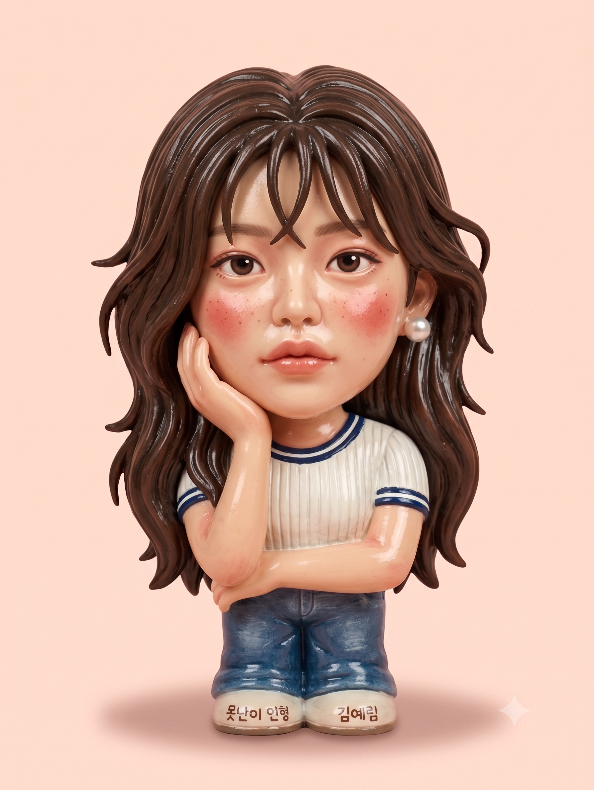
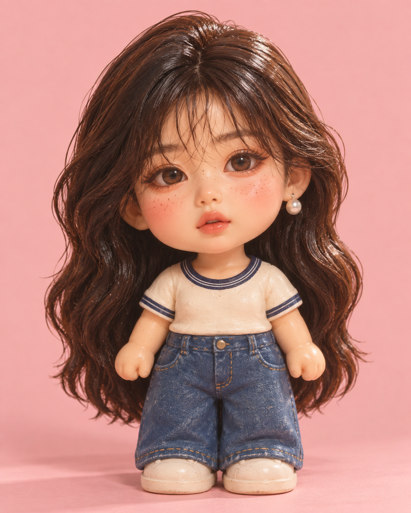

# 1970~80년대 빈티지 못난이 인형 스타일 피규어 프롬프트

## 1. 개요 및 아트 디렉팅 해설
- **콘셉트 테마**: 1970~80년대 한국 가정의 대표적인 레트로 빈티지 아이콘인 **"못난이 인형"** 스타일로 실사 인물을 재해석한 소프트 비닐(소프비, Sofubi) 피규어
- **핵심 조형 원리 및 연출**:
  - **인물 아이덴티티 100% 보존**:
    - 눈매, 코, 입술, 얼굴형, 헤어스타일, 안경·수염·귀걸이 등 개인적 고유 특징을 그대로 유지하여 한눈에 대상 인물임을 인식 가능.
    - 정형화된 못난이 인형 표정(감은 눈, 삐죽 입)으로 바꾸지 않고, **원본 인물의 고유 표정을 그대로 반영**.
  - **못난이 인형 시그니처 스타일링**:
    - 2~3등신의 귀여운 대두(Chibi) 비율로 과장.
    - 통통한 볼 위에 발그레하게 얹은 붉은 홍조와 콕콕 찍힌 주근깨 디테일.
  - **레트로 소프비(소프트 비닐) 재질감**:
    - 3D CG 렌더링이 아닌, 은은한 광택이 도는 소프트 비닐 피규어의 실물 촉감.
    - 70~80년대 공방에서 손으로 칠한 듯한 단순한 채색과 미세한 붓자국.
    - 의상도 원본의 컬러와 형태를 유지하되 인형 옷처럼 단순하고 직관적으로 축약.
- **촬영 스타일**:
  - 단색 파스텔톤 배경 앞, 부드러운 스튜디오 조명 아래 촬영된 빈티지 수집용 토이 제품 사진.

---

## 2. 프롬프트 전문 (코드 블록)

```text
첨부한 사진 속 인물을 한국 1970~80년대 빈티지 "못난이 인형" 스타일 피규어로 만들어줘.

[최우선]
사진 속 인물의 얼굴 생김새를 그대로 유지할 것:
눈 모양과 크기, 쌍꺼풀 유무, 눈 사이 간격
코의 높이와 모양, 입술 두께와 입꼬리 방향
얼굴형(둥근/각진/갸름한), 눈썹 모양과 굵기
점, 보조개, 주름 등 개인적 특징
헤어스타일, 앞머리 형태, 머리 색
안경, 수염, 귀걸이 등 착용 소품
이 인물임을 한눈에 알아볼 수 있어야 함.

[스타일]
위 얼굴 특징을 유지한 상태에서 다음 요소만 적용:
비율만 2~3등신으로 과장 (머리 크게, 몸 작게)
볼에 발그레한 홍조와 주근깨 추가
광택 있는 소프트 비닐 인형 재질감
손으로 칠한 듯 단순한 채색, 미세한 붓자국
옷은 원본 색상과 형태를 유지하되 인형 옷처럼 단순화

[금지]
얼굴을 못난이 인형의 정형화된 표정(감은 눈, 삐죽 입)으로 바꾸지 말 것.
표정은 원본 사진의 표정을 따를 것.

[배경]
단색 파스텔 배경, 정면 스튜디오 제품 사진, 부드러운 그림자.
3D 렌더링이 아닌 실물 비닐 인형을 촬영한 사진처럼.
```

---

## 3. 생성 예제

| Gemini | GPT |
| :---: | :---: |
|  |  |
