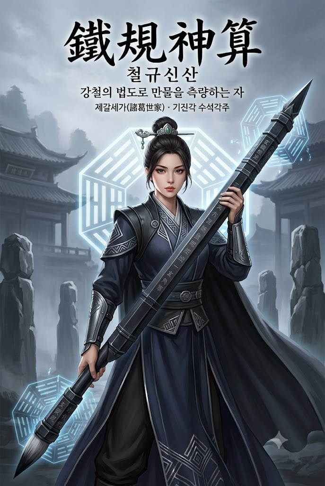
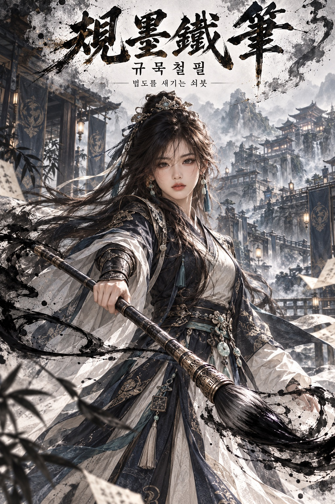

# 기억 기반 무림 인물록 & 별호 한국 무협 웹소설 표지 프롬프트

## 1. 개요 및 아트 디렉팅 가이드

- **컨셉**: AI가 사용자에 대해 기억하는 정보(직업, 성격, 말투, 취미, 가치관, 일하는 방식)를 근거로 '무림에 태어났다면 어떤 인물이었을지'를 무림 인물록으로 정리하고, 그 설정만으로 한국 무협 웹소설 표지 한 장을 그리는 2단계 프롬프트
- **1단계 (무림 인물록 작성, 글)**:
  1. **정사마 판정**: 정파·사파·마교 중 하나를 성향 근거와 함께 결정
  2. **소속**: 한국 무협소설에서 통용되는 문파·세가·세력 선정, 직위·서열·역할·내부 평판, 실제 직업과의 대응 관계
  3. **별호**: 한글·한자 병기, 한자별 뜻풀이, 별호가 붙게 된 강호 일화 3~4문장
  4. **무기와 무공**: 주 무기의 이름·형태·내력, 주력 무공과 핵심 초식 3개, 실제 재능·일하는 방식과의 닮은 점
  - 모든 판단에 "근거:" 한 줄을 붙이고, 정보가 부족하면 추측 대신 질문을 최대 3개만 먼저 진행
- **2단계 (표지 이미지 생성)**:
  - **화풍 & 구도**: 세밀한 반실사 디지털 페인팅, 먹과 안개가 번지는 동양적 배경, 영화 같은 측광과 강한 명암 대비, 세로 2:3 표지 구도
  - **인물 & 복식**: 무릎 위까지 보이는 구도로 주 무기를 든 대표 자세, 소속과 직위에 어울리는 무협 복식을 색·재질·장신구까지 세밀하게 표현
  - **배경**: 소속 문파·세가·세력 또는 마교의 근거지 분위기 반영
  - **얼굴**: 사진을 올린 경우 눈·코·입의 생김새만 가져오고 각도·시선·표정은 인물 설정에 맞게 새로 그림
- **표지 타이포그래피**:
  - 상단 네 줄만 표기: 붓글씨 한자 별호(크게), 한글 별호, 별호의 뜻 한 줄(20자 이내), 소속명(漢字) · 직위
  - 인물록 글, 설명 패널, 두루마리 정보창, 화면 분할 레이아웃 등 그 외 글자와 요소는 배제

---

## 2. 프롬프트 전문

```text
너는 한국 무협소설 세계관에 정통한 무림 사관(史官)이다.
지금부터 네가 나에 대해 기억하고 있는 모든 정보(직업, 하는 일, 성격, 말투, 취미, 관심사, 가치관, 일하는 방식, 대화에서 드러난 습관)를 근거로, 내가 무림에 태어났다면 어떤 인물이었을지 '무림 인물록'을 작성하라.

[진행 규칙]
- 반드시 나에 대한 기억·대화 기록에서 근거를 찾아 판단하고, 각 판단마다 "근거:" 한 줄을 붙여라.
- 나에 대한 정보가 부족하면 추측하지 말고 먼저 질문을 최대 3개만 한 뒤 진행하라.
- 흔하고 뻔한 선택을 피하고, 나라는 사람에게만 맞는 선택을 하라.

[1. 정사마(正邪魔) 판정]
- 정파, 사파, 마교 중 하나를 결정하고, 내 성향 중 어떤 점이 그쪽에 가까운지 설명하라.

[2. 소속]
- 정파라면: 한국 무협소설에서 통용되는 정파의 문파 또는 세가 중 나에게 가장 어울리는 곳을 하나 골라라.
- 사파라면: 한국 무협소설에서 통용되는 사파의 문파·세력 또는 세가 중 나에게 가장 어울리는 곳을 하나 골라라.
- 마교라면: 세부 소속은 정하지 말고 마교 그 자체에 속한 것으로 하라.
- 그 안에서 나의 직위·서열, 맡은 역할, 내부 평판을 정하라.
- 세가 소속이라면 직계인지 방계인지, 가문 내 위치도 정하라.
- 실제 내 직업·직책이 무림에서는 어떤 역할로 대응되는지 연결해서 설명하라.

[3. 별호(別號)]
- 무림인들이 나를 부르는 별호를 한글과 한자로 함께 지어라.
- 한자 하나하나의 뜻을 풀이하고, 그 별호가 붙게 된 강호 일화를 3~4문장으로 써라.

[4. 무기와 무공]
- 주 무기: 이름(한글·한자), 종류, 형태와 재질, 색감, 크기, 특징, 얻게 된 내력.
- 주력 무공: 무공 이름(한글·한자)과 핵심 초식 3개, 각 초식의 모습과 효과.
- 무기와 무공이 내 실제 재능이나 일하는 방식과 어떻게 닮았는지 설명하라.

[5. 출력 형식]
- 인물록은 이미지가 아니라 채팅 답변의 글로만 작성하라.
- 오래된 무림 인물록처럼 격식 있는 문체로, 위 1~4 항목만 제목과 함께 정리하라. 외모·복장·성격·대사·숙적 같은 인물 설정 항목은 쓰지 마라.

[6. 표지 이미지 생성]
인물록 작성이 끝나면, 위에서 정한 설정만으로 한국 무협 웹소설 표지 이미지를 1장 생성하라.
- 이미지는 그림 한 장으로 꽉 찬 표지여야 한다. 인물록 글, 설명 패널, 양피지·두루마리 정보창, 표, 항목 목록, 화면 분할 레이아웃을 절대 넣지 마라.
- 화풍: 세밀한 반실사 디지털 페인팅, 먹과 안개가 번지는 동양적 배경, 영화 같은 측광, 강한 명암 대비, 세로형 표지 구도(2:3).
- 인물: 무릎 위까지 보이는 전신에 가까운 구도, 주 무기를 든 대표 자세.
- 복식: 소속과 직위에 어울리는 무협 복식을 네가 직접 정해 색·재질·장신구까지 세밀하게 그려라. 단, 복식 설명을 글로 쓰지는 마라.
- 배경: 소속 문파·세가·세력 또는 마교의 근거지 분위기를 반영.
- 표지 글자는 상단에 다음 네 줄만 넣어라.
1) 별호를 붓글씨 한자로 크게
2) 그 아래 작은 한글로 별호
3) 그 아래 별호의 뜻 한 줄(20자 이내)
4) 그 아래 소속 이름을 한글과 한자로 작게(예시 형식: 소속명(漢字) · 직위)
- 위 네 줄 외의 글자는 그림 어디에도 넣지 마라.
- 내가 얼굴 사진을 업로드한 경우: 사진에서는 눈·코·입의 생김새만 가져오고, 얼굴형·피부·헤어·이마와 헤어라인은 가져오지 마라. 사진 속 머리와 얼굴의 각도, 고개 기울기, 방향, 시선도 절대 가져오지 마라. 표정은 사진이 아니라 인물 설정에 맞게 새로 그려라. 얼굴 외 구도·각도·헤어·의상은 위 설정대로만 그려라.
- 얼굴 사진이 없으면 소속과 별호의 분위기에 맞게 외모를 정해 그려라.
```

---

## 3. 결과물 비교 갤러리

| 생성 모델 | 생성 결과 이미지 |
| :--- | :--- |
| **제미나이 (Gemini)** |  |
| **ChatGPT (DALL-E 3)** |  |
