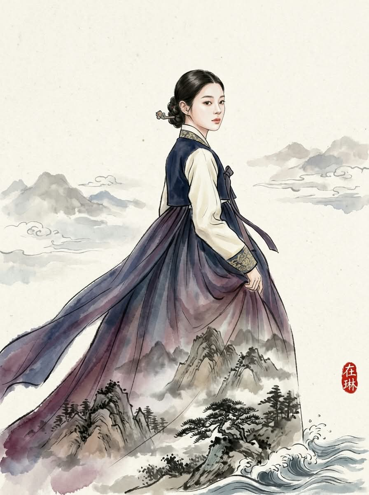
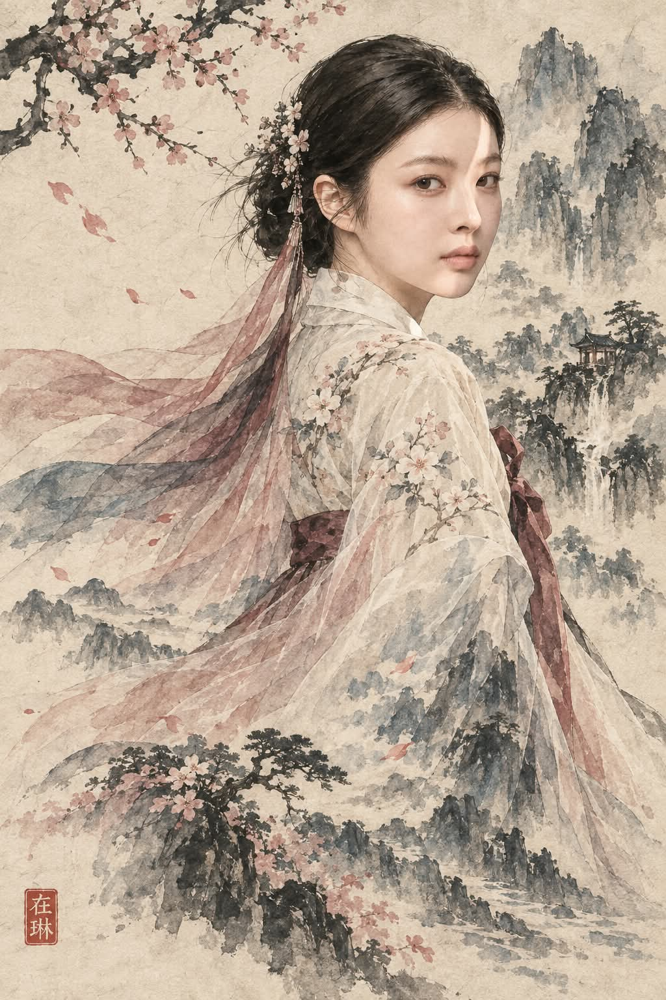

# 물아일체(物我一體) : 풍경 동화 프롬프트

## 1. 개요 및 연출 분석
- **콘셉트 테마**: **물아일체(物我一體)** — 인물과 자연 풍경이 경계 없이 온전히 하나로 녹아드는 초현실적 동양 미학
- **핵심 시각 효과 — 풍경 동화 (Landscape Dissolve)**:
  - 어깨 부분은 은은한 광택과 결이 살아있는 단단한 옷감으로 시작.
  - 아래로 내려올수록 점점 반투명해지며 물질감을 잃고, **안개 낀 산맥, 소나무 숲의 수관, 흘러가는 구름, 부서지는 파도 등 웅장한 자연 풍경 그 자체로 부드럽게 녹아내림**.
  - 옷의 주름선이 산능선과 물결의 포말로 자연스럽게 연속되는 경계 없는 소프트 그라디언트 연출.
  - 얼굴과 갓/머리는 또렷한 형태로 유지되어 인물의 아이덴티티를 보존하면서 하단 옷자락만 풍경과 일체화.
- **화풍 및 재질감**:
  - 사진이나 3D CG가 아닌, 질감이 살아있는 한지 위에 붓질 자국, 먹의 번짐, 엷은 천연 담채(쪽빛, 청자색, 감색, 비취색 등)가 스며든 순수 회화적 깊이감.
  - 넉넉한 여백의 미(餘白의 美)와 절제되고 고요한 분위기.
- **포인트 낙관**:
  - 화면 하단 구석에 붉은색 한자 주문방인(朱文方印) 낙관 **「在琳」** 배치.

---

## 2. 프롬프트 전문 (코드 블록)

```text
This is a traditional Korean ink-and-wash painting (수묵담채화),
brushed onto textured hanji paper. It is not a photograph, not a 3D
render, not digital concept art, and not a graphic novel
illustration. Every part of the image should look like it was made
with a brush: visible brushstrokes, ink bleeding softly into the
paper fibers, pale watercolor washes laid over black ink linework,
and generous empty space where the paper is left bare. The paper
grain shows through everywhere. The overall feel is quiet, restrained
and hand-painted rather than sharp and polished.

Paint the person from the uploaded photo as the subject of this
painting. Make them beautiful — luminous skin, refined features, the
idealized elegance of a figure in a classical court painting — but
keep their actual face. The same face shape, the same eyes, the same
nose, the same mouth, the same age. Someone who knows this person
should recognize them immediately. This is the most beautiful version
of this particular person, not a different beautiful person.

If the photo shows a man, paint him in a men's hanbok: a jeogori
beneath a wide-sleeved durumagi overcoat, baji trousers, and a
knotted waist sash. He wears a gat — the wide-brimmed Korean scholar's
hat woven from semi-transparent black horsehair mesh, with a flat
cylindrical crown roughly a hand tall and a perfectly flat circular
brim that extends past his shoulders, secured with a beaded chin
strap. The brim is a flat disc, never conical and never a straw hat.
His topknot and manggeon headband are faintly visible through the
mesh. The gat must be present; a bare topknot alone is wrong.

If the photo shows a woman, paint her in a women's hanbok: a short
jeogori with gently curved sleeves and a goreum ribbon tie, above a
full, voluminous chima skirt, with a long sheer shawl trailing behind
her in the wind. Her hair is gathered in a traditional updo held by a
binyeo hairpin. She wears no gat.

Choose the colors freely from the traditional Korean dye palette —
obangsaek tones, indigo, celadon, persimmon, plum, jade, ivory, deep
navy — with quiet gold thread at the collar and cuffs. This is Korean
hanbok, not Chinese hanfu and not Japanese kimono.

The most important effect: the overcoat, the chima skirt and the
trailing shawl gradually stop being cloth and become the landscape
itself. At the shoulders the fabric is solid and opaque, with clear
silk sheen and folds. As the eye travels downward the cloth grows
more and more translucent, its weave dissolving into the texture of
the world behind it, until by the hem there is no garment left at all
— only mist-wrapped mountain ridges, pine canopies, drifting cloud
and breaking sea. The change is a slow continuous gradient with no
edge, no seam and no cut line anywhere; the folds of the fabric
simply keep going as wave crests, cloud streaks and ridgelines, and
the garment's colors shift into the landscape's colors as they fall.
The face, the head and the gat stay fully solid and opaque — only the
clothing below dissolves.

Let the pose be chosen at random: turned three-quarters away,
glancing back over one shoulder, sleeves lifted by the wind, or
standing still in contemplation.

In one lower corner, press a small vermilion artist's seal (낙관) — a
red square stamp bearing exactly two Chinese characters, 在 above and
琳 below, carved in white seal script on the red ground. It should
look like a real ink stamp pressed into the paper: small, slightly
uneven, a little imperfect. These two characters only, and no other
text anywhere in the image.
```

---

## 3. 생성 예제

| Gemini | GPT |
| :---: | :---: |
|  |  |

