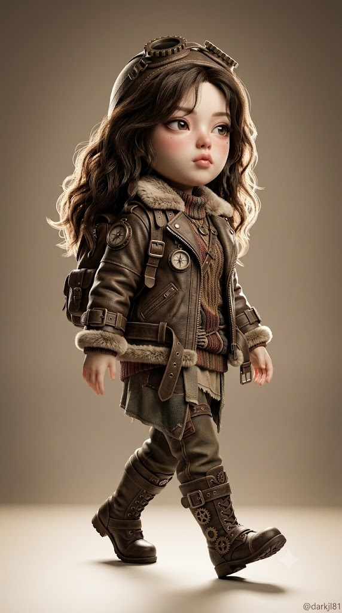
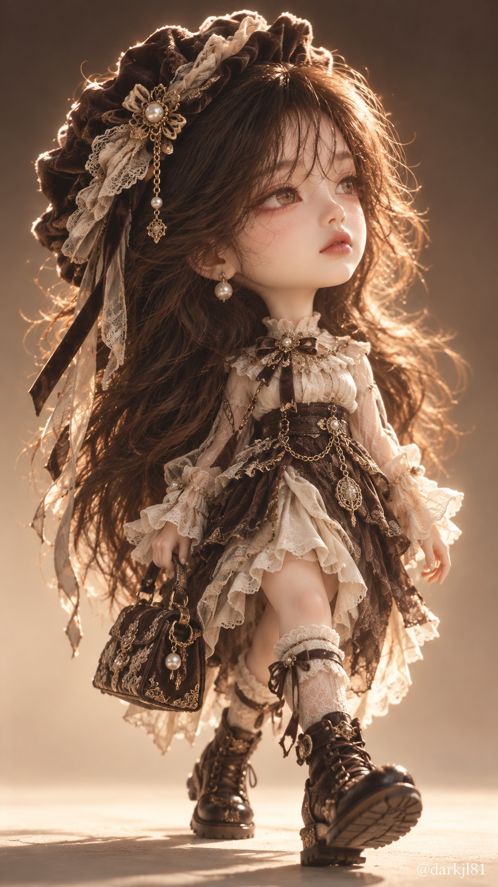

# 3등신 디자이너 피규어 미니미 아트토이 콘셉트 워크 프롬프트

## 1. 개요 및 아트 디렉팅 가이드
- **컨셉/장르**: 성인 인물의 연령감과 인상을 유지한 채 3등신 비율로 재해석한 고급 수집용 디자이너 아트토이 피규어 콘셉트 워크.
- **스타일 & 화풍**:
  - 하이퍼리얼 3D 렌더 기반, 팝 초현실주의 디지털 페인팅과 3D 비스크 인형 기법의 융합.
  - 무광 도자기 질감 피부, 붓결 라이팅, 유리구슬처럼 맑고 깊은 과장된 큰 눈망울, 자연스러운 볼과 코끝의 혈색.
- **의상 & 소품 (모험 코스튬)**:
  - 그림책 속 모험가처럼 발랄하고 엉뚱한 상상력의 오버사이즈 실루엣(풍성한 외투, 볼륨 있는 하의, 청키 슈즈).
  - 콘셉트를 상징하는 장난감처럼 거대하고 귀여운 소품 1종 필수 포함(거대 모자, 백팩, 탐험 장비 등).
  - 두툼한 니트, 캔버스, 빈티지 가죽, 황동 버클 등 손때 묻은 극사실 소재 질감과 세피아 톤 속 포인트 컬러 배색.
- **포즈 & 구도**:
  - 세로 9:16 전신 로우앵글 샷.
  - 상체를 뒤로 살짝 젖히고 으스대며 한 발을 크게 내딛는 걷기 중간 동작.
  - 오른쪽 3/4 방향, 턱을 치켜들고 오른쪽 먼 곳을 응시하는 도도하고 시크한 표정(카메라 미응시).
- **조명 & 배경**:
  - 강한 역광으로 형성되는 실루엣 림라이트와 머리카락·섬유 보풀의 글로우 헤일로.
  - 상단 토프에서 하단 밝은 베이지로 자연스럽게 번지는 심리스 스튜디오 그라데이션 배경 및 부드러운 접지 그림자.

## 2. 프롬프트 전문

```text
[미니미 아트토이 콘셉트 워크]

업로드한 사진은 성인 인물이며, 결과물은 같은 인물을 3등신 비율로 축소한 수집용 디자이너 아트토이 피규어로 표현한다. 인물의 연령감은 그대로 유지하고, 비율만 미니미 스타일로 바꾼다.

업로드한 사진에서 가져오는 것:
1) 눈·코·입의 생김새 특징 (아래 얼굴 화풍으로 재해석해서 반영)
2) 안경 또는 선글라스 (테 모양, 색상, 렌즈 색까지 그대로. 착용하지 않았다면 아이웨어 없음)
3) 인물의 전체적인 인상과 분위기 (의상 콘셉트를 정하는 데만 참고)

업로드한 사진에서 절대 가져오지 않는 것:
얼굴형, 피부톤, 헤어, 이마/헤어라인, 표정, 머리·얼굴 각도, 고개 기울기, 시선 방향, 몸 포즈, 사진 속 옷, 배경, 조명.
머리 각도와 시선은 사진이 어떻든 반드시 아래 '머리 각도'대로 그린다.

■ 의상 (AI가 직접 결정)
- 인물의 인상·분위기를 분석해 가장 잘 어울리는 콘셉트를 하나 정하고, 디자이너 아트토이처럼 장난스럽고 엉뚱한 상상력의 모험 코스튬을 새로 디자인해 입힌다.
- 우아함·섹시함·고딕 패션이 아니라, 그림책 속 모험가처럼 발랄하고 유쾌한 분위기.
- 형태는 둥글고 큼직하고 단순하게: 몸보다 훨씬 큰 오버사이즈 상의나 외투, 통 넓고 볼륨 있는 하의, 무릎을 덮는 길이.
- 콘셉트를 상징하는 과장되게 큰 소품 하나를 반드시 포함 (모자·헤드기어·가방·등에 메는 장비 등 중 AI가 선택). 장난감처럼 크고 귀여운 비율.
- 소재는 두툼한 니트, 캔버스, 낡은 가죽, 펠트, 황동 버클 등 손때 묻은 질감을 실사처럼 디테일하게.
- 신발은 굽 없는 투박한 부츠나 청키 스니커즈, 발이 몸에 비해 크고 뭉툭하게.
- 색은 전체 세피아 톤 안에서 콘셉트를 살리는 포인트 컬러 1~2개를 선명하게 사용.
- 실제 브랜드 로고, 기존 만화·영화 캐릭터 의상은 사용하지 않음.
- 안경/선글라스를 썼다면 그대로 착용시키고, 헤드기어가 아이웨어를 가리지 않게 함.

■ 화풍 / 질감
- 하이퍼리얼 3D 렌더. 고급 수집용 디자이너 피규어처럼 정교하고, 머리카락 한 올, 원단 직조감·보풀·주름까지 실사 질감.
- 머리가 크고 몸이 작은 약 3등신, 짧고 둥글둥글한 팔다리의 피규어 체형.

■ 얼굴 스타일 (화풍만 적용)
- 팝 초현실주의 디지털 페인팅 × 3D 비스크 인형 화풍. 특정 캐릭터를 복제하지 않고, 사진 인물의 눈·코·입 특징을 이 화풍의 문법으로 재해석한다.
- 피부는 무광 도자기 질감에 은은한 페인팅 붓결, 부드럽게 번지는 명암.
- 눈은 실제보다 과장되게 크게, 홍채는 유리구슬처럼 깊고 투명하게. 눈 모양·눈꼬리 방향·쌍꺼풀 유무는 사진 인물 특징을 따른다.
- 코와 입은 실제보다 작게 축소하되 형태 특징은 사진 인물을 따른다.
- 볼·코끝·눈가에 피부 자체의 혈색처럼 번지는 붉은 기.
- 메이크업 없음: 립스틱·아이라인·섀도 없이 자연스러운 혈색만.
- 전체적으로 몽환적이고 살짝 기묘한 인형 같은 분위기.
- 장식 요소(얼굴 보석, 주근깨 등)는 의상 콘셉트에 맞을 때만 AI가 판단해 추가.

■ 머리 각도 (고정)
- 몸은 화면 오른쪽 앞을 향한 3/4 측면, 머리는 몸보다 더 오른쪽으로 돌아가 얼굴이 오른쪽 45~60도 방향을 봄.
- 턱을 살짝 치켜든 상태, 시선은 화면 오른쪽 위쪽 먼 곳. 카메라를 보지 않음.

■ 표정
- 사진과 무관하게 새로 그림: 입술을 다문 무심하고 도도한 표정, 한쪽 입꼬리만 아주 살짝 올라감. 눈은 살짝 내리깔아 시크한 느낌.

■ 헤어
- 의상 콘셉트에 어울리는 헤어스타일과 색을 AI가 정함. 실사 질감으로 풍성하고, 역광에 가장자리가 빛나게.

■ 구도 / 카메라
- 세로 9:16 전신 샷. 머리(모자 포함)부터 신발 끝까지 화면 중앙에 모두 들어옴.
- 무릎 높이 로우앵글에서 살짝 올려다봄.

■ 포즈
- 걷는 중간 동작: 화면상 오른쪽 발이 앞으로 크게 내딛어져 발끝이 살짝 들려 있고, 왼쪽 발은 뒤에서 뒤꿈치가 들린 상태.
- 양팔은 몸 옆으로 힘 빼고 늘어뜨림. 상체를 약간 뒤로 젖혀 으스대는 걸음걸이.

■ 조명 / 색감
- 강한 역광이 실루엣 전체 가장자리에 밝은 림라이트와 은은한 글로우 헤일로를 만듦. 머리카락·원단 보풀 끝이 빛남.
- 좌상단 전면에서 부드러운 키라이트, 그림자 쪽은 깊고 차분한 명암.
- 약한 블룸, 시네마틱 하이콘트라스트, 따뜻한 세피아·토프 톤으로 채도 낮게 그레이딩. 포인트 컬러만 살아 있게.

■ 배경
- 이음매 없는 스튜디오 배경. 토프·베이지 그라데이션으로 위는 어둡고 아래로 갈수록 밝아짐.
- 바닥은 밝게 빛나며 발밑에 부드러운 접지 그림자. 소품·텍스트 없음.

■ 워터마크
- 우하단에 작은 흰색 텍스트 "@darkjl81".

금지: 동물 신체 요소(꼬리·동물 귀·털), 정면 얼굴, 카메라 응시, 사진 속 머리 각도·표정·헤어·옷 반영, 8등신 실제 비율, 평범한 일상복, 코르셋, 레이스 란제리풍 디테일, 가터·허벅지 스트랩, 짧은 치마나 허벅지 노출, 하이힐·굽 있는 부츠, 진한 립스틱, 글램 메이크업, 긴 인조 속눈썹, 애니메이션풍 미소녀 얼굴, 성숙한 패션 화보 분위기, 수채화·페인팅 붓터치 배경.
```

## 3. 결과물 비교 갤러리

| 제미나이 (Gemini) | GPT (DALL-E 3) |
| :---: | :---: |
|  |  |
