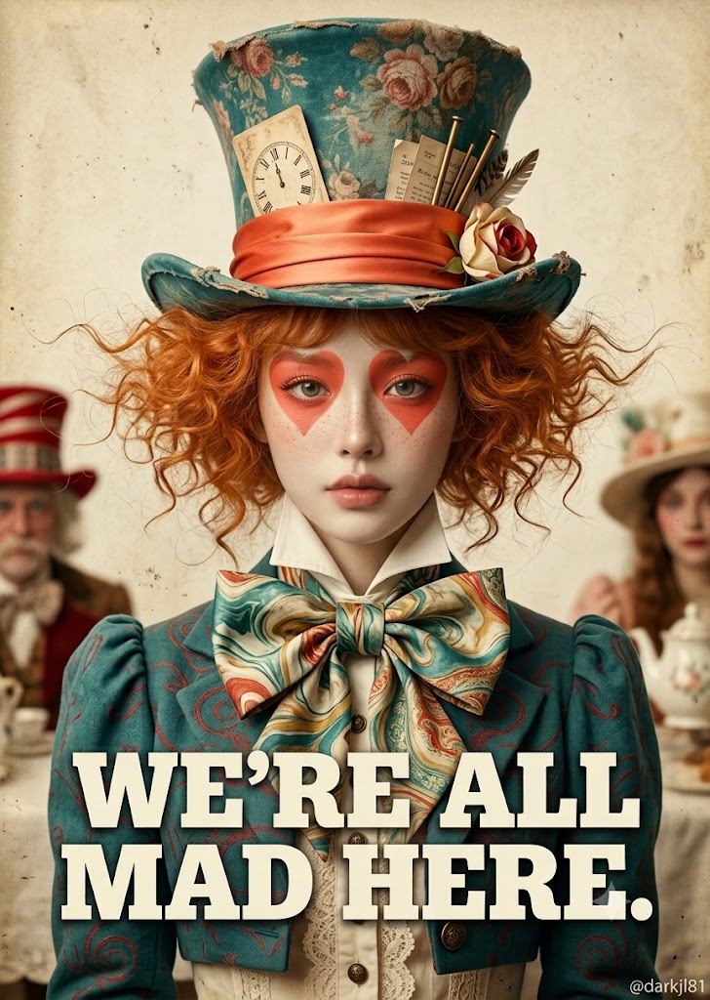
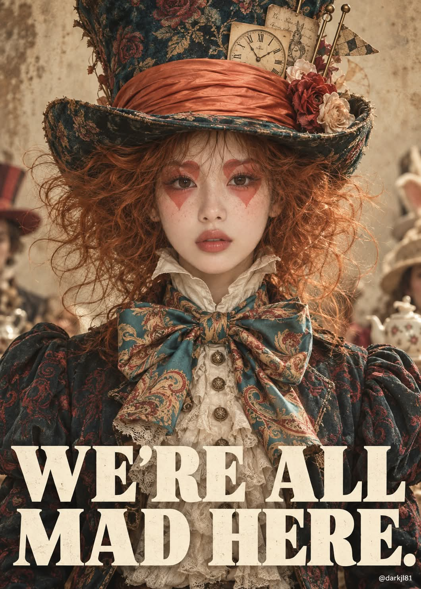

# 이상한 나라의 앨리스 매드 해터 하이엔드 패션 포스터 프롬프트

## 1. 개요 및 아트 디렉팅 가이드
- **컨셉/장르**: 《이상한 나라의 앨리스》 속 매드 해터(모자장수) 모티프의 하이엔드 패션 에디토리얼 실사 포스터 (85mm f/2.8 풀프레임 촬영 질감, 빛바랜 빈티지 세피아 크림빛 필름 그레이딩).
- **인물 & 페이스 페인팅**:
  - 창백한 도자기 피부와 연한 주근깨, 차분하면서도 은은한 광기가 스민 몽환적인 정면 응시 눈빛.
  - 양 눈 주위에 무광 코랄 레드 색상의 거꾸로 된 하트 페이스 페인팅(둥근 윗부분이 눈썹을 덮고 뾰족한 끝이 광대를 향함).
  - 진저·구릿빛 오렌지 컬러의 풍성하고 부스스하게 부풀어 퍼진 곱슬머리.
- **모자 & 빅토리아풍 의상**:
  - 화면 상단 40%를 차지하는 짙은 틸(청록) 색 빈티지 벨벳 톱햇(장미 문양 태피스트리, 코랄 오렌지 새틴 띠, 로마숫자 시계 카드, 낡은 종이 쪽지, 황동 막대, 패브릭 장미).
  - 턱 아래까지 세운 빅토리아풍 스탠드 칼라 크림 셔츠, 어깨 너비의 거대한 페이즐리 마블링 실크 보타이, 퍼프 소매 크롭 재킷과 레이스 프릴 장식.
- **배경, 조명 & 타이포그래피**:
  - 낡은 양피지 질감 배경 및 양옆에 아웃포커스로 흐릿하게 배치된 티파티 손님 실루엣.
  - 클래식 초상화 풍의 부드러운 상단 확산광, 틸과 코랄의 선명한 보색 대비.
  - 가슴 위에 겹쳐지는 크림 화이트 슬랩 세리프 2줄 타이포: `WE'RE ALL / MAD HERE.` 및 우하단 워터마크 `@darkjl81`.

## 2. 프롬프트 전문

```text
[업로드 이미지 사용 규칙]

업로드한 사진은 얼굴 정체성 참고용으로만 사용한다.

사진에서 가져오는 것: 눈·코·입의 생김새와 얼굴 인상의 특징만.

가져오지 않는 것: 얼굴형, 피부톤과 피부 질감, 헤어, 이마·헤어라인, 고개 기울기, 얼굴 방향, 시선, 표정, 조명, 배경, 의상.

머리와 얼굴의 각도는 사진을 절대 따르지 않는다. 아래 구도대로 정면을 향하게 새로 그린다.

표정은 사진의 표정을 쓰지 않고 아래 서술대로 새로 그린다.

얼굴 외의 구도·각도·헤어·의상·소품·색감은 아래 서술에서 하나도 바꾸지 않는다.

[장르 / 화질]

이상한 나라의 앨리스 속 모자장수(매드 해터)를 모티프로 한 실사 인물 포스터.

하이엔드 패션 에디토리얼 사진 느낌. 풀프레임 카메라와 85mm 렌즈, f/2.8로 촬영.

실제 피부 모공, 주근깨, 원단 결, 실크 광택, 머리카락 한 올까지 보이는 초고해상도 사진으로 만든다.

일러스트나 3D 렌더 느낌은 없어야 한다.

전체 톤은 빛바랜 빈티지 필름 사진처럼 한다. 채도는 낮게, 따뜻한 세피아 크림빛으로 그레이딩한다.

[구도]

세로형 포스터, 비율 약 5:7.

인물은 정중앙에 정면으로 서 있고 허리 위까지 보인다.

카메라를 똑바로 바라보는 대칭 구도이며, 고개는 기울이지 않는다.

거대한 모자가 화면 위쪽 약 40%를 차지하고, 모자 꼭대기는 프레임 상단에서 살짝 잘린다.

얼굴은 화면 세로 약 1/3 지점에 온다.

[인물]

창백한 도자기빛 피부. 코와 볼 위에 연한 주근깨가 흩뿌려져 있다.

표정은 무표정에 가깝다. 입술은 다문 채 입꼬리만 아주 살짝 올라가 있다.

눈은 크게 뜨고 있으며, 차분하지만 어딘가 광기가 스민 몽환적인 눈빛이다. 시선은 정면 카메라를 향한다.

페이스 페인팅: 두 눈 주위에 선명한 코랄 레드 하트 모양 페인트를 칠한다.

하트는 거꾸로 된 형태다. 하트의 둥근 윗부분은 눈썹 위를 덮고, 뾰족한 아래 끝은 광대 위쪽을 향한다.

페인트는 무광이고 가장자리가 깔끔하다. 눈동자와 속눈썹은 그대로 드러난다.

입술은 자연스러운 로즈 누드 톤이다.

[헤어]

진저·구릿빛 오렌지 색의 곱슬머리. 풍성하고 부스스하다.

모자 아래 양옆으로 바람에 날리듯 크게 부풀어 퍼지고, 잔머리가 공중에 흩날린다.

앞머리는 모자 챙 아래로 살짝만 보인다.

[모자]

과장되게 높고 위로 갈수록 넓어지는 톱햇. 짙은 틸(청록) 색이다.

표면은 빈티지 벨벳과 태피스트리 원단으로, 바랜 붉은 장미·꽃 문양이 전체에 은은하게 프린트되어 있다.

오래 쓴 듯 가장자리가 해져 있다.

챙은 넓게 위로 말려 올라가 있다.

모자 밑단에는 코랄 오렌지 실크 새틴 띠를 여러 겹 주름지게 두껍게 감았다.

띠에는 다음 소품이 꽂혀 있다.

로마숫자 시계가 그려진 누렇게 바랜 카드

낡은 종이 쪽지 여러 장

가느다란 황동 막대와 깃대 몇 개

옆쪽에 반쯤 핀 크림색과 붉은색의 천 장미 봉오리

[의상]

목: 크림색 셔츠. 옷깃을 높이 세워 턱 아래까지 올라오는 빅토리아풍 스탠드 칼라이며, 칼라 끝이 뾰족하게 벌어진다.

가슴: 목 아래에 거대한 실크 보타이를 맨다. 어깨 너비에 가까운 크기다. 틸 바탕에 크림·머스터드·코랄 레드의 마블링과 페이즐리 문양이 있다.

상의: 짙은 틸 색 짧은 크롭 재킷. 붉은 소용돌이 문양이 은은하게 짜여 있고, 소매는 퍼프 소매로 어깨가 크게 부푼다. 앞섶은 열려 있다.

안쪽: 크림색 셔츠. 가슴에 레이스 프릴 장식이 있고, 앤틱 황동 단추가 세로로 달려 있다.

[배경]

낡은 크림·양피지 색 배경. 얼룩과 먼지 질감이 있고 비네팅이 들어간다.

양옆 가장자리에는 다른 티파티 손님들을 아웃포커스로 흐릿하게 걸쳐 둔다.

왼쪽: 붉은 줄무늬 모자를 쓴 인물

오른쪽: 크림색 모자를 쓴 인물과 도자기 찻주전자

이들은 얼굴이 잘 보이지 않을 만큼 잘리고 흐려야 한다.

[조명]

정면 위쪽에서 들어오는 부드러운 확산광. 클래식 초상화처럼 얼굴에 은은한 그림자를 준다.

모자 챙 아래 이마에는 살짝 그늘이 진다.

틸 색과 코랄 색이 서로 대비되며 도드라지게 한다.

[텍스트]

화면 하단 1/3, 인물 가슴과 재킷 위에 겹쳐서 크림 화이트 색 굵은 슬랩 세리프 대문자로 두 줄 크게 넣는다.

1행: WE'RE ALL

2행: MAD HERE.

좌우 폭을 거의 꽉 채우고 자간은 촘촘하게 한다. 글자는 또렷해야 하며, 철자는 정확히 위와 같아야 한다.

그 외의 로고, 서명, 워터마크, 테두리 박스는 넣지 않는다.

단, 우하단 구석에 작은 흰색 글씨로 "@darkjl81"만 넣는다.

[금지]

일러스트·애니·3D 렌더 질감, 과도한 보정 피부, 사진 속 원래 각도·표정·헤어의 반영, 비대칭 구도, 원본 포스터의 서명·워터마크, 글자 깨짐.
```

## 3. 결과물 비교 갤러리

| 제미나이 (Gemini) | GPT (DALL-E 3) |
| :---: | :---: |
|  |  |
