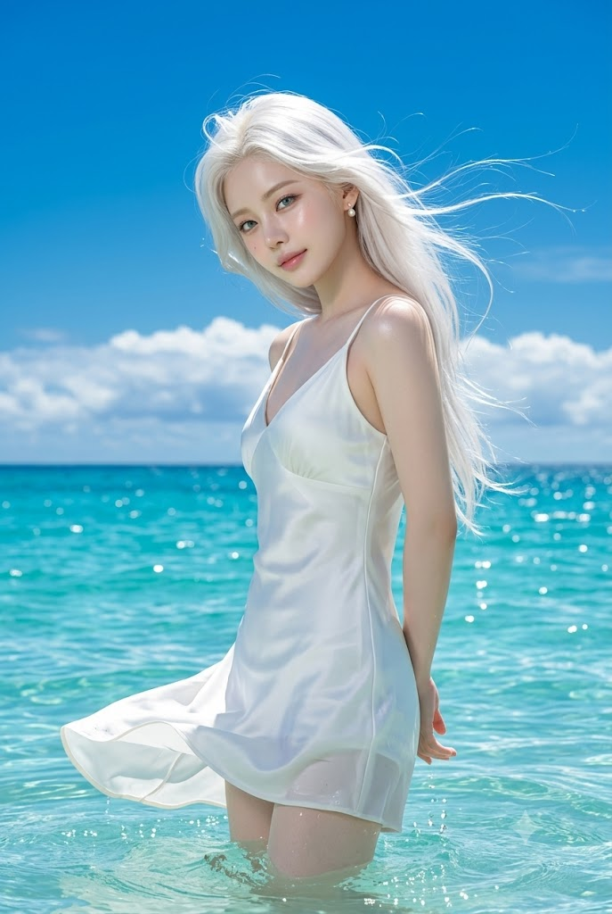
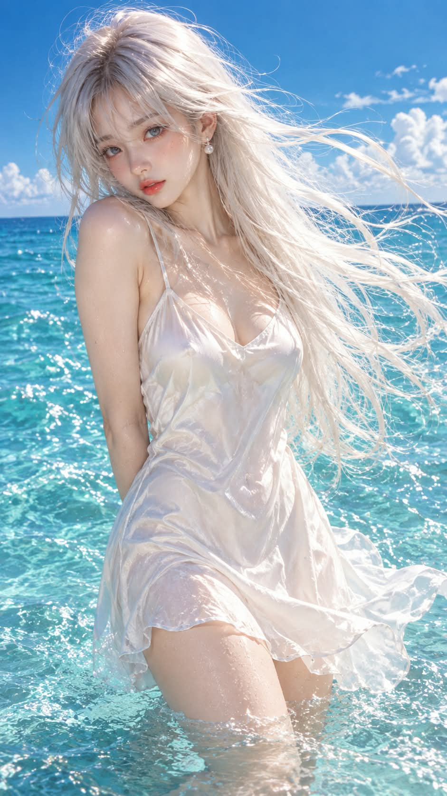

# 한여름 바닷가 순백 슬립 원피스 극사실 시네마틱 패션 화보 프롬프트

## 1. 개요 및 아트 디렉팅 가이드

- **컨셉**: 한여름 정오의 투명한 터콰이즈 바다에 허벅지까지 잠긴 채 선, 순백색 긴 머리와 흰 슬립 원피스의 인물을 담은 청량한 하이키 톤의 극사실 시네마틱 패션 화보
- **얼굴 & 안경 규칙**:
  - 업로드 사진에서는 눈·코·입의 생김새와 안경(선글라스 포함)만 가져오고, 얼굴형·피부색·헤어·표정·각도·시선·눈동자 색은 프롬프트 서술대로 새로 그림
  - 안경은 테와 렌즈를 그대로 유지하며, 선글라스는 원래 렌즈 색과 농도를 지키고 렌즈에 바다와 하늘이 비치게 표현
  - 사진에 안경이 없으면 추가하지 않음
- **스타일 & 구도**:
  - 풀프레임 카메라 85mm 렌즈의 실사 사진, 강한 자연광과 시안·터콰이즈 색감
  - 세로 화면, 머리부터 허벅지 중간까지 보이는 프레임, 수평선이 인물의 허리 위를 지나는 구도
- **포즈 & 표정**:
  - 두 팔을 등 뒤로 모아 손을 맞잡고, 고개를 부드럽게 숙여 기울인 채 눈만 살짝 들어 카메라를 바라보는 자세
  - 바다와 빛에 어울리는 신비로운 색의 눈동자와 반짝이는 캐치라이트, 아주 옅은 미소의 평온하고 몽환적인 표정
  - 햇빛에 은은하게 빛나는 맑고 밝은 우윳빛 피부
- **헤어 & 의상**:
  - 허리까지 오는 순백색(플래티넘 화이트) 생머리가 바닷바람에 크게 흩날리며 반투명하게 빛남, 작은 진주 귀걸이
  - 얇은 끈의 순백색 실크 새틴 슬립 원피스, 바람과 물결에 펄럭이는 치마 밑단. 단정하고 우아한 분위기 유지
- **배경**: 윤슬이 반짝이는 터콰이즈·코발트블루 바다, 다리 주변의 잔물결과 물방울, 짙은 파란 하늘과 수평선 위의 낮은 뭉게구름
- **금지**: 눈 감은 얼굴, 애니메이션 비율의 눈, 인공적인 눈 표현과 과한 발광, 손가락 왜곡, 텍스트·워터마크·로고

---

## 2. 프롬프트 전문

```text
[실사 사진 변환 + 얼굴 합성 프롬프트]

업로드한 사진은 얼굴 참고용입니다. 사진에서는 눈·코·입의 생김새와 안경(선글라스 포함)만 가져오세요.
얼굴형, 피부, 피부색, 헤어, 이마·헤어라인, 표정, 고개 기울기, 얼굴 방향, 시선, 눈동자 색은 사진에서 가져오지 마세요.
아래 서술대로 새로 그리고, 얼굴 외의 구도·각도·포즈·헤어·의상·배경은 바꾸지 마세요.

■ 안경·선글라스

사진 속 인물이 안경이나 선글라스를 쓰고 있다면, 테 모양·색·두께·재질과 렌즈 색·농도를 그대로 유지해서 씌움.

새로 그린 얼굴 각도에 맞춰 자연스럽게 착용.

일반 안경이면 렌즈는 투명하게, 눈동자가 렌즈 너머로 선명하게 보이도록. 렌즈 반사는 눈을 가리지 않게 은은하게.

선글라스면 원래 렌즈 색과 농도를 유지. 렌즈에 바다와 하늘, 햇빛이 비침. 렌즈가 옅으면 너머로 눈동자가 은은하게 비치도록.

사진에 안경·선글라스가 없다면 추가하지 않음.

■ 스타일

극사실 실사 사진. 시네마틱 패션 화보, 풀프레임 카메라 85mm 렌즈.

한여름 정오의 강한 자연광. 맑고 투명한 하이키 톤, 청량한 시안·터콰이즈 색감.

실제 피부 질감, 실제 머리카락 결, 실제 물. 일러스트·애니·3D 렌더 느낌 금지.

■ 구도

세로 화면, 정면에서 살짝 비스듬한 각도. 머리부터 허벅지 중간까지 보이는 프레임.

인물은 화면 중앙에서 약간 왼쪽, 몸통은 화면 오른쪽(인물의 왼쪽)으로 살짝 틀어서 섬.

수평선은 화면 아래쪽에서 약 45% 높이, 인물의 허리 위를 지남.

■ 인물 포즈·표정

날씬한 체형의 젊은 여성. 허벅지 중간까지 바닷물에 잠긴 채 서 있음.

피부는 맑고 투명한 아주 밝은 우윳빛. 햇빛을 받아 은은하게 빛나는 촉촉한 피부.

두 팔은 등 뒤로 모아 손을 맞잡은 자세. 어깨는 편안하게 내림.

고개는 인물의 왼쪽(화면 오른쪽) 아래로 부드럽게 숙이고 기울임.

고개는 숙인 채 눈만 살짝 들어 카메라 쪽을 은은하게 바라봄. 눈은 편안하게 뜬 상태.

눈동자는 이 장면의 바다와 빛에 어울리는, 아름답고 신비로운 색. 색은 자유롭게 정하되 현실에 흔한 갈색·검은색은 피함.

홍채에 투명한 깊이감과 섬세한 결, 햇빛이 비친 반짝이는 캐치라이트. 실제 사람 눈처럼 자연스러운 질감.

입가에 아주 옅은 미소. 평온하고 몽환적인 표정.

얼굴과 어깨에 햇빛이 비쳐 은은한 하이라이트, 볼에 옅은 홍조.

■ 헤어

허리까지 오는 아주 긴 순백색(플래티넘 화이트) 생머리.

강한 바닷바람에 머리카락 전체가 화면 위쪽과 오른쪽으로 크게 흩날림.

가는 머리카락 가닥들이 공중에서 곡선을 그리며 휘날리고, 햇빛을 받아 반투명하게 빛남.

귀 한쪽이 드러나 있고, 작은 진주 귀걸이 하나.

■ 의상

얇은 끈의 순백색 실크 새틴 슬립 원피스. 브이넥, 몸에 부드럽게 붙는 실루엣.

치마 밑단은 바람과 물결에 펄럭이며 화면 왼쪽으로 날림. 원단에 물기가 살짝 배어 광택.

단정하고 우아한 분위기 유지, 노출 강조 금지.

■ 배경

끝없이 펼쳐진 투명한 터콰이즈·코발트블루 바다. 수면에 햇빛이 반짝이는 윤슬.

인물 다리 주변에 잔잔한 물결과 작은 물방울이 튐.

짙고 맑은 파란 하늘, 수평선 위로 하얀 뭉게구름이 낮게 떠 있음.

다른 사람, 배, 소품 없음.

■ 금지

업로드 사진의 피부색·얼굴 각도·시선·표정·헤어·눈동자 색·배경 반영 금지

사진에 있던 안경·선글라스 생략 금지, 사진에 없던 안경·선글라스 추가 금지

선글라스를 일반 안경으로 바꾸거나 렌즈 색을 바꾸는 것 금지

눈 감은 얼굴 금지, 애니메이션 비율의 큰 눈·작은 입 금지

렌즈 낀 듯한 인공적인 눈, 흰자 없는 눈, 과한 발광 금지

손가락 왜곡, 팔 개수 오류, 머리카락 색 변경 금지

텍스트, 워터마크, 로고 금지
```

---

## 3. 결과물 비교 갤러리

| 생성 모델 | 생성 결과 이미지 |
| :--- | :--- |
| **제미나이 (Gemini)** |  |
| **ChatGPT (DALL-E 3)** |  |
