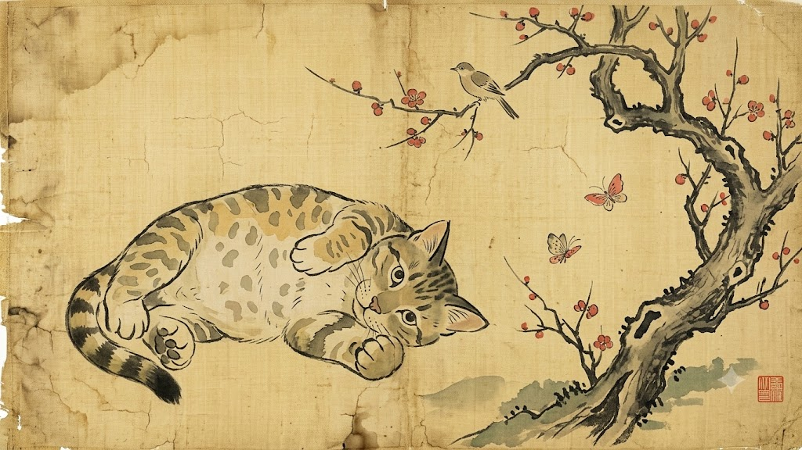
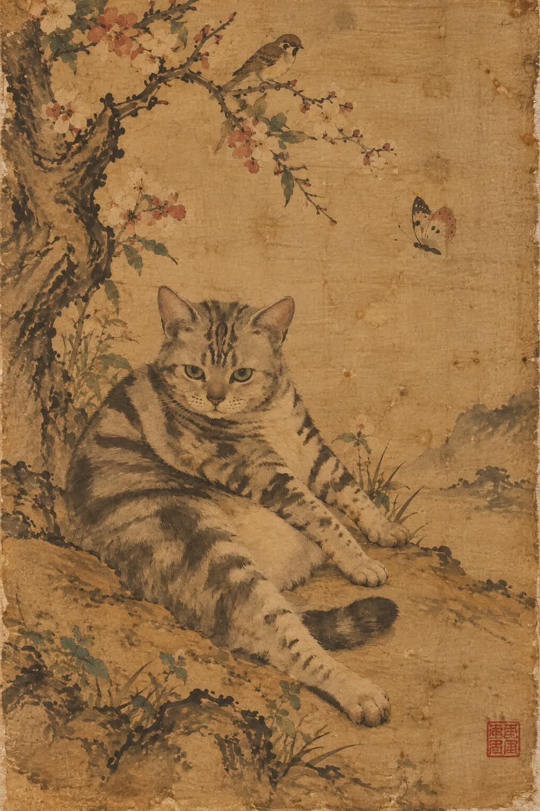

# 조선시대 화원풍 반려동물 전통 민화·채색 수묵화 프롬프트

## 1. 개요 및 아트 디렉팅 가이드
- **콘셉트 테마**: 실제 반려동물 사진의 종과 털 무늬 배치를 바탕으로, 조선시대 도화서 화원이 낡은 고비단 위에 거친 먹선과 옅은 담채(淡彩)로 그려낸 박물관 소장급 전통 영모화(翎毛畵)·민화 스크롤 복원화
- **핵심 아트 디렉팅 & 조형 원리**:
  - **동물 특징의 평면적 단순화 (Stylized & Folk Painting Identity)**:
    - 사진을 직접 리터칭하지 않고 순수 붓질로 처음부터 다시 그려낸 전통 화풍.
    - 사실적인 3D 입체감은 배제하고 평면적인 형태로 단순화하며, 눈은 조선 민화 특유의 동글동글하고 순박한 고전식 눈매로 연출.
  - **거친 먹선과 먹 번짐 기법 (Bold Ink Lines & Ink Wash)**:
    - 굵고 거친 필선의 먹선으로 형태 윤곽을 잡고, 털은 한 올 한 올 그리는 대신 붓질의 굵은 결로만 상징적 묘사.
    - 사실적 그림자 대신 농담(濃淡)의 번짐과 은은한 얼룩으로만 명암 표현.
  - **세월이 깃든 낡은 비단 바탕 질감 (Aged Antique Silk Texture)**:
    - 심하게 누렇게 바랜 낡은 고비단(Silk Canvas)의 굵은 직조 결, 표면 미세 균열, 세월의 곰팡이와 물얼룩, 가장자리 해짐 등 박물관 고문헌 스캔 질감 구현.
  - **전통 오방간색 담채 & 여백의 미 (Traditional Pale Pigments & Asymmetric Space)**:
    - 탁하고 바랜 먹색, 황토(黃土), 빛바랜 주홍(朱紅), 흐린 연녹(軟綠) 등 자연 천연 안료의 스며드는 담채 배색.
    - 넓은 비대칭 여백, 구불구불한 고목 가지, 작은 참새와 나비의 한국적 배치, 한쪽 모서리에 찍힌 붉은 인주 낙관 1개로 마무리.

---

## 2. 프롬프트 전문 (코드 블록)

```text
첨부한 사진 속 동물을 참고해서, 조선시대 화원이 비단에
그린 오래된 민화(채색 수묵화)를 새로 그려 주세요.
사진을 보정하지 말고 처음부터 붓으로 다시 그린 그림이어야 합니다.

[동물]

종, 자세, 털 무늬 배치만 참고

입체감과 세부 묘사는 단순화 (평면적인 그림)

눈은 동글고 순한 옛 그림식 눈으로 표현

[기법]

굵고 거친 먹선으로 윤곽을 먼저 그림

털은 붓질의 결로만 표현하고 세밀한 질감은 생략

명암은 사실적 음영 없이 먹의 옅고 짙은 번짐으로만

채색은 옅게 스며든 담채, 색이 번지고 얼룩진 느낌

[바탕]

심하게 누렇게 바랜 낡은 비단, 굵은 직조 결

균열, 곰팡이 자국, 물얼룩, 모서리 해짐

박물관에서 스캔한 두루마리 그림 느낌

[구도]

여백이 아주 넓은 비대칭 구도

구불구불한 고목, 성긴 가지, 작은 새와 나비

배경은 새로 그리고 사진 배경은 쓰지 않음

[색감]

탁하고 바랜 먹색, 황토, 빛바랜 주홍, 흐린 연녹

[마무리]

모서리에 붉은 낙관 하나

[절대 금지]
사진 같은 질감, 선명한 윤곽, 부드러운 그라데이션,
3D, 반짝이는 눈, 선명한 색, 디지털 일러스트 느낌
```

---

## 3. 결과물 비교 갤러리

| 생성 모델 | 결과 이미지 |
| :--- | :--- |
| **Google Gemini** |  |
| **OpenAI GPT** |  |
