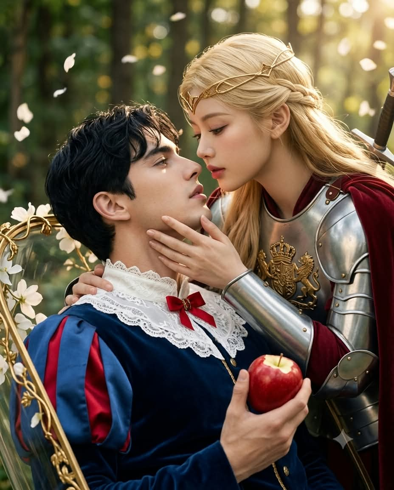
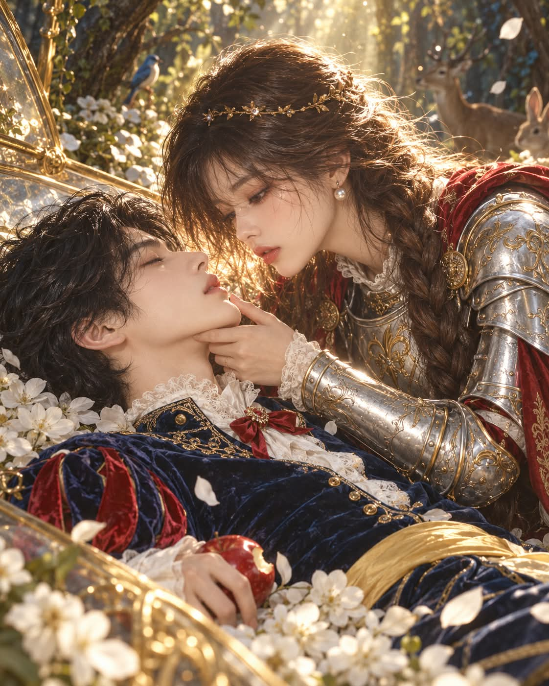

# 백설왕자와 공주기사, 성별을 바꾼 백설공주 장면 프롬프트

## 1. 개요 및 아트 디렉팅 가이드

- **컨셉**: 백설공주 이야기의 성별을 바꿔, 독사과를 먹고 유리관에 잠든 '백설왕자'를 은빛 갑옷의 '공주기사'가 안아 일으키며 입맞춤으로 깨우기 직전의 순간을 담은 장면 (세로 4:5). GPT용과 Gemini용 두 버전으로 작성
- **버전별 차이**:
  - **GPT 버전**: 눈·코·입의 생김새만 가져와 살짝 미화하는 반실사 페인터리 일러스트. 왕자는 눈을 감고 잠든 상태, 안경은 그리지 않음, 숲속 동물과 유리관 등 배경 묘사가 풍부한 미디엄 샷
  - **Gemini 버전**: 얼굴형과 비율까지 사진 그대로 유지하는 실사 시네마틱 사진. 왕자는 막 깨어나려는 듯 눈을 반쯤 뜬 상태, 안경·선글라스는 그대로 유지, 얼굴이 크게 들어오는 바스트샷
- **인물 배정 규칙**:
  - 사진이 2장이거나 한 장에 두 사람이 있으면 각각 백설왕자와 공주기사로 배정
  - 한 사람만 있으면 성별에 맞는 역할로 쓰고, 나머지 한 명은 실존 인물이 아닌 임의의 인물로 새로 그림
- **백설왕자 (화면 왼쪽)**:
  - 열린 유리관 안에서 공주기사의 팔에 받쳐 상반신이 살짝 들린 자세
  - 눈처럼 하얀 피부와 칠흑 같은 검은 짧은 웨이브 머리
  - 백설공주 드레스를 남성복으로 옮긴 복장: 네이비 블루 벨벳 더블릿, 빨간 슬래시 퍼프 소매, 하얀 레이스 스탠드 칼라, 노란 새틴 허리띠, 빨간 리본 브로치
  - 한 입 베어 문 새빨간 사과
- **공주기사 (화면 오른쪽)**:
  - 한 팔로 왕자의 등을 받쳐 안고, 건틀릿을 벗은 맨손으로 뺨에 살며시 닿은 자세
  - 길게 땋은 금발과 이마의 가는 금 서클릿
  - 금색 왕실 문장이 새겨진 은빛 플레이트 갑옷, 짙은 빨간 망토, 장검
  - 반쯤 내리뜬 눈으로 왕자의 입술을 바라보는 애틋한 표정
- **구도**: 두 얼굴이 화면 위쪽에서 마주 보고, 입술 사이에 간격이 남은 채 닿지 않는 순간이 시선의 중심. 두 얼굴 모두 카메라 쪽으로 열린 3/4 각도이며 머리카락·손·소품에 가려지지 않음
- **배경 & 조명**: 이끼 낀 고목과 덩굴의 동화 속 숲 빈터, 나뭇잎 사이로 두 얼굴 사이를 비추는 금빛 빛줄기와 흩날리는 하얀 꽃잎, 윤곽이 빛나는 역광 림라이트
- **출력**: 화면에 글자, 로고, 워터마크 없음

---

## 2. 프롬프트 전문

### GPT 버전

```text
[백설왕자와 공주기사 — 키스 직전 얼굴 합성 프롬프트]

업로드된 사진은 얼굴 참고용입니다.

■ 인물 배정 규칙

- 사진 2장: 1번 사진 인물 = 백설왕자, 2번 사진 인물 = 공주기사
- 사진 1장에 두 사람이 함께 있으면: 왼쪽 인물 = 백설왕자, 오른쪽 인물 = 공주기사
- 사진 1장에 한 사람만 있으면: 사진 인물이 남자면 백설왕자, 여자면 공주기사로 사용합니다.
나머지 한 명은 실존 인물이 아닌 임의의 인물로 새로 그립니다.
· 임의의 백설왕자: 누가 봐도 잘생긴 20대 미남, 선이 고운 갸름한 얼굴, 긴 속눈썹, 오뚝한 코
· 임의의 공주기사: 누가 봐도 아름다운 20대 미녀, 갸름한 얼굴, 크고 맑은 눈, 오뚝한 코, 도톰한 입술
· 임의 인물은 특정 연예인을 닮지 않게 그립니다.

■ 얼굴 사용 규칙 (매우 중요)

- 사진에서는 각 인물의 눈·코·입 생김새만 가져옵니다.
- 얼굴형, 피부, 헤어, 이마·헤어라인, 표정은 사진에서 가져오지 않습니다.
- 사진 속 고개 기울기, 얼굴 방향, 시선 등 머리·얼굴 각도는 절대 따르지 않습니다. 각도는 아래 구도 설명대로만 그립니다.
- 표정은 사진과 상관없이 아래 묘사대로 새로 그립니다.
- 안경을 쓴 사진이라도 안경은 그리지 않습니다.
- 두 사람 모두 동화 일러스트 주인공처럼 살짝 미화하되, 사진 인물의 눈·코·입 특징은 알아볼 수 있게 유지합니다.

■ 콘셉트
백설공주 이야기를 성별을 바꿔 재해석한 장면.
독사과를 먹고 유리관에 잠든 '백설왕자'를 '공주기사'가 찾아와, 입맞춤으로 깨우기 직전의 순간.
입술은 절대 닿지 않고, 두 입술 사이에 손가락 두 마디 정도의 간격이 남아 있습니다.

■ 백설왕자

- 자세: 열린 유리관 안, 하얀 꽃잎 위에 누운 채 상반신이 공주기사의 팔에 받쳐 살짝 들려 있음
- 얼굴 각도: 화면 왼쪽에서 얼굴을 오른쪽 위로 향한 3/4 측면. 얼굴의 눈·코·입이 또렷하게 보이도록 카메라 쪽으로 약간 열린 각도
- 표정: 아직 잠든 듯 눈을 감고 있으며 긴 속눈썹이 뺨에 그림자를 드리움, 평온한 얼굴, 입술은 아주 살짝 벌어짐
- 외모: 눈처럼 하얀 피부, 붉은 입술, 칠흑처럼 검은 짧은 웨이브 머리가 꽃잎 위로 흐트러짐
- 의상: 짙은 네이비 블루 벨벳 더블릿, 어깨에 빨간 슬래시 장식이 들어간 퍼프 소매, 높은 하얀 레이스 스탠드 칼라, 금색 단추, 노란 새틴 허리띠, 칼라에 작은 빨간 리본 브로치
- 소품: 늘어진 한 손 옆, 꽃잎 위에 한 입 베어 문 새빨간 사과가 굴러 있음

■ 공주기사

- 자세: 유리관 옆에 한쪽 무릎을 꿇고, 한 팔로 왕자의 등과 목덜미를 받쳐 안아 올리며 얼굴을 기울여 다가감
- 얼굴 각도: 화면 오른쪽에서 얼굴을 왼쪽 아래로 향한 3/4 측면. 얼굴의 눈·코·입이 또렷하게 보이도록 카메라 쪽으로 약간 열린 각도
- 표정: 반쯤 내리뜬 눈으로 왕자의 입술을 바라봄, 애틋하고 간절한 표정, 입술은 부드럽게 다물어 살짝 내밀어짐
- 외모: 길게 땋은 밝은 금발이 어깨에서 왕자 쪽으로 흘러내림, 이마에 가는 금 서클릿
- 의상: 은빛 플레이트 갑옷(흉갑·견갑·건틀릿), 흉갑에 금색 왕실 문장 각인, 갑옷 아래 로열 레드 스커트형 서코트, 바닥에 펼쳐진 짙은 빨간 망토
- 소품: 장검은 유리관 옆 바닥에 비스듬히 기대어 놓여 있음, 다른 손은 건틀릿을 벗은 맨손으로 왕자의 뺨에 살며시 닿아 있음

■ 배경

- 깊은 동화 속 숲 속 빈터, 이끼 낀 고목과 덩굴
- 위쪽 나뭇잎 사이로 두 사람 얼굴 사이를 비추는 따뜻한 금빛 빛줄기, 공기 중에 떠다니는 빛 입자
- 금빛 덩굴 장식 테두리의 유리관, 뚜껑은 옆으로 열려 있음
- 바닥에 하얀 들꽃과 버섯, 흩날리는 꽃잎
- 뒤쪽 나무 그늘에서 토끼, 사슴, 파랑새가 숨죽여 지켜봄 (흐릿하게)

■ 화풍·조명

- 고전 동화책 삽화와 판타지 영화 포스터를 섞은 반실사 페인터리 일러스트
- 두 얼굴 사이에 역광이 맺혀 윤곽이 빛나는 림라이트, 얼굴 정면은 부드러운 보조광으로 밝고 선명하게
- 색감: 네이비·빨강·노랑(왕자), 은색·빨강·금색(기사)이 숲의 초록과 대비
- 고해상도, 섬세한 원단·금속 질감, 부드러운 피부 표현

■ 구도

- 세로 4:5 비율, 두 인물의 상반신이 크게 들어오는 클로즈업에 가까운 미디엄 샷
- 두 얼굴이 화면 중앙 상단에서 마주 보도록 배치, 입술 사이 간격이 화면의 시선 중심
- 두 얼굴 모두 머리카락·손·소품에 가려지지 않게
- 화면에 글자, 로고, 워터마크 없음
```

### Gemini 버전

```text
[백설왕자와 공주기사 — 제미나이 버전]

가장 중요한 규칙: 업로드한 사진 속 인물의 얼굴을 그대로 유지하세요. 사진 속 사람과 같은 사람으로 바로 알아볼 수 있어야 합니다. 얼굴형, 눈, 코, 입, 눈썹, 턱선, 얼굴 비율을 사진과 똑같이 그리고, 얼굴을 새로 만들거나 미화해서 다른 사람처럼 바꾸지 마세요.
단, 사진 속 머리 스타일, 고개 각도, 시선, 표정, 옷, 배경은 가져오지 말고 아래 설명대로 그리세요.

인물 배정: 사진 속 인물의 성별을 판단해서 남자는 백설왕자, 여자는 공주기사로 그립니다. 두 사람이 같은 성별이면 첫 번째 인물이 백설왕자, 두 번째 인물이 공주기사이고 각자 본인 성별 그대로 그립니다. 사진 속 인물이 한 명뿐이면 그 사람은 성별에 맞는 역할로 그리고, 나머지 한 명은 실존하지 않는 아주 잘생긴 20대 미남 또는 아주 아름다운 20대 미녀로 새로 그립니다.

안경·선글라스: 사진 속 인물이 안경이나 선글라스를 쓰고 있으면 테 모양, 색, 렌즈 색까지 똑같이 그대로 씌웁니다. 절대 빼지 마세요. 쓰지 않았다면 새로 씌우지 않습니다.

장면: 성별을 바꾼 백설공주 이야기. 독사과를 먹고 유리관에 잠들어 있던 백설왕자를 은빛 갑옷의 공주기사가 끌어안아 일으키며 키스하기 직전인 순간입니다. 두 사람의 입술은 손가락 한 마디 정도 떨어져 있습니다.

카메라 구도 (매우 중요):
- 두 사람의 가슴 위까지 보이는 바스트샷입니다. 너무 멀지도, 얼굴만 보일 만큼 가깝지도 않습니다.
- 두 얼굴은 화면 위쪽 절반에 크게 들어오고, 화면 아래쪽 절반에는 두 사람의 의상과 소품이 또렷하게 보입니다.
- 카메라는 두 사람의 눈높이보다 살짝 위에서, 두 사람 앞쪽을 바라봅니다.
- 두 사람 모두 옆모습이 아니라, 얼굴이 카메라 쪽으로 열린 3/4 정면입니다. 두 눈, 코, 입이 모두 또렷이 보입니다.
- 두 얼굴은 머리카락, 손, 소품에 가려지지 않습니다.

백설왕자 (화면 왼쪽): 유리관 안에서 상반신이 공주기사의 팔에 받쳐 비스듬히 기대어 있습니다. 고개를 살짝 뒤로 젖혀 얼굴이 카메라 쪽 3/4 정면을 향하고, 막 깨어나려는 듯 눈을 반쯤 떠 공주기사를 올려다봅니다. 입술은 살짝 벌어져 있습니다.
- 백설공주 드레스를 남성복으로 옮긴 복장이 분명히 보여야 합니다: 칠흑 같은 검은 짧은 웨이브 머리, 높이 선 하얀 레이스 스탠드 칼라, 짙은 네이비 블루 벨벳 더블릿, 빨간 슬래시가 들어간 파란 퍼프 소매, 노란 새틴 허리띠, 칼라 앞의 작은 빨간 리본 브로치.
- 가슴 앞에 늘어진 손에 한 입 베어 문 새빨간 사과를 쥐고 있습니다.
- 어깨 뒤로 유리관의 금빛 덩굴 테두리와 하얀 꽃잎이 보입니다.

공주기사 (화면 오른쪽): 왕자 옆에서 한 팔로 그의 등을 받쳐 안고, 다른 맨손으로 그의 뺨을 감싸며 얼굴을 기울여 다가갑니다. 얼굴은 카메라 쪽 3/4 정면을 향하고, 반쯤 내리뜬 애틋한 눈빛으로 왕자의 입술을 바라봅니다.
- 공주이자 기사라는 것이 분명히 보여야 합니다: 이마의 가는 금 서클릿(작은 왕관 테), 한쪽 어깨로 넘긴 긴 금발 땋은 머리, 은빛 플레이트 갑옷 흉갑과 견갑, 흉갑 중앙의 금색 왕실 문장, 어깨에서 흘러내리는 짙은 빨간 망토.
- 등 뒤로 장검 손잡이가 어깨 위에 살짝 보입니다.

배경: 부드럽게 흐려진 동화 속 숲, 나뭇잎 사이로 두 얼굴 사이를 비추는 금빛 햇살, 공중에 흩날리는 하얀 꽃잎.

스타일: 판타지 로맨스 영화의 한 장면 같은 실사 시네마틱 사진. 얼굴에 부드럽고 밝은 조명, 뒤에서 금빛 역광. 얼굴과 의상 모두 선명하게 초점. 세로 4:5. 글자나 워터마크 없음.

다시 한번: 두 사람의 얼굴은 업로드한 사진 속 인물과 반드시 같은 사람이어야 하고, 얼굴은 크게, 의상은 백설왕자와 공주기사임을 알아볼 수 있게 보여야 합니다.
```

---

## 3. 결과물 비교 갤러리

| 생성 모델 | 생성 결과 이미지 |
| :--- | :--- |
| **제미나이 (Gemini)** |  |
| **ChatGPT (DALL-E 3)** |  |
