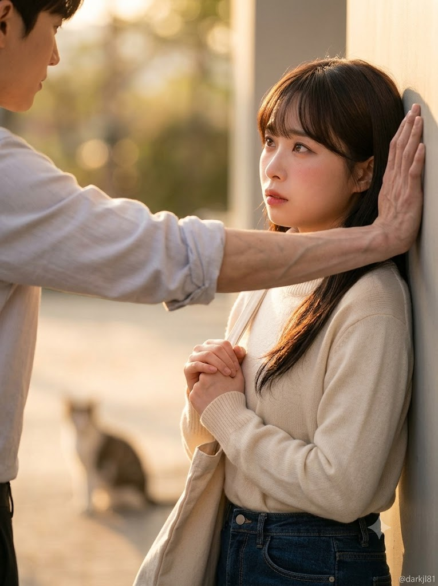
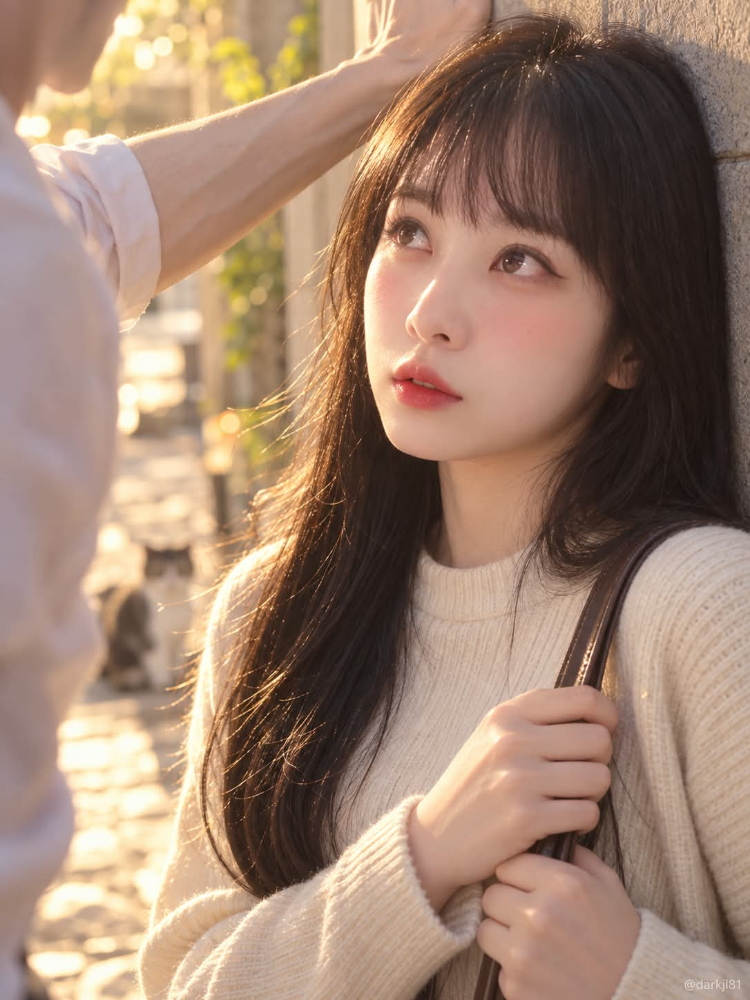

# 로맨스 드라마 '벽쿵 고백' 시네마틱 스틸컷 프롬프트

## 1. 개요 및 아트 디렉팅 가이드
- **콘셉트 테마**: 청춘 로맨스 드라마의 설레는 결정적 클리셰인 '벽쿵(카베동)' 고백 순간을 따스한 골든아워 햇살 아래 포착한 3:4 세로 비율 시네마틱 스틸컷
- **핵심 아트 디렉팅 & 조형 원리**:
  - **인물 정체성 및 섬세한 표정 연출 (Face Identity & Emotion)**:
    - 원본 사진의 이목구비(눈매, 코, 입술, 얼굴형, 헤어라인) 핵심 형태를 유지하며 높은 얼굴 유사도 보존.
    - 벽에 기대어 수줍고 긴장된 채 위를 올려다보는 시선, 살짝 붉어진 양 뺨, 가방 끈을 꼭 쥔 두 손의 디테일.
  - **카베동 1인칭 관찰자 시점 구도 (Perspective & Framing)**:
    - 남성의 얼굴은 배제하고, 화면 좌측 전경에 남성의 걷어 올린 셔츠 소매와 얇고 긴 팔뚝을 아웃포커스(블러)로 배치.
    - 여주인공을 화면 중앙~우측에 선명한 초점으로 배치하여 극적인 설렘과 몰입감 유도.
  - **남성 팔 디테일 (Realistic Forearm Detailing)**:
    - 과도한 근육질이 아닌 마르고 슬림한 체형, 길고 가는 손목과 팔뚝 위로 도드라진 푸른 핏줄과 매끈한 피부결.
  - **골든아워 자연광 & 심도 미장센 (Golden Hour Cinematography)**:
    - 한쪽에서 쏟아지는 따스한 역광/사광, 부드러운 빛망울(보케)과 얕은 피사계 심도.
    - 배경 저 멀리 바닥에 앉아 몽환적인 보케 속에 자연스럽게 녹아든 작은 길고양이 한 마리.
  - **우하단 워터마크 ("@darkjl81")**:
    - 우측 하단 모서리에 작고 은은한 반투명 흰색 텍스트로 **"@darkjl81"** 워터마크 표기.

---

## 2. 프롬프트 전문 (코드 블록)

```text
첨부한 사진은 얼굴 참고용이다. 사진 속 인물의 이목구비(눈매, 코, 입술 모양, 얼굴형, 헤어라인)만 가져와서 아래 장면의 여자 얼굴로 적용한다. 얼굴 유사도를 최우선으로 한다.

사진에서 가져오지 않는 것: 포즈, 자세, 표정, 고개 각도, 옷, 배경, 피부색과 피부 톤. 사진이 정면 증명사진이어도 포즈와 각도는 완전히 무시한다. 피부 톤은 사진과 무관하게 골든아워 조명 아래의 자연스러운 한국인 피부 톤으로 표현한다.

얼굴의 각도, 조명, 명암은 아래 장면 설정에 맞춰 새로 그린다. 골든아워 햇빛이 한쪽에서 들어오고, 그 조명에 맞게 얼굴의 그림자 방향과 명암을 자연스럽게 표현한다.

[장면]
실사 사진 스타일, 로맨스 드라마의 한 장면 같은 분위기. 20대 여성이 벽에 등을 기대고 서서 수줍고 긴장한 표정으로 위를 올려다보고 있다. 뺨이 살짝 붉어져 있고, 두 손은 가방 끈을 잡고 있다. 긴 어두운 갈색 머리, 목선이 높은 크림색 라운드넥 니트, 청바지 차림의 단정한 평상복.

구도: 카메라는 남자의 팔 오른쪽 바로 옆에 있고, 눈높이에서 여자를 약간 옆에서 바라보는 시점이다. 남자의 팔이 화면 왼쪽 가장자리 전경에 걸쳐 있고 살짝 흐릿하게 초점이 나가 있다. 여자는 화면 중앙에서 오른쪽에 있으며 초점이 선명하다. 남자의 얼굴은 보이지 않고 팔만 보인다.

남자가 여자 머리 옆 벽에 한쪽 팔을 짚고 있고, 셔츠 소매를 팔꿈치 위까지 걷어 올린 평상복 차림이다. 남자의 팔은 얇고 마른 체형이다. 근육질이거나 두껍지 않고, 손목과 팔뚝이 가늘고 길다. 대신 팔뚝과 손등에 푸른 핏줄이 선명하게 도드라져 보인다. 피부는 매끈하고 깨끗하다. 보디빌더 같은 근육이나 굵은 팔은 표현하지 않는다.

배경: 여자 뒤쪽 멀리 바닥에 작은 고양이 한 마리가 앉아 있다. 고양이는 배경 보케 속에 흐릿하게 보이며 인물보다 눈에 띄지 않는다.

따뜻한 골든아워 햇빛, 배경은 부드러운 보케, 얕은 심도, 영화 같은 조명, 고해상도. 세로 3:4 비율.

워터마크: 이미지 우측 하단 모서리에 "@darkjl81" 텍스트를 아주 작고 반투명한 흰색 글씨로 넣는다. 철자를 정확히 지키고, 다른 글자나 로고는 넣지 않는다.
```

---

## 3. 결과물 비교 갤러리

| 생성 모델 | 결과 이미지 |
| :--- | :--- |
| **Google Gemini** |  |
| **OpenAI GPT** |  |
