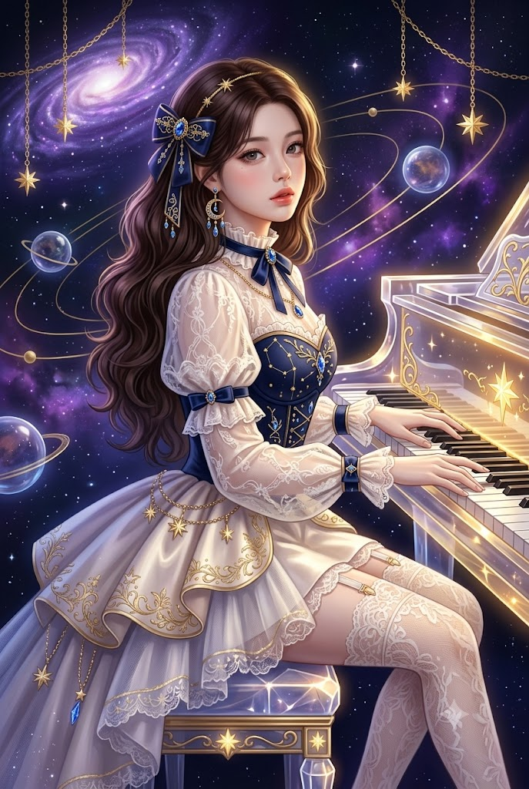
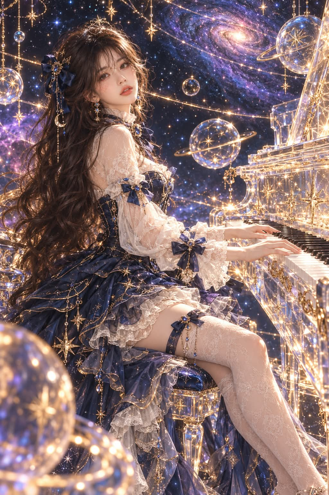

# 럭셔리 코스믹 판타지 크리스털 '별빛 피아노' 세미리얼 일러스트 프롬프트

## 1. 개요 및 아트 디렉팅 가이드

- **컨셉**: 깊은 우주 공간 속 별빛과 은하를 배경으로 투명한 크리스털 그랜드 피아노를 연주하는 럭셔리 코스믹 판타지 세미리얼 디지털 일러스트
- **비율 및 화풍**: 세로 2:3, 8K 초고해상도 세미리얼 판타지 (애니메이션과 실사의 조화, 극도로 섬세한 디테일과 반짝이는 빛 입자/글리터)
- **색 팔레트**: 미드나잇 네이비, 딥 바이올렛, 샴페인 골드, 아이보리
- **얼굴 정체성 보존 & 피부 표현**:
  - 원본의 눈 크기·쌍꺼풀·코·입술·얼굴형과 비율을 충실히 반영하여 동일인 인식 유지
  - 주름 및 잡티를 정돈한 20대 초중반 맑고 투명한 아이보리 페어 톤의 도자기 피부 (미세 피부결 유지)
  - 앰버 브라운 눈동자, 차분하고 우수에 찬 몽환적인 눈빛과 살짝 벌어진 로즈 핑크 입술
- **구도 및 포즈**:
  - 크리스털 피아노 벤치에 앉아 건반 위에 양손을 우아하게 올리고 연주하는 모습 (손가락 각 5개 정밀 구현)
  - 왼쪽 어깨 너머로 돌아보며 카메라를 응시하는 3/4 측면 앵글 (살짝 올려다보는 시점)
- **헤어 & 의상 & 소품 디렉팅**:
  - **헤어**: 허리까지 오는 다크 체스트넛 브라운 롱 웨이브 / 네이비 벨벳 리본, 골드 필리그리, 초승달 및 골드 체인 장식
  - **의상**: 하이넥 러플 칼라의 시스루 레이스 블라우스 + 골드 별자리 자수의 미드나잇 네이비 코르셋 보디스 + 풍성한 하이로우 스커트 & 사이하이 레이스 스타킹
  - **피아노**: 골드 필리그리와 황금빛 여덟 갈래 별이 박힌 투명 크리스털 그랜드 피아노
- **배경 및 조명**:
  - 보랏빛 나선 은하, 성운 구름, 고리가 있는 투명한 유리 행성 구체들과 황금빛 궤도 광선
  - 피아노의 따뜻한 골드 글로우와 우주의 쿨 바이올렛 앰비언트 라이트가 자연스럽게 교차하는 입체 조명

---

## 2. 프롬프트 전문

```text
[얼굴 사진 사용 규칙 – 최우선]
첨부한 사진은 오직 얼굴 정체성 추출용이다. 눈의 모양과 크기, 쌍꺼풀 형태, 코의 모양, 입술 형태, 얼굴형과 턱선, 이목구비 비율만 가져온다. 인물이 동일인으로 확실히 알아볼 수 있어야 한다.
사진의 얼굴 톤, 피부색, 얼굴 각도, 조명 방향, 명암과 그림자, 머리 스타일, 머리 색, 표정, 메이크업, 배경은 절대 가져오지 않는다. 이 요소들은 모두 아래 설정대로 완전히 새로 생성한다.
얼굴은 아래 지정한 각도와 조명에 맞게 3D로 재구성하여, 원래 그림 속 인물처럼 자연스럽게 녹아들게 한다. 합성한 티, 경계선, 색 차이가 전혀 없어야 한다.

[피부 보정]
주름, 잔주름, 눈가 주름, 팔자주름, 이마 주름, 다크서클, 잡티, 기미, 모공 확대, 붉은기를 모두 제거한다.
매끈하고 투명한 도자기 같은 피부, 균일한 톤, 은은한 광택. 단 플라스틱처럼 보이지 않도록 아주 미세한 피부 결은 남긴다.
피부색은 사진과 무관하게 밝고 맑은 아이보리 페어 톤으로 설정하고, 볼과 코끝에 옅은 복숭아빛 혈색을 준다.
얼굴은 20대 초중반의 젊고 생기 있는 인상으로 표현한다.

[화풍]
세미리얼 판타지 디지털 일러스트, 애니메이션풍과 실사풍의 중간, 초고해상도 8K, 극도로 섬세한 디테일, 반짝이는 글리터와 빛 입자, 럭셔리 코스믹 판타지 분위기.
색 팔레트: 미드나잇 네이비, 딥 바이올렛, 샴페인 골드, 아이보리.

[구도·포즈]
세로 2:3 비율, 머리부터 발끝 가까이 보이는 전신에 가까운 좌측 측면 구도.
인물은 화면 왼쪽 중앙, 크리스털 피아노 벤치에 앉아 몸은 오른쪽 피아노를 향하고 있다.
양손은 피아노 건반 위에 우아하게 올려져 연주 중이다. 손가락은 각 손 다섯 개씩 정확하게, 가늘고 길며 서로 겹치지 않고 건반 위에 자연스럽게 벌어져 있다.
고개는 왼쪽 어깨 너머로 돌려 카메라를 돌아보는 각도, 얼굴은 약 3/4 측면, 턱은 살짝 들어올림.
카메라는 인물 눈높이보다 약간 아래에서 비스듬히 올려다보는 시점.
다리는 벤치 앞으로 가지런히 뻗어 오른쪽 아래로 향한다.

[표정·메이크업]
차분하고 몽환적인 눈빛, 약간 우수에 찬 표정, 입술은 살짝 벌어져 있다.
따뜻한 앰버 브라운 눈동자, 은은한 브라운 아이섀도, 자연스러운 속눈썹, 촉촉한 로즈 핑크 입술.

[헤어 – 사진과 무관하게 이 설정으로 고정]
허리까지 오는 긴 다크 체스트넛 브라운 머리, 풍성하고 자연스러운 웨이브 컬.
옆 가르마, 얼굴 옆선을 감싸는 부드러운 앞머리와 잔머리, 등과 어깨 뒤로 흘러내림.
머리 왼쪽에 큰 네이비 벨벳 리본, 리본 중앙에 골드 필리그리 장식과 블루 보석 브로치, 아래로 골드 체인과 초승달 장식이 늘어짐.
정수리에 가느다란 골드 별 모양 헤어 장식.

[액세서리]
길게 늘어지는 골드 샹들리에 귀걸이, 블루 보석과 초승달 장식.
목에 골드 체인 목걸이와 블루 보석 펜던트.

[의상]
상의: 아이보리 시스루 레이스 블라우스, 목을 감싸는 하이넥 러플 칼라, 목 앞에 블루 보석이 박힌 네이비 리본.
소매: 풍성한 퍼프 슬리브, 시스루 레이스, 손목에 여러 겹의 러플 커프스. 윗팔과 손목에 블루 보석 중앙 장식이 있는 네이비 새틴 리본.
보디스: 미드나잇 네이비 코르셋 보디스, 스위트하트 네크라인, 골드 별자리 자수와 블루 크리스털 장식.
스커트: 미드나잇 네이비 새틴과 튤이 겹겹이 쌓인 풍성한 하이로우 스커트, 앞은 짧고 뒤는 길게 퍼짐. 골드 별자리 선 자수, 여덟 갈래 골드 별 장식, 늘어진 골드 체인, 블루 크리스털 비즈.
스커트 안쪽: 아이보리 레이스 페티코트 러플이 여러 겹 드러남.
다리: 아이보리 레이스 패턴 사이하이 스타킹, 상단에 레이스 러플, 허벅지에 블루 보석이 달린 네이비 리본 가터와 골드 체인.

[피아노]
투명한 크리스털 유리로 된 그랜드 피아노, 가장자리에 골드 필리그리 장식.
피아노 몸체와 뚜껑 안쪽에 황금빛으로 빛나는 여덟 갈래 별 장식이 여러 개 박혀 있다.
흰 건반과 검은 건반이 선명하고 규칙적으로 배열됨. 벤치도 크리스털과 골드 다리, 별이 박힌 우주빛 쿠션.

[배경]
깊은 우주 공간. 화면 상단 중앙~오른쪽에 보랏빛 나선 은하.
왼쪽 아래에 보라색 성운 구름.
고리가 있는 투명한 유리 행성 구체들이 곳곳에 떠 있고, 전경 왼쪽 아래에는 크고 흐릿한 유리 구체가 보케로 걸침.
위에서 아래로 늘어진 골드 체인에 별 장식이 매달려 반짝임.
황금빛 궤도 곡선과 빛의 궤적이 공간을 가로지름, 무수한 별빛 입자와 반짝임.

[조명]
피아노와 별 장식에서 나오는 따뜻한 골드 글로우가 인물 오른쪽을 비춤.
우주 배경의 차가운 블루·바이올렛 앰비언트 라이트가 왼쪽과 뒤쪽을 감쌈.
머리카락 가장자리에 골드 림라이트.
얼굴은 부드럽고 균일한 확산광으로 밝고 깨끗하게, 강한 그림자 없이 입체감만 살짝.
얼굴 피부에 주변의 골드와 바이올렛 반사광이 자연스럽게 스며들어 배경과 톤이 완벽히 일치.

[네거티브]
주름, 잔주름, 다크서클, 잡티, 거친 피부, 노안, 플라스틱 피부, 과한 보정, 합성 티, 얼굴 경계선, 얼굴과 몸의 피부색 불일치, 원본 사진의 조명·그림자·각도·헤어 유지, 원본과 닮지 않은 얼굴, 다른 사람 같은 얼굴, 짧은 머리, 흐릿한 얼굴, 왜곡된 손가락, 손가락 개수 오류, 건반 위 손가락 겹침, 뭉개진 손, 손가락 융합, 휘어진 건반, 비대칭 눈, 흐린 이목구비, 저해상도, 워터마크, 텍스트.
```

---

## 3. 결과물 비교 갤러리

| 생성 모델 | 생성 결과 이미지 |
| :--- | :--- |
| **제미나이 (Gemini)** |  |
| **ChatGPT (DALL-E 3)** |  |
