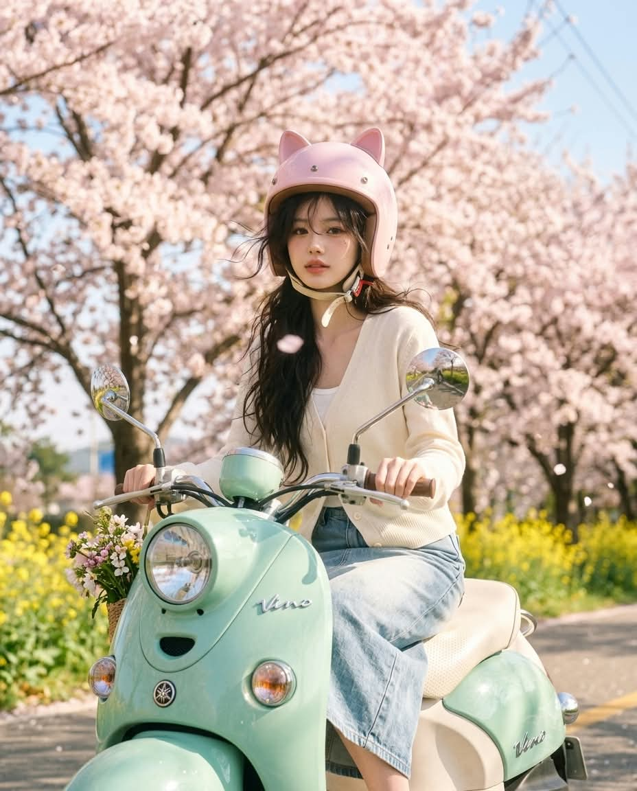
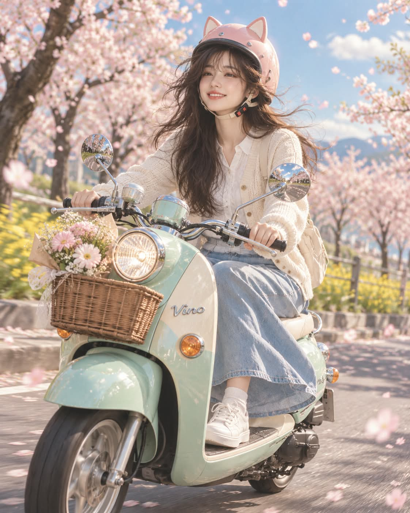

# 봄날의 스쿠터, 벚꽃길 레트로 스쿠터 파스텔 실사 사진 프롬프트

## 1. 개요 및 아트 디렉팅 가이드

- **컨셉**: 벚꽃이 만개한 봄날 가로수길을 민트색 레트로 스쿠터로 달리는 모습을 담은 파스텔 톤 실사 사진 (세로 4:5). GPT용과 Gemini용 두 버전으로 작성
- **버전별 차이**:
  - **GPT 버전 (한국어)**: 사진에서는 눈·코·입의 생김새만 가져오고 표정·각도·구도·헤어·의상을 모두 새로 그리는 방식. 인물과 스쿠터 전체가 보이는 전신 구도
  - **Gemini 버전 (영어)**: 사진을 편집하는 방식. 얼굴은 얼굴형·피부톤·표정까지 원본 그대로 두고 얼굴 주변만 바꿈. 얼굴이 크게 보이는 무릎 위 구도
- **장면**: 화창한 봄날 오후, 구름 몇 점 떠 있는 맑은 파란 하늘, 바람에 흩날리는 연분홍 벚꽃잎, 길가의 노란 유채꽃과 연둣빛 새싹
- **스쿠터**: 둥근 헤드라이트와 곡선형 앞 펜더, 크롬 미러, 아이보리색 시트를 갖춘 야마하 비노 레트로 스쿠터. 파스텔 민트색 유광 차체, 앞 바구니에 담긴 작은 꽃다발
- **헬멧**: 작은 고양이 귀가 달린 파스텔 핑크색 유광 오픈페이스 헬멧, 아이보리색 가죽 턱끈. 얼굴을 가리지 않고 헬멧 아래로 머리카락이 살짝 날림
- **의상**:
  - **여자**: 아이보리색 니트 카디건, 흰색 블라우스, 연한 데님 롱스커트, 흰색 스니커즈
  - **남자**: 아이보리색 니트 카디건, 흰색 셔츠, 베이지색 면바지, 흰색 스니커즈
- **인물 & 표정**: 양손으로 핸들을 가볍게 잡은 바른 자세, 봄바람을 즐기는 듯 눈이 살짝 휘어지는 밝고 상쾌한 미소 (GPT 버전 기준)
- **구도 & 화질**: 정면에서 약간 옆의 3/4 앵글, 살짝 아웃포커스된 배경으로 표현한 속도감, 부드러운 봄 햇살의 자연광과 민트·핑크·아이보리 위주의 필름 카메라 감성

---

## 2. 프롬프트 전문

### GPT 버전

```text
업로드한 사진은 얼굴 참고용으로만 사용한다. 사진에서는 눈·코·입의 생김새만 가져오고, 얼굴형·피부·헤어·이마/헤어라인·표정은 가져오지 않는다. 사진 속 고개 기울기, 얼굴 방향, 시선도 절대 따라 하지 않는다. 표정, 각도, 구도, 헤어, 의상은 모두 아래 서술대로 새로 그린다. 사진 속 인물이 남자인지 여자인지 판단해 해당 의상 버전을 적용한다.

[장면]
화창한 봄날 오후, 벚꽃이 만개한 한적한 가로수길을 민트색 야마하 비노(Yamaha Vino) 50cc 레트로 스쿠터를 타고 달리는 모습. 하늘은 구름 몇 점 떠 있는 맑은 파란색, 연분홍 벚꽃잎이 바람에 흩날리고 길가에는 노란 유채꽃과 연둣빛 새싹이 보인다.

[스쿠터]
야마하 비노 특유의 둥근 헤드라이트, 곡선형 앞 펜더, 크롬 미러 2개, 아이보리색 시트를 갖춘 클래식 레트로 스쿠터. 차체 전체는 파스텔 민트색 유광 도장, 크롬 부품은 햇빛에 반짝인다. 앞쪽 바구니에 작은 꽃다발이 담겨 있다.

[헬멧]
파스텔 핑크색 유광 오픈페이스(제트형) 헬멧, 정수리 양옆에 작은 삼각형 고양이 귀가 달려 있고 귀 안쪽은 연한 흰색. 턱끈은 아이보리색 가죽. 얼굴 전체가 가려지지 않고 또렷하게 보인다. 헬멧 아래로 바람에 살짝 날리는 자연스러운 머리카락이 조금 보인다.

[의상]

- 여자: 아이보리색 니트 카디건, 흰색 블라우스, 연한 데님 롱스커트, 흰색 스니커즈.
- 남자: 아이보리색 니트 카디건, 흰색 셔츠, 베이지색 면바지, 흰색 스니커즈.

[인물·표정]
양손으로 핸들을 가볍게 잡고 바른 자세로 앉아 앞을 보며 달리는 중. 봄바람을 즐기는 듯 눈이 살짝 휘어지는 밝고 상쾌한 미소, 볼에 은은한 홍조.

[구도·카메라]
인물과 스쿠터 전체가 보이는 전신 구도, 진행 방향 기준 정면에서 약간 옆(3/4 앵글)에서 촬영. 얼굴이 화면에서 선명하게 잘 보이도록 배치. 배경은 살짝 아웃포커스되어 속도감이 느껴지고, 인물과 스쿠터에 초점.

[화질·분위기]
실사 사진 스타일, 부드러운 봄 햇살의 자연광, 밝고 따뜻한 파스텔 톤 색감(민트·핑크·아이보리 위주), 필름 카메라 감성의 은은한 색감과 고해상도 디테일. 세로 4:5 비율.
```

### Gemini 버전

```text
Edit this photo. Keep the person's face exactly as it is in the photo — same face, same face shape, same eyes, nose, mouth, skin tone, and expression. Do not redraw, beautify, or change the face in any way. Only change everything around the face.

Change the scene to: a sunny spring afternoon, the person riding a pastel mint Yamaha Vino retro scooter along a road lined with cherry trees in full bloom. Clear blue sky, pale pink petals drifting in the breeze, yellow flowers along the roadside.

The scooter: classic Yamaha Vino with a round headlight, curved front fender, chrome mirrors, ivory seat, glossy pastel mint body, a small bouquet in the front basket.

The person wears a glossy pastel pink open-face helmet with small cat ears on top and an ivory leather chin strap. The helmet does not cover the face. A little hair shows under the helmet, blowing in the wind.

Outfit: ivory knit cardigan with a white top, light denim long skirt and white sneakers if female; beige cotton pants and white sneakers if male.

Both hands on the handlebars, sitting upright while riding. Knee-up shot, the face large and in sharp focus. Background slightly blurred for motion.

Photorealistic, soft natural spring sunlight, bright pastel tones (mint, pink, ivory), subtle film-camera look. Vertical 4:5.

The face must remain identical to the original photo.
```

---

## 3. 결과물 비교 갤러리

| 생성 모델 | 생성 결과 이미지 |
| :--- | :--- |
| **제미나이 (Gemini)** |  |
| **ChatGPT (DALL-E 3)** |  |
