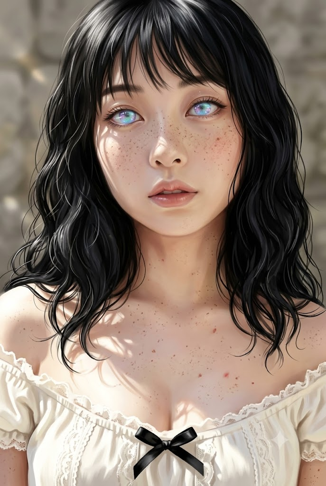
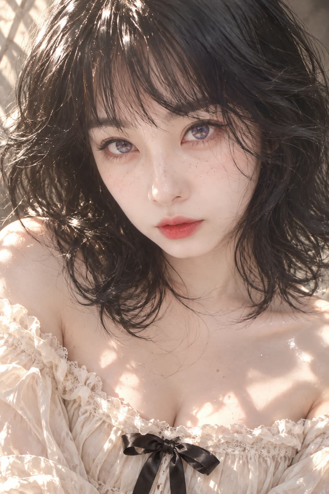

# 세미리얼리스틱 에디토리얼 '뷰티 포트레이트' 프롬프트

## 1. 개요 및 아트 디렉팅 가이드
- **콘셉트 테마**: 실사 70% + 고급 디지털 뷰티 일러스트 30%의 세미리얼리스틱 에디토리얼 화보. 참조 사진의 고유 인상을 기반으로 촉촉한 웻 헤어(Wet Hair) 웨이브와 신비로운 오팔 갤럭시 홍채, 턱을 살짝 내린 채 렌즈를 올려다보는 몽환적인 뷰티 클로즈업 (세로 2:3)
- **핵심 아트 디렉팅 & 조형 원리**:
  - **인물 인상 보존 & 회화적 세미리얼 (Identity & Painterly Realism)**:
    - 참조 사진 속 인물의 얼굴형, 눈매, 코, 입술, 턱선 등 고유 정체성을 엄격히 유지.
    - 과도한 모공 강조나 플라스틱 피부를 배제하고, 자연스러운 입체감 위에 부드러운 디지털 페인팅 블렌딩을 더한 고급 듀이(Dewy) 스킨 연출.
  - **친다운 & 아이즈업 포즈 (Chin-down & Eyes Looking Up)**:
    - 턱을 아주 살짝 아래로 숙이고(Subtle Chin-down), 두 눈은 카메라 렌즈를 향해 살짝 위로 치켜뜨듯 바라보는 도발적이고 몽환적인 시선.
    - 정수리부터 가슴 상단까지 프레임을 가득 채우는 타이트한 뷰티 클로즈업.
  - **풍성한 블랙 웻 헤어 (Wild Wet-Hair Texture)**:
    - 턱선~어깨선 부근의 짙은 흑발에 굵고 불규칙한 S컬 볼륨. 물기나 오일이 묻은 듯 촉촉한 질감과 이마를 가로지르는 내추럴 비대칭 앞머리.
  - **판타지 오팔 갤럭시 홍채 (Opal Galaxy Iris)**:
    - 외곽의 아이스블루·라벤더부터 안쪽의 아쿠아·민트·바이올렛·핑크가 부드럽게 섞인 다색 오팔 그라데이션.
    - 동공 주변 은하수 같은 딥 바이올렛과 극미세 금빛 별가루 반짝임, 촉촉하게 뭉친 웻 래시(Wet-lash) 속눈썹.
  - **자연스러운 주근깨 & 빈티지 오프숄더 스타일링**:
    - 코와 양 볼, 쇄골까지 흩뿌려진 자연스러운 갈색 주근깨와 섬세한 스페큘러 하이라이트.
    - 얇은 오간자/코튼 레이스 트림의 아이보리 오프숄더 블라우스와 네크라인 중앙의 미니멀 블랙 새틴 리본.
  - **강렬한 자연 직사광 & 그림자 패턴**:
    - 왼쪽 위에서 쏟아지는 강한 햇빛이 머리카락을 통과하며 얼굴과 목, 쇄골 위에 만들어내는 불규칙한 빛 조각과 깊고 부드러운 음영 대비.

---

## 2. 프롬프트 전문 (코드 블록)

```text
세로 2:3, 초고해상도.
실사 약 70% + 고급 디지털 뷰티 일러스트 약 30%의
세미리얼리스틱 에디토리얼 뷰티 포트레이트.

실제 패션 화보의 자연스러운 얼굴 구조와 입체감은 유지하되,
완전한 사진처럼 보이지 않도록 부드러운 디지털 페인팅 질감,
매끄러운 블렌딩과 섬세한 그라데이션을 더한 고급 반실사 표현.

━━━━━━━━━━━━━━━━━━━━
[첨부 얼굴 — 정체성·인상만 / 최우선]
━━━━━━━━━━━━━━━━━━━━

첨부 얼굴 사진은 오직 인물의 얼굴 정체성과 고유한 인상을 위한 참고자료이다.

사진에서 가져올 것은:
얼굴형과 기본 비율, 눈의 모양·크기·간격·눈꼬리,
눈썹, 코, 입술, 광대·볼·턱선,
눈·코·입의 상대적인 위치와 그 사람을 알아보게 만드는 고유한 얼굴 인상.

완성 후에도 첨부 사진 속 사람임을 바로 알아볼 수 있어야 한다.

단, 첨부 사진의 헤어스타일·머리색·길이·앞머리,
얼굴 각도·고개 방향·시선·표정·포즈,
피부색·밝기·명암·조명·광택·주근깨·메이크업·눈동자 색,
의상·배경·구도는 가져오지 않는다.

사진의 얼굴을 그대로 붙이지 말고,
고유한 이목구비와 인상만 아래 장면 안에서 자연스럽게 새로 재구성한다.

얼굴 정체성·이목구비·인상 = 첨부 얼굴 사진
그 외 모든 요소 = 아래 템플릿

━━━━━━━━━━━━━━━━━━━━
[구도 · 포즈 — 고정]
━━━━━━━━━━━━━━━━━━━━

정수리부터 가슴 상단까지 꽉 차는 세로형 타이트 뷰티 클로즈업.
배경 여백은 최소화한다.

얼굴은 중앙보다 약간 위쪽에 위치하고,
풍성한 머리카락이 좌우 프레임을 넓게 채운다.

양쪽 어깨와 쇄골, 가슴 상단,
블라우스 중앙의 검정 리본까지 보인다.
손과 팔은 프레임 밖.

얼굴만 지나치게 확대하지 않는다.

얼굴은 카메라 정면 부근을 향하며,
고개를 아주 살짝 아래로 숙인 subtle chin-down pose.

턱은 미세하게 내려가고
두 눈은 카메라를 향해 살짝 위로 치켜뜨듯 바라본다.

CHIN SLIGHTLY DOWN + EYES LOOKING UP AT CAMERA.

첨부 얼굴 사진이 어떤 방향이나 각도로 촬영되었더라도
사진의 각도를 따라가지 않고 이 템플릿의 각도와 포즈를 유지한다.

━━━━━━━━━━━━━━━━━━━━
[헤어 — 고정]
━━━━━━━━━━━━━━━━━━━━

짙은 블랙의 풍성한 미디엄 숏 웨이브 헤어.
길이는 턱 아래~어깨 부근.

굵고 불규칙한 S컬과 느슨한 컬이
얼굴 양옆으로 크게 부풀어 넓은 실루엣을 만든다.

정수리에도 풍성한 볼륨.
살짝 헝클어진 와일드한 editorial wet-hair texture.

비대칭적인 앞머리가 이마 위로 자연스럽게 떨어지고,
몇 가닥은 한쪽 눈과 볼 주변을 부분적으로 가로지른다.

모발은 물기나 오일이 묻은 듯 촉촉하며,
빛을 받은 검은 머리카락에는 선명한 반사광과
섬세한 플라이어웨이가 보인다.

첨부 얼굴 사진의 헤어스타일은 절대 반영하지 않는다.

━━━━━━━━━━━━━━━━━━━━
[표정 · 눈 · 오팔 홍채]
━━━━━━━━━━━━━━━━━━━━

웃지 않는 차분하면서도 도발적이고 몽환적인 표정.
입술은 힘을 빼고 아주 살짝 벌린다.

눈의 형태·크기·간격·눈꼬리와 고유한 눈매는
첨부 얼굴 사진 속 인물의 특징을 유지한다.

단, 원래 눈동자 색은 사용하지 않는다.

홍채는 매우 밝고 투명한 판타지 오팔 갤럭시 아이리스.

바깥쪽은 아이스블루와 옅은 라벤더,
안쪽에는 아쿠아·민트·바이올렛·연보라·은은한 핑크가
오팔처럼 부드럽게 섞인 다색 그라데이션.

동공 주변은 깊은 바이올렛과 남보라색으로
중앙으로 갈수록 은하처럼 깊어진다.

홍채 내부에는 극미세한 금빛 별가루와 빛 입자,
작은 별처럼 반짝이는 포인트,
청록·보라·핑크·금빛의 오팔 무지갯빛 반사가 섬세하게 흩어진다.

유리구슬처럼 맑고 투명하며 몽환적이지만
과도하게 네온 발광하지 않는다.

실제 사람 눈의 흰자·각막·동공·홍채 구조와 크기는 자연스럽게 유지한다.
눈 자체를 크게 만들거나 애니메이션 눈처럼 변형하지 않는다.

속눈썹은 길고 짙으며 살짝 젖어
몇 가닥씩 자연스럽게 뭉친 wet-lash texture.

눈 주변에는 로즈핑크 계열의 부드러운 메이크업과
아주 은은한 오팔빛 하이라이트.

━━━━━━━━━━━━━━━━━━━━
[피부 · 주근깨]
━━━━━━━━━━━━━━━━━━━━

밝고 투명감 있는 아이보리 피부.
첨부 얼굴 사진의 피부색과 피부 밝기는 가져오지 않는다.

얼굴 → 턱 → 목 → 쇄골 → 가슴까지
동일한 피부톤과 동일한 광원 아래 자연스럽게 연결한다.

실제 피부의 입체감은 유지하되
사진처럼 모공과 잔털을 과도하게 강조하지 않는다.

매끄러운 디지털 페인팅 블렌딩이 살짝 섞인
촉촉하고 투명한 dewy skin.

코끝·콧대·눈 밑·입술·턱·쇄골에는
빛에 반응하는 섬세한 스페큘러 하이라이트.

작고 자연스러운 갈색 주근깨가
코와 양 볼에 가장 조밀하게 분포하고,
눈 밑·광대·목·쇄골까지 불규칙하게 이어진다.

가슴 상단에는 극소수의 작고 불규칙한 붉은 반점이 흩어져 있다.

━━━━━━━━━━━━━━━━━━━━
[의상]
━━━━━━━━━━━━━━━━━━━━

아이보리/크림 화이트의 로맨틱 빈티지 오프숄더 블라우스.

넓고 낮은 네크라인으로
양쪽 어깨와 쇄골, 가슴 상단이 자연스럽게 드러난다.

얇고 살짝 반투명한 코튼/오간자 계열 원단,
섬세한 레이스 트림과 작은 러플,
풍성한 퍼프 소매.

가슴 중앙 네크라인 바로 아래에는
작은 검정 새틴 리본 하나가 묶여 있다.

━━━━━━━━━━━━━━━━━━━━
[조명 · 명암 — 중요]
━━━━━━━━━━━━━━━━━━━━

왼쪽 위쪽에서 들어오는 밝고 강한 자연 직사광.

전체 이미지는 밝지만 평평한 조명이 아니다.

머리카락이나 주변 구조물을 통과한 듯한
불규칙한 햇빛과 그림자 패턴이
얼굴 → 턱 → 목 → 쇄골 → 가슴까지 연속적으로 이어진다.

이마 일부, 콧대와 코끝, 한쪽 볼과 입 주변에는 강한 빛.
얼굴 일부와 검은 머리카락 내부에는 깊고 부드러운 그림자.

목과 쇄골, 가슴에도 작은 햇빛 조각들이 불규칙하게 떨어진다.

검은 머리카락의 빛을 받는 가장자리에는 강한 반사광,
촉촉한 피부에는 섬세한 스페큘러 하이라이트.

얼굴만 별도로 밝게 만들지 않는다.
얼굴·목·쇄골·가슴의 밝기, 색온도, 그림자 농도를 자연스럽게 통일한다.

얼굴 주변에 합성 경계나 밝은 후광을 만들지 않으며,
머리카락이 피부 위를 지나는 부분에는 자연스러운 접촉 그림자를 표현한다.

━━━━━━━━━━━━━━━━━━━━
[배경]
━━━━━━━━━━━━━━━━━━━━

따뜻한 그레이/베이지 계열의 흐릿한 실내 벽 또는 석재 질감.

매우 얕은 피사계심도로 부드럽게 아웃포커스.
왼쪽 뒤에는 자연광에 의한 은은한 빛 번짐.

얼굴·눈·머리카락은 배경보다 선명하다.

━━━━━━━━━━━━━━━━━━━━
[최종 화풍]
━━━━━━━━━━━━━━━━━━━━

실사 약 70% + 고급 디지털 뷰티 일러스트 약 30%.

자연스러운 얼굴 구조와 사실적인 빛의 입체감 위에
부드러운 페인터리 블렌딩과 섬세한 그라데이션을 더한
고급 세미리얼리스틱 패션·뷰티 일러스트.

머리카락·눈·입술은 섬세하고 선명하게,
피부는 촉촉하고 매끄러우며 살짝 회화적으로 정돈한다.

완전한 실사 사진처럼 만들지 않는다.
과도한 하이퍼리얼리즘, 거친 모공 표현,
플라스틱 피부, 3D 렌더링, 애니메이션, 강한 셀 셰이딩 금지.

━━━━━━━━━━━━━━━━━━━━
[핵심 우선순위]
━━━━━━━━━━━━━━━━━━━━

얼굴형·이목구비·고유 인상 = 첨부 얼굴 사진
눈의 형태와 눈매 = 첨부 얼굴 사진
홍채 색상·디자인 = 오팔 갤럭시 설정

구도·얼굴 크기·각도·시선 = 템플릿
헤어·머리색·앞머리 = 템플릿
표정·메이크업 = 템플릿
피부색·주근깨·피부 질감 = 템플릿
조명·명암·광택 = 템플릿
의상·배경 = 템플릿

첨부 얼굴 사진 때문에 템플릿의 각도·헤어·조명·피부색·구도를 변경하지 않는다.

최종적으로는 얼굴을 붙여 넣은 합성물이 아니라,
‘첨부 사진 속 인물이 처음부터 이 헤어·각도·조명과
오팔 갤럭시 눈동자를 가진 상태로 그려진 것’처럼 자연스럽게 표현한다.
```

---

## 3. 결과물 비교 갤러리

| 생성 모델 | 결과 이미지 |
| :--- | :--- |
| **Google Gemini** |  |
| **OpenAI GPT** |  |
